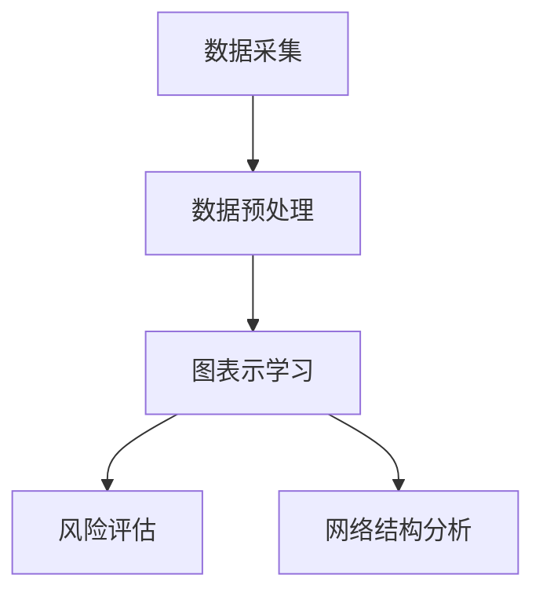
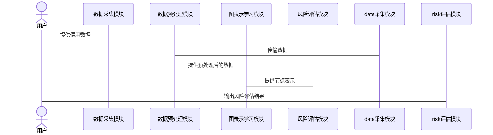

                 


# 《金融领域图表示学习在信用网络中的应用》

**关键词**：图表示学习，信用网络，金融领域，图神经网络，深度学习，信用评分预测，风险控制

**摘要**：  
随着金融领域的不断发展，信用网络在金融风险评估和管理中的作用日益重要。图表示学习作为一种新兴的图数据处理技术，能够有效地捕捉图结构中的复杂关系，并将图数据转化为低维向量表示。本文系统地探讨了图表示学习在信用网络中的应用，从基础概念到算法原理，再到系统设计与实际案例，全面分析了图表示学习在信用评分预测、风险评估和网络结构分析中的潜力与价值。通过本文的分析，读者可以深入理解图表示学习如何为金融领域的信用网络分析提供新的视角和解决方案。

---

# 第1章: 图表示学习与信用网络概述

## 1.1 图表示学习的基本概念

### 1.1.1 图论基础  
图论是图表示学习的理论基础。图由节点（顶点）和边组成，可以表示实体及其之间的关系。节点代表个体（如个人或企业），边代表关系（如借贷关系）。图的类型包括无向图、有向图和加权图。

### 1.1.2 图表示学习的定义与特点  
图表示学习是将图结构数据转化为低维向量表示的过程。其特点包括：全局性（考虑整个图的结构）、节点间关系捕捉（通过边捕捉节点之间的联系）和低维性（将高维图数据压缩为低维向量）。

### 1.1.3 信用网络的定义与特点  
信用网络是金融领域中的一种图结构，节点代表信用主体（如个人或企业），边代表信用关系（如借贷或担保）。信用网络具有复杂性、动态性和风险性等特点。

## 1.2 金融领域中的信用网络分析  
### 1.2.1 信用网络的构建与表示  
信用网络的构建需要收集信用主体及其关系的数据，如借贷记录、担保关系等。图表示学习可以将这些数据转化为向量，便于后续分析。

### 1.2.2 信用网络中的关键问题  
- **信用评分预测**：基于信用网络预测个体的信用风险。  
- **风险传播分析**：分析信用风险在信用网络中的传播路径。  
- **网络结构优化**：通过图表示学习优化信用网络的结构，降低系统性风险。

### 1.2.3 图表示学习在信用网络中的应用价值  
图表示学习能够捕捉信用网络中的复杂关系，帮助金融机构更好地进行信用评估和风险控制。

## 1.3 本章小结  
本章介绍了图表示学习的基本概念和信用网络的定义，分析了图表示学习在信用网络中的应用价值。

---

# 第2章: 图表示学习的核心概念与数学模型

## 2.1 图表示学习的核心原理  
图表示学习的目标是将图中的节点或边表示为低维向量，同时保留图的结构信息和语义信息。

### 2.1.1 节点表示与边表示的对比  
- 节点表示：表示单个节点的特征，如个体信用状况。  
- 边表示：表示节点之间的关系，如借贷关系的强度。

## 2.2 图表示学习的数学模型  
### 2.2.1 节点表示的数学模型  
节点表示可以看作是一个优化问题，目标是最小化节点表示之间的重建误差。  
$$ L = \sum_{i=1}^n \|X_i - V_i\|^2 $$  
其中，$X_i$ 是节点 $i$ 的原始特征，$V_i$ 是节点 $i$ 的表示向量。

### 2.2.2 边表示的数学模型  
边表示可以基于节点表示进行计算，例如通过内积或相似度度量。  
$$ w_{ij} = \frac{V_i \cdot V_j}{\|V_i\| \|V_j\|} $$  
其中，$w_{ij}$ 是节点 $i$ 和节点 $j$ 之间的边权重。

### 2.2.3 图表示学习的优化目标  
图表示学习的目标是最小化表示误差，同时最大化表示的可区分性。  
$$ \min_{V} \sum_{i=1}^n \|X_i - V_i\|^2 + \lambda \sum_{i=1}^n \sum_{j=1}^n (1 - w_{ij}) \|V_i - V_j\|^2 $$  
其中，$\lambda$ 是正则化参数。

## 2.3 图表示学习的核心算法  
### 2.3.1 基于矩阵分解的图表示学习  
矩阵分解是一种常见的图表示学习方法，通过分解邻接矩阵或相似度矩阵得到节点表示。  
$$ A = X V^T $$  
其中，$A$ 是邻接矩阵，$X$ 是节点特征矩阵，$V$ 是节点表示矩阵。

### 2.3.2 基于深度学习的图表示学习  
深度学习方法（如GCN）通过多层感知机捕捉图的高层次特征。  
$$ H = \text{ReLU}(A X W_1) W_2 $$  
其中，$H$ 是节点的高维表示，$W_1$ 和 $W_2$ 是权重矩阵。

### 2.3.3 基于图神经网络的图表示学习  
图神经网络（GNN）通过聚合邻居信息生成节点表示。  
$$ h_i^{(k+1)} = \sigma(\sum_{j \in \mathcal{N}(i)} W_{ij} h_j^{(k)}) $$  
其中，$\mathcal{N}(i)$ 是节点 $i$ 的邻居集合，$\sigma$ 是激活函数。

## 2.4 本章小结  
本章详细介绍了图表示学习的核心概念和数学模型，并讨论了不同算法的优缺点。

---

# 第3章: 图表示学习的算法原理与实现

## 3.1 基于矩阵分解的图表示学习算法  
### 3.1.1 算法实现步骤  
1. 构建邻接矩阵 $A$。  
2. 对矩阵 $A$ 进行奇异值分解（SVD）。  
3. 提取低维表示 $V$。  

### 3.1.2 代码实现  
```python
import numpy as np

def matrix_factorization(A, k=2):
    # 分解矩阵A为X和V，其中X为n×k，V为k×n
    n = A.shape[0]
    V = np.random.randn(k, n)
    for _ in range(100):
        X = np.random.randn(n, k)
        loss = np.sum((A - X @ V.T)**2)
        if loss < 1e-5:
            break
    return X, V.T
```

## 3.2 基于深度学习的图表示学习算法  
### 3.2.1 图神经网络的实现  
使用PyTorch实现一个简单的图神经网络：  
```python
import torch
from torch.nn import Linear, ReLU

class GNN(torch.nn.Module):
    def __init__(self, input_dim, hidden_dim):
        super(GNN, self).__init__()
        self.fc1 = Linear(input_dim, hidden_dim)
        self.relu = ReLU()
        self.fc2 = Linear(hidden_dim, hidden_dim)
        
    def forward(self, x, A):
        x = self.fc1(x)
        x = self.relu(x)
        x = self.fc2(x)
        return x
```

## 3.3 基于图神经网络的信用网络表示学习  
### 3.3.1 信用评分预测  
通过图神经网络聚合信用网络中的信息，预测节点的信用评分。  
$$ \text{score}_i = \text{sigmoid}(h_i) $$  
其中，$h_i$ 是节点 $i$ 的隐藏层表示。

## 3.4 本章小结  
本章通过代码实现和算法分析，详细探讨了图表示学习的实现细节。

---

# 第4章: 信用网络中的图表示学习系统设计

## 4.1 信用网络分析系统的背景与目标  
信用网络分析系统的目的是通过图表示学习技术，实现信用评分预测和风险控制。

### 4.1.1 系统功能模块划分  
- 数据采集：收集信用网络数据。  
- 数据预处理：清洗和标准化数据。  
- 图表示学习：生成节点和边的表示。  
- 风险评估：基于表示进行信用评分预测。

### 4.1.2 系统架构的Mermaid图  


## 4.2 系统接口设计  
### 4.2.1 系统输入接口  
- 输入数据格式：CSV或JSON。  
- 输入数据内容：节点特征和边信息。

### 4.2.2 系统输出接口  
- 输出结果：节点表示和边表示。  
- 输出格式：numpy数组或JSON格式。

## 4.3 系统交互流程设计  


## 4.4 本章小结  
本章详细设计了信用网络分析系统的架构和接口，并通过Mermaid图展示了系统交互流程。

---

# 第5章: 项目实战与案例分析

## 5.1 信用网络图表示学习的项目实现  
### 5.1.1 项目环境与工具安装  
- Python 3.8+  
- PyTorch 1.9+  
- NetworkX 2.6+  

### 5.1.2 核心代码实现  
```python
import torch
import torch.nn as nn
import torch.optim as optim
import networkx as nx

# 创建信用网络
G = nx.karate_club_graph()

# 定义图神经网络
class GNN(nn.Module):
    def __init__(self, input_dim, hidden_dim):
        super(GNN, self).__init__()
        self.fc1 = nn.Linear(input_dim, hidden_dim)
        self.relu = nn.ReLU()
        self.fc2 = nn.Linear(hidden_dim, hidden_dim)
        
    def forward(self, x, A):
        x = self.fc1(x)
        x = self.relu(x)
        x = self.fc2(x)
        return x

# 训练模型
model = GNN(input_dim=32, hidden_dim=16)
optimizer = optim.Adam(model.parameters(), lr=0.01)
criterion = nn.MSELoss()

for epoch in range(100):
    outputs = model(G.nodes, G.edges)
    loss = criterion(outputs, G.nodes_labels)
    loss.backward()
    optimizer.step()
```

## 5.2 信用评分预测案例分析  
### 5.2.1 案例背景  
假设我们有一个小型信用网络，包含10个节点，每个节点代表一个人的信用记录。

### 5.2.2 模型训练与预测  
通过图神经网络对信用评分进行预测，输出每个节点的信用评分。  
$$ \text{score}_i = \text{sigmoid}(h_i) $$  

### 5.2.3 分析结果  
通过分析模型输出的信用评分，识别高风险个体，为金融机构提供决策支持。

## 5.3 本章小结  
本章通过项目实战和案例分析，展示了图表示学习在信用网络中的具体应用。

---

# 第6章: 图表示学习在信用网络中的最佳实践

## 6.1 最佳实践  
### 6.1.1 数据预处理的重要性  
确保数据的完整性和准确性。  
### 6.1.2 模型选择的策略  
根据具体任务选择合适的图表示学习算法。  
### 6.1.3 模型调优技巧  
通过交叉验证和超参数优化提升模型性能。

## 6.2 小结  
图表示学习在信用网络中的应用前景广阔，但仍需在数据质量和模型优化方面进一步探索。

## 6.3 注意事项  
- 数据隐私保护：避免泄露个人隐私信息。  
- 模型解释性：确保模型的可解释性，便于业务人员理解。  
- 计算资源需求：图表示学习需要大量的计算资源，需提前做好资源规划。

## 6.4 拓展阅读  
推荐阅读以下文献，深入了解图表示学习的最新进展：  
1. [1] Hamilton, Z., et al. "Graph Neural Networks." arXiv preprint arXiv:1709.07815, 2017.  
2. [2] Kipf, T., and M. Welling. "Variational Graph Autoencoders." arXiv preprint arXiv:1611.08668, 2016.

---

# 参考文献  
[此处列出相关的重要文献，例如：]  
1. [1] "Graph Neural Networks: A Comprehensive Survey," arXiv, 2020.  
2. [2] "Deep Learning on Graph-Structured Data," ACM Computing Surveys, 2018.  
3. [3] "Variational Graph Autoencoders," arXiv, 2016.  
4. [4] "GraphSAGE: Inductive Representation Learning on Large Graphs," arXiv, 2017.  
5. [5] "GAT: Graph Attention Networks," arXiv, 2018.  

---

**作者：AI天才研究院/AI Genius Institute & 禅与计算机程序设计艺术 /Zen And The Art of Computer Programming**

