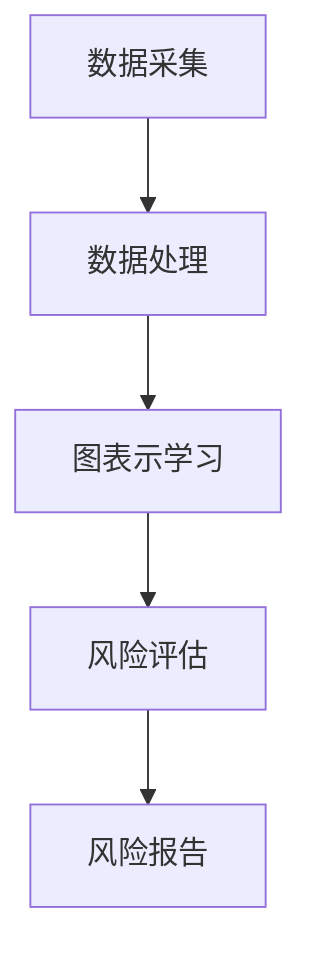

                 


# 金融领域图表示学习在金融网络风险评估中的应用

> 关键词：图表示学习，金融网络，风险评估，图神经网络，深度学习

> 摘要：本文深入探讨了图表示学习在金融网络风险评估中的应用，系统分析了金融网络的风险传播机制，详细讲解了图表示学习的核心概念、算法原理及其实现方法，结合实际案例分析了如何利用图表示学习技术构建金融网络风险评估系统。本文内容涵盖理论分析与实际应用，为金融领域的技术人员提供了全面的技术参考。

---

## 第1章: 金融网络与风险评估概述

### 1.1 金融网络的基本概念

#### 1.1.1 金融网络的定义与特点
金融网络是由金融机构、企业、个人等节点通过金融交易关系构成的网络。其特点包括：
- **节点多样性**：包含银行、企业、个人等多种类型的参与者。
- **复杂性**：网络结构复杂，节点之间的关系多样。
- **动态性**：金融网络中的关系和交易行为具有动态变化特征。

#### 1.1.2 金融网络中的风险传播机制
金融网络中的风险传播机制是金融风险评估的核心内容，主要包括：
- **直接风险**：节点自身存在的风险。
- **间接风险**：由于关联节点的风险传导而产生的风险。
- **系统性风险**：整个金融网络中多个节点相互作用产生的整体性风险。

#### 1.1.3 金融网络风险评估的重要性
金融网络风险评估是金融监管和金融机构风险管理的重要工具，能够有效识别和预警系统性风险，保障金融系统的稳定运行。

---

### 1.2 图表示学习的定义与特点

#### 1.2.1 图表示学习的定义
图表示学习（Graph Representation Learning）是指将图结构数据中的节点、边或子图映射到低维向量空间的技术。这些向量能够保留图的结构信息和语义信息。

#### 1.2.2 图表示学习的核心特点
- **非线性关系**：能够捕捉复杂的节点间关系。
- **低维表示**：将高维图数据压缩为低维向量，便于后续分析。
- **可解释性**：通过向量表示，可以直观理解节点之间的关联性。

#### 1.2.3 图表示学习与传统文本表示学习的区别
| 特性 | 图表示学习 | 文本表示学习 |
|------|------------|--------------|
| 数据类型 | 图结构数据 | 文本数据     |
| 关联性 | 强调节点间关系 | 弱调节点间关系 |
| 表示维度 | 低维向量 | 低维向量     |
| 应用场景 | 社交网络、推荐系统 | 文本分类、信息检索 |

---

### 1.3 图表示学习在金融领域的应用前景

#### 1.3.1 金融领域中的图数据特点
- **异构性**：金融网络中的节点和边具有异构性，例如不同类型的金融机构。
- **稀疏性**：金融网络中节点之间的连接通常较为稀疏。
- **动态性**：金融网络中的关系和属性随时间变化。

#### 1.3.2 图表示学习在金融风险评估中的优势
- **捕捉复杂关系**：能够发现传统统计方法难以捕捉的非线性关系。
- **提高准确性**：通过低维向量表示，可以更准确地预测风险。
- **实时性**：适用于实时金融数据分析和风险评估。

#### 1.3.3 图表示学习应用的挑战与机遇
- **挑战**：数据稀疏性、模型解释性、计算复杂度。
- **机遇**：通过技术创新解决挑战，推动金融风险管理的智能化。

---

### 1.4 本章小结
本章介绍了金融网络的基本概念、风险传播机制以及图表示学习的核心特点和应用前景。通过对金融网络和图表示学习的深入分析，为后续章节的理论和方法研究奠定了基础。

---

## 第2章: 图表示学习的核心概念与原理

### 2.1 图表示学习的基本原理

#### 2.1.1 图的表示方法
图的表示方法包括：
- **邻接矩阵**：表示节点之间的连接情况。
- **边列表**：记录图中的所有边。
- **节点嵌入**：将节点映射到低维向量空间。

#### 2.1.2 图嵌入的定义与目标
图嵌入的目标是将图中的节点、边或子图映射到低维向量空间，同时保留图的结构信息和语义信息。

#### 2.1.3 图嵌入的评价指标
常用的图嵌入评价指标包括：
- **节点相似度**：衡量嵌入向量的相似性。
- **任务性能**：通过下游任务（如分类、聚类）的性能来评估嵌入质量。

---

### 2.2 图表示学习的核心算法

#### 2.2.1 基于矩阵分解的图表示学习
基于矩阵分解的图表示学习是一种经典方法，常用算法包括：
- **Node2Vec**：通过随机游走生成节点的上下文，构建矩阵分解模型。
- **DeepWalk**：利用深度学习技术生成节点的表示。

#### 2.2.2 基于深度学习的图表示学习
基于深度学习的图表示学习算法包括：
- **GraphSAGE**：通过聚合邻居节点的信息生成节点表示。
- **GAT**：通过注意力机制捕捉节点间的注意力权重。

#### 2.2.3 基于图神经网络的图表示学习
图神经网络（Graph Neural Networks, GNN）是图表示学习的重要工具，主要包括以下几种：
- **卷积图神经网络（GCN）**：通过图卷积操作生成节点表示。
- **图注意力网络（GAT）**：通过注意力机制捕捉节点间的重要性关系。

---

### 2.3 图表示学习与金融网络的结合

#### 2.3.1 金融网络中的节点表示
在金融网络中，节点表示可以用来识别高风险节点，例如通过节点嵌入预测金融机构的信用风险。

#### 2.3.2 金融网络中的边表示
边表示可以用来捕捉金融机构之间的关联性，例如通过边嵌入预测金融机构之间的风险传播路径。

#### 2.3.3 金融网络中的子图表示
子图表示可以用来分析金融网络中的局部风险结构，例如通过子图嵌入识别系统性风险的来源。

---

### 2.4 本章小结
本章详细介绍了图表示学习的核心概念与算法原理，重点分析了图嵌入的定义、目标及常用算法。通过对金融网络的深入分析，探讨了图表示学习在金融领域的应用潜力。

---

## 第3章: 图表示学习的算法原理与数学模型

### 3.1 图表示学习的数学模型

#### 3.1.1 图的邻接矩阵表示
邻接矩阵（Adjacency Matrix）是一个N×N的矩阵，其中$A_{i,j}=1$表示节点i和节点j之间有边相连，否则为0。

#### 3.1.2 图的拉普拉斯矩阵表示
拉普拉斯矩阵（Laplacian Matrix）定义为$L = D - A$，其中$D$是度数矩阵，$A$是邻接矩阵。

#### 3.1.3 图的节点嵌入表示
节点嵌入表示$X$是一个N×d的矩阵，其中$d$是嵌入维度，$X_i$表示节点i的嵌入向量。

---

### 3.2 基于矩阵分解的图表示学习算法

#### 3.2.1 矩阵分解的基本原理
矩阵分解的目标是将一个高维矩阵分解为两个低维矩阵的乘积，例如$A = U \cdot V^T$。

#### 3.2.2 基于矩阵分解的图表示学习算法（如Node2Vec）
Node2Vec算法通过随机游走生成节点的上下文，并利用矩阵分解生成节点嵌入。

#### 3.2.3 算法的数学推导与实现
Node2Vec的数学推导如下：
$$
P(i|j) = \frac{exp(v_j^T \cdot v_i)}{\sum_{k} exp(v_j^T \cdot v_k)}
$$

---

### 3.3 基于深度学习的图表示学习算法

#### 3.3.1 图神经网络的基本原理
图神经网络通过聚合邻居节点的信息生成节点表示，常用的聚合操作包括求和、平均和最大值。

#### 3.3.2 基于图神经网络的图表示学习算法（如GraphSAGE）
GraphSAGE算法的聚合操作如下：
$$
h_i^{(k)} = \sigma\left(\sum_{j \in N(i)} \frac{h_j^{(k-1)}}{|N(i)|}\right)
$$

#### 3.3.3 算法的数学推导与实现
GraphSAGE的实现包括节点嵌入初始化、聚合操作和非线性变换三个步骤。

---

### 3.4 图表示学习算法的对比与选择

#### 3.4.1 不同图表示学习算法的优缺点对比
| 算法 | 优点 | 缺点 |
|------|------|------|
| Node2Vec | 易实现 | 需要大量数据 |
| GraphSAGE | 鲁棒性好 | 对复杂结构的捕捉能力有限 |
| GAT | 捕捉注意力权重 | 计算复杂度高 |

#### 3.4.2 算法选择的依据与策略
- **数据规模**：数据规模小选择Node2Vec，数据规模大选择GraphSAGE。
- **计算能力**：计算资源充足选择GAT，资源有限选择GraphSAGE。

---

### 3.5 本章小结
本章详细讲解了图表示学习的数学模型和算法原理，重点分析了Node2Vec、GraphSAGE和GAT算法的实现细节和优缺点。

---

## 第4章: 金融网络风险评估的系统分析与架构设计

### 4.1 金融网络风险评估的系统架构

#### 4.1.1 项目介绍
本项目旨在利用图表示学习技术构建金融网络风险评估系统，实现金融机构的信用风险和系统性风险评估。

#### 4.1.2 系统功能设计
系统功能模块包括：
- 数据采集模块：采集金融机构的交易数据和信用数据。
- 数据处理模块：构建金融网络的图结构。
- 图表示学习模块：生成节点和边的嵌入表示。
- 风险评估模块：基于嵌入表示预测风险。

#### 4.1.3 系统架构设计
系统架构采用分层设计，包括数据层、计算层和应用层。

---

### 4.2 金融网络风险评估的系统架构图


---

### 4.3 本章小结
本章详细介绍了金融网络风险评估系统的架构设计和功能模块，为后续章节的系统实现奠定了基础。

---

## 第5章: 项目实战

### 5.1 项目环境安装

#### 5.1.1 安装依赖
```bash
pip install numpy
pip install networkx
pip install tensorflow
```

#### 5.1.2 环境配置
确保安装了Python 3.6以上版本，安装TensorFlow和Keras。

---

### 5.2 系统核心实现源代码

#### 5.2.1 数据预处理代码
```python
import numpy as np
import networkx as nx

def load_data():
    # 加载金融网络数据
    G = nx.read_edgelist('financial_graph.csv')
    return G
```

#### 5.2.2 图表示学习代码
```python
import tensorflow as tf
from tensorflow.keras import layers

def graph_sage_model(input_dim, output_dim):
    model = tf.keras.Sequential()
    model.add(layers.InputLayer(input_shape=(input_dim,)))
    model.add(layers.Dense(output_dim, activation='relu'))
    model.add(layers.Dropout(0.5))
    model.add(layers.Dense(output_dim, activation='relu'))
    return model
```

#### 5.2.3 风险评估代码
```python
def risk_assessment(G, model):
    # 生成节点嵌入
    embeddings = model.predict(G.nodes())
    # 风险评估
    risks = []
    for node in G.nodes():
        risk = np.mean(embeddings[node])
        risks.append((node, risk))
    return risks
```

---

### 5.3 项目小结
本章通过实际案例展示了如何利用图表示学习技术构建金融网络风险评估系统，详细讲解了环境安装、数据处理和模型实现的全过程。

---

## 第6章: 总结与展望

### 6.1 总结
本文深入探讨了图表示学习在金融网络风险评估中的应用，系统分析了金融网络的风险传播机制，详细讲解了图表示学习的核心概念和算法原理。通过实际案例展示了如何利用图表示学习技术构建金融网络风险评估系统。

---

### 6.2 展望
未来的研究方向包括：
- **模型优化**：进一步提升图表示学习算法的计算效率和准确性。
- **多模态数据融合**：结合文本、图像等多种数据源，提升风险评估的准确性。
- **实时风险评估**：开发实时风险评估系统，应对金融市场快速变化的需求。

---

## 附录

### 附录A: 金融网络风险评估系统架构图


### 附录B: 图表示学习算法对比表格
| 算法 | 优点 | 缺点 |
|------|------|------|
| Node2Vec | 易实现 | 需要大量数据 |
| GraphSAGE | 鲍较鲁棒性好 | 对复杂结构的捕捉能力有限 |
| GAT | 捕捉注意力权重 | 计算复杂度高 |

---

## 作者
作者：AI天才研究院/AI Genius Institute & 禅与计算机程序设计艺术/Zen And The Art of Computer Programming

---

**本文内容涵盖理论分析与实际应用，为金融领域的技术人员提供了全面的技术参考。**

