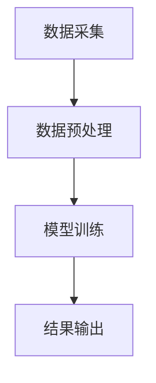

                 


# 《金融领域图表示学习的应用与挑战》

> 关键词：图表示学习，金融，风险评估，欺诈检测，图数据，深度学习

> 摘要：图表示学习是一种通过将图结构数据转换为低维向量表示来分析和理解图数据的技术。在金融领域，图表示学习能够有效捕捉复杂的金融关系，如交易网络、风险传染和客户行为网络，从而在风险评估、欺诈检测、投资组合优化和客户行为分析等方面发挥重要作用。本文系统介绍了图表示学习的基本概念、核心算法、在金融领域的典型应用以及面临的挑战，并通过案例分析探讨了实际应用中的关键问题和解决方案。

---

## 第1章：图表示学习概述

### 1.1 图表示学习的背景与意义

图表示学习是一种通过将图结构数据转换为低维向量表示来分析和理解图数据的技术。随着金融领域的数据复杂性和关联性的增加，传统的统计方法和浅层学习方法难以捕捉复杂的金融关系。图表示学习能够有效建模金融数据中的非线性关系和复杂网络结构，为金融分析提供了新的视角。

图表示学习的核心目标是将图中的节点（如客户、交易、资产等）映射到低维向量空间，同时保留图的结构信息和语义信息。这些向量表示可以用于多种金融任务，如风险评估、欺诈检测和客户画像。

### 1.2 图数据与金融应用场景

金融领域的数据具有高度的关联性和复杂性，常见的金融图数据包括：

1. **交易网络**：记录客户之间的交易行为，识别洗钱、欺诈交易等异常行为。
2. **风险传染网络**：分析金融机构之间的风险传染路径，评估系统性风险。
3. **金融知识图谱**：构建金融实体（如公司、产品、事件）之间的语义关系，支持智能问答和知识检索。
4. **股票关联网络**：分析股票之间的相关性，辅助投资组合优化和市场趋势预测。

### 1.3 图表示学习的核心问题

图表示学习的核心问题包括：

1. **如何有效表示图的结构信息**：图表示需要保留节点之间的关系和网络的全局结构信息。
2. **如何处理稀疏性和噪声**：金融数据可能存在稀疏性和噪声，影响模型的鲁棒性和准确性。
3. **如何提升模型的可解释性**：金融决策需要解释性，模型必须能够解释其输出结果。

---

## 第2章：图论基础与图表示学习的基本概念

### 2.1 图论基础

图是由节点（顶点）和边（连接节点的边）组成的数学结构。图可以分为以下几类：

- **无向图**：边没有方向，表示双向关系（如友谊网络）。
- **有向图**：边有方向，表示单向关系（如交易流向）。
- **加权图**：边具有权重，表示关系的强度或重要性。

### 2.2 图表示学习的核心概念

图表示学习的核心概念包括：

1. **节点表示**：将每个节点映射到低维向量，表示该节点的特征和在网络中的角色。
2. **图嵌入**：将整个图结构编码为低维向量，表示图的整体特征。
3. **图编码**：将图结构转换为可以用于机器学习模型的格式。

### 2.3 图表示学习的关键属性对比

以下表格对比了不同图表示方法的关键属性：

| 属性 | 节点嵌入 | 图嵌入 |
|------|---------|-------|
| 维度   | 低维     | 低维   |
| 保留信息 | 结构和语义信息 | 图的全局结构信息 |
| 应用场景 | 单一节点分析 | 整个图的分析 |

---

## 第3章：金融领域的图数据与需求分析

### 3.1 金融领域的典型图数据

1. **交易网络**：记录客户之间的交易行为，识别洗钱、欺诈交易等异常行为。
2. **风险传染网络**：分析金融机构之间的风险传染路径，评估系统性风险。
3. **金融知识图谱**：构建金融实体（如公司、产品、事件）之间的语义关系，支持智能问答和知识检索。
4. **股票关联网络**：分析股票之间的相关性，辅助投资组合优化和市场趋势预测。

### 3.2 金融领域对图表示学习的需求

1. **风险评估与预警**：通过图表示学习识别高风险节点，预测潜在的违约风险。
2. **欺诈检测与预防**：利用图表示学习识别异常交易模式，预防欺诈行为。
3. **投资组合优化**：通过图表示学习分析股票之间的关联性，优化投资组合。
4. **客户行为分析**：通过图表示学习分析客户行为网络，识别潜在风险或机会。

### 3.3 图表示学习在金融中的边界与外延

图表示学习在金融中的边界包括：

1. **数据稀疏性**：金融数据可能存在稀疏性，影响模型的表示能力。
2. **模型可解释性**：金融决策需要可解释性，模型必须能够解释其输出结果。
3. **实时性**：金融领域的实时性要求较高，模型需要快速响应。

图表示学习的外延包括与其他技术的结合，如深度学习、强化学习和自然语言处理，进一步提升模型的性能和应用范围。

---

## 第4章：图表示学习的算法原理

### 4.1 基于节点嵌入的图表示学习

Node2Vec是一种经典的节点嵌入算法，通过随机游走生成节点的上下文，利用Word2Vec模型训练节点嵌入。其训练目标是最大化节点与其邻居的相似性：

$$
\text{损失函数} = -\log p(w_i|w_{i-1}) + \text{交叉熵损失}
$$

### 4.2 基于图结构学习的表示方法

图卷积网络（GCN）通过聚合节点及其邻居的特征来生成节点表示。其数学表达式为：

$$
h^{(l+1)}_i = \sigma\left(\sum_{j \in \mathcal{N}_i} \frac{1}{|\mathcal{N}_i|} W h^{(l)}_j\right)
$$

其中，$\sigma$ 是激活函数，$W$ 是权重矩阵，$\mathcal{N}_i$ 是节点$i$的邻居集合。

### 4.3 对比学习与无监督图表示

对比学习通过最大化正样本对的相似性和最小化负样本对的相似性来学习节点嵌入。其目标函数为：

$$
\text{损失函数} = -\log \text{exp}\left(\frac{q_i \cdot q_j}{\|q_i\| \|q_j\|}\right) / \sum_{k} \text{exp}\left(\frac{q_i \cdot q_k}{\|q_i\| \|q_k\|}\right)
$$

其中，$q_i$ 和 $q_j$ 是节点$i$和$j$的查询向量。

---

## 第5章：金融领域图表示学习的典型应用

### 5.1 风险评估与预警系统

风险评估系统通过图表示学习识别高风险节点，预测潜在的违约风险。例如，使用GCN对客户信用网络进行建模，预测客户的违约概率。

### 5.2 欺诈检测与预防系统

欺诈检测系统通过图表示学习识别异常交易模式，预防欺诈行为。例如，使用Node2Vec对交易网络进行建模，识别异常交易节点。

### 5.3 投资组合优化

投资组合优化系统通过图表示学习分析股票之间的关联性，优化投资组合。例如，使用图自表达模型对股票关联网络进行建模，优化投资组合的风险和收益。

### 5.4 客户行为分析

客户行为分析系统通过图表示学习分析客户行为网络，识别潜在风险或机会。例如，使用图注意力机制对客户行为网络进行建模，识别高风险客户。

---

## 第6章：图表示学习在金融中的挑战与解决方案

### 6.1 金融图数据的稀疏性与不均衡性

金融数据可能存在稀疏性，导致模型的表示能力受限。解决方案包括引入负采样、使用对比学习等方法。

### 6.2 模型可解释性与可操作性

金融决策需要可解释性，模型必须能够解释其输出结果。解决方案包括使用可解释的模型（如线性模型）或对黑箱模型进行可解释性分析。

### 6.3 实时性与计算效率问题

金融领域的实时性要求较高，模型需要快速响应。解决方案包括优化算法的计算效率、使用分布式计算等。

### 6.4 图表示学习的稳定性与鲁棒性

模型在面对噪声和异常数据时的稳定性需要提高。解决方案包括使用鲁棒的图表示方法、引入数据增强技术等。

---

## 第7章：项目实战——基于图表示学习的金融风险评估系统

### 7.1 系统架构设计

以下是系统架构的Mermaid图：



### 7.2 核心算法实现

以下是Node2Vec算法的Python实现示例：

```python
import numpy as np
from sklearn import preprocessing

class Node2Vec:
    def __init__(self, graph, vector_size=100, window=5, negative=5):
        self.graph = graph
        self.vector_size = vector_size
        self.window = window
        self.negative = negative
        self.wv = {}

    def train(self, epochs=100):
        for epoch in range(epochs):
            for node in self.graph.nodes():
                for neighbor in self.graph.neighbors(node):
                    # 生成训练样本
                    pass
        # 训练完成后的处理
        pass

    def get_vector(self, node):
        return self.wv[node]
```

---

## 第8章：总结与展望

### 8.1 核心内容总结

图表示学习在金融领域的应用具有重要意义，能够有效捕捉复杂的金融关系，支持风险评估、欺诈检测和投资组合优化等任务。然而，图表示学习在金融领域也面临数据稀疏性、模型可解释性和实时性等挑战。

### 8.2 未来研究方向

未来的研究方向包括：

1. **多模态图表示学习**：结合文本、图像等多种数据源，提升模型的表示能力。
2. **实时图表示学习**：研究实时更新的图表示方法，满足金融领域的实时性要求。
3. **可解释图表示学习**：提升模型的可解释性，支持金融决策的透明性和可信性。

### 8.3 读者思考与实践建议

读者可以尝试将图表示学习应用于实际的金融问题，如欺诈检测、风险评估等。同时，建议深入研究图表示学习的最新算法和技术，探索其在金融领域的更多应用。

---

**作者：AI天才研究院/AI Genius Institute & 禅与计算机程序设计艺术 /Zen And The Art of Computer Programming**

