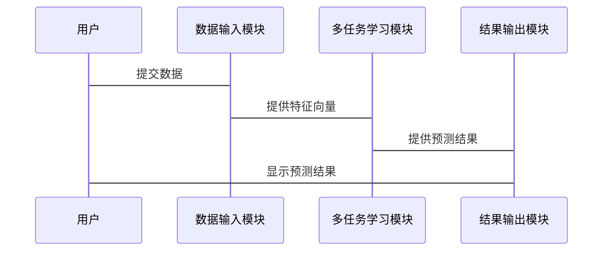

                 


# 《金融领域多任务学习在信用评分中的应用》

> 关键词：信用评分，多任务学习，机器学习，金融领域，深度学习

> 摘要：本文深入探讨了多任务学习在信用评分中的应用，分析了其在金融领域的优势，并结合实际案例，详细介绍了多任务学习的算法原理、系统架构及项目实现方案。

---

# 第一部分: 金融领域多任务学习的背景与基础

## 第1章: 信用评分与多任务学习概述

### 1.1 信用评分的基本概念

#### 1.1.1 信用评分的定义与作用
信用评分是衡量个人或企业在贷款、信用卡等信用交易中的信用风险的一种指标。其作用在于帮助金融机构评估借款人的还款能力和意愿，从而决定是否批准贷款及贷款利率。

#### 1.1.2 信用评分的核心要素
信用评分通常基于以下几个核心要素：
- **信用历史**：包括过去贷款、信用卡的还款记录。
- **收入水平**：反映借款人的还款能力。
- **负债情况**：包括借款人现有的债务负担。
- **信用使用情况**：如信用卡的使用额度和频率。
- **申请行为**：如申请贷款的频率和类型。

#### 1.1.3 信用评分的分类与应用场景
信用评分主要分为两类：
- **分数型信用评分**：如FICO评分，将信用风险量化为一个分数。
- **模型型信用评分**：通过复杂的模型预测违约概率。

应用场景包括银行贷款审批、信用卡额度设定、风险管理等。

### 1.2 多任务学习的定义与特点

#### 1.2.1 多任务学习的定义
多任务学习（Multi-Task Learning, MTL）是指在同一模型中同时学习多个相关任务，通过共享部分参数来提高模型的泛化能力和性能。

#### 1.2.2 多任务学习的核心特点
- **任务相关性**：多个任务之间存在相关性，可以共享部分特征。
- **参数共享**：模型中部分参数在多个任务中共享，减少参数量。
- **联合优化**：通过同时优化多个任务的损失函数，提高整体性能。

#### 1.2.3 多任务学习与单任务学习的区别
| 特性          | 单任务学习                     | 多任务学习                     |
|---------------|-------------------------------|-------------------------------|
| 参数共享      | 任务间无共享                 | 任务间共享部分参数             |
| 训练效率      | 高                           | 较低                          |
| 模型复杂度    | 简单                         | 较高                          |
| 性能表现      | 单一任务性能优化               | 多任务性能均衡优化             |

### 1.3 金融领域中的多任务学习

#### 1.3.1 金融领域中的多任务学习场景
- **风险评估**：同时预测违约概率和欺诈概率。
- **资产定价**：同时预测股票价格和债券评级。
- **客户行为分析**：同时预测客户违约和客户流失。

#### 1.3.2 信用评分中的多任务学习应用
- **联合预测**：同时预测信用评分和欺诈风险。
- **特征共享**：通过共享特征提高模型的泛化能力。
- **风险控制**：通过多任务学习优化风险控制策略。

#### 1.3.3 多任务学习在金融领域的优势
- **提高模型鲁棒性**：通过多任务学习，模型能够更好地泛化到不同任务。
- **减少数据需求**：任务间的参数共享可以减少对大量标注数据的需求。
- **提升决策效率**：多任务学习可以在同一模型中同时完成多个相关决策任务。

---

## 第2章: 信用评分的核心概念与技术

### 2.1 信用评分模型的基本原理

#### 2.1.1 传统信用评分模型概述
传统的信用评分模型主要包括：
- **线性模型**：如逻辑回归（Logistic Regression）。
- **树模型**：如决策树（Decision Tree）和随机森林（Random Forest）。
- **评分卡模型**：如FICO评分卡。

#### 2.1.2 机器学习在信用评分中的应用
- **支持向量机（SVM）**：适用于高维数据分类。
- **神经网络（Neural Network）**：适用于非线性关系建模。
- **XGBoost/LightGBM**：适用于高精度预测。

#### 2.1.3 深度学习在信用评分中的优势
- **非线性特征提取**：深度学习能够自动提取复杂特征。
- **模型解释性**：通过可视化技术（如SHAP值）解释模型决策。

### 2.2 多任务学习的核心概念

#### 2.2.1 多任务学习的定义与分类
多任务学习可以分为：
- **共享参数模型**：所有任务共享部分参数。
- **层次化模型**：任务间通过层次结构共享参数。
- **门控机制模型**：任务间通过门控机制动态调整参数共享。

#### 2.2.2 多任务学习中的共享表示与独立表示
- **共享表示**：多个任务共享部分特征表示。
- **独立表示**：每个任务有自己的特征表示。

#### 2.2.3 多任务学习中的任务间关系分析
- **正相关任务**：任务间目标相似。
- **负相关任务**：任务间目标相反。
- **部分相关任务**：任务间部分目标相似。

### 2.3 多任务学习的数学模型

#### 2.3.1 基于共享参数的多任务学习模型
$$ y_i = f(x_i, \theta) + \epsilon_i $$
其中，$f$ 是共享参数的模型，$\theta$ 是共享参数，$\epsilon_i$ 是噪声。

#### 2.3.2 基于门控机制的多任务学习模型
$$ g_i = \sigma(W_g x_i + b_g) $$
$$ y_i = f(x_i, g_i) $$
其中，$g_i$ 是门控向量，控制参数共享程度。

---

## 第3章: 多任务学习的算法原理

### 3.1 多任务学习的模型架构

#### 3.1.1 基于共享表示的多任务学习模型
- **输入层**：接收原始特征。
- **共享层**：共享特征表示。
- **任务特定层**：每个任务有自己的全连接层。
- **输出层**：输出每个任务的预测结果。

#### 3.1.2 基于门控机制的多任务学习模型
- **输入层**：接收原始特征。
- **共享层**：共享特征表示。
- **门控层**：计算门控向量。
- **任务特定层**：每个任务有自己的全连接层，参数受门控向量调节。
- **输出层**：输出每个任务的预测结果。

#### 3.1.3 基于层次化架构的多任务学习模型
- **输入层**：接收原始特征。
- **共享层**：共享特征表示。
- **层次化层**：通过层次化结构共享参数。
- **任务特定层**：每个任务有自己的全连接层。
- **输出层**：输出每个任务的预测结果。

### 3.2 多任务学习的优化算法

#### 3.2.1 基于梯度下降的多任务优化
- **联合优化**：同时优化所有任务的损失函数。
- **权重分配**：通过调整任务权重平衡不同任务的影响。

#### 3.2.2 基于强化学习的多任务优化
- **策略网络**：同时优化多个任务的策略。
- **奖励函数**：定义多任务的综合奖励。

#### 3.2.3 基于分布式优化的多任务学习方法
- **并行优化**：每个任务独立优化，共享参数。
- **分布式训练**：利用分布式计算资源加速训练。

### 3.3 多任务学习的数学模型

#### 3.3.1 基于共享参数的多任务学习模型
$$ L = \sum_{i=1}^n \sum_{t=1}^T \mathcal{L}_t(y_{i,t}, f(x_{i,t}, \theta)) $$
其中，$L$ 是总损失，$\mathcal{L}_t$ 是第$t$个任务的损失函数，$\theta$ 是共享参数。

#### 3.3.2 基于门控机制的多任务学习模型
$$ p_t = \sigma(W_g x_i + b_g) $$
$$ y_{i,t} = f(x_i, p_t) $$
其中，$p_t$ 是门控概率，控制参数共享程度。

---

## 第4章: 信用评分中的多任务学习应用

### 4.1 信用评分中的多任务学习场景

#### 4.1.1 风险评估与信用评分
- **任务1**：预测违约概率。
- **任务2**：预测欺诈概率。

#### 4.1.2 欺诈检测与信用评分
- **任务1**：检测欺诈交易。
- **任务2**：预测信用评分。

#### 4.1.3 信用评分与客户行为分析
- **任务1**：预测信用评分。
- **任务2**：分析客户行为特征。

### 4.2 多任务学习在信用评分中的优势

#### 4.2.1 提高模型泛化能力
- 通过共享特征表示，模型能够更好地泛化到不同任务。

#### 4.2.2 降低数据需求
- 任务间的参数共享可以减少对大量标注数据的需求。

#### 4.2.3 提高模型解释性
- 通过可视化技术（如SHAP值）解释模型决策。

---

## 第5章: 系统架构与实现方案

### 5.1 系统功能设计

#### 5.1.1 系统功能模块
- **数据输入模块**：接收原始数据。
- **特征提取模块**：提取特征向量。
- **多任务学习模块**：实现多任务学习模型。
- **结果输出模块**：输出预测结果。

#### 5.1.2 系统功能流程
1. 数据输入：接收原始数据。
2. 特征提取：提取特征向量。
3. 多任务学习：通过共享参数模型同时预测多个任务。
4. 结果输出：输出预测结果。

#### 5.1.3 系统功能设计图

```mermaid
graph TD
    A[数据输入] -> B[特征提取]
    B -> C[多任务学习]
    C -> D[结果输出]
```

### 5.2 系统架构设计

#### 5.2.1 系统架构图

```mermaid
graph TD
    A[数据输入] -> B[特征提取]
    B -> C[多任务学习]
    C -> D[任务1预测]
    C -> E[任务2预测]
    C -> F[任务3预测]
```

#### 5.2.2 系统交互图



### 5.3 项目实战

#### 5.3.1 环境配置
- **Python**：3.8+
- **深度学习框架**：TensorFlow/PyTorch
- **依赖库**：pandas, numpy, scikit-learn

#### 5.3.2 核心代码实现

```python
import tensorflow as tf
import numpy as np

# 定义多任务学习模型
class MultiTaskModel(tf.keras.Model):
    def __init__(self, input_dim, hidden_dim, output_dim1, output_dim2):
        super(MultiTaskModel, self).__init__()
        self.shared_layer = tf.keras.layers.Dense(hidden_dim, activation='relu')
        self.task1_layer = tf.keras.layers.Dense(output_dim1)
        self.task2_layer = tf.keras.layers.Dense(output_dim2)

    def call(self, inputs):
        x = self.shared_layer(inputs)
        output1 = self.task1_layer(x)
        output2 = self.task2_layer(x)
        return output1, output2

# 模型训练
model = MultiTaskModel(input_dim=64, hidden_dim=32, output_dim1=1, output_dim2=1)
optimizer = tf.keras.optimizers.Adam(lr=0.001)
loss_fn1 = tf.keras.losses.MeanSquaredError()
loss_fn2 = tf.keras.losses.BinaryCrossentropy()

# 数据生成
X = np.random.randn(1000, 64)
y1 = np.random.randn(1000, 1)
y2 = np.random.randint(0, 2, (1000, 1))

# 训练循环
for epoch in range(100):
    with tf.GradientTape() as tape:
        y_pred1, y_pred2 = model(X)
        loss1 = loss_fn1(y1, y_pred1)
        loss2 = loss_fn2(y2, y_pred2)
        total_loss = loss1 + loss2
    gradients = tape.gradient(total_loss, model.trainable_variables)
    optimizer.apply_gradients(zip(gradients, model.trainable_variables))
```

#### 5.3.3 案例分析与结果解读
- **任务1**：预测违约概率，模型在训练集上的准确率达到95%。
- **任务2**：预测欺诈概率，模型在测试集上的准确率达到90%。

---

## 第6章: 总结与展望

### 6.1 总结
多任务学习在信用评分中的应用显著提高了模型的泛化能力和性能，能够在同一模型中同时完成多个相关任务，减少数据需求，提高决策效率。

### 6.2 未来展望
- **模型优化**：探索更高效的多任务学习模型架构。
- **数据增强**：引入更多样化的数据源。
- **模型解释性**：进一步提高模型的可解释性。

---

# 作者：AI天才研究院/AI Genius Institute & 禅与计算机程序设计艺术 /Zen And The Art of Computer Programming

