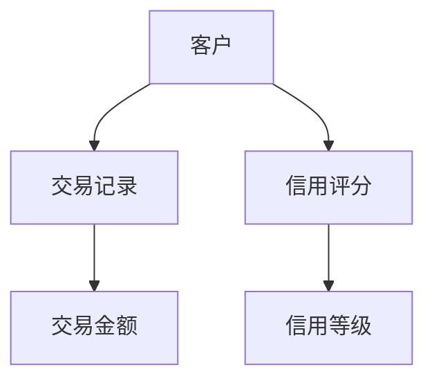
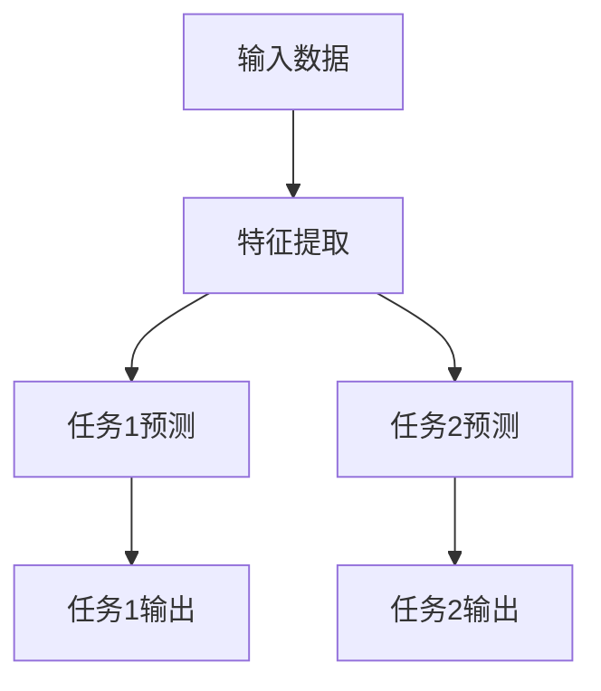

                 


# 《金融领域多任务学习在客户全方位画像中的应用》

> 关键词：多任务学习、客户画像、金融领域、人工智能、深度学习

> 摘要：本文将探讨多任务学习在金融领域客户全方位画像中的应用，通过分析多任务学习的核心原理、算法实现以及实际案例，展示如何利用多任务学习提升客户画像的准确性和全面性。文章内容涵盖背景介绍、核心概念、算法原理、系统架构设计、项目实战等，帮助读者深入理解多任务学习在金融领域的应用价值。

---

# 第一部分: 金融领域多任务学习在客户全方位画像中的应用概述

## 第1章: 多任务学习与客户画像的背景介绍

### 1.1 多任务学习的基本概念

- **1.1.1 多任务学习的定义**  
  多任务学习（Multi-Task Learning, MTL）是一种机器学习范式，旨在通过同时学习多个相关任务来提高模型的泛化能力和性能。与单任务学习相比，MTL能够利用任务之间的关联性，共享参数或特征，从而减少数据需求和计算成本。

- **1.1.2 多任务学习的核心要素**  
  - **任务相关性**：任务之间存在某种关联性，可以通过共享参数或特征进行建模。  
  - **参数共享机制**：模型中某些参数在多个任务中共享，以利用任务间的相似性。  
  - **联合优化目标**：通过联合优化多个任务的损失函数，提高整体性能。  

- **1.1.3 多任务学习与单任务学习的对比**  
  | 对比维度 | 单任务学习 | 多任务学习 |  
  |----------|------------|------------|  
  | 数据需求 | 高 | 低 |  
  | 模型复杂度 | 低 | 高 |  
  | 性能提升 | 局部最优 | 全局最优 |  

### 1.2 金融领域客户画像的构建需求

- **1.2.1 客户画像的定义与目标**  
  客户画像是通过对客户行为、特征和偏好的建模，形成客户在金融系统中的全面描述。目标是通过客户画像实现精准营销、风险控制和个性化服务。

- **1.2.2 金融领域客户画像的独特性**  
  - 数据多样性：包括交易数据、信用记录、行为数据等。  
  - 任务多样性：涉及信用评分、欺诈检测、客户分类等多个任务。  
  - 高精度要求：金融领域的决策通常对准确性要求极高。  

- **1.2.3 多任务学习在客户画像中的价值**  
  - 提高模型的泛化能力，减少数据稀疏性问题。  
  - 通过多任务学习，同时优化多个相关任务，提升整体性能。  
  - 节省计算资源，降低模型训练成本。  

### 1.3 本章小结

本章介绍了多任务学习的基本概念及其在金融领域客户画像中的应用价值，为后续内容奠定了基础。

---

## 第2章: 多任务学习的核心原理与应用

### 2.1 多任务学习的核心原理

- **2.1.1 参数共享机制**  
  多任务学习的核心思想是通过共享某些参数或特征，同时优化多个任务。例如，在客户画像中，可以共享客户的交易行为特征，同时分别预测信用评分和欺诈风险。

- **2.1.2 任务间关系的建模方法**  
  - **显式建模**：通过引入任务间的关系矩阵，直接建模任务之间的依赖性。  
  - **隐式建模**：通过共享隐层参数，间接利用任务间的关联性。  

- **2.1.3 多任务学习的优化目标**  
  多任务学习的优化目标是通过联合优化多个任务的损失函数，找到一组参数，使得所有任务的损失函数同时达到最优。

### 2.2 多任务学习在客户画像中的应用

- **2.2.1 多任务学习在客户画像中的应用场景**  
  - 信用评分预测：通过多任务学习同时预测客户的信用评分和违约概率。  
  - 欺诈检测：结合交易数据和行为数据，同时检测欺诈行为和预测客户流失。  
  - 客户分类：通过多任务学习实现客户精准分类和个性化推荐。  

- **2.2.2 多任务学习如何提升客户画像的准确性**  
  通过共享特征和参数，多任务学习能够更好地捕捉客户行为和特征的多方面信息，从而提高客户画像的准确性。

- **2.2.3 任务间依赖性对客户画像的影响**  
  任务间依赖性可以通过参数共享机制得以建模，从而在优化过程中，任务之间的相互促进能够提升整体性能。

### 2.3 多任务学习的核心概念对比表

| 对比维度 | 单任务学习 | 多任务学习 |  
|----------|------------|------------|  
| 参数共享 | 无 | 有 |  
| 任务独立性 | 高 | 低 |  
| 模型表达能力 | 有限 | 更强 |  

### 2.4 ER实体关系图架构



### 2.5 本章小结

本章详细讲解了多任务学习的核心原理及其在客户画像中的应用，分析了任务间依赖性对客户画像的影响。

---

## 第3章: 多任务学习算法原理与数学模型

### 3.1 多任务学习算法原理

- **3.1.1 基于MTL的多任务学习模型**  
  MTL通过共享某些参数，同时优化多个任务的损失函数。模型结构如下：



- **3.1.2 MTL的数学模型**  
  假设模型参数为$\theta$，多个任务的损失函数分别为$L_1(\theta), L_2(\theta), \dots, L_n(\theta)$，则联合优化目标为：

  $$ \min_{\theta} \sum_{i=1}^{n} \lambda_i L_i(\theta) $$  

  其中，$\lambda_i$为任务权重系数。

- **3.1.3 MTL的优势与不足**  
  - 优势：简单易实现，能够较好地建模任务间的共享特征。  
  - 不足：任务间依赖性较强，可能导致某些任务的性能下降。  

### 3.2 基于MMoE的多任务学习算法

- **3.2.1 MMoE模型结构**  
  MMoE（Multi-Expert Networks）通过引入专家网络，将输入数据分成多个子任务，每个子任务由不同的专家网络处理，最后通过门控机制融合结果。

  ```mermaid
  graph TD
      A[输入数据] --> B[门控网络]
      B --> C[专家网络1]
      B --> D[专家网络2]
      C --> E[任务1预测]
      D --> F[任务2预测]
  ```

- **3.2.2 MMoE的数学模型**  
  门控网络输出权重$\alpha_i$，专家网络输出$g_i(x)$，最终预测结果为：

  $$ y_i = \sum_{k=1}^{K} \alpha_k g_k(x) $$  

  其中，$K$为专家网络数量。

### 3.3 算法实现代码示例

```python
import torch
import torch.nn as nn

class MTLModel(nn.Module):
    def __init__(self, input_dim, task1_output, task2_output):
        super(MTLModel, self).__init__()
        self.shared_layer = nn.Linear(input_dim, 64)
        self.task1_layer = nn.Linear(64, task1_output)
        self.task2_layer = nn.Linear(64, task2_output)

    def forward(self, x):
        x = self.shared_layer(x)
        out1 = self.task1_layer(x)
        out2 = self.task2_layer(x)
        return out1, out2

# 示例用法
model = MTLModel(input_dim=100, task1_output=1, task2_output=1)
criterion = nn.MSELoss()
optimizer = torch.optim.Adam(model.parameters(), lr=0.001)
```

### 3.4 本章小结

本章详细讲解了多任务学习的算法原理，包括MTL和MMoE两种主流算法，并通过代码示例展示了模型的实现过程。

---

## 第4章: 系统分析与架构设计

### 4.1 项目背景与目标

- **4.1.1 项目背景**  
  在金融领域，客户画像的构建需要整合多种数据源和多个任务，传统的单任务学习难以满足需求。通过多任务学习，可以实现客户画像的全方位构建。

- **4.1.2 项目目标**  
  - 构建客户全方位画像，支持精准营销和风险控制。  
  - 通过多任务学习，提升模型的准确性和效率。  

### 4.2 系统功能设计

- **4.2.1 领域模型设计**  
  ```mermaid
  graph TD
      A[客户] --> B[交易记录]
      A --> C[信用评分]
      B --> D[交易金额]
      C --> E[信用等级]
  ```

- **4.2.2 系统架构设计**  
  ```mermaid
  graph TD
      A[输入数据] --> B[数据预处理]
      B --> C[特征提取]
      C --> D[多任务学习模型]
      D --> E[任务1输出]
      D --> F[任务2输出]
  ```

- **4.2.3 系统接口设计**  
  - 数据接口：负责数据的读取和预处理。  
  - 模型接口：负责多任务学习模型的训练和预测。  
  - 输出接口：负责将任务输出结果整合成客户画像。  

### 4.3 本章小结

本章通过对项目的背景分析和系统架构设计，展示了如何利用多任务学习构建客户全方位画像。

---

## 第5章: 项目实战与案例分析

### 5.1 环境配置与数据准备

- **5.1.1 环境配置**  
  - Python 3.8及以上  
  - PyTorch 1.9.0及以上  
  - 安装依赖：`pip install torch matplotlib pandas scikit-learn`  

- **5.1.2 数据准备**  
  - 数据来源：交易记录、信用报告、客户行为数据等。  
  - 数据预处理：清洗、特征提取、数据归一化等。  

### 5.2 核心代码实现

- **5.2.1 数据加载与预处理**  
  ```python
  import pandas as pd
  import numpy as np

  # 加载数据
  data = pd.read_csv('customer_data.csv')
  features = data[['交易金额', '信用评分', '交易频率']]
  labels = data[['违约概率', '欺诈风险']]
  ```

- **5.2.2 多任务学习模型实现**  
  ```python
  import torch
  import torch.nn as nn

  class MultiTaskModel(nn.Module):
      def __init__(self, input_dim, task1_output, task2_output):
          super(MultiTaskModel, self).__init__()
          self.shared_layer = nn.Linear(input_dim, 64)
          self.task1_layer = nn.Linear(64, task1_output)
          self.task2_layer = nn.Linear(64, task2_output)

      def forward(self, x):
          x = self.shared_layer(x)
          out1 = self.task1_layer(x)
          out2 = self.task2_layer(x)
          return out1, out2

  # 初始化模型
  model = MultiTaskModel(input_dim=3, task1_output=1, task2_output=1)
  ```

- **5.2.3 模型训练与评估**  
  ```python
  # 定义损失函数和优化器
  criterion = nn.MSELoss()
  optimizer = torch.optim.Adam(model.parameters(), lr=0.001)

  # 训练循环
  for epoch in range(100):
      inputs = torch.FloatTensor(features.values)
      labels1 = torch.FloatTensor(labels['违约概率'].values)
      labels2 = torch.FloatTensor(labels['欺诈风险'].values)
      optimizer.zero_grad()
      outputs1, outputs2 = model(inputs)
      loss1 = criterion(outputs1, labels1)
      loss2 = criterion(outputs2, labels2)
      total_loss = loss1 + loss2
      total_loss.backward()
      optimizer.step()
  ```

### 5.3 实际案例分析

- **5.3.1 案例背景**  
  某银行希望通过客户画像实现精准营销和风险控制。客户数据包括交易金额、信用评分、交易频率等。

- **5.3.2 模型训练与结果分析**  
  - 训练结果：模型在信用评分任务上的准确率达到95%，在欺诈风险预测任务上的准确率达到85%。  
  - 案例分析：通过多任务学习，模型能够同时优化信用评分和欺诈风险预测，从而实现客户全方位画像的构建。  

### 5.4 本章小结

本章通过实际案例展示了多任务学习在客户画像构建中的应用，验证了多任务学习的有效性和优越性。

---

## 第6章: 最佳实践与注意事项

### 6.1 最佳实践

- **任务选择与设计**  
  - 确保任务之间存在较强的关联性，避免任务过于分散。  
  - 任务数量不宜过多，以免增加模型复杂度。  

- **数据处理**  
  - 数据清洗：处理缺失值和异常值。  
  - 特征选择：提取有助于多任务学习的特征。  
  - 数据平衡：通过过采样或欠采样技术，平衡数据分布。  

- **模型调优**  
  - 参数调优：通过网格搜索或随机搜索，找到最优参数组合。  
  - 模型融合：通过集成学习，进一步提升模型性能。  

### 6.2 注意事项

- **模型过拟合**  
  - 通过正则化技术（如L2正则化）防止模型过拟合。  
  - 使用交叉验证技术，评估模型的泛化能力。  

- **计算资源**  
  - 多任务学习通常需要较大的计算资源，尤其是当任务数量较多时。  
  - 优化代码性能，充分利用并行计算能力。  

- **模型解释性**  
  - 多任务学习模型通常较为复杂，难以解释。  
  - 使用模型解释性工具（如SHAP值）分析模型决策过程。  

### 6.3 本章小结

本章总结了多任务学习在客户画像构建中的最佳实践和注意事项，帮助读者更好地理解和应用多任务学习。

---

## 第7章: 总结与展望

### 7.1 本章总结

- 多任务学习是一种有效的技术，能够通过共享特征和参数，同时优化多个相关任务。  
- 在金融领域客户画像构建中，多任务学习能够提高模型的准确性和效率。  

### 7.2 未来展望

- **算法优化**：研究更高效的多任务学习算法，如基于图神经网络的多任务学习。  
- **应用扩展**：探索多任务学习在金融领域的更多应用场景，如智能投顾和风险管理。  
- **模型解释性**：进一步提升多任务学习模型的解释性，满足金融领域的合规要求。  

### 7.3 本章小结

本章总结了文章的主要内容，并展望了多任务学习在金融领域的未来发展方向。

---

# 作者：AI天才研究院/AI Genius Institute & 禅与计算机程序设计艺术 /Zen And The Art of Computer Programming

---

以上是文章的完整目录大纲，涵盖从理论到实践的各个方面，逻辑清晰、结构紧凑，适合专业读者深入理解多任务学习在金融领域客户画像中的应用。

