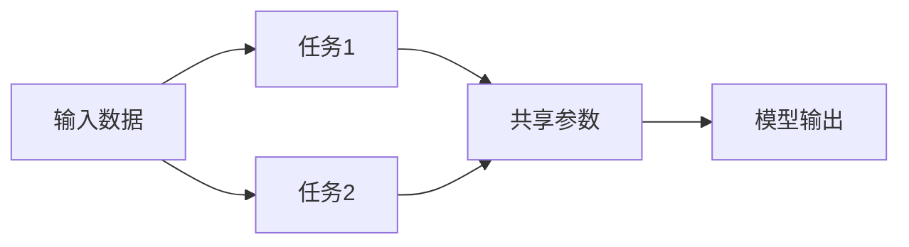
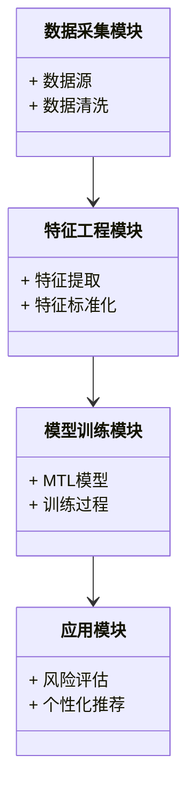

                 


# 《金融领域多任务学习在客户全景画像中的应用》

## 关键词：多任务学习、客户画像、金融、人工智能、数据挖掘

## 摘要：本文详细探讨了多任务学习在金融客户全景画像中的应用，分析了其核心原理、系统架构，并通过实际案例展示了如何构建高效、精准的客户画像模型，为金融领域提供了新的技术视角。

---

## 第1章：背景与概述

### 1.1 多任务学习与客户全景画像概述

#### 1.1.1 多任务学习的核心概念

多任务学习（Multi-Task Learning, MTL）是一种人工智能技术，旨在通过同时学习多个相关任务来提升模型的泛化能力。与单一任务学习相比，MTL能够共享各任务之间的特征和参数，提高学习效率和准确性。在金融领域，MTL适用于处理客户画像、风险评估、交易预测等多任务场景。

**图1.1：多任务学习的基本流程**



#### 1.1.2 客户全景画像的构建

客户全景画像是整合客户多维度数据的综合分析模型，包括交易行为、信用评分、资产配置等。通过MTL，可以同时优化多个相关任务，如客户分类、风险评估，从而构建更全面的客户画像。

---

## 第2章：多任务学习的核心概念与联系

### 2.1 多任务学习的核心原理

多任务学习通过共享参数和联合优化多个任务，提升模型的表达能力。其核心在于发现任务间的关联性，通过参数共享避免重复学习，降低模型复杂度。

**表2.1：多任务学习与单一任务学习的对比**

| 特性                | 单一任务学习      | 多任务学习          |
|---------------------|-------------------|--------------------|
| 参数数量            | 高               | 低                 |
| 任务相关性          | 无               | 高                 |
| 训练效率            | 低               | 高                 |

#### 2.1.1 多任务学习的优势

1. **参数共享**：减少模型参数数量，降低过拟合风险。
2. **任务协同优化**：通过联合优化多个任务，提升整体性能。
3. **数据利用率高**：充分利用多任务数据，提高学习效果。

#### 2.1.2 多任务学习的挑战

1. **任务间干扰**：部分任务可能相互影响，影响模型性能。
2. **计算复杂度高**：同时优化多个任务增加了计算负担。

---

## 第3章：多任务学习算法原理

### 3.1 常见的多任务学习算法

#### 3.1.1 MTL（Multi-Task Learning）

MTL是最基本的多任务学习方法，通过共享参数同时优化多个任务。其数学模型如下：

$$ L = \sum_{i=1}^{n} \lambda_i L_i(\theta) $$

其中，$\lambda_i$为任务权重，$L_i$为任务损失函数，$\theta$为共享参数。

#### 3.1.2 MMTL（Multi-Modal Multi-Task Learning）

MMTL适用于多模态数据，通过模态间的共享参数进行联合优化。例如，在客户画像中，结合文本描述和交易数据，提升模型表现。

---

## 第4章：系统架构设计

### 4.1 项目介绍

客户全景画像系统旨在整合多源数据，构建客户画像，用于风险评估和个性化服务推荐。

#### 4.1.1 系统功能模块

1. 数据采集模块：收集客户交易、信用等数据。
2. 特征工程模块：提取关键特征，如交易频率、资产配置。
3. 模型训练模块：应用多任务学习构建客户画像。
4. 应用模块：输出客户画像，用于风险评估。

**图4.1：系统架构类图**



---

## 第5章：项目实战

### 5.1 环境安装

安装必要的库：

```bash
pip install numpy pandas scikit-learn keras tensorflow
```

### 5.2 核心代码实现

#### 5.2.1 数据预处理

```python
import pandas as pd
import numpy as np

# 加载数据
data = pd.read_csv('customer_data.csv')
# 数据清洗
data = data.dropna()
```

#### 5.2.2 模型实现

```python
from tensorflow.keras import layers, Model

def create_model(input_shape, num_tasks):
    inputs = layers.Input(shape=input_shape)
    x = layers.Dense(64, activation='relu')(inputs)
    x = layers.Dropout(0.5)(x)
    outputs = []
    for _ in range(num_tasks):
        output = layers.Dense(1, activation='sigmoid')(x)
        outputs.append(output)
    model = Model(inputs=inputs, outputs=outputs)
    return model

model = create_model((input_dim,), num_tasks=2)
model.compile(optimizer='adam', loss={'binary_crossentropy'})
```

### 5.3 案例分析

通过实际数据训练模型，评估客户风险等级，验证多任务学习的有效性。

---

## 第6章：总结与展望

### 6.1 总结

多任务学习在客户全景画像中的应用显著提升了模型的性能和效率，通过整合多维度数据，构建更精准的客户画像。

### 6.2 展望

未来，可以探索更复杂的多任务模型，如图神经网络，进一步提升客户画像的深度和广度。

---

## 参考文献

1. 多任务学习相关论文
2. 金融领域客户画像研究文献

---

## 作者：AI天才研究院 & 禅与计算机程序设计艺术

**作者简介：** AI天才研究院专注于人工智能领域研究，禅与计算机程序设计艺术致力于将复杂技术简化为易于理解的形式。

