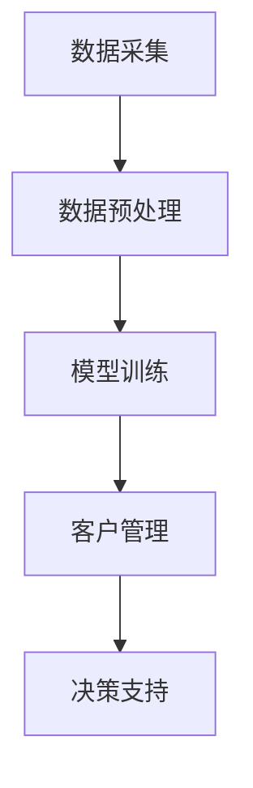

                 


```markdown
# 金融领域多任务学习在客户全生命周期管理中的应用

## 关键词：多任务学习，客户全生命周期，金融管理，机器学习，风险管理

## 摘要：本文探讨了多任务学习在金融客户管理中的应用，分析了其在客户画像、行为预测和风险评估中的优势，通过系统设计和案例分析展示了多任务学习的实际应用价值，并展望了其未来发展。

---

## 第1章: 多任务学习的背景与概念

### 1.1 多任务学习的基本概念

#### 1.1.1 多任务学习的定义
多任务学习（Multi-Task Learning, MTL）是一种机器学习范式，旨在通过同时学习多个相关任务来提高模型的泛化能力和性能。MTL的核心思想是利用任务之间的共享特征，减少数据需求，提高模型效率。

#### 1.1.2 多任务学习的核心思想
多任务学习通过共享参数或特征，使模型能够同时处理多个任务，从而在任务之间建立关联，捕捉数据中的潜在结构，提升整体性能。

#### 1.1.3 多任务学习与单任务学习的对比
| 特性                | 单任务学习          | 多任务学习          |
|---------------------|--------------------|--------------------|
| 数据需求            | 需要大量数据        | 数据需求较低        |
| 模型复杂性          | 简单               | 较为复杂            |
| 任务关联性          | 无关联             | 高度关联            |
| 性能提升            | 单一任务优化        | 多任务协同优化        |

### 1.2 金融领域客户全生命周期管理的挑战

#### 1.2.1 客户全生命周期管理的定义
客户全生命周期管理是指从客户获取、成长、成熟到衰退的全过程管理，涉及客户画像、行为分析、风险评估等多个环节。

#### 1.2.2 传统客户管理的局限性
- 数据孤岛：不同环节的数据分散，难以整合。
- 模型独立：各环节使用独立模型，缺乏关联性。
- 效率低下：传统方法难以同时处理多个任务。

#### 1.2.3 多任务学习在客户管理中的价值
通过多任务学习，可以同时优化多个相关任务，提升整体管理效率和准确性。

---

## 第2章: 多任务学习的核心概念与联系

### 2.1 多任务学习的原理

#### 2.1.1 多任务学习的数学模型
多任务学习的数学模型通常表示为：
$$ L = \sum_{i=1}^{n} \lambda_i L_i $$
其中，$L_i$ 是第i个任务的损失函数，$\lambda_i$ 是任务权重。

#### 2.1.2 多任务学习的权重共享机制
权重共享机制是MTL的核心，通过共享部分权重，模型能够捕捉任务间的相似性。

#### 2.1.3 多任务学习的优化目标
优化目标是在多个任务之间找到平衡，最大化整体性能。

### 2.2 多任务学习与客户全生命周期管理的联系

#### 2.2.1 客户画像与多任务学习的关系
客户画像是通过多任务学习构建的，涉及客户属性、行为等多个方面。

#### 2.2.2 客户行为预测与多任务学习的应用
通过多任务学习，可以同时预测客户的多个行为，如购买、违约等。

#### 2.2.3 客户风险评估与多任务学习的结合
多任务学习可以同时评估客户的信用风险和市场风险，提升评估精度。

---

## 第3章: 多任务学习的算法原理

### 3.1 多任务学习的模型结构

#### 3.1.1 基于神经网络的多任务学习模型
神经网络模型是MTL的常见选择，通过共享部分层，实现任务间的特征共享。

#### 3.1.2 分层多任务学习模型
分层模型将任务分为多个层次，逐步优化。

#### 3.1.3 跨任务注意力机制
注意力机制能够自适应地分配任务权重，提升模型性能。

### 3.2 多任务学习的优化算法

#### 3.2.1 基于梯度下降的多任务优化
通过梯度下降优化多个任务的损失函数，同时考虑任务权重。

#### 3.2.2 参数共享与任务权重分配
参数共享是MTL的关键，任务权重的分配影响整体性能。

#### 3.2.3 多任务学习的正则化方法
正则化方法可以防止过拟合，提升模型的泛化能力。

---

## 第4章: 多任务学习在金融领域的应用

### 4.1 金融客户画像构建

#### 4.1.1 客户画像的多任务学习模型设计
通过多任务学习，构建客户的多维度画像。

#### 4.1.2 基于多任务学习的客户画像构建流程
- 数据收集
- 特征提取
- 模型训练
- 画像生成

#### 4.1.3 客户画像的可视化与分析
通过可视化工具，展示客户的画像特征。

### 4.2 客户行为预测与风险评估

#### 4.2.1 多任务学习在客户行为预测中的应用
预测客户的购买、违约等行为。

#### 4.2.2 基于多任务学习的客户风险评估模型
同时评估客户的信用风险和市场风险。

#### 4.2.3 案例分析：客户违约风险预测
通过MTL模型，准确预测客户违约风险。

---

## 第5章: 系统分析与架构设计

### 5.1 系统功能模块设计

#### 5.1.1 数据采集与预处理模块
- 数据来源：客户数据、交易数据等。
- 数据清洗：处理缺失值、异常值。

#### 5.1.2 多任务学习模型训练模块
- 模型选择：神经网络、决策树等。
- 参数调优：优化任务权重。

#### 5.1.3 客户管理与决策支持模块
- 客户画像展示
- 风险评估报告

### 5.2 系统架构设计

#### 5.2.1 系统整体架构图


#### 5.2.2 数据流与任务流设计
数据流：数据采集 → 数据预处理 → 模型训练 → 客户管理 → 决策支持。

---

## 第6章: 项目实战与案例分析

### 6.1 环境搭建与数据准备

#### 6.1.1 开发环境安装与配置
- 安装Python、TensorFlow、Keras等。

#### 6.1.2 数据准备
- 数据来源：银行客户数据。
- 数据格式：CSV格式。

### 6.2 系统核心实现源代码

#### 6.2.1 数据预处理代码
```python
import pandas as pd

data = pd.read_csv('customer_data.csv')
data = data.dropna()
```

#### 6.2.2 多任务学习模型实现
```python
import tensorflow as tf
from tensorflow import keras

model = keras.Sequential([
    keras.layers.Dense(64, activation='relu'),
    keras.layers.Dense(1, activation='sigmoid')
])
```

#### 6.2.3 模型训练代码
```python
model.compile(optimizer='adam', loss='binary_crossentropy')
model.fit(X_train, y_train, epochs=10, batch_size=32)
```

### 6.3 案例分析与详细解读

#### 6.3.1 案例分析
分析模型在客户违约预测中的表现。

#### 6.3.2 详细解读
通过案例分析，验证模型的有效性。

---

## 第7章: 总结与展望

### 7.1 项目总结
总结多任务学习在客户管理中的应用价值。

### 7.2 未来展望
展望MTL在金融领域的未来发展，包括更复杂任务和实时分析。

---

## 作者：AI天才研究院 & 禅与计算机程序设计艺术
```

