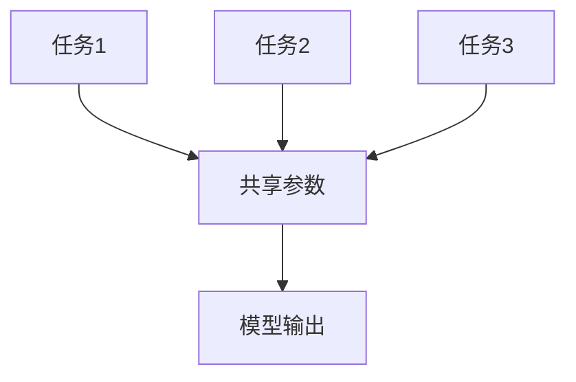
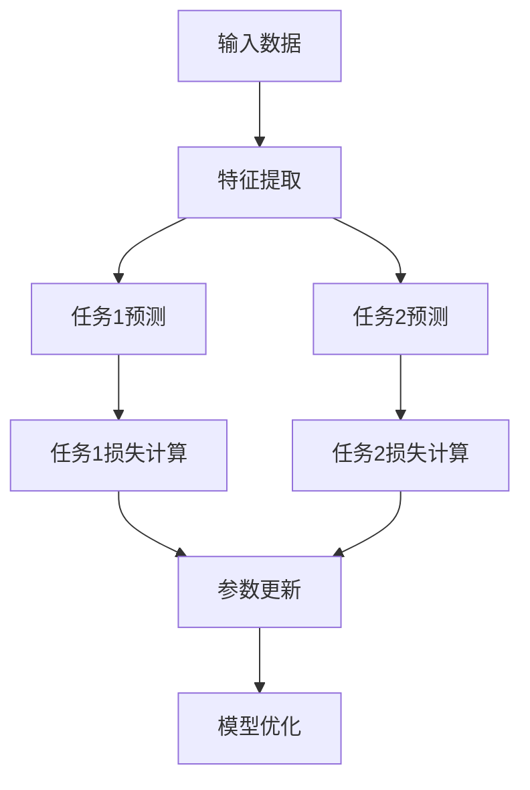
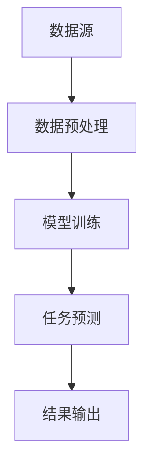

                 


# 《金融领域多任务学习的应用与挑战》

---

## 关键词：  
金融，多任务学习，人工智能，深度学习，机器学习，时间序列预测，风险评估，文本分析

---

## 摘要：  
随着人工智能技术的快速发展，多任务学习（Multi-Task Learning, MTL）在金融领域的应用日益广泛。本文深入探讨了多任务学习的核心概念、算法原理及其在金融领域的应用场景，分析了其在金融时间序列预测、风险评估和文本分析等方面的优势与挑战。通过结合实际案例和系统架构设计，本文为读者提供了从理论到实践的全面解读，并总结了多任务学习在金融领域应用中的最佳实践和未来发展方向。

---

## 正文：

---

### 第一章：多任务学习的基本概念与背景

#### 1.1 多任务学习的定义与特点

多任务学习（Multi-Task Learning, MTL）是一种机器学习范式，旨在通过同时学习多个相关任务来提升模型的泛化能力和性能。与传统单任务学习不同，MTL允许模型在多个任务之间共享参数，从而捕捉任务间的共性和差异性。

**特点：**  
- **参数共享：** MTL通过共享参数，减少模型的参数数量，提高训练效率。  
- **任务相关性：** MTL假设任务之间存在一定的相关性，从而可以互相促进学习效果。  
- **泛化能力：** MTL模型能够更好地处理 unseen 的任务，提升模型的泛化能力。  

---

#### 1.2 金融领域中的多任务学习

在金融领域，多任务学习的应用场景丰富多样。以下是几个典型的应用场景：

1. **金融时间序列预测：**  
   预测股票价格、汇率波动等时间序列数据，同时学习多个相关任务（如趋势预测和波动率预测）。  
2. **金融风险评估：**  
   同时评估信用风险、市场风险和操作风险，通过多任务学习共享风险相关特征。  
3. **金融文本分析：**  
   对新闻、财报等文本进行情感分析、主题分类等任务，通过多任务学习提升文本理解能力。  

**优势：**  
- **数据稀缺性：** 金融数据往往样本有限，多任务学习可以通过参数共享缓解数据不足的问题。  
- **任务相关性：** 金融任务之间通常存在高度的相关性，如价格与波动率的关系。  
- **提升效率：** 同时学习多个任务可以减少模型的训练时间和计算成本。  

---

#### 1.3 本章小结

本章介绍了多任务学习的基本概念及其在金融领域的应用场景，强调了其在金融领域的重要性和优势。接下来，我们将深入探讨多任务学习的核心原理及其在金融中的具体应用。

---

### 第二章：多任务学习的核心原理

#### 2.1 多任务学习的原理

多任务学习的数学模型可以通过以下公式表示：

$$
\min_{\theta} \sum_{i=1}^{n} \lambda_i L_i(\theta) + \lambda_{\text{shared}} L_{\text{shared}}(\theta)
$$

其中，$\lambda_i$ 是任务i的损失权重，$L_{\text{shared}}$ 是共享参数的损失函数。

**参数共享机制：**  
多任务学习通过共享参数，使得模型能够同时优化多个任务，从而捕捉任务间的共性特征。

---

#### 2.2 多任务学习的特征对比

| 特征维度 | 单任务学习 | 多任务学习 |
|----------|------------|------------|
| **任务独立性** | 任务之间独立 | 任务之间相关 |
| **参数数量** | 参数不共享 | 参数共享 |
| **训练效率** | 训练时间较长 | 训练时间较短 |

---

#### 2.3 多任务学习的ER实体关系图



---

#### 2.4 本章小结

本章深入探讨了多任务学习的核心原理及其在金融领域中的应用，分析了其与单任务学习的区别。接下来，我们将从算法原理的角度，进一步分析多任务学习的实现细节。

---

### 第三章：多任务学习的算法原理

#### 3.1 多任务学习的算法框架

1. **基于参数共享的多任务学习框架：**  
   通过共享部分参数，同时优化多个任务的损失函数。  
2. **基于任务关系的多任务学习框架：**  
   根据任务之间的关系，动态调整参数共享策略。  
3. **基于注意力机制的多任务学习框架：**  
   引入注意力机制，根据任务的重要性动态分配权重。  

---

#### 3.2 多任务学习的数学模型

**损失函数的定义：**  
$$
L = \sum_{i=1}^{n} \lambda_i L_i(\theta)
$$  
其中，$\lambda_i$ 是任务i的损失权重，$L_i$ 是任务i的损失函数。

**参数共享的数学表达：**  
$$
\theta = \{ \theta_1, \theta_2, ..., \theta_n \}
$$  
其中，$\theta_i$ 是任务i的模型参数。  

---

#### 3.3 多任务学习的算法流程



---

#### 3.4 本章小结

本章从算法原理的角度，详细分析了多任务学习的实现细节，包括算法框架、数学模型和流程图。接下来，我们将从系统架构的角度，探讨多任务学习在金融领域的具体应用。

---

### 第四章：金融领域多任务学习的系统架构与设计

#### 4.1 金融多任务学习的应用场景

1. **金融时间序列预测：**  
   预测股票价格、汇率波动等时间序列数据。  
2. **金融风险评估：**  
   评估信用风险、市场风险和操作风险。  
3. **金融文本分析：**  
   分析新闻、财报等文本数据，提取情感倾向和主题分类。  

---

#### 4.2 系统功能设计

1. **数据处理模块：**  
   负责数据的采集、清洗和预处理。  
2. **模型训练模块：**  
   实现多任务学习模型的训练和优化。  
3. **任务预测模块：**  
   根据训练好的模型，进行多个任务的预测和分析。  

---

#### 4.3 系统架构设计



---

#### 4.4 系统接口设计

1. **数据接口：**  
   提供数据输入和输出的接口。  
2. **模型接口：**  
   提供模型训练和预测的接口。  
3. **结果接口：**  
   提供预测结果的输出接口。  

---

#### 4.5 本章小结

本章从系统架构的角度，详细设计了金融多任务学习的系统模块和接口。接下来，我们将通过具体案例，展示多任务学习在金融领域的实际应用。

---

### 第五章：项目实战：金融多任务学习的实现

#### 5.1 环境安装

- **Python版本：** Python 3.8+  
- **深度学习框架：** TensorFlow或PyTorch  
- **依赖库安装：**  
  ```bash
  pip install numpy pandas scikit-learn tensorflow
  ```

---

#### 5.2 核心实现代码

以下是一个简单的多任务学习模型实现示例：

```python
import tensorflow as tf
import numpy as np

# 定义任务1和任务2的损失函数
def task1_loss(y_true, y_pred):
    return tf.reduce_mean(tf.square(y_true - y_pred))

def task2_loss(y_true, y_pred):
    return tf.reduce_mean(tf.log(1 + tf.square(y_true - y_pred)))

# 定义多任务学习模型
def multi_task_model(input_shape):
    inputs = tf.keras.Input(shape=input_shape)
    x = tf.keras.layers.Dense(64, activation='relu')(inputs)
    x = tf.keras.layers.Dense(32, activation='relu')(x)
    
    # 分支1：任务1的输出
    output1 = tf.keras.layers.Dense(1, name='output_task1')(x)
    # 分支2：任务2的输出
    output2 = tf.keras.layers.Dense(1, name='output_task2')(x)
    
    model = tf.keras.Model(inputs=inputs, outputs=[output1, output2])
    return model

# 编译模型
model = multi_task_model(input_shape=(input_dim,))
model.compile(optimizer='adam', loss={'output_task1': task1_loss, 'output_task2': task2_loss})
```

---

#### 5.3 案例分析与解读

以金融时间序列预测为例，假设我们同时预测股票价格和波动率。模型可以通过共享参数，同时优化价格预测和波动率预测两个任务，从而提升预测的准确性和鲁棒性。

---

#### 5.4 本章小结

本章通过具体的项目实战，展示了多任务学习在金融领域的实现过程。接下来，我们将总结多任务学习在金融领域应用中的最佳实践和未来发展方向。

---

### 第六章：总结与展望

#### 6.1 本章总结

本文深入探讨了多任务学习的核心概念、算法原理及其在金融领域的应用场景。通过系统架构设计和项目实战，我们展示了多任务学习在金融时间序列预测、风险评估和文本分析中的优势与挑战。

---

#### 6.2 未来展望

随着人工智能技术的不断进步，多任务学习在金融领域的应用前景广阔。未来的研究方向包括：  
1. **更复杂的任务关系建模：** 如引入图神经网络（Graph Neural Network）建模任务间的复杂关系。  
2. **动态参数共享机制：** 根据任务的重要性和相关性动态调整参数共享策略。  
3. **多模态数据融合：** 将文本、图像等多种模态数据融入多任务学习模型中，提升模型的综合分析能力。  

---

## 作者：  
**AI天才研究院/AI Genius Institute**  
**禅与计算机程序设计艺术 / Zen And The Art of Computer Programming**

