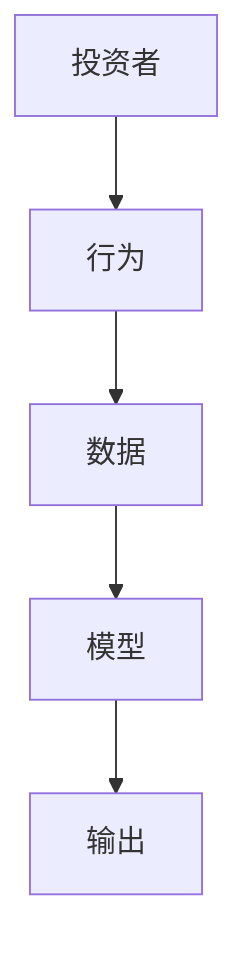

                 

<think>
好，我现在需要根据用户的要求，逐步构建一个详细的《金融领域多模态学习在投资者行为分析中的应用》的技术博客文章。首先，我会按照用户提供的目录大纲，逐步填充每一部分的内容。

### 第一部分: 金融领域多模态学习的背景与基础

#### 第1章: 多模态学习的定义与应用

##### 1.1 多模态学习的核心概念

###### 1.1.1 多模态学习的定义
多模态学习是一种机器学习方法，旨在从多种数据类型（如文本、图像、语音等）中提取信息，并通过融合这些信息来提高模型的性能和准确性。与单模态学习不同，多模态学习能够综合考虑多个数据源，从而捕捉更全面的信息。

###### 1.1.2 多模态学习的特点与优势
多模态学习具有以下特点：
- **数据多样性**：利用多种数据源，提高模型的鲁棒性和泛化能力。
- **信息互补性**：不同模态的数据可以相互补充，提供更全面的视角。
- **高性能**：通过融合多种数据，模型能够更好地捕捉复杂模式。

优势包括：
- 提高准确性：通过多源数据融合，模型能够更准确地识别模式。
- 增强解释性：多模态数据有助于更好地理解问题的本质。
- 提升用户体验：通过综合分析，提供更个性化的服务。

###### 1.1.3 多模态学习在金融领域的应用潜力
在金融领域，多模态学习的应用潜力主要体现在以下几个方面：
- **投资者行为分析**：通过分析文本、市场数据和用户行为数据，多模态学习能够更准确地预测投资者行为。
- **风险评估**：结合市场数据和新闻数据，多模态学习可以帮助更准确地评估投资风险。
- **智能投顾**：通过分析客户的多源数据，提供个性化的投资建议。

#### 1.2 金融领域投资者行为分析的背景

##### 1.2.1 投资者行为分析的重要性
投资者行为分析是理解市场动态、制定投资策略的重要基础。通过分析投资者的行为模式，可以预测市场趋势，优化投资组合。

##### 1.2.2 传统投资者行为分析的局限性
传统投资者行为分析主要依赖单模态数据，如市场数据或文本数据，难以捕捉投资者的全貌。此外，传统方法往往忽视了数据之间的关联性和互补性，导致分析结果的片面性。

##### 1.2.3 多模态学习在投资者行为分析中的优势
多模态学习通过融合多种数据源，能够更全面地捕捉投资者行为的细节，提高分析的准确性和深度。

#### 第2章: 多模态学习与投资者行为分析的关系

##### 2.1 多模态学习的核心原理

###### 2.1.1 多模态数据的融合方法
多模态数据的融合方法主要包括：
- **特征级融合**：在特征提取阶段将不同模态的数据进行融合。
- **决策级融合**：在模型输出结果后，将不同模型的输出进行融合。
- **混合融合**：结合特征级和决策级融合的优势。

###### 2.1.2 多模态学习的模型结构
多模态学习的模型结构主要包括：
- **多模态神经网络**：如多模态循环神经网络、多模态卷积神经网络。
- **注意力机制**：用于捕捉不同模态数据之间的关联性。
- **对比学习**：通过对比不同模态的数据，提高模型的判别能力。

###### 2.1.3 多模态学习与传统单模态分析的对比
多模态学习相比传统单模态分析，具有以下优势：
- 更全面的信息捕捉。
- 更高的模型准确率。
- 更强的泛化能力。

##### 2.2 投资者行为分析的多模态数据来源

###### 2.2.1 文本数据
文本数据包括新闻、社交媒体评论等，反映了市场情绪和投资者 sentiment。

###### 2.2.2 市场数据
市场数据包括股票价格、成交量等，反映了市场的动态和趋势。

###### 2.2.3 用户行为数据
用户行为数据包括投资者的点击、浏览、登录等行为，反映了投资者的互动模式。

##### 2.3 多模态学习在投资者行为分析中的应用框架

###### 2.3.1 数据采集与预处理
数据采集包括从多种数据源获取数据，预处理包括数据清洗、特征提取等。

###### 2.3.2 多模态数据融合
将不同模态的数据进行融合，提取共同特征或进行信息互补。

###### 2.3.3 模型训练与优化
基于融合后的数据，训练多模态模型，并进行模型优化和调参。

#### 第3章: 多模态学习的核心概念与联系

##### 3.1 多模态学习的原理

###### 3.1.1 多模态数据的表示方法
多模态数据的表示方法包括：
- **词嵌入**：如Word2Vec，用于文本数据的表示。
- **图像特征提取**：如CNN、GAN，用于图像数据的表示。
- **时间序列建模**：如LSTM、GRU，用于时间数据的表示。

###### 3.1.2 多模态特征的提取与融合
特征提取包括对不同模态数据的特征提取，融合则包括将这些特征进行合并，如加权融合、注意力融合等。

###### 3.1.3 多模态模型的训练与优化
训练过程包括数据预处理、模型选择、参数调优等，优化目标是提高模型的准确率和泛化能力。

##### 3.2 多模态学习与传统机器学习的对比

###### 3.2.1 数据来源的差异
多模态学习利用多种数据源，而传统机器学习通常依赖单源数据。

###### 3.2.2 模型结构的差异
多模态学习模型结构复杂，通常包含多种模态的特征提取和融合模块，而传统模型结构相对简单。

###### 3.2.3 应用效果的差异
多模态学习通常能够提供更准确和全面的分析结果，而传统方法可能在某些方面存在局限性。

##### 3.3 多模态学习的ER实体关系图

### 总结
通过以上章节的详细分析，我们可以看到，多模态学习在投资者行为分析中的应用具有巨大的潜力。通过融合多种数据源，多模态学习能够更全面地捕捉投资者行为的细节，从而提高分析的准确性和深度。未来，随着技术的不断发展，多模态学习在金融领域的应用将更加广泛和深入。

**作者：AI天才研究院/AI Genius Institute & 禅与计算机程序设计艺术 /Zen And The Art of Computer Programming**

