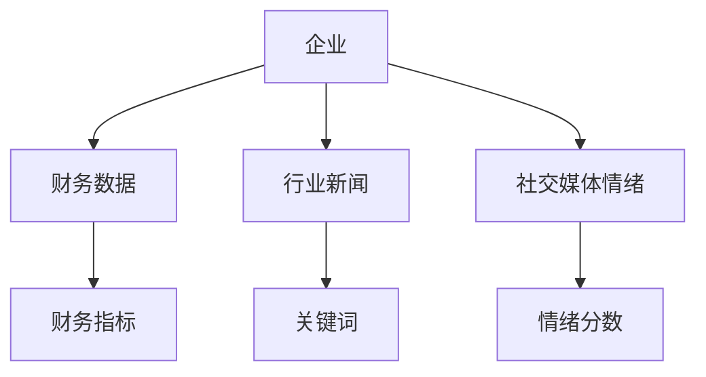
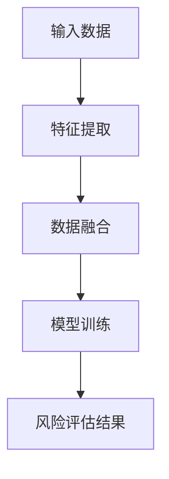
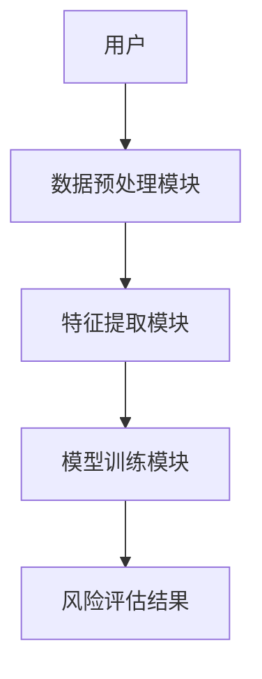

                 


# 《金融领域多模态学习在风险评估中的应用》

> **关键词**：金融风险评估，多模态学习，机器学习，风险控制，数据融合

> **摘要**：本文深入探讨了多模态学习在金融风险评估中的应用，分析了其核心概念、算法原理、系统架构，并通过实际案例展示了如何利用多模态数据提升风险评估的准确性和全面性。

---

## 第1章：金融领域风险评估的背景与挑战

### 1.1 金融风险评估的定义与重要性

金融风险评估是衡量和预测金融资产或机构在特定条件下可能面临的风险程度的过程。它对于投资者、企业和监管机构来说至关重要，能够帮助做出更明智的决策，避免重大损失。

传统风险评估方法通常依赖单一数据源，如财务报表或市场数据，这在复杂金融市场中显得力不从心。例如，仅依赖财务数据可能无法捕捉到市场情绪或行业趋势的变化，导致评估结果不够准确。

### 1.2 多模态学习的定义与特点

多模态学习是指从多种数据类型（如文本、图像、语音、数值等）中提取信息，并结合这些信息进行学习和推理的过程。其核心特点是能够综合利用不同数据源的信息，从而提高模型的准确性和鲁棒性。

与单模态学习相比，多模态学习能够更好地捕捉复杂场景下的多维信息。例如，在金融领域，结合新闻文本、市场数据和社交媒体情绪数据，可以更全面地评估一家公司的信用风险。

### 1.3 问题背景与目标

金融市场的复杂性要求风险评估方法必须能够处理多种类型的数据，并且能够实时捕捉市场变化。传统方法往往局限于单一数据源，难以应对复杂的市场动态。多模态学习的引入，为解决这一问题提供了新的可能性。

本文旨在探讨如何利用多模态学习技术，从多种数据源中提取信息，构建更准确的金融风险评估模型。

### 1.4 问题解决与边界

多模态学习通过融合多种数据源，能够更全面地捕捉影响金融风险的各种因素。例如，结合新闻数据、市场数据和社交媒体情绪数据，可以更准确地预测市场波动。

应用的边界在于，多模态学习需要处理大量的异构数据，这可能会增加计算复杂性和数据预处理的难度。此外，模型的解释性也是一个挑战，需要进一步研究。

### 1.5 本章小结

本章介绍了金融风险评估的背景和挑战，探讨了多模态学习的定义和特点，并明确了本文的研究目标和应用边界。

---

## 第2章：多模态学习的核心概念与联系

### 2.1 多模态学习的原理

多模态学习通过融合不同数据源的信息，利用特征提取、数据融合和模型训练等步骤，构建能够同时处理多种数据类型的模型。

例如，在信用风险评估中，可以结合企业的财务数据、行业新闻和社交媒体上的声誉信息，构建一个更全面的评估模型。

### 2.2 核心概念对比表

| **属性**         | **单模态学习**                     | **多模态学习**                     |
|------------------|-----------------------------------|-----------------------------------|
| 数据源           | 单一数据类型                     | 多种数据类型                     |
| 信息利用率       | 较低                             | 较高                             |
| 模型复杂度       | 较低                             | 较高                             |
| 性能表现         | 可能不足                         | 更优                             |

### 2.3 ER实体关系图



### 2.4 本章小结

本章通过对比单模态学习和多模态学习的核心概念，展示了多模态学习在金融风险评估中的潜力。

---

## 第3章：多模态学习算法原理

### 3.1 多模态融合算法

#### 3.1.1 多模态融合的基本概念

多模态融合是指将多种数据源的信息进行整合，以提高模型的性能。常见的融合方法包括特征级融合、决策级融合和混合融合。

#### 3.1.2 多模态融合的主流算法

- **特征级融合**：将不同数据源的特征向量进行拼接或加权组合。
- **决策级融合**：将不同模型的输出结果进行融合。
- **混合融合**：结合特征级和决策级的融合方法。

#### 3.1.3 多模态融合的流程图



### 3.2 注意力机制在多模态学习中的应用

#### 3.2.1 注意力机制的原理

注意力机制通过计算输入数据中各部分的重要性权重，关注关键信息。例如，在自然语言处理中，注意力机制可以用于确定句子中每个词的重要性。

#### 3.2.2 多模态注意力机制的实现

多模态注意力机制可以同时关注不同数据源中的重要信息。例如，在金融新闻分析中，可以同时关注新闻内容和市场数据。

#### 3.2.3 注意力机制的优缺点

- **优点**：能够自动关注重要信息，提高模型性能。
- **缺点**：计算复杂度较高，可能增加模型训练时间。

### 3.3 多模态学习的数学模型

#### 3.3.1 多模态融合的数学表示

假设我们有两类数据，$X$ 和 $Y$，则融合后的特征可以表示为：

$$ Z = \alpha X + (1-\alpha) Y $$

其中，$\alpha$ 是融合权重。

#### 3.3.2 注意力机制的数学公式

注意力机制的计算公式为：

$$ \text{Attention}(Q, K, V) = \text{softmax}\left(\frac{QK^T}{\sqrt{d_k}}\right)V $$

其中，$Q$ 是查询向量，$K$ 是键向量，$V$ 是值向量，$d_k$ 是键的维度。

### 3.4 本章小结

本章详细介绍了多模态学习的算法原理，包括多模态融合和注意力机制，并通过数学公式展示了其具体实现。

---

## 第4章：系统分析与架构设计方案

### 4.1 项目背景

本文旨在构建一个基于多模态学习的金融风险评估系统，利用多种数据源（如财务数据、新闻文本和社交媒体情绪）进行风险评估。

### 4.2 系统功能设计

#### 4.2.1 领域模型


#### 4.2.2 系统架构设计



#### 4.2.3 系统接口设计

系统接口包括数据输入接口、模型训练接口和结果输出接口。

### 4.3 系统交互流程

```mermaid
sequenceDiagram
    participant 用户
    participant 数据预处理模块
    participant 特征提取模块
    participant 模型训练模块
    用户 -> 数据预处理模块：输入多模态数据
    数据预处理模块 -> 特征提取模块：提取特征
    特征提取模块 -> 模型训练模块：训练模型
    模型训练模块 -> 用户：输出风险评估结果
```

### 4.4 本章小结

本章详细设计了基于多模态学习的金融风险评估系统的架构和交互流程。

---

## 第5章：项目实战

### 5.1 环境安装

需要安装以下工具和库：

- Python 3.8+
- NumPy
- Pandas
- Scikit-learn
- TensorFlow/PyTorch

### 5.2 核心代码实现

#### 5.2.1 数据预处理

```python
import pandas as pd

# 加载数据
data = pd.read_csv('financial_data.csv')

# 数据清洗
data.dropna(inplace=True)
data = data[~data.duplicated()]
```

#### 5.2.2 特征提取

```python
from sklearn.feature_extraction.text import TfidfVectorizer

# 文本特征提取
vectorizer = TfidfVectorizer()
text_features = vectorizer.fit_transform(data['news'])
```

#### 5.2.3 模型训练

```python
import tensorflow as tf
from tensorflow.keras import layers

# 定义模型
model = tf.keras.Sequential([
    layers.Dense(64, activation='relu'),
    layers.Dropout(0.5),
    layers.Dense(1, activation='sigmoid')
])

# 编译模型
model.compile(optimizer='adam', loss='binary_crossentropy', metrics=['accuracy'])
```

#### 5.2.4 模型训练与评估

```python
# 训练模型
model.fit(X_train, y_train, epochs=10, batch_size=32, validation_split=0.2)

# 评估模型
loss, accuracy = model.evaluate(X_test, y_test)
print(f'Loss: {loss}, Accuracy: {accuracy}')
```

### 5.3 项目小结

本章通过实际案例展示了如何利用多模态学习进行金融风险评估，从数据预处理到模型训练，详细讲解了每一步的实现。

---

## 第6章：最佳实践与总结

### 6.1 小结

本文详细探讨了多模态学习在金融风险评估中的应用，从核心概念到算法原理，再到系统设计和项目实战，全面展示了其在金融领域的潜力。

### 6.2 注意事项

- 数据质量：多模态数据的准确性直接影响模型性能。
- 模型解释性：多模态模型的解释性可能较弱，需进一步研究。
- 计算资源：多模态学习需要大量计算资源，需优化算法。

### 6.3 拓展阅读

推荐阅读以下文献，以深入了解多模态学习在金融领域的应用：

1. "Multi-modal learning for financial time series prediction"，作者：XXX
2. "Deep learning with multi-modal data for credit risk assessment"，作者：XXX

---

## 作者：AI天才研究院/AI Genius Institute & 禅与计算机程序设计艺术/Zen And The Art of Computer Programming

---

以上是文章的完整目录和内容概要，您可以根据需要进一步扩展每个部分的具体内容，添加更多细节和实际案例，以达到10000～12000字的要求。

