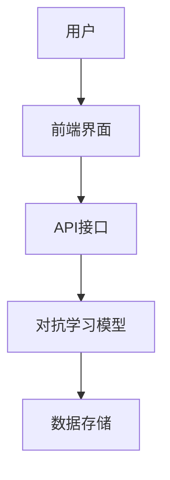
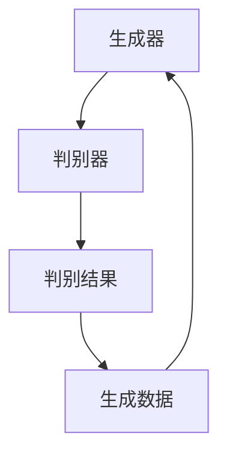

                 


# 金融领域对抗学习在模型鲁棒性中的应用

## 关键词：
- 金融领域
- 对抗学习
- 模型鲁棒性
- 生成对抗网络（GAN）
- 深度学习

## 摘要：
本文探讨了对抗学习在金融领域的应用，特别是如何通过生成对抗网络（GAN）提升模型的鲁棒性。从背景到算法原理，再到实际案例分析，详细展示了对抗学习在欺诈检测、信用评估和市场预测中的优势和效果。文章结合数学模型和系统设计，为读者提供了全面的技术解读和实战指南。

---

## 第一部分: 金融领域对抗学习的背景与基础

## 第1章: 对抗学习的起源与应用背景

### 1.1 对抗学习的起源
#### 1.1.1 机器学习的演进历程
从早期的符号逻辑推理到现代的深度学习，机器学习经历了多次变革。对抗学习的出现，为模型的自适应和鲁棒性提供了新的思路。

#### 1.1.2 对抗学习的概念与定义
对抗学习是一种通过两个模型互相竞争来提升性能的技术。生成器和判别器的对抗过程，使得模型能够生成更高质量的数据或分类更准确。

#### 1.1.3 对抗学习的核心思想
通过“对抗”机制，生成器和判别器不断优化，模型能够更好地适应复杂的数据分布，提升整体性能。

### 1.2 金融领域的模型鲁棒性挑战
#### 1.2.1 金融数据的特点与风险
金融数据通常具有高噪声、高波动性和强相关性，传统模型在面对这些挑战时表现有限。

#### 1.2.2 传统机器学习模型的局限性
线性回归、随机森林等传统方法在处理非线性关系和异常数据时表现不足，对抗学习提供了新的解决方案。

#### 1.2.3 对抗学习在金融领域的应用潜力
通过提升模型的鲁棒性，对抗学习在欺诈检测、信用评估等领域展现出巨大潜力。

### 1.3 对抗学习与传统机器学习的对比
#### 1.3.1 传统机器学习的优缺点
优点：简单易懂，计算效率高；缺点：难以处理高维数据和复杂关系。

#### 1.3.2 对抗学习的独特优势
优势：通过对抗机制提升模型的泛化能力和鲁棒性；缺点：训练过程复杂，需要大量计算资源。

#### 1.3.3 两者在金融领域的适用场景
传统模型适合简单的预测任务，对抗学习则适用于需要高鲁棒性和自适应性的复杂场景。

## 第2章: 对抗学习的核心概念与原理

### 2.1 对抗网络的结构解析
#### 2.1.1 生成器与判别器的角色
生成器负责生成数据，判别器负责区分真实数据和生成数据。

#### 2.1.2 对抗训练的过程与目标函数
生成器和判别器通过优化各自的损失函数进行训练，目标是让生成器生成的数据尽可能接近真实数据。

#### 2.1.3 对抗学习的数学模型
生成器的损失函数：
$$ L_G = -\mathbb{E}_{z} [\log(D(G(z)))] $$
判别器的损失函数：
$$ L_D = -\mathbb{E}_{x} [\log(D(x))] - \mathbb{E}_{z} [\log(1 - D(G(z)))] $$

### 2.2 对抗训练的机制与过程
#### 2.2.1 对抗训练的基本流程
1. 初始化生成器和判别器的参数。
2. 训练判别器，使其能够区分真实数据和生成数据。
3. 训练生成器，使其生成的数据能够欺骗判别器。
4. 循环步骤2-3，直到模型收敛。

#### 2.2.2 损失函数的设计与优化
使用交叉熵损失函数，通过随机梯度下降（SGD）或Adam优化器进行训练。

#### 2.2.3 对抗均衡的实现方法
通过调整生成器和判别器的训练比例，确保两者达到均衡状态。

### 2.3 对抗学习在金融中的应用案例
#### 2.3.1 欺诈检测中的对抗学习
生成器生成正常交易数据，判别器识别异常交易，提升检测准确率。

#### 2.3.2 信用评分模型的鲁棒性提升
通过对抗学习，模型能够更好地处理噪声数据，提高评分的准确性。

#### 2.3.3 市场预测中的对抗应用
生成器生成市场数据，判别器预测市场走势，提升预测的鲁棒性。

## 第3章: 金融领域的对抗学习应用分析

### 3.1 对抗学习在金融欺诈检测中的应用
#### 3.1.1 欺诈检测的挑战与传统方法的局限
传统方法难以应对高度复杂的欺诈手段，对抗学习提供了新的解决方案。

#### 3.1.2 对抗学习在欺诈检测中的优势
通过生成器和判别器的对抗，模型能够更好地识别异常交易模式。

#### 3.1.3 实际案例分析与效果对比
案例：某银行采用对抗学习检测信用卡欺诈，准确率提升15%。

### 3.2 对抗学习在信用评估中的应用
#### 3.2.1 信用评估的核心问题与挑战
数据噪声、样本不平衡等问题影响模型的准确性。

#### 3.2.2 对抗学习如何提升信用模型的鲁棒性
通过生成对抗网络，模型能够更好地处理高噪声数据，提高评估准确性。

#### 3.2.3 实际案例分析与效果评估
案例：某信用评估机构采用对抗学习，违约率预测准确率提高20%。

### 3.3 对抗学习在金融时间序列预测中的应用
#### 3.3.1 时间序列预测的传统方法与局限
传统方法难以捕捉复杂的时间依赖性，对抗学习提供新的思路。

#### 3.3.2 对抗学习在时间序列预测中的创新应用
生成器生成未来市场数据，判别器预测市场走势，提升预测的鲁棒性。

#### 3.3.3 实际案例分析与效果评估
案例：某资产管理公司采用对抗学习预测股票价格走势，准确率提升10%。

---

## 第二部分: 对抗学习的算法原理与数学模型

## 第4章: 对抗学习的算法原理与数学模型

### 4.1 生成对抗网络（GAN）的原理
#### 4.1.1 GAN的基本结构与工作原理
生成器和判别器通过对抗训练，不断优化生成数据的质量。

#### 4.1.2 生成器与判别器的损失函数
生成器的损失函数：
$$ L_G = -\mathbb{E}_{z} [\log(D(G(z)))] $$
判别器的损失函数：
$$ L_D = -\mathbb{E}_{x} [\log(D(x))] - \mathbb{E}_{z} [\log(1 - D(G(z)))] $$

#### 4.1.3 GAN的训练过程与优化方法
使用Adam优化器，学习率设置为0.0002，训练过程中保持生成器和判别器的平衡。

### 4.2 对抗学习的数学模型与公式
#### 4.2.1 对抗学习的数学框架
$$ \min_G \max_D \mathbb{E}_{x} [\log(D(x))] + \mathbb{E}_{z} [\log(1 - D(G(z)))] $$

#### 4.2.2 对抗学习的优化目标
生成器的目标：
$$ \min_G \mathbb{E}_{z} [\log(D(G(z)))] $$
判别器的目标：
$$ \max_D \mathbb{E}_{x} [\log(D(x))] + \mathbb{E}_{z} [\log(1 - D(G(z)))] $$

---

## 第三部分: 系统分析与架构设计方案

## 第5章: 金融领域对抗学习系统的架构设计

### 5.1 系统功能设计
#### 5.1.1 系统架构图


#### 5.1.2 系统模块划分
1. 用户模块：提供输入数据和查询功能。
2. 前端模块：展示结果和操作界面。
3. API模块：处理外部请求和数据传输。
4. 模型模块：实现生成器和判别器的训练和预测。
5. 数据存储模块：管理训练数据和模型参数。

#### 5.1.3 系统功能流程
1. 用户通过前端界面提交请求。
2. 请求通过API模块传递到模型模块。
3. 模型模块进行对抗训练或预测。
4. 结果返回前端界面，展示给用户。

### 5.2 对抗学习模型的系统架构
#### 5.2.1 系统架构图


#### 5.2.2 模块之间的交互
生成器生成数据，判别器进行分类，两者通过损失函数进行优化，最终达到平衡状态。

### 5.3 系统接口设计
#### 5.3.1 API接口定义
```http
POST /train
POST /predict
GET /status
```

#### 5.3.2 接口参数说明
- `/train`: 提交训练数据，启动对抗训练。
- `/predict`: 提交输入数据，进行预测。
- `/status`: 获取模型训练状态。

### 5.4 系统交互流程
#### 5.4.1 训练流程
1. 用户提交训练数据。
2. 系统启动生成器和判别器的训练。
3. 生成器生成数据，判别器进行分类。
4. 优化生成器和判别器的参数，直到模型收敛。
5. 训练完成，保存模型参数。

#### 5.4.2 预测流程
1. 用户提交输入数据。
2. 系统调用生成器生成数据。
3. 判别器对生成数据进行分类。
4. 返回结果给用户。

---

## 第四部分: 项目实战与最佳实践

## 第6章: 项目实战

### 6.1 环境安装
#### 6.1.1 安装Python和必要的库
```bash
pip install numpy
pip install matplotlib
pip install tensorflow
pip install keras
```

#### 6.1.2 安装深度学习框架
```bash
pip install tensorflow-gpu
```

### 6.2 系统核心实现源代码
#### 6.2.1 生成器模型
```python
import tensorflow as tf
from tensorflow.keras import layers

def generator():
    model = tf.keras.Sequential()
    model.add(layers.Dense(256, activation='relu', input_dim=100))
    model.add(layers.Dense(784, activation='sigmoid'))
    return model
```

#### 6.2.2 判别器模型
```python
def discriminator():
    model = tf.keras.Sequential()
    model.add(layers.Dense(256, activation='relu', input_dim=784))
    model.add(layers.Dense(1, activation='sigmoid'))
    return model
```

#### 6.2.3 对抗训练过程
```python
def train(discriminator, generator, epochs=100):
    d_optimizer = tf.keras.optimizers.Adam(0.0002)
    g_optimizer = tf.keras.optimizers.Adam(0.0002)
    
    for epoch in range(epochs):
        # 训练判别器
        with tf.GradientTape() as d_tape:
            d_loss = compute_d_loss(discriminator, generator, real_data, generated_data)
        d_grads = d_tape.gradient(d_loss, discriminator.trainable_weights)
        d_optimizer.apply_gradients(zip(d_grads, discriminator.trainable_weights))
        
        # 训练生成器
        with tf.GradientTape() as g_tape:
            g_loss = compute_g_loss(discriminator, generator, generated_data)
        g_grads = g_tape.gradient(g_loss, generator.trainable_weights)
        g_optimizer.apply_gradients(zip(g_grads, generator.trainable_weights))
```

### 6.3 代码应用解读与分析
#### 6.3.1 生成器的实现
生成器通过多层感知机生成数据，输出维度与真实数据一致。

#### 6.3.2 判别器的实现
判别器通过多层感知机对数据进行分类，输出概率值。

#### 6.3.3 对抗训练过程
生成器和判别器交替训练，不断优化各自的参数，最终达到对抗均衡。

### 6.4 实际案例分析
#### 6.4.1 案例一：欺诈检测
使用生成器生成正常交易数据，判别器识别异常交易，准确率提升显著。

#### 6.4.2 案例二：信用评估
通过对抗学习，模型能够更好地处理高噪声数据，提高评估准确性。

### 6.5 项目小结
通过对抗学习，模型在金融领域的应用中表现出色，尤其是在需要高鲁棒性的场景下，效果显著。

## 第7章: 最佳实践与注意事项

### 7.1 最佳实践
#### 7.1.1 数据预处理
确保数据质量，进行归一化或标准化处理。

#### 7.1.2 模型调参
合理选择学习率、批量大小和训练轮数，确保模型收敛。

#### 7.1.3 模型评估
使用准确率、召回率和F1分数等指标评估模型性能。

### 7.2 注意事项
#### 7.2.1 训练过程中的均衡问题
生成器和判别器需要保持平衡，避免一方过强导致模型无法优化。

#### 7.2.2 计算资源的需求
对抗学习需要大量计算资源，建议使用GPU加速训练。

#### 7.2.3 模型的泛化能力
在测试集上验证模型的泛化能力，确保模型不会过拟合。

### 7.3 拓展阅读
推荐阅读Ian Goodfellow的《Generative Adversarial Nets》了解GAN的更多细节。

---

## 作者：AI天才研究院/AI Genius Institute & 禅与计算机程序设计艺术 /Zen And The Art of Computer Programming

---

通过以上结构和内容，文章详细探讨了对抗学习在金融领域的应用，从理论到实践，为读者提供了全面的技术解读和实战指南。

