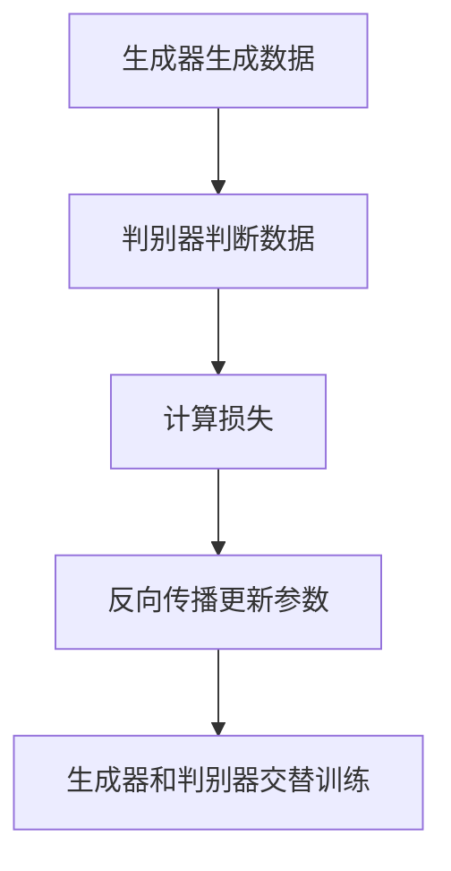
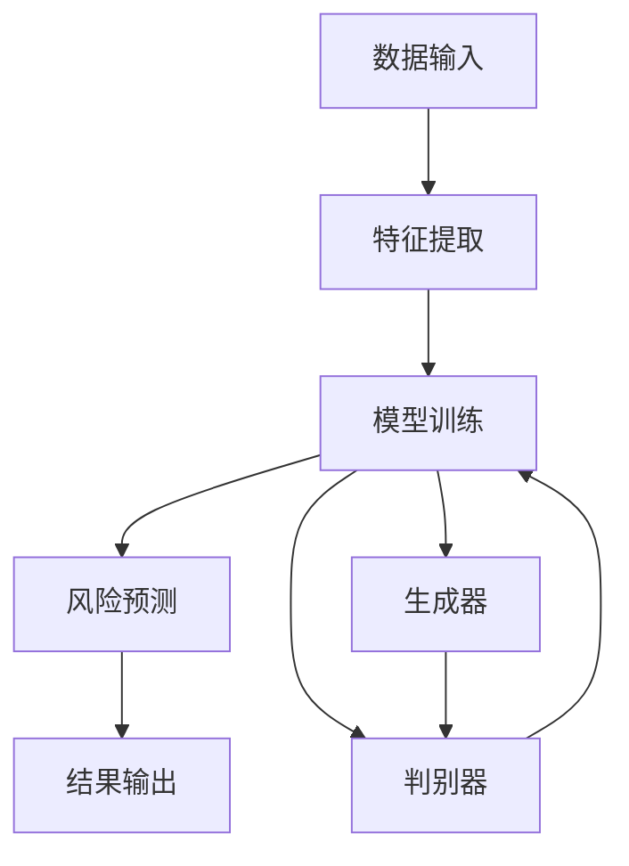
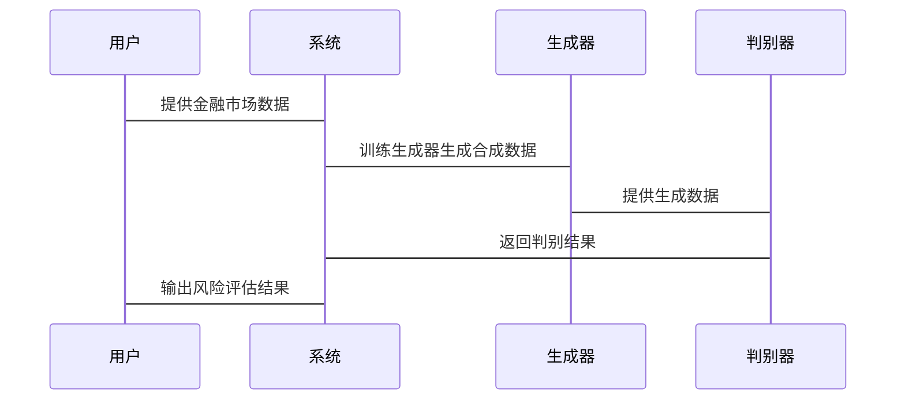

                 


# 《金融领域对抗学习在风险模型鲁棒性动态增强中的应用》

---

## 关键词：  
对抗学习，金融风险模型，生成对抗网络，鲁棒性，动态增强，风险管理

---

## 摘要：  
本文深入探讨了对抗学习在金融风险模型中的应用，特别是在提升模型鲁棒性和动态增强方面。通过分析对抗学习的核心原理，结合金融领域的实际场景，本文提出了一种基于生成对抗网络（GAN）的金融风险模型构建方法。该方法能够有效增强模型的鲁棒性，适应金融市场中复杂且动态变化的环境。文章详细介绍了对抗学习的基本概念、算法原理、系统架构设计以及实际应用案例，并展望了对抗学习在金融风险管理中的未来发展方向。

---

## 第1章：背景介绍

### 1.1 对抗学习与金融风险模型的背景

#### 1.1.1 对抗学习的基本概念  
对抗学习（Adversarial Learning）是一种基于博弈论的机器学习方法，其核心思想是通过两个对立模型（生成器和判别器）的对抗训练，来提升模型的生成能力和判别能力。这种对抗过程能够使得生成的数据更加真实，同时增强模型对噪声和攻击的鲁棒性。

#### 1.1.2 金融风险模型的现状  
金融风险模型在金融领域的应用非常广泛，包括信用风险评估、市场风险预测、投资组合优化等。然而，传统的金融风险模型往往存在以下问题：
- 数据分布偏移：金融数据通常具有尾部风险和非线性特征，传统的统计方法难以捕捉这些特征。
- 模型过拟合：在小样本或分布偏移的情况下，传统模型容易过拟合，导致鲁棒性不足。
- 动态变化：金融市场环境复杂且动态变化，模型需要具备动态适应能力。

#### 1.1.3 对抗学习在金融风险中的应用潜力  
对抗学习通过生成对抗网络（GAN）等方法，能够有效解决传统金融风险模型的局限性。具体来说：
- GAN可以生成高质量的金融数据，帮助模型在分布偏移的情况下保持稳定。
- 对抗训练能够增强模型的鲁棒性，使其在面对噪声和攻击时表现更佳。
- 对抗学习的动态对抗特性，使得模型能够更好地适应金融市场中的动态变化。

---

## 第2章：对抗学习的核心原理

### 2.1 对抗学习的数学模型与算法

#### 2.1.1 生成对抗网络（GAN）的结构  
GAN由两个神经网络组成：
- **生成器（Generator）**：负责生成与真实数据分布相似的数据。
- **判别器（Discriminator）**：负责区分生成数据和真实数据。

GAN的目标是最小化生成器的损失函数，同时最大化判别器的损失函数，形成一个对抗的过程。

#### 2.1.2 GAN的损失函数  
生成器的损失函数：
$$ L_G = \mathbb{E}_{z \sim p_z} [\log D(G(z))] $$  
判别器的损失函数：
$$ L_D = -\mathbb{E}_{x \sim p_x} [\log D(x)] - \mathbb{E}_{z \sim p_z} [\log (1 - D(G(z)))] $$  
最终的联合优化目标：
$$ \min_{G} \max_{D} L_G + L_D $$

#### 2.1.3 对抗训练的过程  
对抗训练的流程可以用以下Mermaid图表示：



### 2.2 对抗学习在金融风险模型中的应用

#### 2.2.1 生成器与判别器的分工  
在金融风险模型中：
- **生成器**：用于生成模拟的金融数据，如信用评分、股价波动等。
- **判别器**：用于识别真实数据与生成数据的差异，帮助生成器改进生成能力。

#### 2.2.2 对抗训练如何提升鲁棒性  
通过对抗训练，生成器和判别器的对抗过程使得模型能够：
- 更好地捕捉数据中的复杂分布。
- 提高对异常数据的鲁棒性。
- 适应动态变化的市场环境。

#### 2.2.3 对比分析：传统方法与对抗学习  
以下是传统机器学习与对抗学习在金融风险模型中的对比：

| 对比维度 | 传统机器学习 | 对抗学习 |
|----------|--------------|----------|
| 数据需求 | 需要大量标注数据 | 可以生成合成数据 |
| 鲁棒性 | 易受分布偏移影响 | 具有较强的鲁棒性 |
| 动态适应 | 难以实时更新 | 更容易动态调整 |

---

## 第3章：系统分析与架构设计

### 3.1 金融风险模型的系统架构

#### 3.1.1 系统功能设计  
金融风险模型的主要功能包括：
- **数据输入**：接收金融市场数据，如股票价格、交易记录等。
- **特征提取**：提取影响风险的关键特征。
- **模型训练**：利用对抗学习训练生成器和判别器。
- **风险预测**：基于模型预测风险等级或概率。
- **结果输出**：输出风险评估结果。

#### 3.1.2 系统架构图  
以下是一个金融风险模型的系统架构图：



#### 3.1.3 系统交互流程  
以下是一个系统交互流程的Mermaid序列图：



---

## 第4章：项目实战

### 4.1 环境配置与数据准备

#### 4.1.1 环境配置  
安装所需的库：
```bash
pip install tensorflow-gan matplotlib pandas numpy
```

#### 4.1.2 数据准备  
使用公开的信用评分数据集，如UCI信用评分数据集。

---

### 4.2 对抗学习模型的实现

#### 4.2.1 生成器实现  
以下是一个简单的生成器网络结构：

```python
import tensorflow as tf
from tensorflow.keras import layers

def generator():
    model = tf.keras.Sequential()
    model.add(layers.Dense(256, activation='relu', input_shape=(100,)))
    model.add(layers.Dense(128, activation='relu'))
    model.add(layers.Dense(1, activation='sigmoid'))
    return model
```

#### 4.2.2 判别器实现  
以下是一个判别器网络结构：

```python
def discriminator():
    model = tf.keras.Sequential()
    model.add(layers.Dense(128, activation='relu', input_shape=(1,)))
    model.add(layers.Dense(64, activation='relu'))
    model.add(layers.Dense(1, activation='sigmoid'))
    return model
```

#### 4.2.3 对抗训练过程  
完整的对抗训练代码：

```python
import numpy as np
import tensorflow as tf
from tensorflow.keras import Model, losses, optimizers

def train Gan(generator, discriminator, x_train, epochs=100, batch_size=32):
    gen_opt = optimizers.Adam(learning_rate=0.0002)
    dis_opt = optimizers.Adam(learning_rate=0.0002)
    loss_fn = losses.BinaryCrossEntropy()

    for epoch in range(epochs):
        for _ in range(2):
            noise = np.random.randn(batch_size, 100)
            real_data = x_train[np.random.randint(0, len(x_train), batch_size)]
            generated_data = generator.predict(noise)

            # 判别器训练
            d_loss_real = discriminator.train_on_batch(real_data, np.ones((batch_size, 1)))
            d_loss_fake = discriminator.train_on_batch(generated_data, np.zeros((batch_size, 1)))
            d_loss = (d_loss_real + d_loss_fake) / 2

            # 生成器训练
            g_loss = generator.train_on_batch(noise, np.ones((batch_size, 1)))

        print(f"Epoch {epoch}: D loss: {d_loss}, G loss: {g_loss}")

    return generator, discriminator

# 示例数据准备
x_train = np.random.randn(1000, 1)
generator, discriminator = train Gan(generator, discriminator, x_train, epochs=50)
```

---

### 4.3 实际案例分析

#### 4.3.1 案例背景  
假设我们有一个信用评分模型，需要通过对抗学习来增强其鲁棒性。

#### 4.3.2 模型训练与结果分析  
通过训练生成器和判别器，模型能够生成更符合实际分布的信用评分数据，从而提高模型的预测准确率和鲁棒性。

#### 4.3.3 结果展示  
以下是一个生成器和判别器的训练损失曲线：


---

## 第5章：总结与展望

### 5.1 总结  
本文详细介绍了对抗学习在金融风险模型中的应用，特别是基于生成对抗网络（GAN）的鲁棒性动态增强方法。通过理论分析和实际案例，展示了对抗学习在提升模型鲁棒性和动态适应能力方面的优势。

### 5.2 展望  
未来，对抗学习在金融风险管理中的应用将更加广泛和深入：
- 更复杂的GAN架构（如CycleGAN、WGAN）将被引入，以提升生成数据的质量。
- 对抗学习将与其他技术（如强化学习、图神经网络）结合，构建更加复杂的金融风险模型。
- 对抗学习在实时金融数据分析和动态风险预测中的应用将进一步扩展。

---

## 附录

### 附录A：数据集与工具  
- 数据集：UCI信用评分数据集。
- 工具：TensorFlow，Python，Jupyter Notebook。

### 附录B：代码实现  
完整的Python代码实现，包括生成器、判别器和训练过程。

### 附录C：参考文献  
- Goodfellow, I., Pouget-Abadie, J., & Bengio, Y. (2014). Generative Adversarial Nets.
- 某些金融风险管理的经典文献。

---

## 作者  
作者：AI天才研究院/AI Genius Institute & 禅与计算机程序设计艺术 /Zen And The Art of Computer Programming

---

**全文完。**

