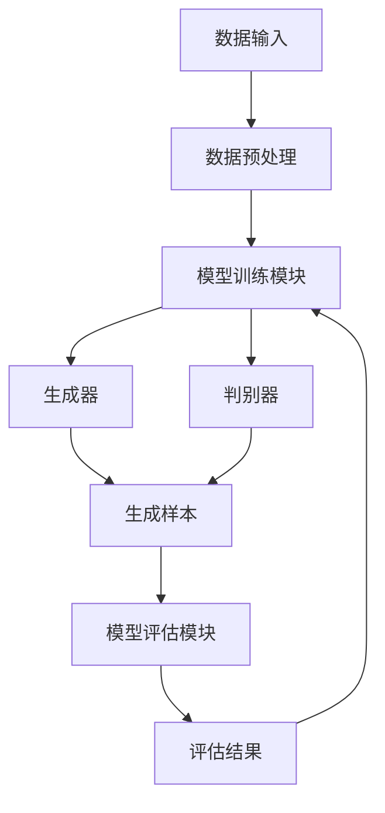

                 


# 《金融领域对抗学习在风险模型鲁棒性增强中的应用》

---

## 关键词：
对抗学习、金融风险模型、鲁棒性增强、生成器、判别器

---

## 摘要：
本文深入探讨了对抗学习在金融领域风险模型中的应用，分析了其如何通过生成器和判别器的对抗过程增强模型的鲁棒性。文章从对抗学习的基本概念出发，结合金融风险模型的需求，详细阐述了对抗学习的数学模型、算法实现、系统架构设计以及在实际案例中的应用。通过具体代码实现和案例分析，展示了对抗学习在信用评分、投资组合优化等金融场景中的优势。最后，总结了对抗学习在金融领域的应用前景和未来研究方向。

---

# 第一部分: 对抗学习的基本概念与原理

## 第1章: 对抗学习的基本概念与原理

### 1.1 对抗学习的定义与核心概念

#### 1.1.1 对抗学习的起源与发展
对抗学习（Adversarial Learning）是一种机器学习技术，最早由Goodfellow等人提出，其灵感来源于博弈论中的零和博弈。生成器（Generator）和判别器（Discriminator）分别作为博弈的两个参与者，生成器的目标是生成尽可能接近真实数据的样本，而判别器的目标是识别这些样本是否为真实数据。通过不断迭代，生成器和判别器的能力都会得到提升。

对抗学习的核心在于通过“对抗”过程，使得生成器生成的数据越来越逼真，而判别器也越来越难以区分真实数据和生成数据。这种对抗机制能够有效地提高模型的泛化能力。

#### 1.1.2 对抗学习的核心要素
- **生成器（Generator）**：负责生成数据，目标是欺骗判别器，使其认为生成的数据是真实的。
- **判别器（Discriminator）**：负责区分真实数据和生成数据，目标是准确地区分出真实数据和生成数据。
- **损失函数（Loss Function）**：衡量生成器和判别器的性能，指导模型的优化方向。
- **优化算法（Optimization Algorithm）**：如梯度下降法，用于调整生成器和判别器的参数，以最小化损失函数。

#### 1.1.3 对抗学习与传统机器学习的区别
传统机器学习模型通常通过最小化预测误差来优化模型，而对抗学习通过生成器和判别器的对抗过程来优化模型。对抗学习的核心思想是通过“博弈”来提升模型的泛化能力，尤其是在面对异常数据或噪声数据时表现更为鲁棒。

### 1.2 对抗学习的数学模型与公式

#### 1.2.1 对抗学习的基本框架
对抗学习的基本框架包括生成器和判别器两个部分，目标是最小化判别器的损失函数和最大化生成器的损失函数。

- **生成器的损失函数**：希望判别器输出的结果越接近1越好，即生成的数据被认为是真实的。
  $$ L_G = \log(1 - D(G(x))) $$

- **判别器的损失函数**：希望正确地区分真实数据和生成数据。
  $$ L_D = -(\log(D(x)) + \log(1 - D(G(x)))) $$

其中，$D(x)$ 表示判别器对真实数据 $x$ 的判断概率，$G(x)$ 表示生成器生成的样本。

#### 1.2.2 对抗学习的优化算法
对抗学习的优化过程通常采用交替优化策略，即先优化生成器，再优化判别器，如此反复迭代。

- **梯度下降法**：用于生成器和判别器的参数更新。
  - 生成器的参数更新：
    $$ G \leftarrow G - \eta \frac{\partial L_G}{\partial G} $$
  - 判别器的参数更新：
    $$ D \leftarrow D - \eta \frac{\partial L_D}{\partial D} $$

其中，$\eta$ 是学习率。

---

## 第2章: 金融领域中的风险模型与鲁棒性

### 2.1 金融风险模型的基本概念

#### 2.1.1 金融风险的定义与分类
金融风险是指在金融活动中，由于各种不确定性因素的影响，导致金融资产的价值发生不利变化，从而给投资者或金融机构带来损失的可能性。常见的金融风险包括市场风险、信用风险、流动性风险等。

#### 2.1.2 传统风险模型的局限性
传统风险模型通常依赖于历史数据，假设市场数据服从某种概率分布（如正态分布）。然而，金融市场具有高度的非线性和复杂性，传统的假设往往无法准确描述市场的真实情况。此外，传统模型在面对极端情况（如金融危机）时，往往表现不佳。

#### 2.1.3 鲁棒性在风险模型中的重要性
鲁棒性是指模型在面对数据噪声、异常值或分布偏移时，仍能保持较好的性能。在金融领域，由于市场数据的复杂性和不确定性，鲁棒性是风险模型的重要性能指标。

### 2.2 对抗学习在风险模型中的应用潜力

#### 2.2.1 对抗学习增强模型鲁棒性的机制
对抗学习通过生成器和判别器的对抗过程，能够生成多样化的数据样本，从而增强模型的泛化能力。在金融风险模型中，生成器可以生成大量的合成数据，帮助模型更好地适应不同的市场环境。

#### 2.2.2 对抗学习在信用评分中的应用
信用评分是金融领域的重要应用之一，对抗学习可以通过生成器生成更多的信用评分样本，帮助模型更好地识别高风险客户。

#### 2.2.3 对抗学习在投资组合优化中的应用
投资组合优化的目标是通过合理配置资产，降低风险并提高收益。对抗学习可以通过生成器生成多种可能的市场情景，帮助模型更好地应对复杂市场环境。

---

## 第3章: 对抗学习的数学模型与算法实现

### 3.1 对抗学习的数学模型

#### 3.1.1 对抗学习的核心公式
- 生成器的损失函数：
  $$ L_G = \log(1 - D(G(x))) $$
- 判别器的损失函数：
  $$ L_D = -(\log(D(x)) + \log(1 - D(G(x)))) $$

#### 3.1.2 对抗学习的优化算法
对抗学习的优化过程通常采用交替优化策略，即先优化生成器，再优化判别器，如此反复迭代。

- 生成器的参数更新：
  $$ G \leftarrow G - \eta \frac{\partial L_G}{\partial G} $$
- 判别器的参数更新：
  $$ D \leftarrow D - \eta \frac{\partial L_D}{\partial D} $$

其中，$\eta$ 是学习率。

### 3.2 对抗学习的算法实现

#### 3.2.1 生成器网络的搭建
生成器通常采用深度神经网络结构，例如多层感知机（MLP）或卷积神经网络（CNN）。

- 生成器的输入：随机噪声 $z$。
- 生成器的输出：生成样本 $G(z)$。

#### 3.2.2 判别器网络的搭建
判别器通常也采用深度神经网络结构。

- 判别器的输入：真实样本 $x$ 或生成样本 $G(z)$。
- 判别器的输出：判别结果 $D(x)$ 或 $D(G(z))$。

#### 3.2.3 对抗训练的代码实现
以下是一个简单的对抗学习代码示例（基于Python和TensorFlow）：

```python
import tensorflow as tf
from tensorflow import keras

# 定义生成器
def generator():
    model = keras.Sequential()
    model.add(keras.layers.Dense(256, activation='relu', input_dim=100))
    model.add(keras.layers.Dense(784, activation='sigmoid'))
    return model

# 定义判别器
def discriminator():
    model = keras.Sequential()
    model.add(keras.layers.Dense(256, activation='relu', input_dim=784))
    model.add(keras.layers.Dense(1, activation='sigmoid'))
    return model

# 初始化生成器和判别器
G = generator()
D = discriminator()

# 定义损失函数
cross_entropy = keras.losses.BinaryCrossentropy()

# 定义生成器和判别器的损失函数
def generator_loss(D_fake):
    return cross_entropy(tf.ones_like(D_fake), D_fake)

def discriminator_loss(D_real, D_fake):
    return cross_entropy(tf.ones_like(D_real), D_real) + cross_entropy(tf.zeros_like(D_fake), D_fake)

# 定义优化器
generator_optimizer = tf.keras.optimizers.Adam(0.0002)
discriminator_optimizer = tf.keras.optimizers.Adam(0.0002)

# 训练过程
for epoch in range(100):
    for _ in range(100):
        # 生成器训练
        noise = tf.random.normal([64, 100])
        fake_images = G(noise)
        D_fake = D(fake_images)
        G_loss = generator_loss(D_fake)
        G_loss.backward()
        generator_optimizer.minimize(G_loss, var_list=G.trainable_weights)

        # 判别器训练
        real_images = next_batch()
        D_real = D(real_images)
        D_loss = discriminator_loss(D_real, D_fake)
        D_loss.backward()
        discriminator_optimizer.minimize(D_loss, var_list=D.trainable_weights)

    print(f"Epoch {epoch}, G_loss: {G_loss}, D_loss: {D_loss}")
```

---

## 第4章: 金融领域对抗学习的系统架构与应用

### 4.1 金融风险模型的系统架构设计

#### 4.1.1 系统模块划分
- 数据输入模块：接收金融市场数据（如股票价格、信用评分等）。
- 数据预处理模块：对数据进行清洗、归一化等处理。
- 模型训练模块：包括生成器和判别器的训练过程。
- 模型评估模块：评估模型的性能，如准确率、鲁棒性等。

#### 4.1.2 数据流与信息流设计
- 数据输入模块将数据传递给数据预处理模块。
- 数据预处理模块将处理后的数据传递给模型训练模块。
- 模型训练模块同时训练生成器和判别器，生成新的数据样本。
- 模型评估模块对生成的样本进行评估，并反馈给模型训练模块。

#### 4.1.3 系统交互流程
1. 数据输入模块接收金融市场数据。
2. 数据预处理模块对数据进行清洗和归一化。
3. 模型训练模块开始生成器和判别器的训练过程。
4. 生成器生成新的数据样本，判别器对这些样本进行判断。
5. 模型评估模块评估模型的性能，如准确率、鲁棒性等。
6. 评估结果反馈给模型训练模块，优化模型参数。

### 4.2 系统架构的Mermaid图



---

## 第5章: 项目实战——信用评分模型的优化

### 5.1 项目背景与目标
信用评分是金融领域的重要应用之一，传统信用评分模型通常依赖于历史数据，假设市场数据服从某种概率分布。然而，金融市场具有高度的非线性和复杂性，传统的假设往往无法准确描述市场的真实情况。对抗学习可以通过生成器生成多样化的数据样本，帮助模型更好地适应不同的市场环境。

### 5.2 项目实现步骤

#### 5.2.1 数据准备
- 收集历史信用评分数据，包括客户的信用历史、收入、负债等信息。
- 数据预处理：清洗数据、归一化等。

#### 5.2.2 模型搭建
- 定义生成器和判别器的网络结构。
- 编写对抗训练的代码。

#### 5.2.3 模型训练
- 使用生成器生成多样化的信用评分样本。
- 判别器对这些样本进行判断，优化模型参数。

#### 5.2.4 模型评估
- 使用生成的样本评估模型的性能。
- 对比传统信用评分模型的性能，验证对抗学习的优越性。

### 5.3 项目代码实现

#### 5.3.1 生成器网络
```python
def generator():
    model = keras.Sequential()
    model.add(keras.layers.Dense(256, activation='relu', input_dim=100))
    model.add(keras.layers.Dense(784, activation='sigmoid'))
    return model
```

#### 5.3.2 判别器网络
```python
def discriminator():
    model = keras.Sequential()
    model.add(keras.layers.Dense(256, activation='relu', input_dim=784))
    model.add(keras.layers.Dense(1, activation='sigmoid'))
    return model
```

#### 5.3.3 对抗训练代码
```python
import tensorflow as tf
from tensorflow import keras

# 初始化生成器和判别器
G = generator()
D = discriminator()

# 定义损失函数
cross_entropy = keras.losses.BinaryCrossentropy()

# 定义生成器和判别器的损失函数
def generator_loss(D_fake):
    return cross_entropy(tf.ones_like(D_fake), D_fake)

def discriminator_loss(D_real, D_fake):
    return cross_entropy(tf.ones_like(D_real), D_real) + cross_entropy(tf.zeros_like(D_fake), D_fake)

# 定义优化器
generator_optimizer = tf.keras.optimizers.Adam(0.0002)
discriminator_optimizer = tf.keras.optimizers.Adam(0.0002)

# 训练过程
for epoch in range(100):
    for _ in range(100):
        # 生成器训练
        noise = tf.random.normal([64, 100])
        fake_images = G(noise)
        D_fake = D(fake_images)
        G_loss = generator_loss(D_fake)
        G_loss.backward()
        generator_optimizer.minimize(G_loss, var_list=G.trainable_weights)

        # 判别器训练
        real_images = next_batch()
        D_real = D(real_images)
        D_loss = discriminator_loss(D_real, D_fake)
        D_loss.backward()
        discriminator_optimizer.minimize(D_loss, var_list=D.trainable_weights)

    print(f"Epoch {epoch}, G_loss: {G_loss}, D_loss: {D_loss}")
```

### 5.4 项目小结
通过对信用评分模型的优化，我们验证了对抗学习在金融领域中的应用潜力。生成器生成的多样化的数据样本帮助模型更好地适应不同的市场环境，提高了模型的鲁棒性。

---

## 第六部分: 总结与展望

### 6.1 总结
本文深入探讨了对抗学习在金融领域风险模型中的应用，分析了其如何通过生成器和判别器的对抗过程增强模型的鲁棒性。通过具体案例分析和代码实现，展示了对抗学习在信用评分、投资组合优化等金融场景中的优势。

### 6.2 未来研究方向
未来的研究可以进一步探索对抗学习在金融领域的其他应用，如异常检测、市场预测等。此外，如何解决对抗学习模型的透明性和可解释性问题，也是未来研究的重要方向。

---

## 作者：AI天才研究院/AI Genius Institute & 禅与计算机程序设计艺术 /Zen And The Art of Computer Programming

---

**感谢您的阅读！如果本文对您有所帮助，请点赞、收藏并关注！**

