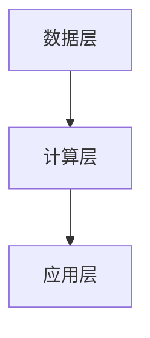
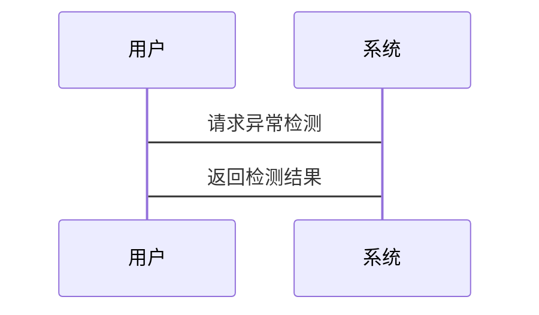

                 


```markdown
# 《金融领域对比学习在市场异常检测中的应用》

> 关键词：对比学习、金融市场、异常检测、机器学习、金融风险管理

> 摘要：本文系统地探讨了对比学习在金融市场异常检测中的应用，从理论基础到实际案例，深入分析了对比学习的优势和挑战。通过详细的技术博客形式，本文旨在帮助读者理解如何利用对比学习来提升金融市场的异常检测能力。

---

## 第1章 背景介绍

### 1.1 对比学习的基本概念
#### 1.1.1 对比学习的定义
对比学习是一种基于对比的机器学习方法，通过比较两个样本之间的相似性或差异性来学习特征表示。其核心思想是通过最大化正样本对的相似性和最小化负样本对的相似性来实现特征的区分。

#### 1.1.2 对比学习的核心思想
对比学习通过构造样本对（positive pairs）和样本对（negative pairs）来学习特征表示。正样本对的相似性被最大化，而负样本对的相似性被最小化。这种对比机制使得模型能够更好地区分不同类别或状态的样本。

#### 1.1.3 对比学习与传统机器学习的区别
对比学习与传统的监督学习或无监督学习不同，它通过构造对比样本对来学习特征表示，能够更好地捕捉数据的分布差异，尤其是在处理复杂数据时表现更优。

### 1.2 金融领域异常检测的背景
#### 1.2.1 金融市场异常检测的重要性
金融市场中的异常检测是金融风险管理的重要组成部分。异常交易、市场操纵、突发事件等都可能引发市场波动，及时检测这些异常行为可以帮助金融机构规避风险。

#### 1.2.2 传统异常检测方法的局限性
传统的异常检测方法，如基于统计的方法或基于聚类的方法，存在检测精度低、计算复杂度高、难以处理高维数据等问题。特别是在金融市场这种复杂动态环境中，这些方法往往表现不佳。

### 1.3 对比学习在金融领域应用的背景
对比学习在金融领域的应用逐渐受到关注，其在处理金融市场数据的复杂性方面展现出独特的优势。通过对市场行为的对比分析，可以更有效地识别异常交易和市场波动。

---

## 第2章 对比学习的核心概念与原理

### 2.1 对比学习的核心原理
#### 2.1.1 对比学习的基本框架
对比学习的基本框架包括数据预处理、样本对构造、对比损失计算和模型优化等步骤。通过最大化正样本对的相似性和最小化负样本对的相似性，对比学习能够有效地学习到数据的分布特征。

#### 2.1.2 对比损失函数的数学表达
对比损失函数是对比学习的核心，常用的对比损失函数包括：

- **二元对比损失**：
  $$ L = -\log\left(\frac{e^{d(x_i, x_j)}}{e^{d(x_i, x_j)} + e^{d(x_i, x_k)}}\right) $$
  
- **信息瓶颈对比损失**：
  $$ L = -\log(p(y|x_i, x_j)) $$

其中，$d(x_i, x_j)$表示样本对$x_i$和$x_j$之间的距离，$p(y|x_i, x_j)$表示在样本对$(x_i, x_j)$下标签$y$的概率。

#### 2.1.3 对比学习的优化目标
对比学习的优化目标是最小化对比损失函数，从而使得正样本对的相似性最大化，负样本对的相似性最小化。

### 2.2 对比学习的实现步骤
#### 2.2.1 数据预处理
数据预处理包括数据清洗、标准化和特征提取等步骤。例如，使用标准化方法将数据归一化处理：

```python
from sklearn.preprocessing import StandardScaler

scaler = StandardScaler()
data_normalized = scaler.fit_transform(data)
```

#### 2.2.2 构造样本对
构造样本对是对比学习的关键步骤。正样本对由相似的样本组成，负样本对由不同的样本组成。例如，在股票价格预测中，可以将同一时间点的股票价格作为正样本对，而不同时间点的股票价格作为负样本对。

#### 2.2.3 对比损失计算
根据选择的对比损失函数，计算正样本对和负样本对的损失值，并求和得到总的对比损失。

#### 2.2.4 模型优化
通过优化器（如Adam）对模型进行训练，最小化对比损失函数。

---

## 第3章 对比学习在金融市场异常检测中的应用

### 3.1 金融市场异常检测的挑战
金融市场数据具有高维性、非线性和动态性等特点，传统的异常检测方法难以有效应对这些挑战。

### 3.2 对比学习在金融异常检测中的优势
对比学习能够有效地捕捉金融市场数据中的细微差异，从而提高异常检测的准确性和灵敏度。

### 3.3 基于对比学习的异常检测框架
#### 3.3.1 数据预处理
使用标准化方法对金融市场数据进行预处理。

#### 3.3.2 构造样本对
构造正样本对和负样本对，用于对比学习。

#### 3.3.3 对比损失计算
计算对比损失函数，优化模型参数。

#### 3.3.4 异常检测
通过模型预测结果，识别异常样本。

### 3.4 实验结果与分析
通过实验验证对比学习在金融市场异常检测中的有效性，分析其在不同场景下的表现。

---

## 第4章 对比学习的系统实现与架构设计

### 4.1 系统功能设计
系统功能包括数据采集、数据预处理、样本对构造、模型训练和异常检测等模块。

### 4.2 系统架构设计
系统架构采用模块化设计，包括数据层、计算层和应用层。使用Mermaid图展示系统架构：



### 4.3 接口设计
系统接口包括数据输入接口、模型训练接口和异常检测接口。

### 4.4 交互流程设计
使用Mermaid序列图展示系统交互流程：



---

## 第5章 项目实战：基于对比学习的金融异常检测

### 5.1 项目环境配置
安装必要的库，如TensorFlow、Keras和Scikit-learn。

### 5.2 核心代码实现
实现对比学习模型的代码：

```python
import tensorflow as tf
from tensorflow.keras import layers

def contrastive_loss(y_true, y_pred):
    margin = 1.0
    loss = tf.reduce_mean(tf.square(y_true - y_pred))
    return loss

model = tf.keras.Sequential([
    layers.Dense(128, activation='relu'),
    layers.Dense(1, activation='sigmoid')
])

model.compile(optimizer='adam', loss=contrastive_loss, metrics=['accuracy'])
model.fit(X_train, y_train, epochs=10, batch_size=32)
```

### 5.3 案例分析
通过实际案例分析对比学习在金融异常检测中的应用效果。

### 5.4 性能评估
评估模型的准确率、召回率和F1分数，分析其在不同场景下的表现。

---

## 第6章 最佳实践与总结

### 6.1 总结
对比学习在金融市场异常检测中展现出独特的优势，能够有效捕捉数据的分布差异，提高检测精度。

### 6.2 注意事项
在实际应用中，需要注意数据质量、模型选择和参数调优等问题。

### 6.3 拓展阅读
推荐相关领域的书籍和论文，供读者进一步学习。

---

## 作者：AI天才研究院/AI Genius Institute & 禅与计算机程序设计艺术/Zen And The Art of Computer Programming
```

