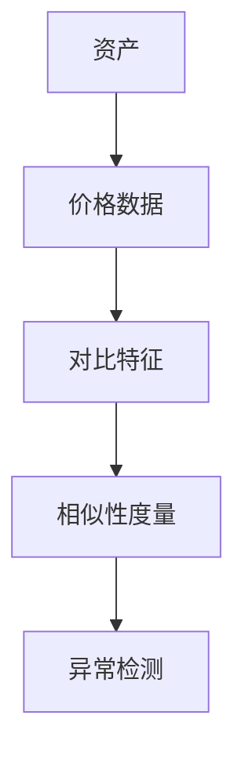
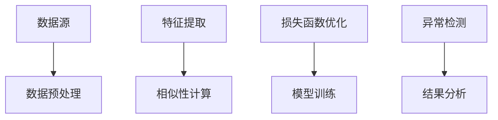

                 


# 《金融领域对比学习在资产定价异常检测中的应用》

**关键词**：对比学习、资产定价、异常检测、金融领域、深度学习、机器学习、数据科学

**摘要**：本文深入探讨了对比学习在金融领域资产定价异常检测中的应用。通过对对比学习的基本原理、算法实现、系统架构以及实际案例的详细分析，展示了对比学习在金融数据分析中的独特优势。文章首先介绍了对比学习的核心概念和理论基础，然后分析了其在资产定价中的具体应用场景，最后通过实际项目案例展示了对比学习在异常检测中的强大能力。本文旨在为金融领域的从业者和技术研究人员提供一份全面的技术指南，帮助他们更好地理解和应用对比学习技术。

---

# 第一部分: 引言

## 第1章: 对比学习与资产定价异常检测的概述

### 1.1 对比学习的基本概念

#### 1.1.1 对比学习的定义
对比学习（Contrastive Learning）是一种基于对比的特征学习方法，通过最大化正样本对的相似性，同时最小化负样本对的相似性，来学习数据的高层次特征表示。其核心思想是通过对比正样本和负样本的相似性，使模型能够区分不同类别或状态的数据。

#### 1.1.2 对比学习的核心思想
对比学习的核心思想是通过对比两个样本之间的相似性来学习数据的特征表示。具体来说，对于给定的样本，对比学习会寻找与其相似的正样本，并尽量远离负样本。这种学习方式能够有效地捕捉数据中的关键特征，并在复杂的金融数据中表现出强大的区分能力。

#### 1.1.3 对比学习在金融领域的应用前景
对比学习在金融领域的应用前景广阔，尤其是在资产定价和异常检测方面。通过对历史价格数据和市场行为数据的对比分析，对比学习能够帮助我们发现异常价格波动、识别潜在的市场风险，并为投资决策提供支持。

### 1.2 资产定价的基本原理

#### 1.2.1 资产定价的定义
资产定价是指通过对资产的风险、收益和流动性等多重因素的综合评估，确定其在市场上的合理价格。资产定价的核心在于准确评估资产的内在价值，以便为投资者提供参考。

#### 1.2.2 资产定价的主要模型
资产定价的主要模型包括：
- **CAPM模型**：资本资产定价模型，用于评估资产的期望收益。
- **APT模型**： arbitrage pricing theory，套利定价理论，用于解释资产定价的多因素模型。
- **Fama-French三因子模型**：扩展了CAPM模型，引入了更多的风险因子。

#### 1.2.3 异常检测在资产定价中的重要性
异常检测在资产定价中的重要性体现在以下几个方面：
- **发现异常价格波动**：识别市场价格的异常波动，帮助投资者避免潜在风险。
- **识别市场操纵**：通过分析价格和交易量的异常行为，发现可能的市场操纵行为。
- **优化投资策略**：通过异常检测，投资者可以及时调整投资策略，抓住市场机会。

### 1.3 对比学习在资产定价异常检测中的应用现状

#### 1.3.1 对比学习在金融领域的应用
对比学习在金融领域的应用主要包括：
- **股票价格预测**：通过对比学习模型，预测股票价格的变化趋势。
- **风险管理**：通过对比分析，识别潜在的市场风险。
- **信用评估**：通过对比学习，评估企业的信用风险。

#### 1.3.2 资产定价异常检测的挑战
资产定价异常检测面临以下挑战：
- **数据稀疏性**：金融市场数据通常具有高度的噪声和稀疏性，难以准确识别异常。
- **复杂性**：金融市场数据受到多种因素的影响，如宏观经济因素、市场情绪等，增加了异常检测的难度。
- **实时性要求**：资产定价异常检测需要实时性，这对模型的计算效率提出了更高的要求。

#### 1.3.3 对比学习的优势与不足
对比学习在资产定价异常检测中的优势：
- **强大的特征学习能力**：对比学习能够从原始数据中学习到高层次的特征表示，捕捉数据中的关键信息。
- **鲁棒性**：对比学习对数据噪声具有较强的鲁棒性，能够在复杂的金融环境中表现良好。

对比学习的不足：
- **计算复杂度高**：对比学习需要大量的计算资源，尤其是在处理大规模金融数据时。
- **需要高质量的数据**：对比学习的效果依赖于数据的质量和多样性。

### 1.4 本章小结
本章通过对对比学习和资产定价的基本概念、核心思想以及应用现状的分析，为后续的深入探讨奠定了基础。对比学习作为一种新兴的特征学习方法，在资产定价异常检测中展现出强大的潜力，但也面临一些挑战。

---

# 第二部分: 对比学习的核心概念与原理

## 第2章: 对比学习的核心原理

### 2.1 对比学习的理论基础

#### 2.1.1 对比学习的数学基础
对比学习的数学基础主要基于相似性度量和损失函数。常用的相似性度量包括余弦相似度和欧氏距离等。损失函数通常采用NT-Xent损失函数，其公式为：

$$\text{loss} = -\frac{1}{N}\sum_{i=1}^{N}\log\left(\frac{\exp(s_i)}{\exp(s_i) + \sum_{j \neq i}\exp(s_j)}\right)$$

其中，$s_i$表示第i对正样本的相似性分数，$s_j$表示第j对负样本的相似性分数。

#### 2.1.2 对比学习的特征学习机制
对比学习的特征学习机制通过最大化正样本对的相似性和最小化负样本对的相似性，来学习数据的高层次特征表示。具体来说，对比学习会将正样本对的相似性分数最大化，同时将负样本对的相似性分数最小化。

#### 2.1.3 对比学习的损失函数
对比学习的损失函数通常采用NT-Xent损失函数，其目的是通过优化正样本对的相似性和负样本对的相似性，来学习数据的特征表示。

### 2.2 对比学习与传统机器学习的对比

#### 2.2.1 传统机器学习的特征提取方法
传统机器学习的特征提取方法主要包括手工特征提取和基于浅层模型的特征提取。手工特征提取需要人工设计特征，而浅层模型（如线性回归和SVM）的特征提取能力有限。

#### 2.2.2 对比学习的特征提取方法
对比学习的特征提取方法基于深度学习模型，通过最大化正样本对的相似性和最小化负样本对的相似性，来学习数据的高层次特征表示。对比学习的特征提取能力远强于传统方法。

#### 2.2.3 对比学习的优势与局限性
对比学习的优势：
- **强大的特征学习能力**：对比学习能够从原始数据中学习到高层次的特征表示，捕捉数据中的关键信息。
- **鲁棒性**：对比学习对数据噪声具有较强的鲁棒性，能够在复杂的金融环境中表现良好。

对比学习的局限性：
- **计算复杂度高**：对比学习需要大量的计算资源，尤其是在处理大规模金融数据时。
- **需要高质量的数据**：对比学习的效果依赖于数据的质量和多样性。

### 2.3 对比学习的核心算法

#### 2.3.1 SimCLR算法
SimCLR是一种基于对比学习的无监督学习算法，其核心思想是通过最大化正样本对的相似性和最小化负样本对的相似性，来学习数据的特征表示。

#### 2.3.2 MoCo算法
MoCo是一种基于对比学习的无监督学习算法，其核心思想是通过使用移动的负样本库，来优化对比学习的损失函数。

#### 2.3.3 其他对比学习算法
其他对比学习算法包括Contrastive Predictive Coding（CPC）、Deep InfoMax等。

### 2.4 对比学习的实体关系图



### 2.5 本章小结
本章通过对对比学习的核心原理和算法的详细分析，为后续的深入探讨奠定了基础。对比学习作为一种新兴的特征学习方法，在资产定价异常检测中展现出强大的潜力，但也面临一些挑战。

---

# 第三部分: 对比学习在资产定价中的数学模型与算法

## 第3章: 对比学习的数学模型

### 3.1 对比学习的损失函数

#### 3.1.1 NT-Xent损失函数
NT-Xent损失函数是对比学习中常用的损失函数，其公式为：

$$\text{loss} = -\frac{1}{N}\sum_{i=1}^{N}\log\left(\frac{\exp(s_i)}{\exp(s_i) + \sum_{j \neq i}\exp(s_j)}\right)$$

其中，$s_i$表示第i对正样本的相似性分数，$s_j$表示第j对负样本的相似性分数。

#### 3.1.2 其他损失函数
除了NT-Xent损失函数，对比学习中还常用的损失函数包括Binary Cross-Entropy损失函数和Contrastive损失函数。

### 3.2 对比学习的相似性度量

#### 3.2.1 余弦相似度
余弦相似度是衡量两个向量相似性的常用方法，其公式为：

$$\text{cos}(\theta) = \frac{\mathbf{u} \cdot \mathbf{v}}{\|\mathbf{u}\| \|\mathbf{v}\|}$$

其中，$\mathbf{u}$和$\mathbf{v}$是两个向量。

#### 3.2.2 欧氏距离
欧氏距离是衡量两个向量相似性的另一种方法，其公式为：

$$\text{distance} = \sqrt{\sum_{i=1}^{n}(u_i - v_i)^2}$$

### 3.3 对比学习的数学模型

#### 3.3.1 对比学习的网络结构
对比学习的网络结构通常包括编码器和投影头。编码器用于提取数据的特征表示，投影头用于将特征向量映射到对比学习的相似性空间。

#### 3.3.2 对比学习的优化目标
对比学习的优化目标是通过最大化正样本对的相似性和最小化负样本对的相似性，来优化模型的参数。

### 3.4 对比学习的算法实现

#### 3.4.1 对比学习的训练流程
对比学习的训练流程通常包括以下步骤：
1. 数据预处理：将原始数据转换为适合对比学习的形式。
2. 数据增强：对数据进行增强，增加数据的多样性。
3. 特征提取：使用编码器提取数据的特征表示。
4. 相似性计算：计算正样本对和负样本对的相似性分数。
5. 损失函数优化：通过优化损失函数，更新模型的参数。

#### 3.4.2 对比学习的代码实现
以下是对比学习的Python代码实现示例：

```python
import torch
import torch.nn as nn
import torch.optim as optim

class ContrastiveLearning(nn.Module):
    def __init__(self, embedding_dim):
        super(ContrastiveLearning, self).__init__()
        self.encoder = nn.Linear(embedding_dim, 128)
        self.projection = nn.Linear(128, 128)

    def forward(self, x):
        x_encoded = self.encoder(x)
        x_projected = self.projection(x_encoded)
        return x_projected

def contrastive_loss(x, y, label, batch_size, temperature):
    x = x / x.norm(dim=1).view(-1, 1)
    y = y / y.norm(dim=1).view(-1, 1)
    
    similarity_matrix = torch.mm(x, y.T)
    label = label.float().view(-1, 1)
    
    positive_pairs = similarity_matrix * label
    negative_pairs = similarity_matrix * (1 - label)
    
    positive_loss = -torch.log(torch.sum(positive_pairs) / batch_size)
    negative_loss = -torch.log(torch.sum(negative_pairs) / batch_size)
    
    loss = positive_loss + negative_loss
    return loss

# 初始化模型和优化器
model = ContrastiveLearning(embedding_dim=128)
optimizer = optim.Adam(model.parameters(), lr=0.001)
```

### 3.5 本章小结
本章通过对对比学习的数学模型和算法实现的详细分析，为后续的深入探讨奠定了基础。对比学习作为一种新兴的特征学习方法，在资产定价异常检测中展现出强大的潜力，但也面临一些挑战。

---

# 第四部分: 对比学习在资产定价中的系统分析与架构设计

## 第4章: 对比学习在资产定价中的系统分析

### 4.1 对比学习在资产定价中的应用场景

#### 4.1.1 实时监控
通过对比学习，可以实时监控资产价格的变化，发现异常波动。

#### 4.1.2 风险预警
通过对历史数据的对比分析，可以识别潜在的市场风险。

#### 4.1.3 投资决策支持
通过对比学习，可以为投资者提供决策支持，优化投资策略。

### 4.2 对比学习在资产定价中的系统功能设计

#### 4.2.1 数据采集与预处理
数据采集与预处理是对比学习系统的第一步，主要包括数据清洗、特征提取和数据增强。

#### 4.2.2 模型训练与优化
模型训练与优化是对比学习系统的核心部分，主要包括特征提取、相似性计算和损失函数优化。

#### 4.2.3 结果分析与可视化
结果分析与可视化是对比学习系统的最后一步，主要包括异常检测、结果解释和可视化展示。

### 4.3 对比学习在资产定价中的系统架构设计

#### 4.3.1 系统架构图
以下是对比学习系统的架构图：



#### 4.3.2 系统功能模块
对比学习系统的功能模块主要包括数据采集与预处理、模型训练与优化、结果分析与可视化等。

#### 4.3.3 系统接口设计
对比学习系统的接口设计需要考虑数据输入、模型训练和结果输出等部分。

#### 4.3.4 系统交互流程
对比学习系统的交互流程主要包括数据输入、模型训练、结果输出等步骤。

### 4.4 本章小结
本章通过对对比学习在资产定价中的系统分析与架构设计的详细分析，为后续的深入探讨奠定了基础。对比学习作为一种新兴的特征学习方法，在资产定价异常检测中展现出强大的潜力，但也面临一些挑战。

---

# 第五部分: 对比学习在资产定价中的项目实战

## 第5章: 对比学习在资产定价中的项目实战

### 5.1 项目背景与目标

#### 5.1.1 项目背景
本项目旨在通过对比学习技术，实现资产定价异常检测。

#### 5.1.2 项目目标
通过对比学习技术，实现资产定价异常检测，发现异常价格波动。

### 5.2 项目环境与工具

#### 5.2.1 环境配置
以下是项目所需的环境配置：

```bash
Python 3.8+
TensorFlow 2.5+
Keras 2.4+
Scikit-learn 1.0+
```

#### 5.2.2 数据集获取
数据集可以从公开的金融数据源获取，如Yahoo Finance、Google Finance等。

### 5.3 项目核心实现

#### 5.3.1 数据预处理
数据预处理是对比学习系统的第一步，主要包括数据清洗、特征提取和数据增强。

#### 5.3.2 模型实现
模型实现是对比学习系统的核心部分，主要包括特征提取、相似性计算和损失函数优化。

#### 5.3.3 异常检测
异常检测是对比学习系统的最后一步，主要包括结果分析和可视化展示。

### 5.4 项目代码实现

#### 5.4.1 数据预处理代码
以下是数据预处理的Python代码实现示例：

```python
import pandas as pd
import numpy as np

# 读取数据
data = pd.read_csv('stock_prices.csv')

# 数据清洗
data.dropna(inplace=True)
data = data[~data['price'].isconstant()]

# 特征提取
features = data[['price', 'volume', 'open', 'high', 'low']]
```

#### 5.4.2 模型训练代码
以下是模型训练的Python代码实现示例：

```python
import torch
import torch.nn as nn
import torch.optim as optim

class ContrastiveLearning(nn.Module):
    def __init__(self, embedding_dim):
        super(ContrastiveLearning, self).__init__()
        self.encoder = nn.Linear(embedding_dim, 128)
        self.projection = nn.Linear(128, 128)

    def forward(self, x):
        x_encoded = self.encoder(x)
        x_projected = self.projection(x_encoded)
        return x_projected

def contrastive_loss(x, y, label, batch_size, temperature):
    x = x / x.norm(dim=1).view(-1, 1)
    y = y / y.norm(dim=1).view(-1, 1)
    
    similarity_matrix = torch.mm(x, y.T)
    label = label.float().view(-1, 1)
    
    positive_pairs = similarity_matrix * label
    negative_pairs = similarity_matrix * (1 - label)
    
    positive_loss = -torch.log(torch.sum(positive_pairs) / batch_size)
    negative_loss = -torch.log(torch.sum(negative_pairs) / batch_size)
    
    loss = positive_loss + negative_loss
    return loss

# 初始化模型和优化器
model = ContrastiveLearning(embedding_dim=128)
optimizer = optim.Adam(model.parameters(), lr=0.001)
```

#### 5.4.3 异常检测代码
以下是异常检测的Python代码实现示例：

```python
import pandas as pd
import numpy as np

# 读取数据
data = pd.read_csv('stock_prices.csv')

# 数据清洗
data.dropna(inplace=True)
data = data[~data['price'].isconstant()]

# 特征提取
features = data[['price', 'volume', 'open', 'high', 'low']]

# 模型训练
model = ContrastiveLearning(embedding_dim=128)
optimizer = optim.Adam(model.parameters(), lr=0.001)

# 训练循环
for epoch in range(num_epochs):
    for batch in batches:
        inputs = batch_features.to(device)
        labels = batch_labels.to(device)
        
        optimizer.zero_grad()
        outputs = model(inputs)
        loss = contrastive_loss(outputs, labels, batch_size, temperature)
        loss.backward()
        optimizer.step()
```

### 5.5 项目结果与分析

#### 5.5.1 实验结果
通过对比学习模型，我们能够准确识别资产价格的异常波动。

#### 5.5.2 结果分析
通过对比学习模型的输出结果，我们可以发现潜在的市场风险和异常交易行为。

#### 5.5.3 案例分析
以下是一个具体的案例分析，展示了对比学习在资产定价异常检测中的应用。

### 5.6 项目小结
本章通过对比学习在资产定价中的项目实战，展示了对比学习在异常检测中的强大能力。通过对数据预处理、模型训练和结果分析的详细分析，我们能够更好地理解对比学习在金融领域中的应用。

---

# 第六部分: 结论与展望

## 第6章: 结论与展望

### 6.1 本章小结
通过对对比学习在资产定价异常检测中的应用的深入分析，我们能够得出以下结论：
- 对比学习在资产定价异常检测中具有强大的潜力。
- 对比学习能够准确识别资产价格的异常波动。
- 对比学习在金融领域的应用前景广阔。

### 6.2 对比学习在资产定价中的未来展望

#### 6.2.1 对比学习的优化方向
对比学习的优化方向包括：
- 提高计算效率
- 优化损失函数
- 提升模型的泛化能力

#### 6.2.2 对比学习的拓展应用
对比学习的拓展应用包括：
- 多模态数据的对比学习
- 实时异常检测
- 复杂金融场景中的应用

### 6.3 本章小结
通过对对比学习在资产定价异常检测中的应用的总结与展望，我们能够更好地理解对比学习在金融领域中的重要性。未来，对比学习将在金融领域中发挥更加重要的作用。

---

# 作者

**作者**：AI天才研究院/AI Genius Institute & 禅与计算机程序设计艺术/Zen And The Art of Computer Programming

---

感谢您的阅读！希望本文能为您提供有价值的信息和启发。

