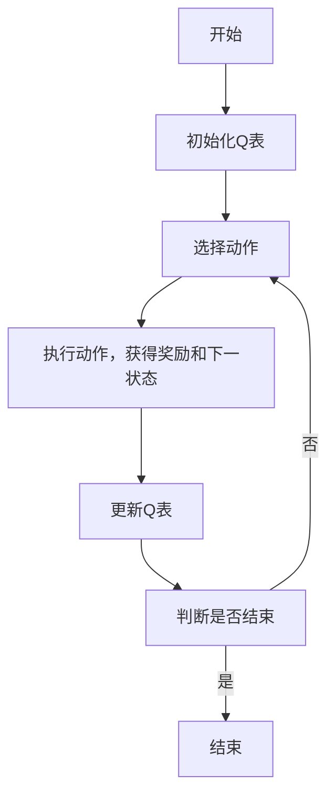
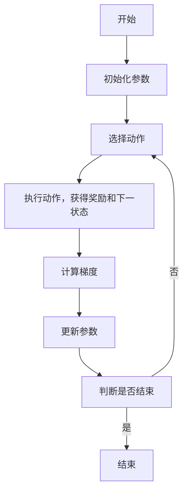
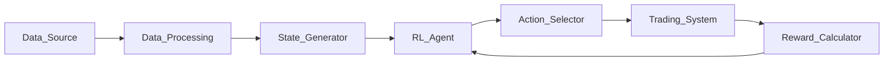
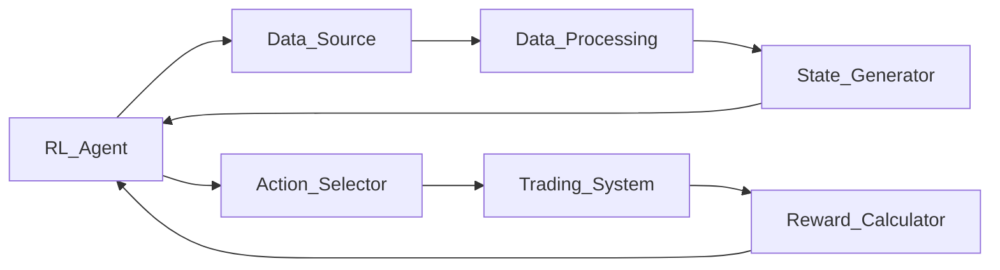

                 


# 《金融领域强化学习在交易执行中的应用》

---

## 关键词：  
强化学习、金融交易、Q-Learning、策略梯度、交易执行、深度强化学习、股票交易

---

## 摘要：  
本文深入探讨了强化学习在金融交易执行中的应用，结合金融交易的复杂性和不确定性，详细分析了强化学习的核心算法及其在交易策略优化中的实际应用。文章从强化学习的基本概念出发，逐步展开其在金融领域的具体应用，包括Q-Learning算法的实现、策略梯度方法的应用、系统架构设计以及实际项目案例的分析。通过本文的阐述，读者可以全面理解强化学习如何在金融交易中实现高效、智能的策略优化。

---

## 第一部分：强化学习在金融交易中的背景与基础

### 第1章：强化学习与金融交易概述

#### 1.1 强化学习的基本概念  
**1.1.1 强化学习的定义**  
强化学习（Reinforcement Learning, RL）是一种机器学习范式，旨在通过智能体与环境的交互，学习最优策略以最大化累计奖励。与监督学习不同，强化学习不需要明确的标签数据，而是通过奖励信号指导智能体的学习过程。  

**1.1.2 强化学习的核心要素**  
- **状态（State）**：环境中的当前情况，例如金融市场的价格、成交量等。  
- **动作（Action）**：智能体在给定状态下采取的操作，例如买入、卖出或持有。  
- **奖励（Reward）**：智能体在特定状态下采取动作后获得的反馈，通常表示为收益或损失。  
- **策略（Policy）**：智能体在不同状态下选择动作的概率分布。  
- **值函数（Value Function）**：衡量某状态下采取某动作后的预期累计奖励。  

**1.1.3 强化学习与金融交易的结合点**  
金融交易的复杂性和不确定性使得强化学习成为一种理想的解决方案。通过模拟市场环境，强化学习可以训练智能体在不同市场条件下做出最优决策，例如股票交易中的买卖时机选择。

#### 1.2 金融交易中的强化学习应用  
**1.2.1 金融交易的复杂性**  
金融市场受到多种因素的影响，包括经济指标、公司财报、政策变化等，这些因素使得市场预测具有高度的不确定性。  

**1.2.2 强化学习在交易执行中的优势**  
- **自适应性**：强化学习能够根据市场变化动态调整交易策略。  
- **高效性**：通过模拟训练，智能体可以在短时间内找到最优策略。  
- **可扩展性**：强化学习适用于多种金融资产和市场环境。  

**1.2.3 交易执行中的关键问题**  
- **延迟优化**：如何在不同时间窗口内优化交易执行。  
- **风险控制**：如何在最大化收益的同时最小化风险。  
- **多资产交易**：如何在多种资产之间进行优化配置。  

#### 1.3 本章小结  
本章介绍了强化学习的基本概念及其在金融交易中的应用潜力，强调了强化学习在复杂市场环境中的优势，并为后续章节奠定了基础。

---

## 第二部分：强化学习的核心算法原理

### 第2章：强化学习的核心算法

#### 2.1 Q-Learning算法  
**2.1.1 Q-Learning的基本原理**  
Q-Learning是一种经典的强化学习算法，通过更新Q值表来学习最优策略。Q值表记录了每个状态下每个动作的预期累计奖励。  

**2.1.2 Q-Learning的数学模型**  
Q-Learning的更新公式为：  
$$ Q(s, a) = Q(s, a) + \alpha \left[ r + \gamma \max Q(s', a') - Q(s, a) \right] $$  
其中，$\alpha$是学习率，$\gamma$是折扣因子，$r$是奖励，$s'$是下一状态。  

**2.1.3 Q-Learning的流程图**  


**2.1.4 Q-Learning的Python实现示例**  
```python
import numpy as np

class QLearning:
    def __init__(self, state_space, action_space, alpha=0.1, gamma=0.9):
        self.state_space = state_space
        self.action_space = action_space
        self.Q = np.zeros((state_space, action_space))
        self.alpha = alpha
        self.gamma = gamma

    def choose_action(self, state, epsilon=0.1):
        if np.random.random() < epsilon:
            return np.random.randint(self.action_space)
        else:
            return np.argmax(self.Q[state, :])

    def update_Q(self, state, action, reward, next_state):
        self.Q[state, action] += self.alpha * (reward + self.gamma * np.max(self.Q[next_state, :]) - self.Q[state, action])
```

#### 2.2 策略梯度方法  
**2.2.1 策略梯度的基本原理**  
策略梯度方法直接优化策略，通过梯度上升或下降来更新参数，以最大化累计奖励。  

**2.2.2 策略梯度的数学模型**  
策略梯度的更新公式为：  
$$ \theta = \theta + \alpha \nabla_{\theta} \left( \sum_{t} \gamma^{t} r_t \right) $$  

**2.2.3 策略梯度的流程图**  


#### 2.3 强化学习算法在金融交易中的应用  
**2.3.1 交易策略的优化**  
通过强化学习，智能体可以学习在不同市场条件下采取最优的买卖策略。  

**2.3.2 风险控制的实现**  
强化学习可以通过奖励函数的设计，将风险控制纳入策略优化的目标。  

---

## 第三部分：强化学习在金融交易中的系统架构设计

### 第3章：强化学习系统架构

#### 3.1 交易执行系统的功能设计  
**3.1.1 数据流设计**  
交易系统需要处理的历史数据包括开盘价、收盘价、最高价、最低价、成交量等。  

**3.1.2 模块划分**  
- **数据获取模块**：从数据源获取实时或历史数据。  
- **状态生成模块**：将数据转换为强化学习的状态表示。  
- **策略执行模块**：根据当前状态选择动作并执行交易。  
- **奖励计算模块**：根据交易结果计算奖励。  

#### 3.2 系统架构设计  
**3.2.1 系统架构图**  


#### 3.3 系统接口设计  
- **数据接口**：与数据源的交互接口。  
- **策略接口**：与交易策略的交互接口。  
- **奖励接口**：与奖励计算模块的交互接口。  

#### 3.4 系统交互流程图  


---

## 第四部分：强化学习在金融交易中的项目实战

### 第4章：强化学习在股票交易中的应用

#### 4.1 项目环境搭建  
**4.1.1 数据获取**  
使用Yahoo Finance获取股票历史数据。  

**4.1.2 环境搭建代码**  
```python
import pandas as pd
import numpy as np

def get_stock_data(ticker, start_date, end_date):
    data = pd.read_csv(f'data/{ticker}.csv')
    data = data[(data['Date'] >= start_date) & (data['Date'] <= end_date)]
    return data
```

#### 4.2 策略实现  
**4.2.1 状态空间设计**  
状态包括当前价格、移动平均线（MA）、相对强弱指数（RSI）等。  

**4.2.2 动作空间设计**  
动作包括买入、卖出和持有。  

#### 4.3 交易结果分析  
**4.3.1 回测结果**  
通过回测验证策略的有效性，计算年化收益、最大回撤等指标。  

#### 4.4 代码实现与优化  
**4.4.1 强化学习算法的实现**  
```python
class StockTrader:
    def __init__(self, state_dim, action_dim, alpha=0.1, gamma=0.9):
        self.state_dim = state_dim
        self.action_dim = action_dim
        self.Q = np.zeros((state_dim, action_dim))
        self.alpha = alpha
        self.gamma = gamma

    def get_state(self, data, i):
        # 生成状态向量
        state = data.iloc[i:i+10].mean().values
        return state

    def choose_action(self, state, epsilon=0.1):
        if np.random.random() < epsilon:
            return np.random.randint(self.action_dim)
        else:
            return np.argmax(self.Q[state])
```

---

## 第五部分：总结与展望

### 第5章：总结与展望

#### 5.1 本章总结  
本文详细探讨了强化学习在金融交易中的应用，从算法原理到系统架构，再到实际项目案例，全面展示了强化学习在交易执行中的潜力。  

#### 5.2 未来展望  
未来的研究方向包括：  
- **多智能体强化学习**：模拟市场中的多方博弈。  
- **深度强化学习**：结合深度学习的特征提取能力，进一步提升交易策略的效果。  
- **实时交易系统**：将强化学习应用于实时交易，实现高效的决策过程。  

---

## 作者：AI天才研究院/AI Genius Institute & 禅与计算机程序设计艺术 /Zen And The Art of Computer Programming  

---

本文通过系统地分析强化学习在金融交易中的应用，结合算法原理和实际案例，为读者提供了一个全面的理解框架。希望本文能为金融领域的技术从业者提供有价值的参考，进一步推动强化学习在金融交易中的实践应用。

