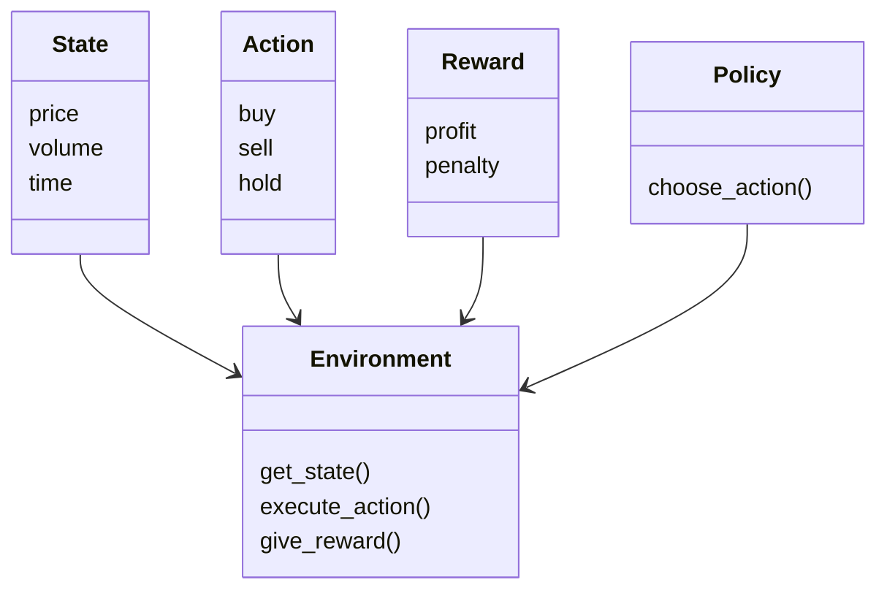
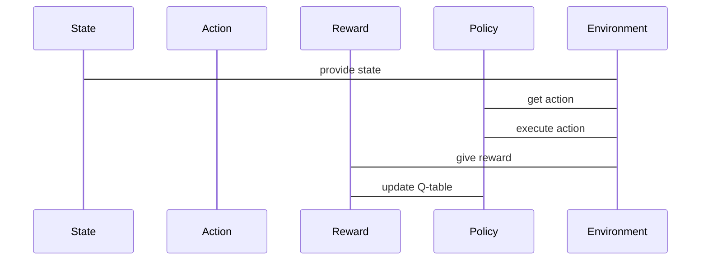

                 


# 《金融领域强化学习在交易策略中的应用》

> 关键词：强化学习，金融交易，交易策略，深度强化学习，Q-learning算法，金融市场，算法交易

> 摘要：本文深入探讨了强化学习在金融交易中的应用，特别是如何利用强化学习算法优化交易策略。通过分析Q-learning算法和深度强化学习（DRL）的核心原理，结合实际案例，详细阐述了强化学习在金融交易系统设计中的应用。本文还提供了代码实现和系统架构设计，帮助读者理解强化学习如何在实际交易场景中发挥作用。

---

# 第1章: 强化学习与金融交易的背景介绍

## 1.1 强化学习的基本概念

### 1.1.1 什么是强化学习
强化学习（Reinforcement Learning，RL）是一种机器学习范式，其中智能体通过与环境交互来学习策略。智能体通过执行动作并观察结果，获得奖励或惩罚，从而优化其行为以最大化累积奖励。

$$
R = \sum_{t=1}^{T} r_t
$$

其中，$R$ 是总奖励，$r_t$ 是时间 $t$ 的奖励。

### 1.1.2 强化学习的核心要素
强化学习系统由以下核心要素组成：
- 状态（State）：环境的当前情况。
- 动作（Action）：智能体采取的行动。
- 奖励（Reward）：环境对智能体行动的反馈。
- 策略（Policy）：智能体选择动作的规则。
- 价值函数（Value Function）：评估状态或动作价值的函数。

### 1.1.3 强化学习与金融交易的结合
在金融交易中，强化学习被广泛应用于自动交易策略的开发。通过将金融市场视为一个动态环境，交易系统可以通过强化学习不断优化其决策过程。

---

## 1.2 金融交易的基本原理

### 1.2.1 金融市场的基本构成
金融市场由交易者、资产、价格和交易规则组成。交易者通过买卖资产影响市场价格，而价格的变化反映了市场参与者的供需关系。

### 1.2.2 交易策略的分类与特点
交易策略可以分为以下几类：
- **趋势跟踪策略**：基于价格趋势进行交易。
- **均值回归策略**：基于价格回归均值的假设进行交易。
- **套利策略**：利用价格差异进行无风险或低风险套利。

### 1.2.3 强化学习在金融交易中的优势
强化学习能够处理动态变化的市场环境，通过实时反馈优化交易策略。其优势包括：
- **自适应性**：能够根据市场变化动态调整策略。
- **高效性**：通过模拟大量交易场景，快速找到最优策略。

---

## 1.3 强化学习在金融领域的应用现状

### 1.3.1 强化学习在金融中的典型应用
- **算法交易**：利用强化学习优化订单执行和市场参与。
- **风险管理**：通过强化学习模型预测市场风险。
- **资产配置**：优化投资组合的配置策略。

### 1.3.2 当前存在的问题与挑战
- **市场的不可预测性**：金融市场受到多种因素影响，强化学习模型难以完全捕捉。
- **计算资源需求**：强化学习需要大量计算资源进行训练。

### 1.3.3 未来的发展趋势
随着深度强化学习（DRL）的发展，强化学习在金融领域的应用将更加广泛。未来的研究方向包括：
- **多智能体协作**：多个交易系统协同工作，优化整体收益。
- **结合其他技术**：将强化学习与其他技术（如自然语言处理）结合，提升交易策略的复杂性和多样性。

---

## 1.4 本章小结
本章介绍了强化学习的基本概念及其在金融交易中的应用。通过分析强化学习的核心要素和金融市场的基本构成，揭示了强化学习在优化交易策略方面的潜力和挑战。

---

# 第2章: 强化学习的核心概念与原理

## 2.1 强化学习的基本原理

### 2.1.1 状态、动作与奖励的定义
在强化学习中，智能体通过与环境交互，观察状态（State），选择动作（Action），并获得奖励（Reward）。

$$
s_{t+1} = f(s_t, a_t)
$$

其中，$s_t$ 是当前状态，$a_t$ 是当前动作，$f$ 是环境转移函数。

### 2.1.2 马尔可夫决策过程（MDP）
马尔可夫决策过程（Markov Decision Process）是强化学习的基础模型，由以下部分组成：
- 状态空间（State Space）：所有可能的状态集合。
- 动作空间（Action Space）：所有可能的动作集合。
- 奖励函数（Reward Function）：定义每个状态和动作的奖励。
- 转移概率（Transition Probability）：从当前状态和动作转移到下一个状态的概率。

### 2.1.3 策略与价值函数
策略（Policy）定义智能体在给定状态下的动作选择概率。价值函数（Value Function）评估状态或动作的价值。

$$
V(s) = \max_{a} [ r(s, a) + V(s') ]
$$

其中，$V(s)$ 是状态 $s$ 的价值，$r(s, a)$ 是状态 $s$ 下动作 $a$ 的奖励，$s'$ 是下一个状态。

---

## 2.2 常见的强化学习算法

### 2.2.1 Q-learning算法
Q-learning是一种基于值函数的强化学习算法，通过更新Q值表（Q-table）来学习最优策略。

$$
Q(s, a) = Q(s, a) + \alpha [ r(s, a) + \gamma \max Q(s', a') - Q(s, a) ]
$$

其中，$\alpha$ 是学习率，$\gamma$ 是折扣因子。

### 2.2.2 深度强化学习（DRL）
深度强化学习结合了深度学习和强化学习，通过神经网络逼近价值函数或策略。

### 2.2.3 其他强化学习算法简介
- **策略梯度方法**：直接优化策略参数。
- **Actor-Critic方法**：同时学习策略和价值函数。

---

## 2.3 强化学习的核心概念对比

### 2.3.1 监督学习与强化学习的对比
| 特性      | 监督学习                | 强化学习                |
|-----------|------------------------|-------------------------|
| 数据来源  | 标签数据                | 环境反馈                |
| 反馈机制  | 单次反馈                | 延时反馈                |
| 应用场景  | 分类、回归              | 控制、游戏、机器人控制    |

### 2.3.2 强化学习与其他机器学习方法的对比
| 特性      | 监督学习                | 强化学习                | 聚类                |
|-----------|------------------------|-------------------------|---------------------|
| 目标      | 预测标签                | 最大化累积奖励          | 发现数据分布        |
| 反馈机制  | 标签                    | 奖励                    | 不提供               |
| 适用场景  | 分类、回归              | 控制、游戏、机器人控制    | 数据分组            |

---

## 2.4 强化学习的数学模型与公式

### 2.4.1 Q-learning的数学公式
Q-learning的目标是最优化Q值表：

$$
Q_{\text{opt}}(s, a) = \max Q(s, a)
$$

### 2.4.2 策略评估的数学模型
策略评估是通过动态规划方法计算价值函数：

$$
V_\pi(s) = \sum_{a} \pi(a|s) Q_\pi(s, a)
$$

其中，$\pi(a|s)$ 是策略 $\pi$ 在状态 $s$ 下选择动作 $a$ 的概率。

### 2.4.3 策略迭代的数学推导
策略迭代包括策略评估和策略改进两步：

1. **策略评估**：计算当前策略的价值函数。
2. **策略改进**：根据价值函数优化策略。

---

## 2.5 本章小结
本章详细讲解了强化学习的基本原理和常见算法，分析了强化学习与其他机器学习方法的差异，并通过数学公式展示了Q-learning和策略迭代的核心思想。

---

# 第3章: 强化学习算法的数学模型与实现

## 3.1 Q-learning算法的详细讲解

### 3.1.1 Q-learning的算法步骤
1. 初始化Q值表为零。
2. 在每个时间步，根据当前状态选择动作。
3. 执行动作，观察下一个状态和奖励。
4. 更新Q值表：

$$
Q(s, a) = Q(s, a) + \alpha [ r + \gamma \max Q(s', a') - Q(s, a) ]
$$

### 3.1.2 Q-learning的数学公式
Q-learning的目标是最优化Q值表：

$$
Q_{\text{opt}}(s, a) = \max Q(s, a)
$$

### 3.1.3 Q-learning的实现代码

```python
import numpy as np

class QLearning:
    def __init__(self, state_space_size, action_space_size, gamma=0.99, alpha=0.1):
        self.Q = np.zeros((state_space_size, action_space_size))
        self.gamma = gamma
        self.alpha = alpha

    def get_action(self, state, epsilon=0.1):
        if np.random.random() < epsilon:
            return np.random.randint(0, self.Q.shape[1])
        else:
            return np.argmax(self.Q[state, :])

    def update_Q(self, state, action, reward, next_state):
        self.Q[state, action] += self.alpha * (reward + self.gamma * np.max(self.Q[next_state, :]) - self.Q[state, action])
```

---

## 3.2 策略网络与值函数网络

### 3.2.1 策略网络的定义与作用
策略网络直接输出动作概率分布：

$$
\pi(a|s) = \text{softmax}(W s + b)
$$

### 3.2.2 值函数网络的定义与作用
值函数网络估计状态的价值：

$$
V(s) = W s + b
$$

### 3.2.3 网络结构的对比与选择
- **策略网络**：适用于离散动作空间。
- **值函数网络**：适用于连续动作空间。

---

## 3.3 强化学习算法的实现细节

### 3.3.1 状态空间的处理方法
- 离散化：将连续状态转换为离散状态。
- 状态编码：使用特征提取方法处理复杂状态。

### 3.3.2 动作空间的处理方法
- 离散化：将动作空间分为有限个动作。
- 连续化：允许动作在一定范围内连续变化。

### 3.3.3 奖励函数的设计原则
- **及时性**：奖励应及时反馈。
- **明确性**：奖励应明确指导智能体行为。
- **一致性**：奖励应保持一致。

---

## 3.4 本章小结
本章详细讲解了Q-learning算法的实现，并对比了策略网络和值函数网络的优缺点，提供了具体的代码实现和算法细节。

---

# 第4章: 强化学习在金融交易中的系统设计

## 4.1 金融交易系统的整体架构

### 4.1.1 系统目标与范围
系统目标是优化交易策略，提升交易收益。

### 4.1.2 系统功能模块划分
- 数据采集模块
- 特征提取模块
- 策略选择模块
- 交易执行模块

### 4.1.3 系统架构设计
系统采用模块化设计，各模块协同工作。

---

## 4.2 系统功能模块设计

### 4.2.1 数据采集模块
- 数据来源：金融市场数据接口。
- 数据类型：价格、成交量、市场情绪等。

### 4.2.2 特征提取模块
- 特征工程：将原始数据转换为有意义的特征。
- 特征选择：筛选重要特征。

### 4.2.3 策略选择模块
- 策略选择：基于强化学习算法选择最优策略。
- 策略调整：根据市场反馈动态调整策略。

### 4.2.4 交易执行模块
- 订单生成：根据策略生成订单。
- 执行监控：监控交易执行情况。

---

## 4.3 系统架构设计

### 4.3.1 领域模型（mermaid类图）



### 4.3.2 系统交互（mermaid序列图）



---

## 4.4 本章小结
本章详细描述了金融交易系统的整体架构和功能模块设计，并通过mermaid图展示了系统的交互流程。

---

# 第5章: 项目实战

## 5.1 环境安装与配置

### 5.1.1 安装Python和相关库
- 安装Python 3.x
- 安装必要的库：numpy, pandas, matplotlib, keras, tensorflow

### 5.1.2 数据源配置
- 数据接口：使用Yahoo Finance API获取股票数据。

---

## 5.2 系统核心实现源代码

### 5.2.1 强化学习模型实现

```python
import numpy as np
import pandas as pd
import gym
from gym import spaces

class TradingEnvironment(gym.Env):
    def __init__(self, data):
        self.data = data
        self.current_step = 0
        self.action_space = spaces.Discrete(3)  # 0: hold, 1: buy, 2: sell
        self.observation_space = spaces.Box(low=0, high=1, shape=(1, 10))  # 示例观测空间

    def _get_state(self):
        state = self.data.iloc[self.current_step: self.current_step+10].values
        return state

    def reset(self):
        self.current_step = 0
        return self._get_state()

    def step(self, action):
        next_step = self.current_step + 1
        if next_step >= len(self.data):
            next_step = len(self.data) - 1
        state = self._get_state()
        reward = self._calculate_reward(action)
        done = next_step == len(self.data) - 1
        info = {}
        return state, reward, done, info

    def _calculate_reward(self, action):
        # 示例奖励计算
        return np.random.random()
```

### 5.2.2 交易策略实现

```python
class TradingStrategy:
    def __init__(self, env):
        self.env = env
        self.Q = np.zeros((env.observation_space.shape[0], env.action_space.n))

    def get_action(self, state, epsilon=0.1):
        if np.random.random() < epsilon:
            return self.env.action_space.sample()
        else:
            return np.argmax(self.Q[state])

    def update_Q(self, state, action, reward, next_state):
        self.Q[state, action] += 0.1 * (reward + 0.99 * np.max(self.Q[next_state]) - self.Q[state, action])
```

---

## 5.3 实际案例分析

### 5.3.1 数据准备
使用历史股票数据训练强化学习模型。

### 5.3.2 策略优化
通过多次迭代优化交易策略，提升收益。

### 5.3.3 结果分析
分析策略的收益、风险和稳定性。

---

## 5.4 本章小结
本章通过实际案例展示了强化学习在金融交易中的应用，提供了代码实现和结果分析。

---

# 第6章: 最佳实践与注意事项

## 6.1 最佳实践

### 6.1.1 数据质量的重要性
确保数据的完整性和准确性。

### 6.1.2 模型调参技巧
合理选择学习率和折扣因子。

### 6.1.3 算法的局限性
强化学习在处理复杂市场时可能表现不佳。

---

## 6.2 小结

---

# 结语
强化学习在金融交易中的应用前景广阔，但需要克服数据质量和模型调参等挑战。通过不断优化算法和结合其他技术，强化学习将在金融领域发挥更大的作用。

---

# 作者：AI天才研究院/AI Genius Institute & 禅与计算机程序设计艺术 /Zen And The Art of Computer Programming

