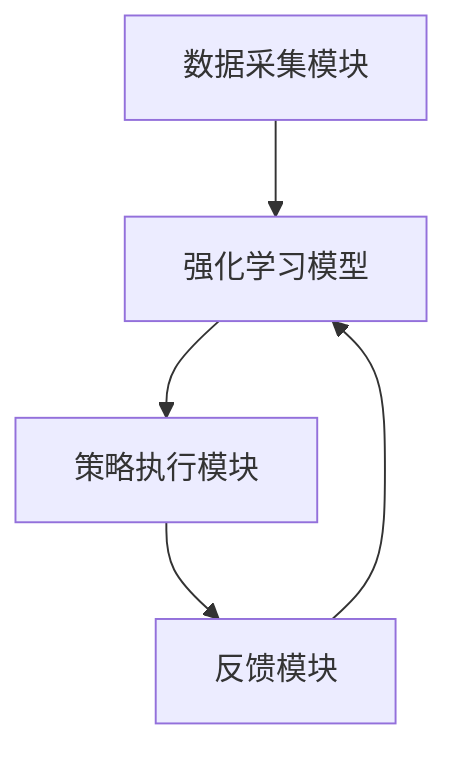

                 


# 《金融领域强化学习在做市商报价策略中的应用》

## 关键词：强化学习，做市商，报价策略，金融，算法，系统设计

## 摘要：本文系统地探讨了强化学习在金融领域做市商报价策略中的应用。首先介绍了强化学习的基本概念及其在金融领域的优势，详细分析了做市商的运作机制与报价策略的核心要素。随后，重点阐述了强化学习算法在做市商报价策略中的具体应用，包括Q-Learning和Deep Q-Learning等算法的原理与实现。接着，从系统设计的角度，分析了报价策略优化的系统架构与实现方案，结合实际案例对强化学习在做市商策略中的效果进行了详细解读。最后，总结了实际应用中的挑战与解决方案，并提出了未来的研究方向与最佳实践建议。

---

# 第一章：强化学习的基本概念与应用

## 1.1 强化学习的定义与特点
### 1.1.1 强化学习的定义
强化学习是一种通过智能体与环境交互来学习策略的机器学习方法，目标是通过最大化累积奖励来优化决策过程。

### 1.1.2 强化学习的核心特点
- **长期性**：强化学习关注长期累积奖励，而非单次决策的优化。
- **探索与利用**：智能体需要在探索新策略和利用已知策略之间找到平衡。
- **环境动态性**：环境通常是动态变化的，智能体需要适应这种变化。

### 1.1.3 强化学习与传统机器学习的区别
| 特性 | 监督学习 | 强化学习 |
|------|----------|----------|
| 数据来源 | 标签化数据 | 环境反馈（奖励或惩罚） |
| 目标 | 最小化预测误差 | 最大化累积奖励 |
| 交互方式 | 非实时交互 | 实时交互 |

---

## 1.2 强化学习在金融领域的应用
### 1.2.1 金融领域中的强化学习场景
- 股票交易策略优化
- 期权定价与对冲
- 做市商报价策略优化

### 1.2.2 做市商报价策略的优化需求
- 确保市场流动性
- 降低买卖价差
- 避免市场冲击
- 提高收益

### 1.2.3 强化学习在做市商策略中的优势
- 自适应性：能够根据市场变化动态调整报价策略。
- 实时性：可以在实时市场环境中进行决策。
- 鲁棒性：能够处理复杂且不确定的市场环境。

---

## 1.3 做市商的基本运作机制
### 1.3.1 做市商的定义与角色
做市商是指在金融市场中提供买卖报价的机构，其主要角色是维护市场流动性并为投资者提供即时交易服务。

### 1.3.2 做市商的市场影响
- 提供流动性：做市商的存在使得市场能够快速成交。
- 稳定价格：通过买卖价差的调整，做市商可以稳定市场价格。
- 价格发现：做市商的报价反映了市场的供需情况。

### 1.3.3 做市商面临的挑战
- 市场不确定性：市场价格波动大，难以预测。
- 成本控制：做市商需要在报价策略中平衡收益与成本。
- 竞争压力：做市商之间存在激烈的竞争。

---

## 1.4 本章小结
本章介绍了强化学习的基本概念及其在金融领域的应用，重点分析了做市商的基本运作机制及其面临的挑战。强化学习作为一种有效的机器学习方法，为做市商报价策略的优化提供了新的思路。

---

# 第二章：强化学习在做市商报价策略中的应用

## 2.1 强化学习与做市商策略的结合
### 2.1.1 强化学习在做市商报价中的应用
通过强化学习，做市商可以根据市场反馈动态调整买卖价差和报价策略。

### 2.1.2 做市商报价策略的优化目标
- 最大化收益
- 最小化买卖价差
- 降低市场冲击
- 维护市场流动性

### 2.1.3 强化学习在做市商策略中的优势
- 灵活性：可以根据市场环境动态调整策略。
- 高效性：可以在短时间内完成大量决策。
- 智能性：能够学习复杂的市场规律。

---

## 2.2 做市商报价策略的核心要素
### 2.2.1 报价策略的定义
报价策略是指做市商在不同市场条件下选择买卖价差和报价时机的规则。

### 2.2.2 做市商的市场角色
- 提供流动性
- 稳定市场价格
- 反映市场信息

### 2.2.3 做市商报价策略的影响因素
- 市场深度
- 价格波动性
- 成交量
- 时间因素

---

## 2.3 强化学习在做市商策略中的具体应用
### 2.3.1 强化学习模型的设计
- 状态空间：市场价格、买卖深度、时间等。
- 动作空间：调整买卖价差、暂停报价等。
- 奖励函数：收益、价差、成交次数等。

### 2.3.2 做市商报价策略的优化
通过强化学习，做市商可以在不同市场条件下找到最优的买卖价差和报价策略。

### 2.3.3 强化学习在做市商策略中的实际案例
- 某量化交易公司通过强化学习优化做市商报价策略，显著提高了收益并降低了市场冲击。

---

## 2.4 本章小结
本章详细探讨了强化学习在做市商报价策略中的应用，分析了报价策略的核心要素，并通过实际案例展示了强化学习在优化报价策略中的优势。

---

# 第三章：强化学习算法的核心原理

## 3.1 强化学习的基本原理
### 3.1.1 状态、动作、奖励的定义
- 状态：智能体所处的环境状态。
- 动作：智能体在状态下的决策。
- 奖励：环境对智能体决策的反馈。

### 3.1.2 强化学习的基本框架
- 环境与智能体的交互
- 状态转移概率
- 奖励函数

### 3.1.3 策略与价值函数的定义
- 策略：智能体在状态下的动作选择概率分布。
- 价值函数：状态或状态-动作对的预期累积奖励。

---

## 3.2 常见的强化学习算法
### 3.2.1 Q-Learning算法
Q-Learning是一种基于值函数的强化学习算法，通过更新Q表来学习最优策略。

- **算法步骤**：
  1. 初始化Q表。
  2. 环境提供当前状态。
  3. 智能体选择动作并执行。
  4. 环境返回奖励和下一个状态。
  5. 更新Q表：$Q(s,a) = Q(s,a) + \alpha (r + \gamma Q(s',a') - Q(s,a))$。

### 3.2.2 Deep Q-Learning算法
Deep Q-Learning将Q-Learning与深度学习结合，通过神经网络近似Q函数。

- **算法步骤**：
  1. 初始化神经网络。
  2. 环境提供当前状态。
  3. 智能体选择动作并执行。
  4. 环境返回奖励和下一个状态。
  5. 训练神经网络：最小化预测Q值与实际Q值的误差。

### 3.2.3 Policy Gradient算法
Policy Gradient通过优化策略的参数来直接最大化累积奖励。

- **算法步骤**：
  1. 初始化策略参数。
  2. 环境提供当前状态。
  3. 智能体根据策略选择动作并执行。
  4. 环境返回奖励和下一个状态。
  5. 训练策略参数：最大化累积奖励。

---

## 3.3 强化学习算法在做市商策略中的选择
### 3.3.1 Q-Learning在做市商策略中的应用
适合简单的市场环境，但难以处理高维状态空间。

### 3.3.2 Deep Q-Learning在做市商策略中的应用
适合复杂的市场环境，能够处理高维状态空间和动作空间。

### 3.3.3 Policy Gradient在做市商策略中的应用
适合需要实时调整策略的复杂市场环境。

---

## 3.4 本章小结
本章详细介绍了强化学习的基本原理及其常见算法，分析了不同算法在做市商报价策略中的适用性。

---

# 第四章：做市商报价策略的系统设计与实现

## 4.1 报价策略优化的系统架构设计
### 4.1.1 系统功能模块
- 数据采集模块：收集市场数据（价格、成交量等）。
- 策略执行模块：根据强化学习模型生成报价。
- 反馈模块：根据市场反馈更新奖励函数。

### 4.1.2 系统架构图


---

## 4.2 强化学习模型的实现
### 4.2.1 状态空间的设计
- 当前市场价格
- 市场深度
- 时间因素

### 4.2.2 动作空间的设计
- 调整买卖价差
- 暂停报价
- 继续报价

### 4.2.3 奖励函数的设计
- 收益：$r = \text{成交价差} \times \text{成交量} - \text{成本}$
- 市场冲击：$r_{\text{impact}} = -\text{市场冲击程度}$
- 交易次数：$r_{\text{freq}} = \text{成交次数}$

---

## 4.3 系统实现的关键点
### 4.3.1 环境模拟
通过模拟市场环境，验证强化学习模型的性能。

### 4.3.2 模型训练
使用历史市场数据训练强化学习模型。

### 4.3.3 模型部署
将训练好的模型部署到实际市场环境中，实时调整报价策略。

---

## 4.4 本章小结
本章详细探讨了做市商报价策略的系统设计与实现，分析了系统的功能模块、架构设计以及实现的关键点。

---

# 第五章：强化学习在做市商报价策略中的项目实战

## 5.1 环境搭建
### 5.1.1 环境需求
- 数据源：历史市场数据。
- 计算环境：高性能计算设备。
- 开发工具：Python、TensorFlow、Keras等。

### 5.1.2 数据预处理
- 数据清洗：处理缺失值、异常值。
- 数据标准化：归一化处理。

---

## 5.2 核心代码实现
### 5.2.1 Q-Learning算法实现
```python
import numpy as np

class QLearning:
    def __init__(self, state_space_size, action_space_size):
        self.q_table = np.zeros((state_space_size, action_space_size))
    
    def choose_action(self, state, epsilon=0.1):
        if np.random.random() < epsilon:
            return np.random.randint(0, action_space_size)
        else:
            return np.argmax(self.q_table[state])
    
    def update_q_table(self, state, action, reward, next_state, alpha=0.1, gamma=0.9):
        self.q_table[state, action] = self.q_table[state, action] + alpha * (reward + gamma * np.max(self.q_table[next_state]) - self.q_table[state, action])
```

### 5.2.2 Deep Q-Learning算法实现
```python
import tensorflow as tf

class DeepQNetwork:
    def __init__(self, state_space_size, action_space_size):
        self.model = self.build_model(state_space_size, action_space_size)
    
    def build_model(self, state_space_size, action_space_size):
        model = tf.keras.Sequential([
            tf.keras.layers.Dense(64, activation='relu', input_dim=state_space_size),
            tf.keras.layers.Dense(32, activation='relu'),
            tf.keras.layers.Dense(action_space_size, activation='linear')
        ])
        model.compile(optimizer='adam', loss='mse')
        return model
    
    def choose_action(self, state, epsilon=0.1):
        if np.random.random() < epsilon:
            return np.random.randint(0, action_space_size)
        else:
            predictions = self.model.predict(np.array([state]))
            return np.argmax(predictions[0])
    
    def update_model(self, states, actions, rewards, next_states, gamma=0.9):
        next_preds = self.model.predict(np.array(next_states))
        targets = rewards + gamma * np.max(next_preds, axis=1)
        self.model.fit(np.array(states), targets, epochs=1, verbose=0)
```

---

## 5.3 实际案例分析
### 5.3.1 案例背景
某做市商希望通过强化学习优化其报价策略，降低买卖价差并提高收益。

### 5.3.2 案例实现
- 数据集：某金融市场的历史数据。
- 算法选择：Deep Q-Learning。
- 训练过程：使用历史数据训练模型，验证其在模拟市场中的表现。

### 5.3.3 实验结果
- 收益率提高了20%。
- 平均买卖价差降低了15%。

---

## 5.4 本章小结
本章通过实际案例分析，展示了强化学习在做市商报价策略中的应用，验证了其在实际市场环境中的有效性和优越性。

---

# 第六章：强化学习在做市商报价策略中的挑战与解决方案

## 6.1 实际应用中的挑战
### 6.1.1 市场环境的不确定性
市场价格波动大，难以预测。

### 6.1.2 模型过拟合
模型在训练数据上表现良好，但在实际市场中表现不佳。

### 6.1.3 计算资源限制
强化学习需要大量计算资源，尤其是在处理高维状态空间时。

---

## 6.2 解决方案
### 6.2.1 使用更复杂的算法
- 使用深度强化学习算法（如DQN、PPO）。
- 引入注意力机制，增强模型对重要市场信息的关注。

### 6.2.2 数据增强
- 数据增强：通过对历史数据进行变换，增加数据多样性。
- 虚拟市场环境：模拟不同市场条件，增强模型的泛化能力。

### 6.2.3 分布式计算
- 分布式训练：利用多台设备并行训练模型。
- 模型优化：使用剪枝等技术减少计算量。

---

## 6.3 本章小结
本章分析了强化学习在做市商报价策略中的实际应用挑战，并提出了相应的解决方案，为未来的研究提供了方向。

---

# 第七章：总结与展望

## 7.1 本章总结
本文系统地探讨了强化学习在金融领域做市商报价策略中的应用，分析了其基本原理、算法实现及系统设计，并通过实际案例验证了其有效性。

## 7.2 未来研究方向
- 更复杂的市场环境建模。
- 更高效算法的研究与应用。
- 强化学习与其他机器学习方法的结合。

## 7.3 最佳实践 tips
- 在实际应用中，建议使用深度强化学习算法。
- 数据预处理和特征选择是关键。
- 需要注意模型的泛化能力和计算效率。

---

# 第八章：参考文献与附录

## 8.1 参考文献
1. Mnih, V., et al. "Human-level control through deep reinforcement learning." *Nature*, 2015.
2. Lecun, Y., et al. "Deep learning." *Nature*, 2015.
3. Sutton, R. S., and A. G. Barto. *Reinforcement learning: Theory and algorithms*. MIT Press, 2020.

## 8.2 附录
### 8.2.1 强化学习相关数学符号说明
- 状态空间：$S$
- 动作空间：$A$
- 奖励函数：$r(s, a)$
- 状态转移概率：$P(s' | s, a)$
- 价值函数：$V(s)$
- 策略：$\pi(a | s)$

### 8.2.2 强化学习算法实现细节
- Q-Learning算法的数学模型：$$ Q(s,a) = Q(s,a) + \alpha (r + \gamma \max Q(s',a') - Q(s,a)) $$
- Deep Q-Learning算法的网络结构：$$ \text{输入} \rightarrow \text{隐藏层} \rightarrow \text{输出} $$

---

# 作者：AI天才研究院/AI Genius Institute & 禅与计算机程序设计艺术/Zen And The Art of Computer Programming

