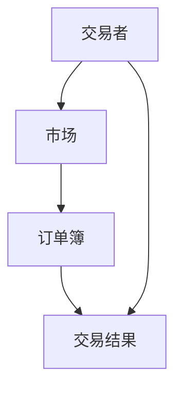
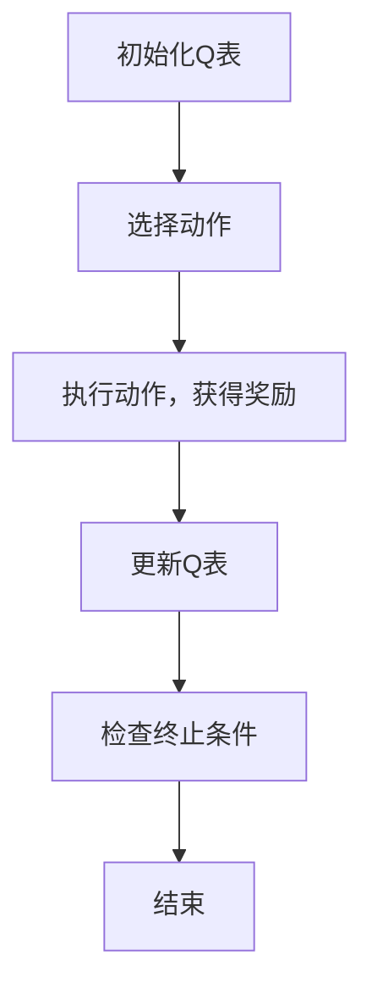
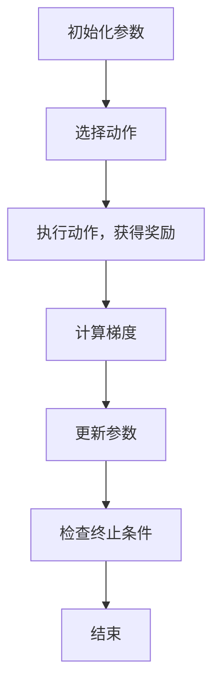

                 


# 金融领域强化学习在动态最优执行策略中的应用

> 关键词：强化学习、动态最优执行、金融交易、马尔可夫决策过程、深度学习、Q-learning、策略梯度

> 摘要：本文深入探讨了强化学习在金融领域动态最优执行策略中的应用。通过分析强化学习的核心原理，结合金融交易中的实际问题，详细讲解了动态最优执行策略的构建过程。从算法原理到系统架构，再到实际项目实战，本文为读者提供了全面而深入的技术指导，展示了强化学习在金融交易中的巨大潜力。

---

# 第一部分: 强化学习与金融领域动态最优执行策略的背景介绍

## 第1章: 动态最优执行策略的背景与问题背景

### 1.1 动态最优执行策略的背景
#### 1.1.1 金融交易中的执行问题
在金融交易中，执行问题是指如何在最优的时间和价格上买卖资产，以最小化交易成本并最大化收益。动态最优执行策略的核心目标是根据市场环境的变化，实时调整交易策略，以实现最优的执行效果。

#### 1.1.2 动态最优执行策略的定义与特点
动态最优执行策略是一种能够根据市场环境变化实时调整交易行为的策略。其特点包括：
- **实时性**：能够快速响应市场变化。
- **适应性**：能够根据市场环境调整交易策略。
- **最优性**：能够在给定市场条件下实现最优的交易结果。

#### 1.1.3 强化学习在金融交易中的应用潜力
强化学习（Reinforcement Learning, RL）是一种通过与环境交互来学习最优策略的技术。其在金融交易中的潜力主要体现在：
- **实时决策**：强化学习能够快速做出决策，适应市场变化。
- **复杂环境建模**：强化学习能够处理复杂的市场环境，捕捉非线性关系。
- **自适应优化**：强化学习能够通过经验不断优化策略，提高执行效率。

---

## 第2章: 问题描述与解决方案

### 2.1 金融交易中的动态最优执行问题
#### 2.1.1 交易执行的核心挑战
在金融交易中，执行问题的核心挑战包括：
- **市场流动性**：市场的流动性会影响交易成本和价格。
- **交易成本**：包括佣金、滑点等成本。
- **市场微观结构**：市场的微观结构（如订单簿、市场深度等）影响交易策略。

#### 2.1.2 动态最优执行的数学建模
动态最优执行问题可以被建模为一个动态优化问题，其目标是最小化交易成本，同时最大化收益。数学上，可以表示为一个连续优化问题，其中状态包括当前的市场环境、资产价格、订单簿信息等。

#### 2.1.3 强化学习在动态优化中的优势
强化学习通过与环境交互，学习最优策略，能够有效解决动态优化问题。其优势包括：
- **自适应性**：能够根据市场变化自适应调整策略。
- **非线性关系捕捉**：能够捕捉市场中的非线性关系。
- **实时决策**：能够在实时环境下做出决策。

---

## 第3章: 强化学习与动态最优执行的结合

### 3.1 强化学习的核心概念
#### 3.1.1 马尔可夫决策过程（MDP）
马尔可夫决策过程（MDP）是强化学习的核心模型，由以下五个要素组成：
- **状态（State）**：环境的当前情况。
- **动作（Action）**：智能体可以执行的操作。
- **奖励（Reward）**：智能体执行动作后获得的反馈。
- **策略（Policy）**：智能体选择动作的概率分布。
- **价值函数（Value Function）**：衡量状态或动作-状态对的价值。

#### 3.1.2 状态、动作、奖励的定义
在动态最优执行问题中：
- **状态**：当前的市场环境，如资产价格、订单簿信息、市场深度等。
- **动作**：执行的交易行为，如买入、卖出、持有等。
- **奖励**：交易后的收益，通常定义为交易收益减去交易成本。

#### 3.1.3 策略与价值函数的数学表达
策略函数 $\pi(a|s)$ 表示在状态 $s$ 下选择动作 $a$ 的概率。价值函数 $V(s)$ 表示在状态 $s$ 下的期望收益。

$$
V(s) = \max_{a} \mathbb{E}[r + V(s') | s, a]
$$

其中，$s'$ 是执行动作 $a$ 后的新状态。

---

## 第4章: 边界与外延

### 4.1 动态最优执行的边界条件
#### 4.1.1 市场深度与流动性约束
市场深度影响交易成本，流动性约束限制了大额交易的可能性。

#### 4.1.2 交易成本与滑点
交易成本包括佣金、滑点等，这些成本会直接影响交易收益。

#### 4.1.3 市场微观结构的影响
市场微观结构（如订单簿、做市商行为）会影响交易策略的有效性。

### 4.2 强化学习在金融中的外延应用
#### 4.2.1 股票交易策略优化
强化学习可以用于优化股票交易策略，实现动态仓位调整。

#### 4.2.2 债券定价与交易
强化学习可以用于债券定价和交易策略的优化。

#### 4.2.3 金融风险管理中的应用
强化学习可以用于金融风险管理和对冲策略的优化。

---

## 第5章: 核心要素与概念结构

### 5.1 核心概念与属性对比
下表对比了动态最优执行策略和强化学习算法的关键参数：

| **核心要素** | **动态最优执行** | **强化学习算法** |
|--------------|------------------|------------------|
| **状态**     | 市场环境          | 当前环境状态      |
| **动作**     | 交易行为          | 可选动作          |
| **奖励**     | 交易收益          | 奖励信号          |
| **策略**     | 交易策略          | 动作选择策略      |
| **价值函数** | 期望收益          | 状态或动作价值    |

### 5.2 实体关系图


---

# 第二部分: 强化学习在动态最优执行策略中的核心概念与联系

## 第6章: 强化学习的核心原理

### 6.1 马尔可夫决策过程（MDP）
马尔可夫决策过程是强化学习的核心模型，通过状态、动作和奖励的定义，构建了一个动态优化的框架。

---

## 第7章: 强化学习算法原理讲解

### 7.1 Q-learning算法
Q-learning是一种经典的强化学习算法，通过学习Q值函数来优化策略。

#### 7.1.1 Q-learning的数学模型
Q值函数 $Q(s, a)$ 表示在状态 $s$ 下执行动作 $a$ 的期望未来奖励。

$$
Q(s, a) = r + \gamma \max_{a'} Q(s', a')
$$

其中，$\gamma$ 是折扣因子，$s'$ 是执行动作 $a$ 后的新状态。

#### 7.1.2 Q-learning的算法流程


#### 7.1.3 Python代码实现
以下是一个简单的Q-learning实现示例：

```python
import numpy as np

class QLearning:
    def __init__(self, state_size, action_size, gamma=0.99):
        self.state_size = state_size
        self.action_size = action_size
        self.gamma = gamma
        self.q_table = np.zeros((state_size, action_size))
    
    def choose_action(self, state, epsilon=0.1):
        if np.random.random() < epsilon:
            return np.random.randint(self.action_size)
        else:
            return np.argmax(self.q_table[state])
    
    def learn(self, state, action, reward, next_state):
        self.q_table[state, action] = reward + self.gamma * np.max(self.q_table[next_state])
```

---

### 7.2 策略梯度方法
策略梯度方法是一种基于策略的强化学习算法，通过优化策略直接最大化奖励。

#### 7.2.1 策略梯度的数学模型
策略函数 $\pi(a|s)$ 表示在状态 $s$ 下选择动作 $a$ 的概率。

$$
\theta = \arg\max_{\theta} \mathbb{E}_{s,a}[r + \gamma V(s', \theta)]
$$

#### 7.2.2 策略梯度的算法流程


---

## 第8章: 系统分析与架构设计

### 8.1 问题场景介绍
动态最优执行系统需要解决金融交易中的实时决策问题，包括订单簿分析、交易成本优化等。

### 8.2 系统功能设计
系统功能模块包括：
- **数据采集**：采集市场数据和订单簿信息。
- **状态定义**：定义交易状态。
- **动作选择**：选择交易动作。
- **奖励计算**：计算交易奖励。

### 8.3 系统架构设计
系统架构图如下：


---

## 第9章: 项目实战

### 9.1 环境安装
需要安装以下依赖：
- Python 3.8+
- TensorFlow 2.0+
- Keras 2.4.3+
- matplotlib 3.3.3+
- numpy 1.19.2+

### 9.2 系统核心实现源代码
以下是一个简单的强化学习交易系统实现示例：

```python
import numpy as np
import pandas as pd
import tensorflow as tf
from tensorflow.keras import layers

# 定义强化学习模型
class DQN:
    def __init__(self, state_size, action_size, hidden_units=64):
        self.model = self.build_model(state_size, action_size, hidden_units)
        self.target_model = self.build_model(state_size, action_size, hidden_units)
        self.update_target_weights()

    def build_model(self, state_size, action_size, hidden_units):
        model = tf.keras.Sequential([
            layers.Dense(hidden_units, activation='relu', input_shape=(state_size,)),
            layers.Dense(action_size)
        ])
        return model

    def update_target_weights(self):
        self.target_model.set_weights(self.model.get_weights())

    def predict(self, state):
        return self.model.predict(state)

    def target_predict(self, state):
        return self.target_model.predict(state)

    def train(self, state, action, reward, next_state, gamma=0.99):
        target = self.predict(state)
        target_next = self.target_predict(next_state)
        target[0][action] = reward + gamma * np.max(target_next[0])
        self.model.fit(state, target, epochs=1, verbose=0)
        self.update_target_weights()
```

### 9.3 代码应用解读与分析
上述代码实现了一个深度Q网络（DQN）算法，用于金融交易中的动态最优执行策略。模型通过与市场环境交互，学习最优交易策略。

### 9.4 实际案例分析
假设我们有一个简单的股票交易场景，模型通过学习订单簿信息，优化买入和卖出策略，以最小化交易成本并最大化收益。

---

## 第10章: 总结与展望

### 10.1 最佳实践 tips
- **数据质量**：确保数据的准确性和实时性。
- **模型调参**：合理调整学习率、折扣因子等参数。
- **风险管理**：设计有效的风险管理机制，避免过度交易。

### 10.2 小结
本文详细探讨了强化学习在金融领域动态最优执行策略中的应用，从理论到实践，全面分析了如何利用强化学习优化交易策略。

### 10.3 注意事项
- 强化学习模型需要大量的数据和计算资源。
- 模型的泛化能力需要通过充分的训练来保证。
- 需要结合实际市场环境进行模型优化。

### 10.4 拓展阅读
- 建议读者进一步阅读《Reinforcement Learning: Theory and Algorithms》和《Deep Reinforcement Learning》等书籍，深入了解强化学习的理论与算法。

---

# 作者：AI天才研究院/AI Genius Institute & 禅与计算机程序设计艺术 /Zen And The Art of Computer Programming

