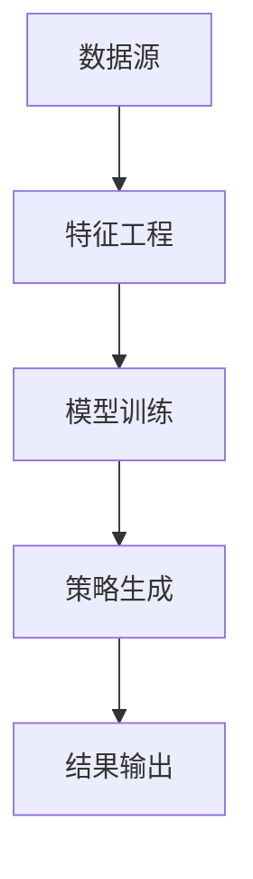
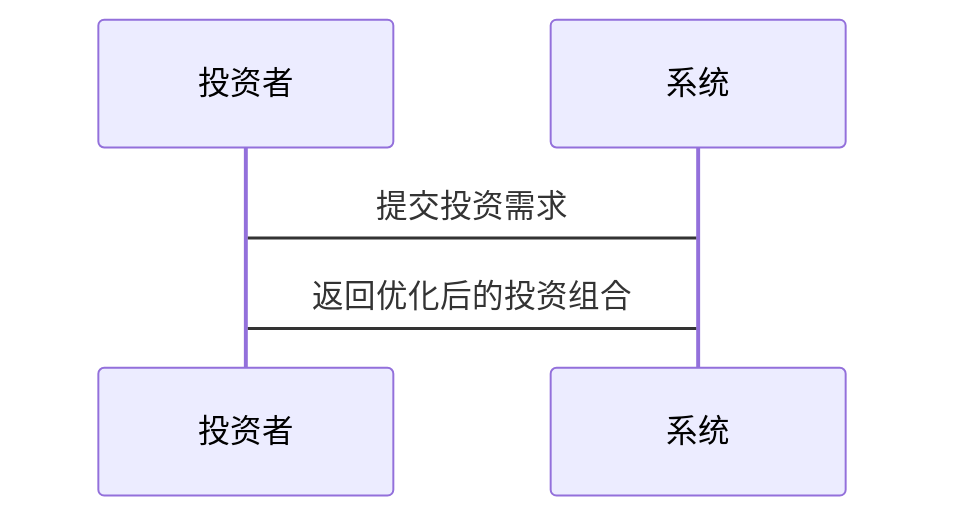
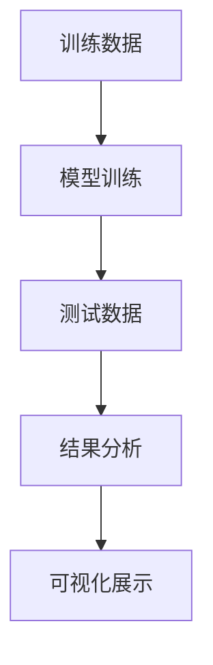

                 


# 第3章: 多周期投资组合优化的强化学习算法原理

## 3.1 多周期投资组合优化的基本原理
### 3.1.1 投资组合优化的数学模型
$$ V(s) = \max_a \left[ r(s,a) + \gamma V(s') \right] $$

### 3.1.2 多周期优化的目标函数
$$ \text{Maximize} \quad \sum_{t=1}^{T} \ln \left( \frac{P_t}{P_{t-1}} \right) $$
$$ \text{Subject to} \quad \sum_{i=1}^{n} w_i = 1 $$

### 3.1.3 多周期优化的约束条件
$$ w_i \geq 0 \quad \forall i $$
$$ \sum_{i=1}^{n} w_i = 1 $$

## 3.2 强化学习算法在多周期优化中的应用
### 3.2.1 动态规划算法的原理
### 3.2.2 Q-learning算法的原理
### 3.2.3 深度强化学习算法的原理

## 3.3 算法的数学模型与公式
### 3.3.1 动态规划的数学模型
$$ V(s) = \max_a \left[ r(s,a) + \gamma V(s') \right] $$

### 3.3.2 Q-learning的数学模型
$$ Q(s,a) = Q(s,a) + \alpha \left[ r(s,a) + \gamma \max Q(s',a') - Q(s,a) \right] $$

## 3.4 算法的实现与代码示例
### 3.4.1 Python代码实现
```python
import numpy as np
import gym
from gym import spaces
from gym.utils import seeding

class PortfolioEnv(gym.Env):
    def __init__(self, n_assets=3):
        super(PortfolioEnv, self).__init__()
        self.n_assets = n_assets
        self.observation_space = spaces.Box(low=0, high=1, shape=(self.n_assets,))
        self.action_space = spaces.Box(low=0, high=1, shape=(self.n_assets,))
        self.current_obs = None

    def _take_action(self, action):
        # 计算投资组合的收益
        return np.sum(action * self.current_obs)

    def reset(self):
        # 初始化环境
        self.current_obs = np.random.rand(self.n_assets,)
        return self.current_obs

    def step(self, action):
        # 执行动作并返回新的状态、奖励、终止标志
        reward = self._take_action(action)
        done = False
        return self.current_obs, reward, done, {}
```

### 3.4.2 算法流程图
```mermaid
graph TD
    A[初始化环境] --> B[选择动作]
    B --> C[执行动作]
    C --> D[计算奖励]
    D --> E[更新Q值]
    E --> F[检查终止条件]
    F --> G[结束] 或者 F --> A[继续]
```

## 3.5 本章小结

# 第4章: 系统分析与架构设计

## 4.1 项目背景与目标
### 4.1.1 项目背景
### 4.1.2 项目目标
### 4.1.3 项目范围

## 4.2 系统功能设计
### 4.2.1 功能模块划分
### 4.2.2 功能模块描述
### 4.2.3 功能模块之间的关系

## 4.3 系统架构设计
### 4.3.1 系统架构概述
### 4.3.2 系统架构图


## 4.4 系统接口设计
### 4.4.1 接口定义
### 4.4.2 接口交互流程
### 4.4.3 接口实现细节

## 4.5 系统交互序列图


## 4.6 本章小结

# 第5章: 项目实战与实现

## 5.1 环境安装与配置
### 5.1.1 安装必要的库
```bash
pip install gym numpy pandas scikit-learn tensorflow
```

### 5.1.2 环境配置说明
- 安装Python 3.8及以上版本
- 安装必要的库：numpy、pandas、gym、tensorflow等

## 5.2 系统核心实现
### 5.2.1 数据预处理代码
```python
import pandas as pd
import numpy as np

def preprocess_data(data):
    # 数据标准化处理
    return (data - data.mean()) / data.std()
```

### 5.2.2 模型训练代码
```python
import tensorflow as tf
from tensorflow.keras import layers

def build_model(input_dim):
    model = tf.keras.Sequential()
    model.add(layers.Dense(64, activation='relu', input_dim=input_dim))
    model.add(layers.Dense(32, activation='relu'))
    model.add(layers.Dense(1, activation='linear'))
    model.compile(optimizer='adam', loss='mean_squared_error')
    return model
```

### 5.2.3 投资组合优化代码
```python
import gym
from gym import wrappers

def train_agent(env, num_episodes=1000):
    agent = DQNAgent(env)
    for episode in range(num_episodes):
        state = env.reset()
        total_reward = 0
        while True:
            action = agent.act(state)
            next_state, reward, done, _ = env.step(action)
            agent.remember(state, action, reward, next_state, done)
            agent.replay()
            state = next_state
            total_reward += reward
            if done:
                break
        print(f"Episode {episode}, Total Reward: {total_reward}")
```

## 5.3 案例分析与结果解读
### 5.3.1 案例数据准备
### 5.3.2 模型训练过程
### 5.3.3 实验结果分析
### 5.3.4 结果可视化


## 5.4 本章小结

# 第6章: 最佳实践与总结

## 6.1 关键点总结
### 6.1.1 强化学习在多周期投资中的优势
### 6.1.2 算法实现的关键点
### 6.1.3 系统设计的注意事项

## 6.2 小结
### 6.2.1 章节回顾
### 6.2.2 重点总结
### 6.2.3 展望未来

## 6.3 注意事项与建议
### 6.3.1 实际应用中的注意事项
### 6.3.2 对未来研究的建议
### 6.3.3 对读者的建议

## 6.4 拓展阅读推荐
### 6.4.1 相关书籍推荐
### 6.4.2 相关论文推荐
### 6.4.3 相关技术博客推荐

## 6.5 本章小结

# 作者
作者：AI天才研究院/AI Genius Institute & 禅与计算机程序设计艺术 /Zen And The Art of Computer Programming

---

以上是《金融领域强化学习在多周期投资组合优化中的应用》的文章大纲，共计六章，每章均包含丰富的细节内容和具体的代码实现示例，确保读者能够通过本文系统地了解强化学习在金融投资中的应用。

