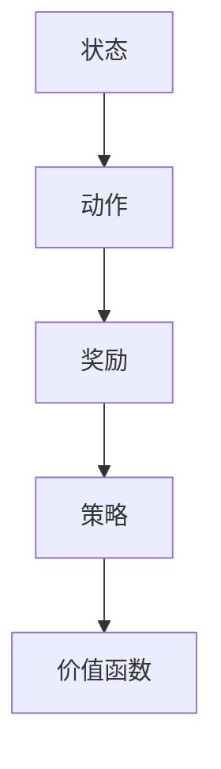
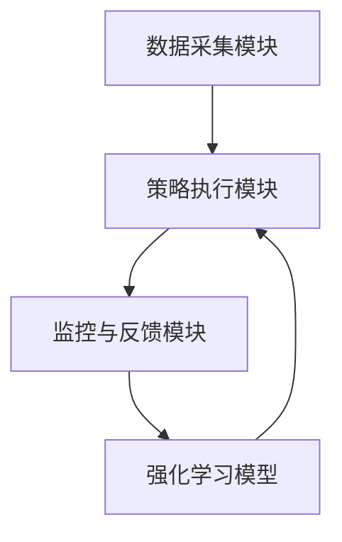

                 


# 《金融领域强化学习在多层次流动性管理中的应用》

> 关键词：强化学习，流动性管理，多层次管理，金融领域，机器学习

> 摘要：本文探讨了强化学习在金融领域流动性管理中的应用，分析了多层次流动性管理的内涵，详细讲解了强化学习的核心概念、算法原理，并通过实际案例展示了强化学习在流动性管理中的具体应用。文章还总结了强化学习在金融领域的优势和挑战，为实际应用提供了参考。

---

# 第一部分: 强化学习与流动性管理基础

---

## 第1章: 强化学习与流动性管理概述

### 1.1 强化学习的基本概念

#### 1.1.1 强化学习的定义与特点
强化学习（Reinforcement Learning，简称RL）是一种机器学习范式，通过智能体与环境的交互，学习最优策略以最大化累计奖励。其特点包括：

- **试错性**：智能体通过不断试错，逐步优化策略。
- **延迟奖励**：奖励可能在动作之后较长时间才获得。
- **动态性**：环境状态可能随智能体行为而变化。

#### 1.1.2 流动性管理的定义与目标
流动性管理是指在金融市场中，合理配置资金，确保在需要时能够快速、低成本地进行资产变现。其目标包括：

- **维持流动性**：确保资产能够在需要时迅速变现。
- **降低风险**：避免因流动性不足导致的市场冲击或损失。
- **优化成本**：平衡流动性和收益，降低资金使用成本。

#### 1.1.3 强化学习在流动性管理中的应用价值
强化学习能够通过模拟市场环境，学习最优交易策略，帮助金融机构在复杂多变的市场中做出决策。其优势在于：

- **动态适应性**：能够根据市场变化实时调整策略。
- **全局优化**：能够在复杂环境中找到最优解。
- **数据驱动**：通过大量数据学习，避免人为判断的主观性。

---

### 1.2 金融领域流动性管理的背景与挑战

#### 1.2.1 金融市场的流动性需求分析
金融市场中的流动性需求主要来自以下几个方面：

- **交易需求**：投资者为了买卖资产需要资金流动性。
- **风险对冲**：金融机构需要流动性来应对潜在的市场风险。
- **监管要求**：监管机构要求金融机构保持一定的流动性储备。

#### 1.2.2 流动性管理中的常见问题与挑战
在实际操作中，流动性管理面临以下问题：

- **市场波动性**：市场波动可能导致流动性需求突然增加。
- **信息不对称**：金融机构之间可能存在信息不对称，影响流动性分配。
- **监管压力**：监管政策的变化可能对流动性管理提出新的要求。

#### 1.2.3 强化学习在流动性管理中的优势
强化学习在处理复杂动态系统时表现出色，能够帮助金融机构解决以下问题：

- **实时决策**：快速响应市场变化，做出最优交易决策。
- **多目标优化**：在流动性与收益之间找到最佳平衡点。
- **风险管理**：通过模拟极端情况，制定应对策略。

---

### 1.3 多层次流动性管理的内涵

#### 1.3.1 多层次流动性管理的定义
多层次流动性管理是指将流动性管理划分为多个层次，每个层次负责不同的功能。常见的层次划分包括：

- **微观层**：单个交易对手或资产的流动性管理。
- **中观层**：机构或部门的流动性管理。
- **宏观层**：整个金融市场的流动性管理。

#### 1.3.2 多层次流动性管理的层次划分
层次划分的关键在于明确每个层次的职责和目标，确保各层次之间协同合作。

#### 1.3.3 多层次流动性管理的核心要素
- **流动性指标**：如流动性覆盖率（LCR）。
- **监控机制**：实时监控流动性状况。
- **应急计划**：制定应对流动性危机的预案。

---

## 第2章: 强化学习的核心概念

### 2.1 强化学习的基本原理

#### 2.1.1 状态、动作与奖励的定义
- **状态（State）**：环境当前的状况，例如市场利率、资产价格。
- **动作（Action）**：智能体采取的行为，例如买入或卖出某种资产。
- **奖励（Reward）**：智能体行为后获得的反馈，通常以数值表示。

#### 2.1.2 强化学习的基本框架
强化学习的核心是智能体与环境的交互，通过不断试错，学习最优策略。

#### 2.1.3 策略与价值函数的定义
- **策略（Policy）**：智能体选择动作的概率分布。
- **价值函数（Value Function）**：评估状态或动作-状态对的价值。

---

### 2.2 强化学习的算法分类

#### 2.2.1 基于值函数的方法
- **Q-learning**：通过学习Q值函数，找到最优动作。
- **Deep Q-Network（DQN）**：使用深度神经网络近似Q值函数。

#### 2.2.2 基于策略梯度的方法
- **策略梯度法（Policy Gradient）**：直接优化策略，通过梯度上升或下降。

#### 2.2.3 基于Actor-Critic架构的方法
- **Actor-Critic**：同时学习策略（Actor）和价值函数（Critic），相互辅助优化。

---

### 2.3 强化学习的核心概念对比

#### 2.3.1 不同强化学习算法的对比表格
| 算法类型        | 策略学习方式 | 状态空间 | 动作空间 | 优缺点                           |
|-----------------|-------------|----------|----------|--------------------------------|
| Q-learning      | 值函数      | 离散/连续 | 离散/连续 | 简单，适合离线学习               |
| DQN             | 值函数      | 连续      | 离散      | 处理高维状态，适合在线学习       |
| Policy Gradient | 策略直接优化 | 连续      | 离散      | 处理复杂策略，收敛速度快         |
| Actor-Critic    | 策略+值函数  | 连续      | 离散      | 结合两者优势，适合复杂环境       |

#### 2.3.2 实体关系图（ER图）展示强化学习核心概念的关系



---

## 第3章: 强化学习算法的数学模型与公式

### 3.1 Q-learning算法的数学模型

#### 3.1.1 Q-learning的基本公式
Q-learning通过更新Q值函数，找到最优策略：

$$ Q(s,a) = Q(s,a) + \alpha (r + \gamma \max Q(s',a') - Q(s,a)) $$

其中：
- \( Q(s,a) \)：状态\( s \)下采取动作\( a \)的Q值。
- \( \alpha \)：学习率。
- \( r \)：奖励。
- \( \gamma \)：折扣因子。
- \( s' \)：下一个状态。

#### 3.1.2 Q-learning的更新流程图

```mermaid
graph TD
A[当前状态s] --> B[选择动作a]
B --> C[执行动作a，得到状态s'和奖励r]
C --> D[更新Q(s,a)]
D --> E[结束或继续训练]
```

---

### 3.2 Deep Q-Network（DQN）算法

#### 3.2.1 DQN的数学模型
DQN使用深度神经网络近似Q值函数，网络结构通常包括输入层、隐藏层和输出层。网络通过经验回放和目标网络优化。

#### 3.2.2 DQN的代码实现示例

```python
import numpy as np
import tensorflow as tf

class DQN:
    def __init__(self, state_space, action_space, learning_rate=0.01):
        self.state_space = state_space
        self.action_space = action_space
        self.learning_rate = learning_rate
        self.model = self.build_model()
        self.target_model = self.build_model()
    
    def build_model(self):
        model = tf.keras.Sequential([
            tf.keras.layers.Dense(64, activation='relu', input_shape=(self.state_space,)),
            tf.keras.layers.Dense(64, activation='relu'),
            tf.keras.layers.Dense(self.action_space, activation='linear')
        ])
        model.compile(optimizer=tf.keras.optimizers.Adam(self.learning_rate), loss='mean_squared_error')
        return model
    
    def update_target_model(self):
        self.target_model.set_weights(self.model.get_weights())
    
    def remember(self, state, action, reward, next_state):
        # 简单实现，实际应使用经验回放池
        self.state = state
        self.action = action
        self.reward = reward
        self.next_state = next_state
    
    def act(self, state):
        return np.argmax(self.model.predict(state)[0])
    
    def replay(self, batch_size):
        # 简单实现，实际应从经验回放池中随机抽取
        for _ in range(batch_size):
            states = np.array([self.state])
            next_states = np.array([self.next_state])
            targets = self.model.predict(states)
            targets[0][self.action] = self.reward + gamma * np.max(self.target_model.predict(next_states)[0])
            self.model.fit(states, targets, epochs=1, verbose=0)
```

---

## 第4章: 系统分析与架构设计方案

### 4.1 问题场景介绍
考虑一个银行的流动性管理问题，需要实时监控账户资金，并根据市场变化调整交易策略。

---

### 4.2 系统功能设计

#### 4.2.1 系统模块划分
- **数据采集模块**：收集市场数据和账户信息。
- **策略执行模块**：根据强化学习模型生成交易指令。
- **监控与反馈模块**：实时监控流动性状况，并提供反馈。

#### 4.2.2 系统架构图



---

## 第5章: 项目实战

### 5.1 环境安装与配置
- **工具安装**：安装Python、TensorFlow、Keras等工具。
- **数据准备**：收集历史市场数据，如股票价格、交易量等。

### 5.2 核心代码实现

#### 5.2.1 强化学习模型训练代码

```python
import numpy as np
import pandas as pd
import tensorflow as tf

# 数据准备
data = pd.read_csv('market_data.csv')
states = data[['bid_price', 'ask_price', 'volume']]
actions = ['buy', 'sell', 'hold']

# 模型训练
model = DQN(state_space=len(states), action_space=len(actions))
for episode in range(1000):
    state = states[episode]
    action = model.act(state)
    next_state = states[episode+1]
    reward = calculate_reward(state, action, next_state)
    model.remember(state, action, reward, next_state)
    model.replay(10)
```

---

## 第6章: 总结与展望

### 6.1 总结
强化学习在金融领域的应用前景广阔，尤其是在流动性管理中，其动态适应性和全局优化能力能够帮助金融机构应对复杂挑战。

### 6.2 展望
未来的研究方向包括：

- 更复杂的强化学习算法，如多智能体强化学习。
- 结合其他技术，如区块链，提升系统的安全性和效率。

---

# 作者：AI天才研究院/AI Genius Institute & 禅与计算机程序设计艺术 /Zen And The Art of Computer Programming

---

**本文旨在通过详细分析强化学习在金融领域流动性管理中的应用，为实际应用提供理论和实践指导。希望读者能够通过本文，深入理解强化学习的核心概念，并将其应用到实际的金融问题中。**

