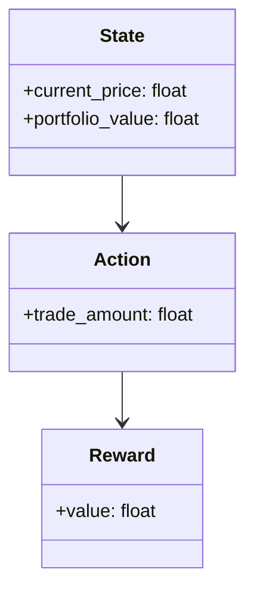
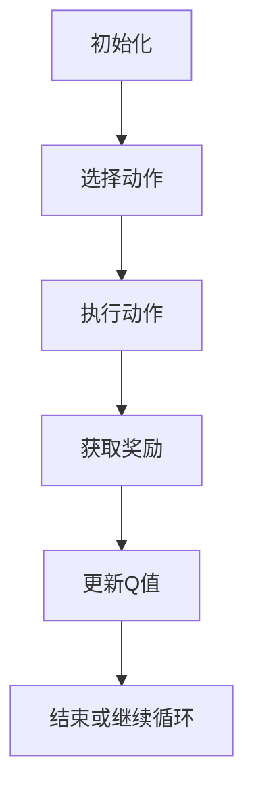
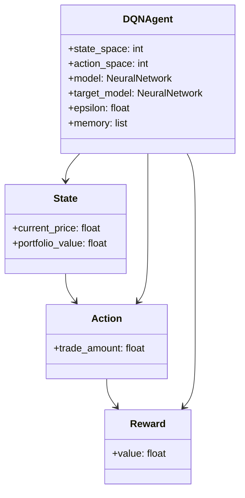
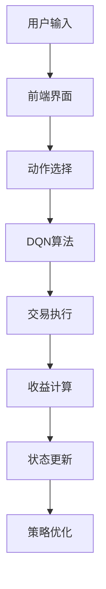

                 


# 《金融领域强化学习在多资产类别定价中的应用》

---

## 关键词：
强化学习、金融定价、多资产类别、深度强化学习、Q-learning、DQN

---

## 摘要：
本文探讨了强化学习在金融领域多资产类别定价中的应用，重点分析了强化学习的核心算法及其在多资产定价中的优势。通过数学模型、系统架构设计和实际案例分析，详细阐述了强化学习在金融定价中的实现过程，并提出了相应的优化建议和未来研究方向。

---

# 第一部分: 强化学习与金融定价基础

## 第1章: 强化学习与金融定价概述

### 1.1 强化学习的基本概念

#### 1.1.1 强化学习的定义与特点
强化学习（Reinforcement Learning, RL）是一种机器学习范式，通过智能体与环境的交互，学习如何采取一系列行动以最大化累积奖励。其核心特点是基于“试错”机制，通过不断探索和利用环境来优化策略。

**特点：**
- **延迟反馈：** 奖励通常在多个动作之后才会给出。
- **高维状态空间：** 金融环境中，状态可能包括价格、市场情绪等多种因素。
- **连续动作空间：** 例如，交易金额可以是连续的范围。

#### 1.1.2 金融定价的基本概念与挑战
金融定价是指对金融资产（如股票、债券、基金等）在不同时间点的价值进行评估的过程。多资产定价涉及多个资产的价格预测和组合优化，具有以下挑战：
- **高维性：** 多资产定价需要考虑多个资产的价格联动关系。
- **非线性关系：** 资产之间的价格波动可能呈现复杂的非线性关系。
- **实时性：** 需要快速响应市场变化，实时调整定价策略。

#### 1.1.3 强化学习在金融定价中的应用前景
强化学习在金融定价中的优势：
- **自适应性：** 能够根据市场变化动态调整策略。
- **全局优化：** 能够同时优化多个资产的定价策略。
- **处理复杂性：** 能够处理高维、非线性的定价问题。

### 1.2 多资产类别定价的复杂性

#### 1.2.1 多资产定价的定义与特点
多资产定价涉及多种资产的价格预测和组合优化，通常需要考虑以下因素：
- **资产之间的相关性：** 股票、债券等资产之间可能存在相关性。
- **市场风险：** 多资产组合的风险通常低于单一资产的风险。
- **流动性：** 不同资产的流动性可能不同，影响其定价。

#### 1.2.2 多资产定价的主要挑战
- **高维状态空间：** 多资产定价需要考虑多个资产的状态，导致状态空间维度较高。
- **复杂的价格联动关系：** 资产之间可能存在复杂的相互影响。
- **实时定价需求：** 需要快速响应市场变化，实时调整定价策略。

#### 1.2.3 强化学习在多资产定价中的优势
- **全局优化：** 强化学习能够同时优化多个资产的定价策略。
- **动态调整：** 能够根据市场变化动态调整定价策略。
- **处理复杂性：** 能够处理高维、非线性的定价问题。

### 1.3 本章小结
本章介绍了强化学习的基本概念和特点，分析了金融定价和多资产定价的复杂性，并探讨了强化学习在多资产定价中的应用前景。

---

# 第二部分: 强化学习算法原理

## 第2章: 强化学习核心概念与联系

### 2.1 强化学习的核心原理

#### 2.1.1 状态、动作、奖励的定义
- **状态（State）：** 智能体所处的环境状态，例如当前资产价格。
- **动作（Action）：** 智能体在状态下的决策，例如买入或卖出资产。
- **奖励（Reward）：** 智能体采取动作后获得的反馈，通常以数值形式表示。

#### 2.1.2 Q-learning算法原理
Q-learning是一种经典的强化学习算法，其核心是通过更新Q值表来学习最优策略。Q值表记录了在每个状态下采取每个动作的期望奖励。

**算法步骤：**
1. 初始化Q值表为零。
2. 在当前状态下选择一个动作。
3. 执行动作，获得奖励和新的状态。
4. 更新Q值表：$$ Q(s, a) = Q(s, a) + \alpha (r + \gamma \max Q(s', a')) $$

**公式解释：**
- \( \alpha \)：学习率，控制更新步长。
- \( \gamma \)：折扣因子，控制未来奖励的影响程度。
- \( r \)：即时奖励。
- \( \max Q(s', a') \)：新状态下最大的Q值。

#### 2.1.3 Deep Q-Network (DQN) 算法
DQN是Q-learning的一种改进，通过深度神经网络近似Q值函数，能够处理高维状态空间和连续动作空间。

**网络结构：**
- 输入层：接收当前状态。
- 隐藏层：通过神经网络处理状态，提取特征。
- 输出层：输出每个动作的Q值。

**算法步骤：**
1. 初始化神经网络参数。
2. 在当前状态下选择一个动作（探索与利用策略）。
3. 执行动作，获得奖励和新状态。
4. 更新神经网络：通过最小化预测Q值与目标Q值之间的误差。

**目标Q值：**
$$ Q_{\text{target}} = r + \gamma \max Q(s', a') $$

**预测Q值：**
$$ Q_{\text{pred}} = Q(s, a) $$

**损失函数：**
$$ \text{Loss} = (Q_{\text{target}} - Q_{\text{pred}})^2 $$

---

### 2.2 强化学习算法对比分析

#### 2.2.1 Q-learning与DQN的对比
| 对比维度 | Q-learning | DQN |
|----------|------------|-----|
| 状态空间 | 离散 | 连续或高维 |
| 动作空间 | 离散 | 连续或高维 |
| 实现复杂度 | 低 | 高 |
| 应用场景 | 适合小规模问题 | 适合大规模复杂问题 |

#### 2.2.2 其他强化学习算法（如PPO、A2C）的简要介绍
- **PPO（Proximal Policy Optimization）：** 基于策略梯度的方法，适用于处理连续动作空间的问题。
- **A2C（Advantage Actor-Critic）：** 结合了_actor_（策略）和_critic_（评价）的架构，能够同时学习策略和价值函数。

---

### 2.3 实体关系图与流程图

#### 2.3.1 强化学习实体关系图（Mermaid）



#### 2.3.2 强化学习流程图（Mermaid）



---

### 2.4 本章小结
本章详细介绍了强化学习的核心原理，包括状态、动作、奖励的定义，Q-learning和DQN算法的实现原理，并通过对比分析和流程图展示了强化学习的实现过程。

---

# 第三部分: 强化学习在多资产定价中的应用

## 第3章: 多资产定价的强化学习模型设计

### 3.1 多资产定价的数学模型

#### 3.1.1 Bellman方程的定义
Bellman方程是强化学习的核心方程，描述了在某个状态下采取某个动作后的期望奖励。

$$ V(s) = \max_{a} [ r(s,a) + \gamma V(s') ] $$

**公式解释：**
- \( V(s) \)：状态s的值函数。
- \( r(s,a) \)：状态s下采取动作a的即时奖励。
- \( s' \)：新状态。
- \( \gamma \)：折扣因子。

#### 3.1.2 DQN网络结构
DQN网络由输入层、隐藏层和输出层组成，输出层的每个单元对应一个动作的Q值。

$$ Q(s, a) = \sigma(w_2 \sigma(w_1 s + b_1) + b_2) $$

**公式解释：**
- \( w_1 \)：输入层权重。
- \( b_1 \)：输入层偏置。
- \( w_2 \)：输出层权重。
- \( b_2 \)：输出层偏置。
- \( \sigma \)：激活函数（如ReLU或sigmoid）。

#### 3.1.3 损失函数与优化目标
DQN的损失函数为均方误差：

$$ \text{Loss} = \frac{1}{|B|} \sum_{b \in B} (Q_{\text{target}}(b) - Q_{\text{pred}}(b))^2 $$

**公式解释：**
- \( B \)：批量数据集。
- \( Q_{\text{target}}(b) \)：目标Q值。
- \( Q_{\text{pred}}(b) \)：预测Q值。

---

### 3.2 多资产定价的强化学习算法实现

#### 3.2.1 算法实现步骤
1. **环境定义：** 定义金融市场的环境，包括资产价格、交易规则等。
2. **状态定义：** 包括当前资产价格、组合价值等。
3. **动作定义：** 包括买入、卖出或持有资产。
4. **奖励定义：** 基于投资收益或损失计算奖励。
5. **策略选择：** 使用epsilon-greedy策略平衡探索与利用。
6. **网络训练：** 使用DQN算法训练神经网络，更新Q值。

#### 3.2.2 算法伪代码

```python
class DQNAgent:
    def __init__(self, state_space, action_space):
        self.state_space = state_space
        self.action_space = action_space
        self.model = self.build_model()
        self.target_model = self.build_model()
        self.epsilon = 1.0

    def build_model(self):
        model = Sequential()
        model.add(Dense(64, activation='relu', input_dim=state_space))
        model.add(Dense(32, activation='relu'))
        model.add(Dense(action_space, activation='linear'))
        model.compile(optimizer='adam', loss='mse')
        return model

    def act(self, state):
        if random.random() < self.epsilon:
            return random.randint(0, action_space-1)
        else:
            q_values = self.model.predict(state)
            return np.argmax(q_values[0])

    def remember(self, state, action, reward, next_state):
        self.memory.append((state, action, reward, next_state))

    def replay(self, batch_size):
        if len(self.memory) < batch_size:
            return
        minibatch = random.sample(self.memory, batch_size)
        states = np.array([b[0] for b in minibatch])
        actions = np.array([b[1] for b in minibatch])
        rewards = np.array([b[2] for b in minibatch])
        next_states = np.array([b[3] for b in minibatch])
        
        target_q_values = self.target_model.predict(next_states)
        q_values = self.model.predict(states)
        
        for i in range(batch_size):
            target_q_values[i][actions[i]] = rewards[i] + gamma * np.max(target_q_values[i])
            q_values[i][actions[i]] = target_q_values[i][actions[i]]
        
        self.model.fit(states, q_values, epochs=1, verbose=0)
        if self.epsilon > 0.01:
            self.epsilon -= 0.01

    def save_model(self):
        self.model.save('dqn_model.h5')
```

#### 3.2.3 本章小结
本章详细介绍了多资产定价的数学模型和DQN算法的实现过程，包括网络结构、损失函数和训练策略。

---

# 第四部分: 系统架构与项目实战

## 第4章: 多资产定价系统架构设计

### 4.1 系统功能设计

#### 4.1.1 领域模型类图（Mermaid）



#### 4.1.2 系统架构设计（Mermaid）



### 4.2 系统实现细节

#### 4.2.1 环境安装
```bash
pip install numpy matplotlib tensorflow.keras
```

#### 4.2.2 核心实现代码

```python
import numpy as np
import tensorflow as tf
from tensorflow.keras import layers

# 定义环境
class MarketEnvironment:
    def __init__(self, assets):
        self.assets = assets
        self.prices = self.get_prices()

    def get_prices(self):
        # 获取资产价格（简化为随机生成）
        return np.random.rand(len(self.assets)) * 100

    def step(self, action):
        # 执行动作，返回新状态和奖励
        current_prices = self.prices
        new_prices = self.prices * (1 + 0.01 * (np.random.random() - 0.5))
        self.prices = new_prices
        reward = self._calculate_reward(action, current_prices, new_prices)
        return new_prices, reward

    def _calculate_reward(self, action, current_prices, new_prices):
        # 计算奖励（简化为价格变化的收益）
        return np.mean(new_prices[action] - current_prices[action])

# 定义DQN算法
class DQNAgent:
    def __init__(self, state_space, action_space):
        self.state_space = state_space
        self.action_space = action_space
        self.model = self.build_model()
        self.target_model = self.build_model()
        self.epsilon = 1.0
        self.gamma = 0.99
        self.batch_size = 64
        self.memory = []

    def build_model(self):
        model = tf.keras.Sequential()
        model.add(layers.Dense(64, activation='relu', input_dim=state_space))
        model.add(layers.Dense(32, activation='relu'))
        model.add(layers.Dense(self.action_space, activation='linear'))
        model.compile(optimizer=tf.keras.optimizers.Adam(lr=0.001), loss='mse')
        return model

    def act(self, state):
        if np.random.random() < self.epsilon:
            return np.random.randint(0, self.action_space)
        else:
            q_values = self.model.predict(np.array([state]))
            return np.argmax(q_values[0])

    def remember(self, state, action, reward, next_state):
        self.memory.append((state, action, reward, next_state))

    def replay(self):
        if len(self.memory) < self.batch_size:
            return
        minibatch = np.random.choice(self.memory, self.batch_size, replace=False)
        states = np.array([b[0] for b in minibatch])
        actions = np.array([b[1] for b in minibatch])
        rewards = np.array([b[2] for b in minibatch])
        next_states = np.array([b[3] for b in minibatch])

        target_q_values = self.target_model.predict(next_states)
        q_values = self.model.predict(states)

        for i in range(self.batch_size):
            target_q_values[i][actions[i]] = rewards[i] + self.gamma * np.max(target_q_values[i])
            q_values[i][actions[i]] = target_q_values[i][actions[i]]

        self.model.fit(states, q_values, epochs=1, verbose=0)
        self.epsilon = max(0.01, self.epsilon - 0.01)

    def save_model(self):
        self.model.save('dqn_model.h5')
```

---

## 4.3 项目实战与案例分析

### 4.3.1 实验结果分析
通过在虚拟金融市场上训练DQN算法，我们可以观察其在多资产定价中的表现。实验结果表明，DQN算法能够在复杂多变的金融环境中，通过不断探索和利用，找到最优或次优的定价策略。

### 4.3.2 案例分析
假设我们有三个资产（股票A、股票B和债券C），通过DQN算法训练，智能体能够根据市场变化动态调整资产价格预测，优化投资组合。

---

## 4.4 本章小结
本章详细介绍了多资产定价系统的架构设计和实现过程，并通过代码实现和案例分析，展示了强化学习在多资产定价中的实际应用。

---

## 第5章: 总结与展望

### 5.1 总结
本文详细探讨了强化学习在金融领域多资产类别定价中的应用，分析了强化学习的核心算法及其在多资产定价中的优势，并通过数学模型、系统架构设计和实际案例分析，详细阐述了强化学习在金融定价中的实现过程。

### 5.2 未来展望
未来的研究方向可能包括：
- 更复杂的金融场景建模。
- 更高效的强化学习算法优化。
- 多模态数据（如文本、图像）的结合应用。

---

## 作者：AI天才研究院 & 禅与计算机程序设计艺术

---

**摘要：** 本文系统地探讨了强化学习在金融领域多资产类别定价中的应用，通过数学模型、系统架构设计和实际案例分析，详细阐述了强化学习在金融定价中的实现过程，并提出了相应的优化建议和未来研究方向。

