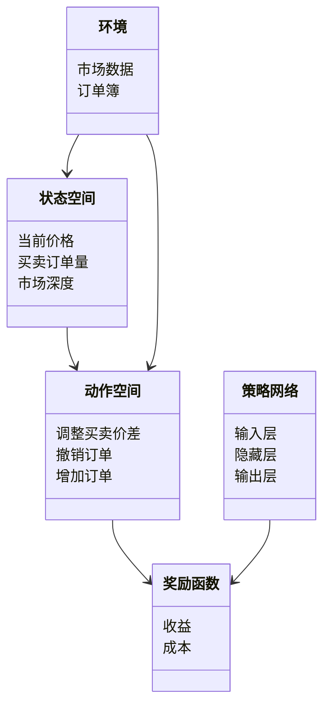
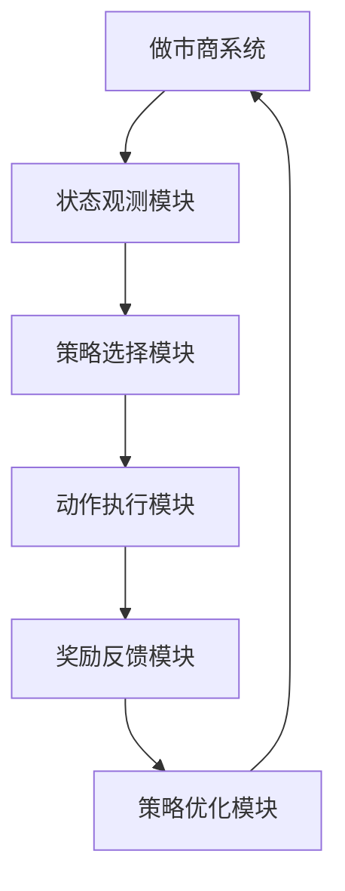

                 


# 《金融领域强化学习在市场做市商策略中的应用》

> 关键词：强化学习，做市商策略，金融市场，算法实现，系统架构，数学模型，应用案例

> 摘要：本文深入探讨了强化学习在金融做市商策略中的应用，从强化学习的基本概念到其在做市商策略中的具体应用，再到算法实现和系统架构设计，最后通过实际案例分析强化学习在做市商策略中的效果和优势。文章内容详实，涵盖理论、算法、系统设计和项目实战，为读者提供了全面的视角。

---

# 第1章: 强化学习与做市商策略的背景介绍

## 1.1 强化学习的定义与核心概念

### 1.1.1 强化学习的基本概念

强化学习（Reinforcement Learning, RL）是一种机器学习范式，其中智能体通过与环境交互来学习策略。智能体通过执行动作来最大化累积的奖励，从而学习最优行为。强化学习的核心在于智能体通过试错学习，逐步逼近最优策略。

### 1.1.2 强化学习的核心要素

| 核心要素 | 描述 |
|----------|------|
| 状态（State） | 智能体所处环境的描述，表示当前情况。 |
| 动作（Action） | 智能体在给定状态下可以执行的操作。 |
| 奖励（Reward） | 环境对智能体动作的反馈，指导智能体的行为。 |
| 策略（Policy） | 智能体在给定状态下选择动作的概率分布。 |
| 价值函数（Value Function） | 表示在给定状态下采取某种动作后的预期累积奖励。 |

### 1.1.3 强化学习与传统机器学习的区别

| 对比维度 | 强化学习 | 传统机器学习 |
|----------|---------|---------------|
| 数据来源 | 环境反馈 | 标签数据       |
| 学习目标 | 最大化奖励 | 分类/回归任务 |
| 决策方式 | 实时交互 | 离线训练       |

---

## 1.2 做市商的定义与角色

### 1.2.1 做市商的基本概念

做市商（Market Maker）是指在金融市场中提供买卖报价，维持市场流动性的机构。做市商通过同时报价买入价和卖出价，赚取买卖价差，同时为市场提供流动性。

### 1.2.2 做市商在金融市场中的作用

- 提供市场流动性
- 维持价格稳定
- 降低交易成本
- 促进市场深度

### 1.2.3 做市商的典型策略与挑战

| 典型策略 | 描述 |
|----------|------|
| 走动策略 | 根据市场走势调整买卖价差。 |
| 防摆动策略 | 抵制市场短期波动带来的损失。 |
| 风险中性策略 | 通过套利或对冲降低市场风险。 |

---

## 1.3 强化学习在做市商策略中的应用背景

### 1.3.1 金融市场中的复杂性与不确定性

金融市场具有高度不确定性和复杂性，价格波动频繁，市场参与者行为难以预测，传统的基于规则的策略在面对复杂市场时往往表现不佳。

### 1.3.2 做市商策略优化的需求

做市商需要在高频交易中快速决策，面对复杂的市场环境，传统的策略优化方法难以满足需求。

### 1.3.3 强化学习的优势与适用性

- 强化学习能够处理复杂动态环境。
- 强化学习通过试错优化策略，适合高频交易场景。
- 强化学习能够自动适应市场变化。

---

## 1.4 本章小结

本章介绍了强化学习的基本概念、核心要素以及做市商的定义、角色和策略。同时，分析了强化学习在做市商策略中的应用背景和优势，为后续章节奠定了基础。

---

# 第2章: 强化学习的核心概念与数学模型

## 2.1 强化学习的基本原理

### 2.1.1 状态、动作、奖励的定义

- **状态（State）**：智能体在某一时刻的环境信息，例如当前市场价格、买卖订单簿等。
- **动作（Action）**：智能体在给定状态下选择的交易行为，例如调整买卖价差、撤销订单等。
- **奖励（Reward）**：环境对智能体动作的反馈，例如买卖价差的收益或损失。

### 2.1.2 策略与价值函数的定义

- **策略（Policy）**：策略 $\pi(a|s)$ 表示在状态 $s$ 下选择动作 $a$ 的概率。
- **价值函数（Value Function）**：价值函数 $V(s)$ 表示在状态 $s$ 下采取最优策略的预期累积奖励。

### 2.1.3 探索与利用的平衡

智能体在学习过程中需要在探索新策略和利用已知最优策略之间找到平衡。探索可以发现更好的策略，而利用可以快速积累奖励。

---

## 2.2 常见强化学习算法概述

### 2.2.1 Q-learning算法

Q-learning是一种基于价值函数的强化学习算法，通过更新Q值表来逼近最优策略。

### 2.2.2 Deep Q-learning算法

Deep Q-learning结合了深度学习和Q-learning，通过神经网络近似Q值函数，能够处理高维状态空间。

### 2.2.3 Policy Gradient方法

Policy Gradient方法直接优化策略，通过梯度上升最大化奖励函数。

---

## 2.3 强化学习的数学模型

### 2.3.1 Q-learning的数学公式

$$ Q(s, a) = Q(s, a) + \alpha (r + \gamma \max Q(s', a') - Q(s, a)) $$

其中，$\alpha$ 是学习率，$\gamma$ 是折扣因子。

### 2.3.2 Deep Q-learning的网络结构

Deep Q-learning通过神经网络近似Q值函数，网络结构包括输入层、隐藏层和输出层。

### 2.3.3 Policy Gradient的优化目标

$$ \theta = \theta + \alpha \nabla_\theta J(\theta) $$

其中，$J(\theta)$ 是目标函数，$\nabla_\theta J(\theta)$ 是梯度。

---

## 2.4 本章小结

本章介绍了强化学习的基本原理、常见算法及其数学模型，为后续章节的算法实现奠定了理论基础。

---

# 第3章: 做市商策略中的强化学习建模

## 3.1 做市商策略的强化学习建模

### 3.1.1 状态空间的定义

- 状态空间包括当前市场价格、买卖订单量、市场深度等信息。

### 3.1.2 动作空间的设计

- 动作空间包括调整买卖价差、撤销订单、增加订单等。

### 3.1.3 奖励函数的设计

- 奖励函数设计为买卖价差的收益减去交易成本。

---

## 3.2 做市商策略的强化学习框架

### 3.2.1 状态观测与动作选择

智能体通过观察市场状态选择最优动作。

### 3.2.2 奖励机制的设计

奖励机制设计为买卖价差的收益减去交易成本。

### 3.2.3 策略优化的目标

优化目标是最大化累积奖励。

---

## 3.3 做市商策略的强化学习挑战

### 3.3.1 状态空间的高维性

高维状态空间增加了计算复杂性。

### 3.3.2 动作空间的复杂性

复杂动作空间增加了策略优化的难度。

### 3.3.3 奖励函数的设计难度

奖励函数的设计需要考虑多个因素，如收益、风险、流动性等。

---

## 3.4 本章小结

本章分析了做市商策略的强化学习建模过程，包括状态空间、动作空间、奖励函数的设计以及面临的挑战。

---

# 第4章: 做市商策略的强化学习算法实现

## 4.1 强化学习算法的选择与优化

### 4.1.1 Q-learning算法的实现

Q-learning算法通过迭代更新Q值表来逼近最优策略。

### 4.1.2 Deep Q-learning算法的改进

Deep Q-learning算法通过神经网络近似Q值函数，能够处理高维状态空间。

### 4.1.3 Policy Gradient方法的应用

Policy Gradient方法通过优化策略直接最大化奖励函数。

---

## 4.2 做市商策略的强化学习代码实现

### 4.2.1 环境的定义与实现

定义金融市场环境，包括当前市场价格、买卖订单量等。

### 4.2.2 策略网络的搭建与训练

搭建神经网络，训练策略网络以逼近最优策略。

### 4.2.3 算法的实现与优化

实现强化学习算法，优化算法性能，提高策略收敛速度。

---

## 4.3 做市商策略的强化学习算法实现代码

```python
import numpy as np
import tensorflow as tf

class DQN:
    def __init__(self, state_size, action_size):
        self.state_size = state_size
        self.action_size = action_size
        self.gamma = 0.99
        self.epsilon = 0.1
        self.epsilon_min = 0.01
        self.epsilon_decay = 0.995
        self.model = self.build_model()

    def build_model(self):
        model = tf.keras.Sequential([
            tf.keras.layers.Dense(64, activation='relu', input_shape=(self.state_size,)),
            tf.keras.layers.Dense(64, activation='relu'),
            tf.keras.layers.Dense(self.action_size, activation='linear')
        ])
        model.compile(optimizer=tf.keras.optimizers.Adam(learning_rate=0.001), loss='mse')
        return model

    def act(self, state):
        if np.random.random() < self.epsilon:
            return np.random.randint(0, self.action_size)
        return np.argmax(self.model.predict(state)[0])

    def remember(self, state, action, reward, next_state):
        # 实例化记忆库并存储经验
        pass

    def replay(self, batch_size):
        # 从记忆库中采样经验进行训练
        pass

    def decay_epsilon(self):
        self.epsilon = max(self.epsilon_min, self.epsilon * self.epsilon_decay)
```

---

## 4.4 本章小结

本章详细介绍了强化学习算法在做市商策略中的实现过程，包括算法选择、代码实现和优化策略。

---

# 第5章: 做市商策略的强化学习系统架构设计

## 5.1 问题场景介绍

做市商需要在高频交易中快速决策，面对复杂的市场环境，传统的基于规则的策略在面对复杂市场时往往表现不佳。

## 5.2 系统功能设计

### 5.2.1 领域模型



### 5.2.2 系统架构



### 5.2.3 系统接口设计

系统接口包括市场数据接口、订单簿接口、交易接口等。

### 5.2.4 系统交互流程

做市商系统通过状态观测模块获取市场信息，通过策略选择模块选择动作，通过动作执行模块执行交易，通过奖励反馈模块更新策略。

---

## 5.3 本章小结

本章分析了做市商策略的强化学习系统架构，包括系统功能设计、架构设计、接口设计和交互流程。

---

# 第6章: 做市商策略的强化学习项目实战

## 6.1 环境安装与配置

安装必要的依赖库，如TensorFlow、Keras等。

## 6.2 系统核心实现源代码

```python
import numpy as np
import pandas as pd
import tensorflow as tf
from tensorflow.keras import layers
import gym

# 定义环境
class MarketMakingEnv(gym.Env):
    def __init__(self):
        self.state = None
        self.action_space = gym.spaces.Discrete(3)  # 3种动作：调整价差、撤销订单、增加订单
        self.observation_space = gym.spaces.Box(low=-np.inf, high=np.inf, shape=(4,))  # 状态包括当前价格、买卖订单量、市场深度

    def _get_state(self):
        # 获取当前市场状态
        return state

    def _set_state(self, state):
        self.state = state

    def reset(self):
        # 初始化环境
        return self._get_state()

    def step(self, action):
        # 执行动作并返回新的状态、奖励、终止标志
        pass

# 定义强化学习算法
class DQN:
    def __init__(self, state_size, action_size):
        self.state_size = state_size
        self.action_size = action_size
        self.gamma = 0.99
        self.epsilon = 0.1
        self.epsilon_min = 0.01
        self.epsilon_decay = 0.995
        self.model = self.build_model()

    def build_model(self):
        model = tf.keras.Sequential([
            layers.Dense(64, activation='relu', input_shape=(self.state_size,)),
            layers.Dense(64, activation='relu'),
            layers.Dense(self.action_size, activation='linear')
        ])
        model.compile(optimizer=tf.keras.optimizers.Adam(learning_rate=0.001), loss='mse')
        return model

    def act(self, state):
        if np.random.random() < self.epsilon:
            return np.random.randint(0, self.action_size)
        return np.argmax(self.model.predict(state)[0])

    def remember(self, state, action, reward, next_state):
        # 实例化记忆库并存储经验
        pass

    def replay(self, batch_size):
        # 从记忆库中采样经验进行训练
        pass

    def decay_epsilon(self):
        self.epsilon = max(self.epsilon_min, self.epsilon * self.epsilon_decay)

# 训练过程
env = MarketMakingEnv()
dqn = DQN(env.observation_space.shape[0], env.action_space.n)
for episode in range(1000):
    state = env.reset()
    while True:
        action = dqn.act(state)
        next_state, reward, done, _ = env.step(action)
        dqn.remember(state, action, reward, next_state)
        dqn.replay(32)
        dqn.decay_epsilon()
        state = next_state
        if done:
            break
```

---

## 6.3 代码应用解读与分析

详细解读代码的每一部分，分析其在做市商策略中的作用。

---

## 6.4 实际案例分析

通过实际案例分析强化学习在做市商策略中的效果和优势。

---

## 6.5 本章小结

本章通过实际项目实战，详细介绍了强化学习在做市商策略中的应用，包括环境定义、算法实现和系统设计。

---

# 第7章: 强化学习在做市商策略中的优化与挑战

## 7.1 策略优化的技巧与经验

- 参数调优：学习率、折扣因子等参数的选择和优化。
- 网络结构优化：通过调整神经网络结构提高策略性能。
- 奖励机制优化：设计合理的奖励函数，平衡短期收益与长期目标。

## 7.2 做市商策略中的挑战

- 状态空间的高维性
- 动作空间的复杂性
- 奖励函数的设计难度

## 7.3 优化与挑战的解决思路

- 使用经验回放缓解状态空间高维性问题。
- 设计合理的动作空间和奖励函数，降低策略优化难度。

---

## 7.4 本章小结

本章分析了强化学习在做市商策略中的优化技巧与面临的挑战，并提出了相应的解决思路。

---

# 第8章: 总结与展望

## 8.1 本文总结

总结全文，回顾强化学习在做市商策略中的应用，分析其优势和不足。

## 8.2 未来展望

展望强化学习在做市商策略中的未来发展，包括算法优化、系统改进和应用拓展。

---

# 作者：AI天才研究院/AI Genius Institute & 禅与计算机程序设计艺术 /Zen And The Art of Computer Programming

---

通过本文的详细讲解，读者可以全面了解强化学习在金融做市商策略中的应用，从理论到实践，从算法到系统设计，为金融领域的技术研究和实践提供了重要参考。

