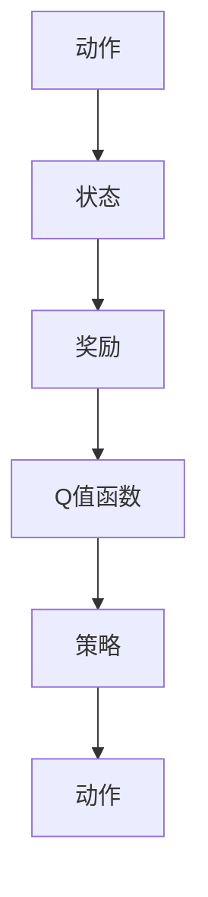
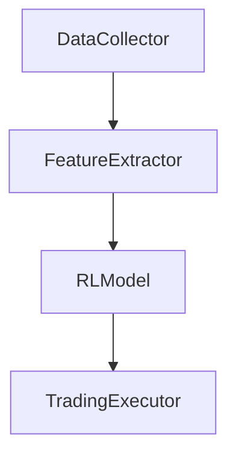

                 


# 《金融领域强化学习在最优执行策略中的应用》

---

## 关键词：
- 强化学习（Reinforcement Learning）
- 金融领域
- 最优执行策略
- 交易算法
- Q-Learning
- Deep Q-Network
- 金融数学模型

---

## 摘要：
本文深入探讨了强化学习在金融领域最优执行策略中的应用，结合理论分析和实际案例，详细介绍了强化学习的核心概念、算法原理及其在金融交易中的具体应用场景。文章从强化学习的基本原理出发，分析了其在股票交易、资产配置和风险控制中的应用优势，并通过实际案例展示了如何利用强化学习算法优化交易策略。同时，本文还探讨了当前研究中的挑战与未来发展方向，为读者提供了一个全面而深入的视角。

---

## 第1章: 强化学习与最优执行策略的背景介绍

### 1.1 强化学习的基本概念

#### 1.1.1 强化学习的定义与核心要素
强化学习是一种机器学习范式，通过智能体与环境的交互，学习最优策略以最大化累积奖励。其核心要素包括：
- **状态（State）**：智能体所处的环境信息，例如当前的市场数据。
- **动作（Action）**：智能体根据当前状态做出的决策，例如买入或卖出某只股票。
- **奖励（Reward）**：智能体执行动作后获得的反馈，通常表示该动作的优劣。
- **策略（Policy）**：智能体选择动作的概率分布，目标是通过最大化累积奖励来优化策略。
- **价值函数（Value Function）**：评估某状态下采取某种策略的期望收益。

#### 1.1.2 最优执行策略的定义与目标
最优执行策略是指在给定市场条件下，以最小化交易成本、最大化收益为目标的交易策略。其核心目标包括：
- **最小化交易成本**：包括佣金、滑点等。
- **最大化收益**：在风险可控的前提下，实现收益最大化。
- **适应市场变化**：能够动态调整策略以应对市场波动。

#### 1.1.3 强化学习在金融领域的应用背景
金融市场的复杂性和不确定性为强化学习提供了丰富的应用场景。例如：
- **高频交易**：需要在极短时间内做出决策。
- **资产配置**：需要动态调整投资组合以应对市场变化。
- **风险管理**：需要实时监控并调整头寸以控制风险。

---

### 1.2 金融领域最优执行策略的现状与挑战

#### 1.2.1 传统最优执行策略的局限性
传统最优执行策略通常基于数学模型（如均值-方差模型）进行优化，但存在以下问题：
- **静态性**：难以适应市场的动态变化。
- **计算复杂性**：在高频交易场景下计算效率不足。
- **人为因素**：依赖于交易员的主观判断，存在人为失误的风险。

#### 1.2.2 强化学习在金融最优执行中的优势
强化学习通过与环境的交互不断优化策略，具有以下优势：
- **自适应性**：能够根据市场变化动态调整策略。
- **全局优化**：通过强化学习算法，可以找到全局最优解。
- **并行性**：可以同时考虑多个交易机会，提高交易效率。

#### 1.2.3 当前研究中的主要挑战
当前研究中，强化学习在金融领域的应用仍面临以下挑战：
- **数据稀疏性**：金融市场数据通常有限，难以训练复杂的强化学习模型。
- **计算资源需求**：强化学习需要大量计算资源，尤其是在处理高频交易时。
- **模型过拟合**：容易在特定市场环境下过拟合，导致泛化能力不足。

---

### 1.3 强化学习在金融领域的核心应用领域

#### 1.3.1 股票交易与投资
强化学习可以通过分析历史股价、成交量等信息，帮助投资者制定买卖决策，实现收益最大化。

#### 1.3.2 期货与衍生品交易
在期货和衍生品交易中，强化学习可以用于套利机会识别、风险对冲等场景。

#### 1.3.3 资产配置与风险控制
通过强化学习，投资者可以动态调整资产配置比例，优化风险收益比。

---

### 1.4 本书的结构与目标

#### 1.4.1 本书的核心目标
本书旨在通过理论与实践相结合的方式，系统地介绍强化学习在金融领域最优执行策略中的应用。

#### 1.4.2 各章节内容概述
- 第2章：强化学习的核心概念与原理。
- 第3章：强化学习在金融中的具体应用场景。
- 第4章：强化学习算法的实现与优化。
- 第5章：金融最优执行策略的系统架构设计。
- 第6章：项目实战与案例分析。
- 第7章：总结与展望。

#### 1.4.3 读者对象与学习要求
本书适合金融从业者、数据科学家以及对强化学习感兴趣的读者阅读。读者需要具备一定的编程基础和金融知识。

---

## 第2章: 强化学习的核心概念与原理

### 2.1 马尔可夫决策过程（MDP）的基本原理

#### 2.1.1 状态空间的定义与特征
状态空间是指智能体所处的所有可能状态的集合。在金融场景中，状态可以是当前的市场价格、成交量等。

#### 2.1.2 动作空间的定义与特征
动作空间是指智能体可以执行的所有可能动作的集合。在股票交易中，动作可以是买入、卖出或持有。

#### 2.1.3 奖励函数的设计与优化
奖励函数是强化学习的核心，用于衡量智能体动作的好坏。在股票交易中，奖励可以定义为交易收益。

#### 2.1.4 策略与价值函数的定义
策略是指智能体在给定状态下选择动作的概率分布。价值函数是衡量某状态下采取某种策略的期望收益。

---

### 2.2 强化学习算法的分类与选择

#### 2.2.1 Q-Learning算法
Q-Learning是一种经典的强化学习算法，通过更新Q值表来学习最优策略。

#### 2.2.2 Deep Q-Learning算法
Deep Q-Learning通过使用深度神经网络近似Q值函数，能够处理高维状态空间。

#### 2.2.3 策略梯度算法（PG）
策略梯度算法通过优化策略的参数来最大化累积奖励。

#### 2.2.4 Actor-Critic算法
Actor-Critic算法结合了策略梯度和值函数的优势，能够同时优化策略和价值函数。

---

### 2.3 强化学习在金融中的具体应用场景

#### 2.3.1 交易策略优化
通过强化学习，可以优化交易策略以适应市场变化。

#### 2.3.2 风险控制与资产配置
强化学习可以帮助投资者制定风险可控的投资策略。

#### 2.3.3 市场微观结构分析
强化学习可以用于分析市场微观结构，例如订单簿分析。

---

## 第3章: 金融领域最优执行策略的核心概念与联系

### 3.1 最优执行策略的数学模型与公式

#### 3.1.1 最优执行策略的数学表达
最优执行策略可以通过强化学习算法表示为：

$$
\pi^* = \arg\max_{\pi} \mathbb{E}[R(\pi)]
$$

其中，$\pi$是策略，$R(\pi)$是累积奖励。

#### 3.1.2 强化学习在最优执行中的数学模型
强化学习模型可以表示为马尔可夫决策过程：

$$
MDP = (S, A, R, P)
$$

其中，$S$是状态空间，$A$是动作空间，$R$是奖励函数，$P$是转移概率矩阵。

---

### 3.2 强化学习与最优执行策略的ER实体关系图



---

### 3.3 强化学习在金融最优执行中的数学模型

#### 3.3.1 Q-Learning算法的数学模型
Q-Learning算法的更新公式为：

$$
Q(s, a) \leftarrow Q(s, a) + \alpha [r + \gamma \max Q(s', a')]
$$

其中，$\alpha$是学习率，$\gamma$是折扣因子。

---

## 第4章: 强化学习算法的实现与优化

### 4.1 Deep Q-Learning算法的实现

#### 4.1.1 神经网络结构设计
使用深度神经网络近似Q值函数，网络结构通常包括输入层、隐藏层和输出层。

#### 4.1.2 网络训练与优化
使用梯度下降算法（如Adam）优化神经网络参数。

#### 4.1.3 算法实现代码
```python
import numpy as np
import tensorflow as tf

class DQN:
    def __init__(self, state_space, action_space):
        self.state_space = state_space
        self.action_space = action_space
        self.model = self.build_model()
    
    def build_model(self):
        model = tf.keras.Sequential([
            tf.keras.layers.Dense(64, activation='relu', input_dim=self.state_space),
            tf.keras.layers.Dense(32, activation='relu'),
            tf.keras.layers.Dense(self.action_space, activation='linear')
        ])
        return model
```

---

### 4.2 Actor-Critic算法的实现

#### 4.2.1 算法原理
Actor-Critic算法同时优化策略和价值函数，通过策略网络和价值网络的协同工作实现优化。

#### 4.2.2 算法实现代码
```python
import numpy as np
import tensorflow as tf

class ActorCritic:
    def __init__(self, state_space, action_space):
        self.state_space = state_space
        self.action_space = action_space
        self.actor = self.build_actor()
        self.critic = self.build_critic()
    
    def build_actor(self):
        model = tf.keras.Sequential([
            tf.keras.layers.Dense(64, activation='relu', input_dim=self.state_space),
            tf.keras.layers.Dense(self.action_space, activation='softmax')
        ])
        return model
    
    def build_critic(self):
        model = tf.keras.Sequential([
            tf.keras.layers.Dense(64, activation='relu', input_dim=self.state_space),
            tf.keras.layers.Dense(1, activation='linear')
        ])
        return model
```

---

## 第5章: 金融最优执行策略的系统架构设计

### 5.1 系统功能设计

#### 5.1.1 数据采集模块
负责采集实时市场数据，包括价格、成交量等。

#### 5.1.2 特征提取模块
将原始数据转化为强化学习算法所需的特征向量。

#### 5.1.3 策略执行模块
根据强化学习模型的输出，执行具体的交易动作。

---

### 5.2 系统架构设计



---

## 第6章: 项目实战与案例分析

### 6.1 环境安装与配置

#### 6.1.1 环境搭建
安装必要的Python库，如TensorFlow、Keras等。

#### 6.1.2 数据准备
准备金融市场的历史数据，例如股票价格数据。

---

### 6.2 系统核心实现

#### 6.2.1 强化学习模型训练
使用训练数据训练强化学习模型。

#### 6.2.2 交易策略实现
根据训练好的模型，实现具体的交易策略。

---

### 6.3 案例分析

#### 6.3.1 实验结果与分析
展示强化学习模型在实际交易中的表现。

#### 6.3.2 模型优化与调参
根据实验结果，优化模型参数以提高交易收益。

---

## 第7章: 总结与展望

### 7.1 本书的核心内容总结
强化学习在金融领域最优执行策略中的应用具有广阔前景，但仍需解决数据稀疏性、计算资源需求等挑战。

### 7.2 未来研究方向
- 更高效的学习算法。
- 更精准的金融数据建模。
- 多模态数据的应用。

### 7.3 最佳实践与注意事项
- 在实际应用中，需结合市场实际情况进行策略调整。
- 加强对市场数据的理解，提高模型的鲁棒性。

---

## 作者：
AI天才研究院/AI Genius Institute & 禅与计算机程序设计艺术/Zen And The Art of Computer Programming

