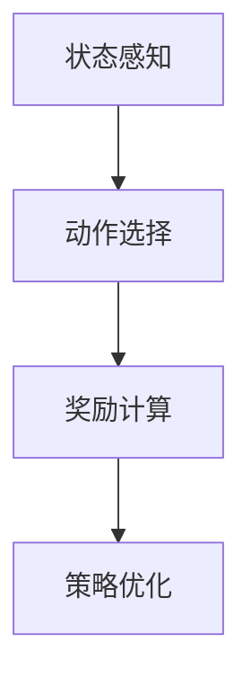

                 


```markdown
# 《金融领域强化学习在最优执行策略动态调整中的应用》

> 关键词：强化学习，最优执行策略，动态调整，金融交易，Q-learning，策略梯度

> 摘要：本文系统地探讨了强化学习在金融领域最优执行策略动态调整中的应用。首先，介绍了强化学习的基本概念和核心原理，分析了金融领域最优执行策略的动态调整需求。其次，详细讲解了强化学习在金融交易中的数学模型与算法实现，包括马尔可夫决策过程、Q-learning和策略梯度方法。然后，结合实际应用场景，分析了强化学习在动态调整最优执行策略中的优势与挑战。最后，通过项目实战和系统架构设计，展示了强化学习在金融交易系统中的具体实现与应用效果。

---

## 第1章: 强化学习的基本概念与应用背景

### 1.1 强化学习的定义与核心原理

#### 1.1.1 强化学习的基本概念
强化学习（Reinforcement Learning，RL）是一种机器学习范式，通过智能体与环境的交互，学习如何做出决策以最大化累积奖励。与监督学习和无监督学习不同，强化学习强调实时决策的优化，通过试错和经验积累来改进策略。

#### 1.1.2 强化学习的核心原理
强化学习的核心是“智能体-环境”交互系统。智能体通过感知环境状态，选择动作，并根据环境的反馈（奖励或惩罚）来调整策略。具体来说，强化学习系统包括以下四个核心要素：
- **状态（State）**：环境当前的状况，表示智能体所处的环境信息。
- **动作（Action）**：智能体在给定状态下做出的选择。
- **奖励（Reward）**：智能体在做出动作后，环境给予的反馈，用于评价动作的好坏。
- **策略（Policy）**：智能体选择动作的概率分布，描述了在给定状态下选择动作的概率。

强化学习的目标是通过不断试错，找到最优策略，使得累积奖励最大化。

#### 1.1.3 强化学习与传统机器学习的区别
与监督学习和无监督学习相比，强化学习的独特之处在于：
- **实时性**：强化学习通过实时交互获得反馈，而监督学习依赖于标记数据，无监督学习依赖于数据分布。
- **动态性**：强化学习适用于动态环境，能够实时调整策略，而监督学习和无监督学习通常处理静态数据。

### 1.2 金融领域中的最优执行策略

#### 1.2.1 金融最优执行策略的定义
最优执行策略是指在金融交易中，以最小的交易成本和风险，执行大规模资产交易的策略。最优执行策略的核心目标是在保证交易效率的同时，最小化交易成本和市场冲击。

#### 1.2.2 最优执行策略在金融交易中的重要性
在现代金融市场中，最优执行策略是高频交易、算法交易和机构投资的核心技术。通过优化订单执行的时机和规模，可以显著降低交易成本，提高投资收益。

#### 1.2.3 动态调整最优执行策略的必要性
金融市场的环境复杂多变，价格波动、市场深度和流动性等因素都在不断变化。传统的静态执行策略难以适应市场环境的变化，因此动态调整最优执行策略成为必要。

### 1.3 强化学习在金融领域的应用背景

#### 1.3.1 金融领域中的复杂决策问题
金融市场的决策问题具有高度的不确定性和复杂性。例如，高频交易需要在毫秒级别做出决策，且市场环境瞬息万变。传统的统计方法和机器学习算法难以有效应对这些复杂问题。

#### 1.3.2 强化学习在最优执行策略中的优势
强化学习能够通过实时交互和动态调整策略，适应市场的复杂性和不确定性。与传统算法相比，强化学习在动态环境下具有更强的适应性和优化能力。

#### 1.3.3 当前研究的现状与挑战
当前，强化学习在金融领域的研究主要集中在算法交易、风险管理等领域。然而，如何在实际金融市场中实现高效的强化学习算法，仍面临诸多挑战，例如计算复杂度和市场环境的不可预测性。

---

## 第2章: 强化学习的核心概念与数学模型

### 2.1 马尔可夫决策过程（MDP）

#### 2.1.1 状态空间的定义
在强化学习中，状态空间（State Space）描述了环境的所有可能状态。在金融交易中，状态可以是市场深度、价格波动、订单簿信息等。

#### 2.1.2 动作空间的定义
动作空间（Action Space）是智能体在给定状态下可以执行的所有动作。在金融交易中，动作可以是“买入”、“卖出”或“持有”等。

#### 2.1.3 奖励函数的设计
奖励函数（Reward Function）是强化学习系统的核心组成部分，用于评价智能体动作的优劣。在金融交易中，奖励函数通常与交易收益、交易成本和市场冲击相关。

#### 2.1.4 策略与值函数的定义
策略（Policy）描述了智能体在给定状态下选择动作的概率分布。值函数（Value Function）用于评估某个状态下采取某种策略的期望收益。

### 2.2 Q-learning算法

#### 2.2.1 Q-learning的基本原理
Q-learning是一种经典的强化学习算法，通过维护一个Q值表（Q-table）来记录状态-动作对的期望奖励。Q值的更新公式为：
$$ Q(s, a) = Q(s, a) + \alpha [r + \gamma \max Q(s', a') - Q(s, a)] $$
其中，$\alpha$是学习率，$\gamma$是折扣因子，$r$是即时奖励，$s'$是下一状态。

#### 2.2.2 Q-learning的更新公式
Q-learning的更新公式展示了如何通过即时奖励和未来奖励的折扣值来更新Q值。该算法适用于离散状态和动作空间。

#### 2.2.3 Q-learning在金融中的应用
在金融交易中，Q-learning可以用于优化订单执行策略。通过不断更新Q值，智能体可以找到最优的买卖时机和规模。

### 2.3 策略梯度方法

#### 2.3.1 策略梯度的基本概念
策略梯度（Policy Gradient）方法通过优化策略的参数，直接最大化累积奖励。策略梯度方法适用于连续动作空间，能够实现更复杂的决策过程。

#### 2.3.2 策略梯度的优化算法
策略梯度的优化算法通常采用随机梯度下降（SGD）或Adam优化器。策略梯度的梯度计算公式为：
$$ \nabla \theta = \frac{\partial}{\partial \theta} \mathbb{E}[R] $$

#### 2.3.3 策略梯度在金融中的应用
在金融领域，策略梯度方法可以用于优化投资组合和风险管理策略。通过动态调整投资组合，策略梯度能够在复杂市场环境中实现最优收益。

---

## 第3章: 强化学习在最优执行策略中的应用

### 3.1 动态调整最优执行策略的必要性

#### 3.1.1 市场环境的动态变化
金融市场的价格和流动性等关键因素时刻都在变化。传统的静态执行策略难以应对这些变化，因此动态调整策略成为必要。

#### 3.1.2 交易成本的最小化
动态调整最优执行策略可以显著降低交易成本，包括显性成本（如佣金）和隐性成本（如市场冲击）。

#### 3.1.3 风险控制的重要性
动态调整策略能够及时应对市场风险，避免重大损失。例如，在市场剧烈波动时，智能体可以动态调整订单规模和时机。

### 3.2 强化学习在动态调整中的优势

#### 3.2.1 自适应性
强化学习能够根据市场环境的变化，实时调整策略，实现自适应交易。

#### 3.2.2 实时性
强化学习能够在毫秒级别做出决策，适应高频交易的需要。

#### 3.2.3 高效性
通过不断试错和优化，强化学习能够在较短时间内找到最优策略。

### 3.3 实际应用场景分析

#### 3.3.1 股票交易中的动态调整
在股票交易中，强化学习可以通过动态调整买卖时机和规模，优化交易收益。

#### 3.3.2 债券交易中的动态调整
在债券交易中，强化学习可以动态调整订单规模和价格，降低交易成本。

#### 3.3.3 多资产配置中的动态调整
在多资产配置中，强化学习能够根据市场变化，动态调整资产比例，优化投资组合。

---

## 第4章: 强化学习算法的数学模型与公式

### 4.1 Q-learning算法的数学模型

#### 4.1.1 Q值更新公式
Q-learning的更新公式为：
$$ Q(s, a) = Q(s, a) + \alpha [r + \gamma \max Q(s', a') - Q(s, a)] $$

#### 4.1.2 状态转移与奖励函数
状态转移矩阵和奖励函数是Q-learning的核心。通过状态转移矩阵，可以描述从当前状态到下一状态的概率分布。

#### 4.1.3 Q值表的更新流程
Q值表的更新流程包括以下步骤：
1. 状态感知
2. 动作选择
3. 奖励获得
4. Q值更新

### 4.2 策略梯度方法的数学模型

#### 4.2.1 策略梯度的梯度计算公式
策略梯度的梯度计算公式为：
$$ \nabla \theta = \frac{\partial}{\partial \theta} \mathbb{E}[R] $$

#### 4.2.2 策略优化的数学表达
策略优化的目标是最优化累积奖励，即：
$$ \max_{\theta} \mathbb{E}[R] $$

#### 4.2.3 策略梯度算法的收敛性分析
策略梯度算法在适当的条件下能够收敛到最优策略，其收敛速度与学习率和折扣因子有关。

---

## 第5章: 强化学习在金融交易中的系统分析与架构设计

### 5.1 系统功能设计

#### 5.1.1 系统功能模块
金融交易系统通常包括以下功能模块：
- 状态感知模块
- 动作选择模块
- 奖励计算模块
- 策略优化模块

#### 5.1.2 系统功能流程
系统的功能流程包括以下步骤：
1. 状态感知
2. 动作选择
3. 奖励计算
4. 策略优化

### 5.2 系统架构设计

#### 5.2.1 系统架构图
系统架构图如下：


#### 5.2.2 系统交互流程
系统交互流程如下：
1. 智能体感知市场状态
2. 智能体选择动作
3. 环境反馈奖励
4. 智能体优化策略

---

## 第6章: 强化学习在金融交易中的项目实战

### 6.1 环境安装与配置

#### 6.1.1 环境要求
需要安装以下环境：
- Python 3.8及以上
- TensorFlow 2.0及以上
- gym库
- pandas库

#### 6.1.2 环境配置
在终端中运行以下命令：
```bash
pip install numpy
pip install gym
pip install tensorflow
pip install pandas
```

### 6.2 系统核心实现

#### 6.2.1 Q-learning算法实现
```python
import numpy as np
import gym

class QLAgent:
    def __init__(self, env):
        self.env = env
        self.Q = np.zeros((env.observation_space.n, env.action_space.n))
        self.alpha = 0.1
        self.gamma = 0.9

    def choose_action(self, state):
        return np.argmax(self.Q[state, :])

    def update_Q(self, state, action, reward, next_state):
        self.Q[state, action] += self.alpha * (reward + self.gamma * np.max(self.Q[next_state, :]) - self.Q[state, action])

# 初始化环境
env = gym.make('FiniteStateMachine-v0')
agent = QLAgent(env)

# 训练过程
for episode in range(1000):
    state = env.reset()
    done = False
    while not done:
        action = agent.choose_action(state)
        next_state, reward, done, info = env.step(action)
        agent.update_Q(state, action, reward, next_state)
        state = next_state
```

#### 6.2.2 策略梯度算法实现
```python
import tensorflow as tf
import gym

class PolicyGradientAgent:
    def __init__(self, env):
        self.env = env
        self.state_space = env.observation_space.n
        self.action_space = env.action_space.n
        self.theta = tf.Variable(tf.random.uniform([self.state_space, self.action_space], minval=-1, maxval=1))

    def policy(self, state):
        with tf.GradientTape() as tape:
            logits = tf.nn.softmax(tf.matmul(state, self.theta))
            action = tf.multinomial(logits, 1)
        return action

    def update_policy(self, state, action, reward):
        with tf.GradientTape() as tape:
            logits = tf.nn.softmax(tf.matmul(state, self.theta))
            action_prob = tf.gather(logits, action, axis=1)
            loss = -tf.reduce_sum(reward * tf.log(action_prob))
            gradients = tape.gradient(loss, self.theta)
            self.theta.assign_sub(self.learning_rate * gradients)

# 初始化环境
env = gym.make('FiniteStateMachine-v0')
agent = PolicyGradientAgent(env)

# 训练过程
for episode in range(1000):
    state = env.reset()
    done = False
    while not done:
        action = agent.choose_action(state)
        next_state, reward, done, info = env.step(action)
        agent.update_policy(state, action, reward)
        state = next_state
```

### 6.3 案例分析与效果评估

#### 6.3.1 Q-learning算法的交易策略
通过Q-learning算法，可以在股票交易中实现动态调整买卖时机和规模，优化交易收益。

#### 6.3.2 策略梯度算法的投资组合优化
通过策略梯度算法，可以在多资产配置中动态调整资产比例，优化投资组合的收益与风险比。

### 6.4 项目总结
强化学习在金融交易中的应用具有巨大潜力，但实际应用中仍面临诸多挑战。未来的研究方向包括算法优化、模型解释性和风险管理等。

---

## 第7章: 总结与展望

### 7.1 总结
本文系统地探讨了强化学习在金融领域最优执行策略动态调整中的应用。通过理论分析和实践案例，展示了强化学习在金融交易中的优势和潜力。

### 7.2 展望
未来的研究方向包括：
- **算法优化**：进一步提高强化学习算法的效率和稳定性。
- **模型解释性**：增强强化学习模型的可解释性，便于实际应用。
- **风险管理**：结合强化学习与风险管理技术，提高金融交易的稳定性。

---

## 作者信息

作者：AI天才研究院/AI Genius Institute & 禅与计算机程序设计艺术 /Zen And The Art of Computer Programming

---

**注意：以上文章内容为示例，实际撰写时需要根据具体需求进行调整和扩展，确保内容的完整性和深度。**
```

