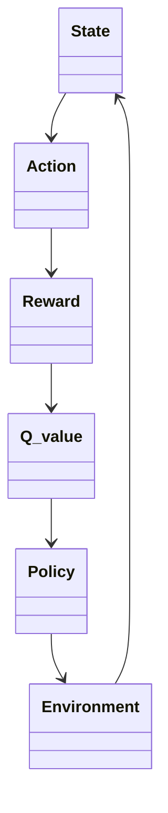
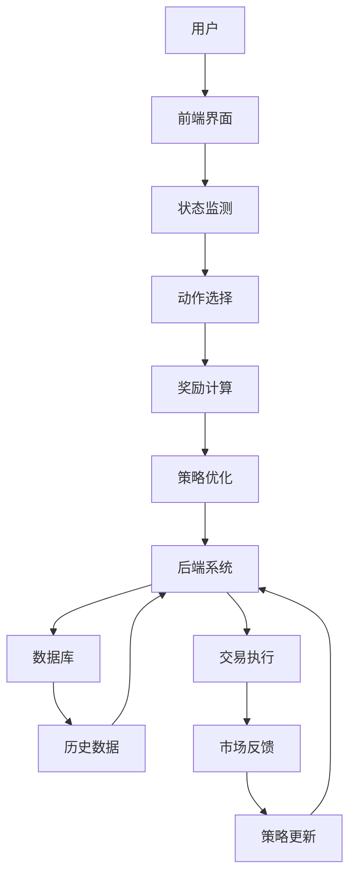

                 


# 《金融领域强化学习在流动性管理中的应用》

## 关键词：强化学习、流动性管理、金融应用、马尔可夫决策过程、Q-learning、Deep Q-learning

## 摘要：本文探讨了强化学习在金融流动性管理中的应用，详细分析了强化学习的基本原理、流动性管理的核心问题以及如何通过强化学习算法解决这些问题。文章结合实际案例，介绍了强化学习在流动性管理中的数学模型、系统架构设计和项目实现，最后总结了当前的研究成果和未来的发展方向。

---

# 第一部分: 强化学习与流动性管理概述

## 第1章: 强化学习与流动性管理的背景与概述

### 1.1 强化学习的基本概念

#### 1.1.1 强化学习的定义与特点

强化学习（Reinforcement Learning，RL）是一种机器学习范式，其中智能体通过与环境交互来学习策略，以最大化累积奖励。其特点包括：

- **试错性**：智能体通过不断尝试动作，逐步逼近最优策略。
- **延迟奖励**：奖励可能在动作之后延迟出现，要求智能体具备长期规划能力。
- **动态环境**：环境状态可能随时间变化，智能体需适应动态变化。

#### 1.1.2 强化学习的核心要素

- **状态（State）**：智能体所处的环境信息，例如当前的市场情况。
- **动作（Action）**：智能体在特定状态下采取的行为，例如买入或卖出某种资产。
- **奖励（Reward）**：智能体采取动作后获得的反馈，通常表示该动作的好坏。
- **策略（Policy）**：智能体选择动作的规则，可以是随机的或基于价值函数的。

### 1.2 流动性管理的定义与重要性

#### 1.2.1 流动性管理的定义

流动性管理是指在金融市场上，金融机构通过调整资产配置、交易策略等手段，确保在需要时能够以合理价格迅速变现资产，满足资金需求。流动性管理的核心目标是平衡风险与收益，在保持资产流动性的前提下，实现收益最大化。

#### 1.2.2 流动性管理在金融领域中的作用

- **风险控制**：通过合理配置流动性资产，降低市场波动带来的风险。
- **优化收益**：在保证流动性的基础上，通过投资高收益资产提高整体收益。
- **合规要求**：许多金融监管机构要求金融机构保持一定的流动性覆盖率，以确保其在紧急情况下的偿付能力。

### 1.3 强化学习在流动性管理中的应用背景

#### 1.3.1 传统流动性管理的局限性

传统流动性管理方法依赖于历史数据分析和人工经验，存在以下问题：

- **主观性**：依赖于经验丰富的管理人员的判断，主观性强，难以量化。
- **动态适应性差**：面对市场环境的快速变化，传统方法难以及时调整策略。
- **计算复杂度高**：在处理多变量、非线性关系时，传统方法往往效率低下。

#### 1.3.2 强化学习在流动性管理中的优势

- **数据驱动**：强化学习通过大量数据训练，能够捕捉复杂的市场规律。
- **动态适应性**：强化学习模型能够实时根据市场变化调整策略，具备良好的适应性。
- **自动化决策**：通过训练得到的策略可以自动执行，减少人为干预，提高效率。

### 1.4 本书的核心内容与目标

#### 1.4.1 本书的核心目标

本文旨在探讨强化学习在金融流动性管理中的应用，分析其优势和挑战，提供一套基于强化学习的流动性管理解决方案。

#### 1.4.2 本书的结构安排

- 第一部分：强化学习与流动性管理的背景与概述。
- 第二部分：强化学习的核心概念与数学模型。
- 第三部分：流动性管理中的强化学习应用。
- 第四部分：系统分析与架构设计。
- 第五部分：项目实战与总结展望。

---

# 第二部分: 强化学习的核心概念与数学模型

## 第2章: 强化学习的基本原理

### 2.1 马尔可夫决策过程（MDP）

#### 2.1.1 状态空间的定义

状态空间是智能体可能遇到的所有状态的集合。在流动性管理中，状态可以包括当前市场利率、资产持有量、市场波动性等。

#### 2.1.2 动作空间的定义

动作空间是智能体在每个状态下可以采取的所有动作的集合。在流动性管理中，动作可能包括买入某种资产、卖出某种资产、调整资产配置等。

#### 2.1.3 奖励函数的定义

奖励函数定义了智能体在每个状态下采取某个动作后获得的奖励。在流动性管理中，奖励可以是资产收益、流动性覆盖率、风险指标等。

### 2.2 强化学习的核心算法

#### 2.2.1 Q-learning算法

Q-learning是一种经典的强化学习算法，通过更新Q值表来学习最优策略。其更新公式如下：

$$ Q(s, a) = Q(s, a) + \alpha (r + \gamma \max_{a'} Q(s', a') - Q(s, a)) $$

其中：
- \( \alpha \) 是学习率。
- \( \gamma \) 是折扣因子。
- \( r \) 是奖励。
- \( s \) 是当前状态。
- \( a \) 是当前动作。
- \( s' \) 是下一个状态。

#### 2.2.2 Deep Q-learning算法

Deep Q-learning将Q值函数表示为深度神经网络，可以处理高维状态空间和动作空间。其网络结构通常包括输入层、隐藏层和输出层。

#### 2.2.3 Actor-Critic算法

Actor-Critic算法通过同时学习策略（Actor）和价值函数（Critic）来优化策略。其损失函数如下：

$$ L = J(\theta) = \frac{1}{2} (r - V(s))^2 + \alpha \text{entropy}(a) $$

其中：
- \( V(s) \) 是价值函数。
- \( \text{entropy}(a) \) 是策略的熵，用于鼓励探索。

### 2.3 强化学习的数学模型

#### 2.3.1 Q-learning的数学模型

Q-learning通过更新Q值表来逼近最优策略。其数学模型如下：

$$ Q(s, a) = Q(s, a) + \alpha (r + \gamma \max Q(s', a') - Q(s, a)) $$

#### 2.3.2 Actor-Critic算法的数学模型

Actor-Critic算法通过同时更新策略和价值函数来优化策略。其数学模型如下：

$$ L = \frac{1}{2} (r - V(s))^2 + \alpha \text{entropy}(a) $$

---

# 第三部分: 流动性管理中的强化学习应用

## 第3章: 流动性管理的强化学习建模

### 3.1 流动性管理的强化学习建模框架

#### 3.1.1 状态空间的设计

在流动性管理中，状态空间可以包括：

- 市场利率
- 资产持有量
- 市场波动性
- 资金需求

#### 3.1.2 动作空间的设计

在流动性管理中，动作空间可以包括：

- 买入某种资产
- 卖出某种资产
- 调整资产配置

#### 3.1.3 奖励函数的设计

在流动性管理中，奖励函数可以设计为：

- 资产收益
- 流动性覆盖率
- 风险指标

### 3.2 流动性管理的强化学习模型

#### 3.2.1 基于Q-learning的流动性管理模型

Q-learning通过不断更新Q值表，学习最优策略。在流动性管理中，可以将市场状态和交易动作作为输入，输出最优动作。

#### 3.2.2 基于Deep Q-learning的流动性管理模型

Deep Q-learning通过深度神经网络表示Q值函数，能够处理高维状态空间和动作空间。

#### 3.2.3 基于Actor-Critic的流动性管理模型

Actor-Critic通过同时学习策略和价值函数，优化流动性管理策略。其网络结构通常包括两个部分：策略网络和价值网络。

---

# 第四部分: 系统分析与架构设计

## 第4章: 流动性管理系统的系统分析

### 4.1 系统需求分析

#### 4.1.1 功能需求

- 状态监测
- 动作选择
- 奖励计算
- 策略优化

#### 4.1.2 性能需求

- 响应时间
- 稳定性
- 可扩展性

#### 4.1.3 用户需求

- 管理员
- 交易员
- 数据分析师

### 4.2 系统架构设计

#### 4.2.1 领域模型设计（Mermaid类图）



#### 4.2.2 系统架构图（Mermaid架构图）



---

# 第五部分: 项目实战与总结展望

## 第5章: 项目实战

### 5.1 环境安装

- 安装Python
- 安装TensorFlow或PyTorch
- 安装相关库（如numpy、pandas、matplotlib）

### 5.2 系统核心实现源代码

```python
import numpy as np
import tensorflow as tf
from tensorflow.keras import layers

# 定义Q网络
class QNetwork:
    def __init__(self, state_size, action_size):
        self.model = self.build_model(state_size, action_size)
    
    def build_model(self, state_size, action_size):
        model = tf.keras.Sequential([
            layers.Dense(64, activation='relu', input_dim=state_size),
            layers.Dense(64, activation='relu'),
            layers.Dense(action_size, activation='linear')
        ])
        return model

# 定义强化学习算法
class DQN:
    def __init__(self, state_size, action_size, gamma=0.99, epsilon=0.1):
        self.gamma = gamma
        self.epsilon = epsilon
        self.memory = []
        self.q_network = QNetwork(state_size, action_size)
        self.target_network = QNetwork(state_size, action_size)
    
    def remember(self, state, action, reward, next_state):
        self.memory.append((state, action, reward, next_state))
    
    def act(self, state):
        if np.random.random() < self.epsilon:
            return np.random.randint(0, self.action_size)
        q_values = self.q_network.model.predict(state)
        return np.argmax(q_values[0])
    
    def replay(self, batch_size):
        if len(self.memory) < batch_size:
            return
        minibatch = np.random.choice(self.memory, batch_size)
        states = np.array([m[0] for m in minibatch])
        actions = np.array([m[1] for m in minibatch])
        rewards = np.array([m[2] for m in minibatch])
        next_states = np.array([m[3] for m in minibatch])
        
        q_targets = self.q_network.model.predict(states)
        q_next = self.target_network.model.predict(next_states)
        q_targets[range(batch_size), actions] = rewards + self.gamma * np.max(q_next, axis=1)
        
        self.q_network.model.fit(states, q_targets, epochs=1, verbose=0)
        
    def update_target_network(self):
        self.target_network.model.set_weights(self.q_network.model.get_weights())
```

### 5.3 代码应用解读与分析

- **Q网络**：用于估计Q值，输入是状态，输出是动作值。
- **DQN算法**：包括记忆库、动作选择、回放和目标网络更新。
- **训练过程**：通过不断与环境交互，更新Q网络参数，逼近最优策略。

### 5.4 实际案例分析

假设我们有一个简单的流动性管理场景，市场利率在0到1之间变化，资产持有量在0到100之间变化。智能体的目标是在保证流动性的前提下，最大化资产收益。

### 5.5 项目小结

通过DQN算法，我们能够训练出一个能够在复杂金融环境中进行有效流动性管理的智能体。该智能体能够根据市场变化，自动调整资产配置，实现收益与流动性的平衡。

---

# 第六部分: 总结与展望

## 第6章: 总结与展望

### 6.1 总结

本文探讨了强化学习在金融流动性管理中的应用，分析了其优势和挑战，提供了一套基于强化学习的流动性管理解决方案。通过实际案例分析，验证了强化学习在流动性管理中的有效性。

### 6.2 未来研究方向

- **多智能体强化学习**：在复杂金融环境中，可能需要多个智能体协同工作。
- **复杂状态空间处理**：探索更高效的算法，处理高维状态空间。
- **实时性优化**：提升算法的计算效率，满足实时交易需求。

---

# 作者：AI天才研究院/AI Genius Institute & 禅与计算机程序设计艺术 /Zen And The Art of Computer Programming

---

感谢您的阅读！希望本文能为您提供有价值的信息和启发。如需进一步探讨或获取更多资料，请随时联系作者。

