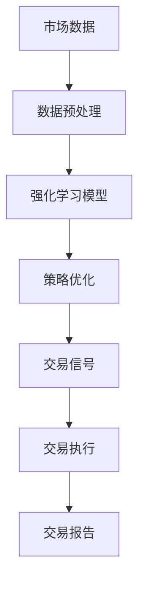
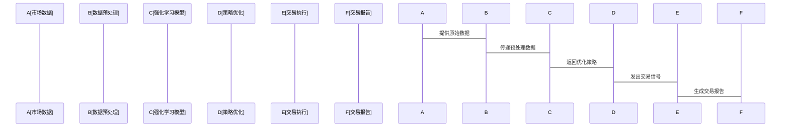

                 


# 金融领域强化学习在算法交易中的应用

> 关键词：强化学习、算法交易、金融、机器学习、智能投资、交易策略

> 摘要：  
本文深入探讨了强化学习在金融算法交易中的应用，从强化学习的基本概念、算法原理到实际应用，结合数学模型和系统架构设计，详细分析了强化学习如何在金融交易中优化策略、降低风险并提高收益。通过具体案例和代码实现，展示了强化学习在算法交易中的实际应用和未来发展方向。

---

# 第1章 强化学习与算法交易的背景介绍

## 1.1 强化学习的基本概念  
### 1.1.1 强化学习的定义  
强化学习是一种机器学习范式，通过智能体在环境中采取动作，以最大化累积奖励。与监督学习不同，强化学习不需要明确的标签，而是通过试错和奖励机制来学习最优策略。

### 1.1.2 强化学习的核心要素  
- **状态 (State)**：环境中的当前情况，例如股票价格、市场波动率等。  
- **动作 (Action)**：智能体在状态下的决策，例如买入、卖出或持有。  
- **奖励 (Reward)**：智能体采取动作后获得的反馈，用于指导学习。  
- **策略 (Policy)**：决定动作选择的规则，最大化累积奖励。  

### 1.1.3 强化学习与监督学习的区别  
- 监督学习：基于输入数据和标签学习映射关系。  
- 强化学习：通过与环境交互，学习最优策略，强调长期收益。

## 1.2 算法交易的定义与特点  
### 1.2.1 算法交易的定义  
算法交易是利用数学模型和算法自动执行交易决策，减少人为干扰，提高交易效率和准确性。  

### 1.2.2 算法交易的核心特点  
- **自动化**：基于算法自动决策和执行交易。  
- **高频交易**：利用算法快速捕捉市场机会。  
- **数据驱动**：依赖大量历史数据和实时数据进行分析。  

### 1.2.3 算法交易与传统交易的区别  
- 传统交易：依赖人工分析和决策。  
- 算法交易：依赖算法和模型，速度快、频率高、覆盖面广。  

## 1.3 强化学习在金融领域的应用背景  
### 1.3.1 金融领域的复杂性与不确定性  
金融市场具有高度不确定性，价格波动频繁，传统统计方法难以捕捉复杂市场行为。  

### 1.3.2 强化学习在金融交易中的优势  
- 能够处理非线性关系和复杂策略。  
- 通过试错优化交易策略，适应市场变化。  

### 1.3.3 金融领域强化学习的应用场景  
- 股票交易策略优化。  
- 期货市场套利机会捕捉。  
- 跨资产配置和风险控制。  

## 1.4 本章小结  
- 强化学习的基本概念：状态、动作、奖励、策略。  
- 算法交易的特点：自动化、高频交易、数据驱动。  
- 金融领域强化学习的应用前景广阔，尤其在复杂市场环境中具有优势。

---

# 第2章 强化学习的核心概念与原理

## 2.1 强化学习的基本原理  
### 2.1.1 状态、动作、奖励的定义  
- **状态 (State)**：市场环境的当前状态，例如当前价格、市场情绪等。  
- **动作 (Action)**：交易策略，例如买入、卖出或持有。  
- **奖励 (Reward)**：交易结果，例如收益或亏损。  

### 2.1.2 马尔可夫决策过程（MDP）  
马尔可夫决策过程是强化学习的核心模型，由以下五部分组成：  
1. 状态空间 (State Space)：所有可能的状态集合。  
2. 动作空间 (Action Space)：所有可能的动作集合。  
3. 奖励函数 (Reward Function)：定义每个动作和状态组合的奖励。  
4. 转移概率 (Transition Probability)：从当前状态采取动作后转移到下一个状态的概率。  
5. 策略 (Policy)：决定动作选择的概率分布。  

### 2.1.3 策略与价值函数  
- **策略 (Policy)**：定义在每个状态下选择动作的概率分布。  
- **价值函数 (Value Function)**：衡量某个状态下策略的优劣，通常以期望收益为目标。  

## 2.2 强化学习的核心算法  
### 2.2.1 Q-learning算法  
Q-learning是一种经典的强化学习算法，通过更新Q值表来学习最优策略。  

公式：  
$$ Q(s, a) = Q(s, a) + \alpha [r + \gamma \max Q(s', a')] $$  

其中：  
- \( \alpha \) 是学习率。  
- \( \gamma \) 是折扣因子。  

### 2.2.2 Deep Q-Networks（DQN）  
DQN通过深度神经网络近似Q值函数，解决高维状态空间的问题。  

### 2.2.3 策略梯度方法  
策略梯度方法直接优化策略，通过梯度下降更新参数。  

公式：  
$$ \nabla J(\theta) = \mathbb{E}_{\tau \sim \pi_\theta} [\nabla \log \pi_\theta(a|s) Q(s, a)] $$  

## 2.3 强化学习在金融中的应用案例  
### 2.3.1 股票交易中的强化学习应用  
- 使用DQN优化股票买卖策略，捕捉短期价格波动。  

### 2.3.2 期货交易中的强化学习应用  
- 利用强化学习进行期货套利，捕捉价差变化。  

### 2.3.3 跨资产交易中的强化学习应用  
- 通过多资产配置优化投资组合，分散风险。  

## 2.4 本章小结  
- 强化学习的基本原理：MDP模型、Q值函数、策略与价值函数。  
- 核心算法：Q-learning、DQN、策略梯度。  
- 金融领域中的应用案例丰富，强化学习在优化交易策略方面潜力巨大。

---

# 第3章 强化学习算法的数学模型与公式

## 3.1 状态值函数与动作值函数  
### 3.1.1 状态值函数的定义  
状态值函数 \( V(s) \) 表示在状态 \( s \) 下采取最优策略的期望收益。  

公式：  
$$ V(s) = \max_a Q(s, a) $$  

### 3.1.2 动作值函数的定义  
动作值函数 \( Q(s, a) \) 表示在状态 \( s \) 下采取动作 \( a \) 的期望收益。  

公式：  
$$ Q(s, a) = \mathbb{E}[r + \gamma V(s')] $$  

### 3.1.3 动作值函数与状态值函数的关系  
- \( V(s) = \max_a Q(s, a) \)  
- \( Q(s, a) = r + \gamma \max_{a'} Q(s', a') \)  

## 3.2 贝尔曼方程  
### 3.2.1 贝尔曼方程的定义  
贝尔曼方程描述了当前状态的价值与未来状态价值之间的关系。  

公式：  
$$ V(s) = \max_a \left( r(s, a) + \gamma V(s') \right) $$  

### 3.2.2 贝尔曼方程的数学表达式  
$$ V(s) = \max_a \left( r(s, a) + \gamma V(s') \right) $$  

## 3.3 策略梯度方法  
### 3.3.1 策略梯度的基本原理  
策略梯度方法通过优化策略参数，使期望奖励最大化。  

公式：  
$$ \nabla J(\theta) = \mathbb{E}_{\tau \sim \pi_\theta} [\nabla \log \pi_\theta(a|s) Q(s, a)] $$  

### 3.3.2 策略梯度的数学表达式  
$$ \nabla J(\theta) = \mathbb{E}_{\tau \sim \pi_\theta} [\nabla \log \pi_\theta(a|s) Q(s, a)] $$  

## 3.4 本章小结  
- 状态值函数和动作值函数的定义及其关系。  
- 贝尔曼方程的数学表达式。  
- 策略梯度方法的基本原理和数学公式。  

---

# 第4章 系统分析与架构设计

## 4.1 系统架构设计  
### 4.1.1 系统整体架构  
- 输入：市场数据、交易规则。  
- 处理：强化学习模型、策略优化。  
- 输出：交易信号、交易报告。  

Mermaid图：  


### 4.1.2 强化学习模型的输入与输出  
- 输入：市场数据（如价格、成交量）。  
- 输出：交易信号（如买入、卖出）。  

## 4.2 系统功能设计  
### 4.2.1 数据预处理  
- 数据清洗、特征提取。  

### 4.2.2 策略优化  
- 基于强化学习优化交易策略。  

### 4.2.3 交易执行  
- 根据交易信号执行交易。  

## 4.3 系统交互设计  
Mermaid序列图：  


## 4.4 本章小结  
- 系统架构设计：输入、处理、输出模块。  
- 系统功能设计：数据预处理、策略优化、交易执行。  
- 系统交互设计：模块间的协作流程。  

---

# 第5章 项目实战：基于强化学习的算法交易系统实现

## 5.1 环境搭建  
- 安装Python、TensorFlow、Keras、Pandas、NumPy。  
- 数据源：股票价格数据（如Yahoo Finance）。  

## 5.2 系统核心实现  
### 5.2.1 强化学习模型实现  
```python
import numpy as np
import tensorflow as tf

class DQN:
    def __init__(self, state_size, action_size):
        self.state_size = state_size
        self.action_size = action_size
        self.model = self.build_model()
        
    def build_model(self):
        model = tf.keras.Sequential([
            tf.keras.layers.Dense(64, activation='relu', input_dim=self.state_size),
            tf.keras.layers.Dense(32, activation='relu'),
            tf.keras.layers.Dense(self.action_size, activation='linear')
        ])
        model.compile(optimizer='adam', loss='mean_squared_error')
        return model
```

### 5.2.2 策略优化与训练  
```python
def train_model(model, states, actions, rewards):
    targets = model.predict(states)
    indices = np.argmax(actions, axis=1)
    targets[range(len(indices)), indices] += rewards
    model.fit(states, targets, epochs=1, verbose=0)
```

### 5.2.3 交易信号生成  
```python
def generate_signals(model, states):
    predictions = model.predict(states)
    actions = np.argmax(predictions, axis=1)
    return actions
```

## 5.3 代码应用解读与分析  
- 数据预处理：特征提取和标准化。  
- 模型训练：使用历史数据训练DQN模型。  
- 交易信号生成：基于当前状态生成交易指令。  

## 5.4 实际案例分析  
### 5.4.1 数据来源与处理  
- 数据来源：股票价格数据。  
- 数据处理：标准化、滑动窗口技术。  

### 5.4.2 交易策略优化  
- 使用DQN模型优化交易策略，捕捉价格波动。  

### 5.4.3 交易结果分析  
- 回测结果：收益、风险、胜率。  

## 5.5 本章小结  
- 项目实战：从环境搭建到代码实现。  
- 交易信号生成和策略优化的具体实现。  
- 实际案例分析与结果解读。

---

# 第6章 总结与展望

## 6.1 本章总结  
- 强化学习的基本概念与原理。  
- 算法交易的核心特点与优势。  
- 系统架构设计与项目实现。  

## 6.2 强化学习的局限性  
- 计算资源消耗大。  
- 模型的过拟合问题。  
- 市场环境的复杂性。  

## 6.3 未来展望  
- 更高效的强化学习算法。  
- 多资产配置与智能投资。  
- 结合其他技术（如区块链）的应用。  

## 6.4 最佳实践 Tips  
- 数据质量至关重要。  
- 模型调参需谨慎。  
- 交易策略需结合市场实际情况。  

## 6.5 本章小结  
- 强化学习在金融领域的潜力巨大。  
- 未来发展方向：算法优化、多资产配置、技术融合。  

---

作者：AI天才研究院/AI Genius Institute & 禅与计算机程序设计艺术 /Zen And The Art of Computer Programming

