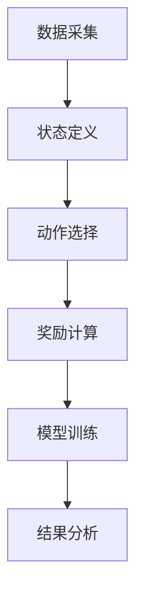
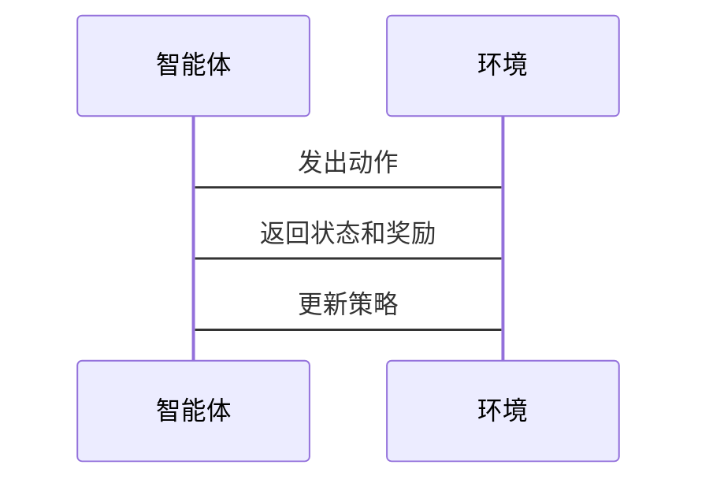

                 


# 金融领域强化学习在资产定价中的应用

> 关键词：强化学习、资产定价、金融、深度强化学习、马尔可夫决策过程、投资组合优化

> 摘要：本文深入探讨了强化学习在金融资产定价中的应用，分析了其核心原理、算法实现及其在投资组合优化和风险管理中的实际应用案例。通过详细讲解数学模型、系统架构和项目实战，本文为读者提供了从理论到实践的全面指南，展示了强化学习如何在金融领域中发挥重要作用。

---

## 第一部分：强化学习与资产定价基础

### 第1章：强化学习与资产定价概述

#### 1.1 强化学习的基本概念

**1.1.1 强化学习的定义与核心概念**

强化学习（Reinforcement Learning，RL）是一种机器学习范式，其中智能体通过与环境交互来学习策略，以最大化累积奖励。与监督学习不同，强化学习依赖于奖励信号而非标签，智能体通过试错方法优化行为。

**1.1.2 资产定价的基本原理**

资产定价是指确定资产在市场上的公允价值。传统方法包括现金流折现模型（DCF）、资产定价模型（CAPM）等，这些方法依赖于历史数据和市场假设，但在复杂多变的市场环境中，其局限性日益显现。

**1.1.3 强化学习在资产定价中的应用价值**

强化学习能够处理复杂动态的市场环境，通过实时交互和自适应策略，提供更为灵活和高效的资产定价方法。其优势在于能够处理非线性关系和多目标优化问题。

---

### 第2章：强化学习的基本原理

#### 2.1 马尔可夫决策过程（MDP）

**2.1.1 状态空间与动作空间**

- **状态空间（State Space）**：环境在某一时刻的所有可能状态的集合。在资产定价中，状态可能包括市场指数、历史价格、宏观经济指标等。
- **动作空间（Action Space）**：智能体在每个状态下可执行的动作的集合。在资产定价中，动作可能包括买入、卖出或持有资产。

**2.1.2 转移概率与奖励函数**

- **转移概率（Transition Probability）**：给定当前状态和动作，系统转移到下一个状态的概率。
- **奖励函数（Reward Function）**：智能体在执行动作后获得的即时奖励，通常基于资产的收益或风险指标。

**2.1.3 策略与价值函数**

- **策略（Policy）**：描述智能体在每个状态下选择动作的概率分布。
- **价值函数（Value Function）**：衡量某状态下策略的期望收益。

#### 2.2 强化学习的核心算法

**2.2.1 Q-learning算法**

Q-learning通过更新Q值表，学习状态-动作对的最优价值。算法如下：

1. 初始化Q表为零。
2. 在每个时间步，选择动作，执行动作并获得奖励。
3. 更新Q值：Q(s, a) = Q(s, a) + α(奖励 + γ·max Q(s', a'))，其中α是学习率，γ是折扣因子。

**2.2.2 策略梯度方法**

策略梯度通过优化策略的参数，直接最大化累积奖励。常用算法包括策略梯度（PG）和 actor-critic 方法。

**2.2.3 深度强化学习（DNN在强化学习中的应用）**

深度神经网络（DNN）用于处理高维状态空间，提取复杂特征。例如，使用卷积神经网络（CNN）处理图像数据，或循环神经网络（RNN）处理时间序列数据。

---

### 第3章：资产定价的强化学习模型

#### 3.1 资产定价模型的构建

**3.1.1 状态空间的定义**

资产定价模型中，状态可能包括市场指数、历史价格、宏观经济指标等。例如，使用股票的历史价格、市盈率、收益率等作为状态特征。

**3.1.2 动作空间的设计**

动作可能包括买入、卖出或持有资产。动作的选择取决于当前状态和策略模型的预测。

**3.1.3 奖励函数的构建**

奖励函数通常基于资产的收益和风险。例如，使用收益减去风险（如标准差）作为奖励。

#### 3.2 强化学习在资产定价中的应用案例

**3.2.1 股票价格预测的强化学习模型**

通过强化学习模型预测股票价格，并根据预测结果选择买卖时机。例如，使用DQN算法训练智能体，使其在模拟交易环境中最大化收益。

**3.2.2 投资组合优化的强化学习方法**

强化学习用于优化投资组合的配置，平衡风险与收益。通过定义适当的奖励函数，智能体学习最优的投资组合策略。

**3.2.3 风险管理中的强化学习应用**

强化学习用于实时监控和管理投资组合的风险，例如通过动态调整头寸来应对市场波动。

---

## 第二部分：强化学习算法的数学模型与实现

### 第4章：强化学习的数学模型

#### 4.1 马尔可夫决策过程的数学描述

- **状态空间**：S = {s₁, s₂, ..., sₙ}
- **动作空间**：A = {a₁, a₂, ..., aₘ}
- **转移概率**：P(s' | s, a) 表示从状态s执行动作a后转移到状态s'的概率。
- **奖励函数**：R(s, a, s') 表示在状态s执行动作a后转移到状态s'获得的奖励。

#### 4.2 Q-learning算法的数学推导

Q值更新公式：

$$ Q(s, a) ← Q(s, a) + \alpha \left( r + \gamma \max_{a'} Q(s', a') - Q(s, a) \right) $$

其中，α是学习率，γ是折扣因子，r是即时奖励。

### 第5章：深度强化学习的实现

#### 5.1 DQN算法的数学模型

DQN通过神经网络近似Q函数，网络结构通常包括输入层、隐藏层和输出层。训练过程包括：

1. 从经验回放缓存中随机抽取小批量样本。
2. 计算当前Q值和目标Q值。
3. 使用均方误差（MSE）作为损失函数，优化网络参数。

#### 5.2 策略梯度方法的数学推导

策略梯度通过最大化累积奖励的对数概率，优化策略参数θ：

$$ \nabla \theta \log \pi(a | s) \left( R + \gamma R' + \cdots \right) $$

其中，π(a | s)是策略函数，R是奖励。

---

## 第三部分：系统设计与项目实战

### 第6章：系统设计与项目实战

#### 6.1 项目介绍

本项目旨在构建一个基于强化学习的资产定价系统，用于股票市场的价格预测和投资组合优化。

#### 6.2 系统功能设计

**系统功能模块**：

1. 数据采集模块：获取股票价格、市场指标等数据。
2. 状态定义模块：定义状态空间。
3. 动作选择模块：基于策略选择动作。
4. 奖励计算模块：计算即时奖励。
5. 模型训练模块：训练强化学习模型。
6. 结果分析模块：分析模型的表现。

**系统架构设计**：



#### 6.3 系统接口设计

**输入接口**：接收市场数据和用户指令。

**输出接口**：输出交易信号和投资组合建议。

**交互流程**：



#### 6.4 项目实战

**6.4.1 环境配置**

安装必要的库，如TensorFlow、Keras、Pandas等。

**6.4.2 核心代码实现**

以下是DQN算法的核心代码：

```python
import numpy as np
import tensorflow as tf

class DQNAgent:
    def __init__(self, state_space, action_space):
        self.state_space = state_space
        self.action_space = action_space
        self.model = self.build_model()
    
    def build_model(self):
        model = tf.keras.Sequential([
            tf.keras.layers.Dense(64, activation='relu', input_dim=self.state_space),
            tf.keras.layers.Dense(64, activation='relu'),
            tf.keras.layers.Dense(self.action_space, activation='linear')
        ])
        model.compile(optimizer='adam', loss='mse')
        return model
    
    def get_action(self, state):
        state = np.array([state])
        predictions = self.model.predict(state)
        return np.argmax(predictions[0])
    
    def train(self, state, action, reward, next_state):
        state = np.array([state])
        next_state = np.array([next_state])
        target = self.model.predict(state)
        target[0][action] = reward + 0.99 * np.max(self.model.predict(next_state)[0])
        self.model.fit(state, target, epochs=1, verbose=0)
```

**6.4.3 结果分析**

通过回测分析，评估模型的收益、风险和稳定性。调整超参数，如学习率、折扣因子，优化模型性能。

**6.4.4 优化建议**

结合市场数据的特征工程，如引入技术指标、宏观经济数据，提升模型的预测能力。

---

## 第四部分：总结与展望

### 第7章：总结与展望

#### 7.1 总结

本文详细探讨了强化学习在资产定价中的应用，从理论基础到算法实现，再到系统设计和项目实战，展示了其在金融领域的巨大潜力。

#### 7.2 展望

未来，随着深度强化学习的不断发展，其在资产定价中的应用将更加广泛。研究方向可能包括多智能体协作、实时动态定价、风险可控的投资组合优化等。

---

作者：AI天才研究院/AI Genius Institute & 禅与计算机程序设计艺术 /Zen And The Art of Computer Programming

