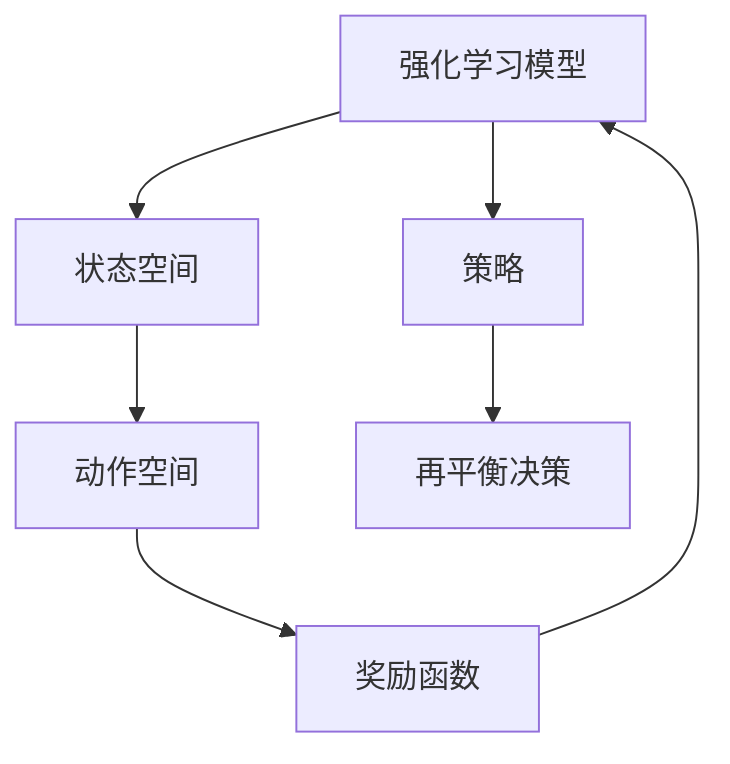
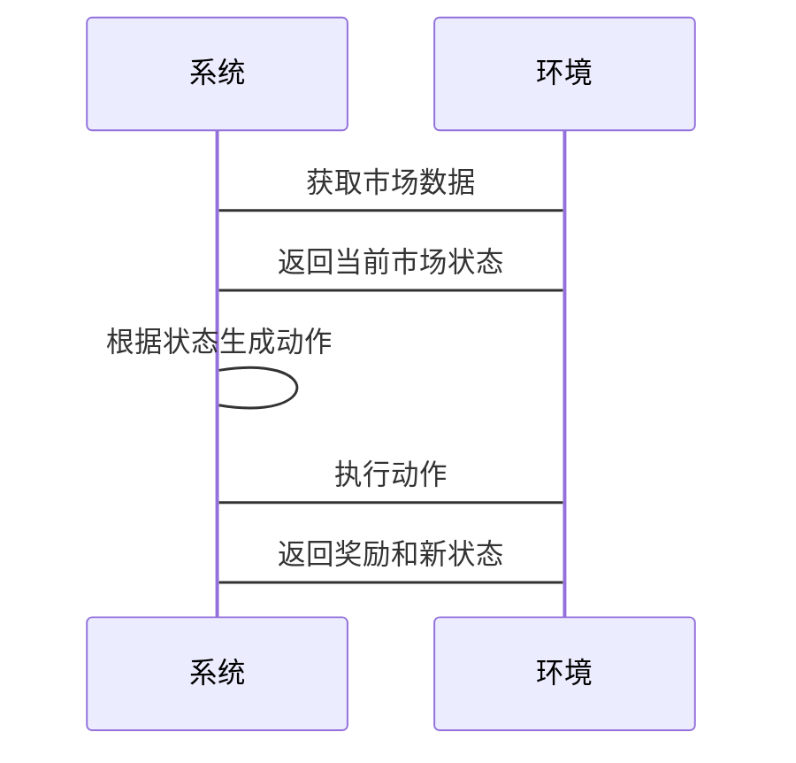

                 


# 《金融领域强化学习在资产组合再平衡中的应用》

> 关键词：强化学习、资产组合再平衡、动态优化、Q-learning、策略梯度、深度强化学习、马尔可夫决策过程

> 摘要：本文探讨了强化学习在金融资产组合再平衡中的应用，详细分析了强化学习的基本原理、算法实现、数学模型以及在资产组合优化中的实际应用。通过结合强化学习的核心概念和资产组合再平衡的动态优化问题，本文提出了基于强化学习的资产配置模型，并通过实例分析验证了其有效性。文章还讨论了强化学习在金融投资中的优势与挑战，为未来的实践提供了有价值的参考。

---

## 第一部分: 强化学习与资产组合再平衡的背景介绍

### 第1章: 强化学习与资产组合再平衡概述

#### 1.1 强化学习的基本概念
##### 1.1.1 强化学习的定义
强化学习（Reinforcement Learning, RL）是一种机器学习范式，其中智能体通过与环境交互，学习如何采取一系列行动以最大化累积奖励。与监督学习和无监督学习不同，强化学习强调动态决策过程中的试错和反馈机制。

##### 1.1.2 强化学习的核心要素
- **状态（State）**：智能体所处环境的当前情况。
- **动作（Action）**：智能体在特定状态下采取的行为。
- **奖励（Reward）**：智能体采取行动后获得的反馈，用于指导后续决策。
- **策略（Policy）**：描述智能体在给定状态下选择动作的概率分布。
- **价值函数（Value Function）**：衡量某个状态下采取特定策略的预期收益。

##### 1.1.3 资产组合再平衡的定义与意义
资产组合再平衡是指根据市场变化和个人投资目标的调整，定期重新调整投资组合的过程。其目的是为了维持投资组合的风险和收益特性与初始设定一致，同时优化资产配置以应对市场波动。

---

#### 1.2 强化学习在金融领域的应用背景
##### 1.2.1 传统资产组合管理的局限性
- 传统资产配置方法（如均值-方差优化）依赖于对市场未来表现的假设，且假设资产收益呈正态分布。
- 在实际市场中，资产收益往往表现出非线性、非平稳性和尾部风险（Fat-tail Risk）。
- 传统方法难以应对市场环境的动态变化，尤其是在极端市场条件下。

##### 1.2.2 强化学习在金融投资中的优势
- 强化学习能够处理非线性、动态变化的市场环境。
- 通过试错和反馈机制，强化学习能够在复杂环境中找到最优策略。
- 无需明确的市场模型，强化学习可以通过经验直接学习最优投资策略。

##### 1.2.3 资产组合再平衡的现实需求
- 随着市场环境的变化，投资组合的收益和风险特性需要定期调整。
- 传统再平衡方法依赖于市场预测，而强化学习可以通过动态优化实现自适应再平衡。

---

#### 1.3 强化学习与资产组合再平衡的结合
##### 1.3.1 强化学习在资产组合优化中的应用
- 强化学习可以用于动态资产配置，根据市场变化调整投资比例。
- 通过强化学习，投资者可以找到在不同市场状态下最优的资产组合。

##### 1.3.2 资产组合再平衡的动态优化问题
- 再平衡问题可以转化为一个动态优化问题，其中每个时间步需要做出调整决策。
- 强化学习能够处理这种动态优化问题，通过试错找到最优调整策略。

##### 1.3.3 强化学习在动态资产配置中的潜力
- 强化学习能够处理多资产类别、多市场条件下的复杂配置问题。
- 通过强化学习，投资者可以实现自适应的再平衡策略，提高投资组合的收益和风险调整能力。

---

## 第二部分: 强化学习的核心概念与联系

### 第2章: 强化学习的核心原理

#### 2.1 马尔可夫决策过程（MDP）
##### 2.1.1 状态空间与动作空间
- **状态空间**：所有可能的状态的集合。
- **动作空间**：在每个状态下所有可能动作的集合。

##### 2.1.2 奖励函数与价值函数
- **奖励函数**：定义在状态-动作对上的奖励。
- **价值函数**：衡量某个状态下采取特定策略的预期收益。

##### 2.1.3 策略与价值评估
- **策略**：描述智能体在给定状态下选择动作的概率分布。
- **价值评估**：估计策略在不同状态下的价值。

##### 2.1.4 MDP的数学表示
使用马尔可夫决策过程（MDP）来描述强化学习问题：
$$
MDP = (S, A, P, R, \gamma)
$$
其中：
- \( S \)：状态空间。
- \( A \)：动作空间。
- \( P \)：状态转移概率矩阵。
- \( R \)：奖励函数。
- \( \gamma \)：折扣因子，介于0和1之间。

---

#### 2.2 强化学习算法的分类与比较
##### 2.2.1 Q-learning算法
- Q-learning是一种基于价值函数的强化学习算法。
- 通过更新Q值表来学习最优策略。
- 适用于离散状态和动作空间。

##### 2.2.2 策略梯度方法
- 策略梯度方法直接优化策略，而非价值函数。
- 适用于连续动作空间。
- 使用梯度上升方法更新策略参数。

##### 2.2.3 深度强化学习（Deep RL）
- 将深度神经网络与强化学习结合，处理高维状态空间。
- 常见算法包括Deep Q-Networks（DQN）和策略梯度方法（如PPO）。

##### 2.2.4 不同算法的比较
| 算法类型         | 适用场景                  | 优势                              | 劣势                              |
|------------------|---------------------------|-----------------------------------|-----------------------------------|
| Q-learning       | 离散状态和动作             | 简单易实现                       | 无法处理高维状态                   |
| 策略梯度方法     | 连续动作空间               | 直接优化策略                     | 计算复杂性较高                     |
| Deep RL          | 高维状态空间               | 能处理复杂环境                   | �易出现过拟合                     |

---

#### 2.3 强化学习在资产组合再平衡中的应用模型
##### 2.3.1 基于强化学习的资产配置模型
- 将资产配置问题转化为强化学习问题。
- 状态：市场状态（如市场指数、波动率等）。
- 动作：调整资产比例。
- 奖励：投资组合收益减去惩罚项。

##### 2.3.2 资产再平衡的动态优化模型
- 通过强化学习实现动态再平衡。
- 状态：当前资产组合的收益和风险。
- 动作：调整部分资产比例。
- 奖励：再平衡后的收益。

##### 2.3.3 基于强化学习的交易策略模型
- 使用强化学习优化交易策略。
- 状态：市场数据（如价格、成交量）。
- 动作：买入、卖出或持有。
- 奖励：交易收益。

---

## 第三部分: 强化学习算法的数学模型与实现

### 第3章: 强化学习算法的数学模型

#### 3.1 马尔可夫决策过程的数学描述
##### 3.1.1 状态空间与动作空间的数学表示
- 状态空间 \( S \) 可以是高维向量空间。
- 动作空间 \( A \) 可以是离散或连续的动作空间。

##### 3.1.2 奖励函数与价值函数的数学公式
- 奖励函数 \( R(s, a) \) 表示在状态 \( s \) 下采取动作 \( a \) 所获得的奖励。
- 价值函数 \( V(s, a) \) 表示在状态 \( s \) 下采取动作 \( a \) 的预期未来奖励。

##### 3.1.3 动态规划与策略评估
- 策略评估：在给定策略下，计算每个状态的价值。
- 动态规划：通过迭代更新状态价值来逼近最优策略。

---

#### 3.2 Q-learning算法的数学模型
##### 3.2.1 Q-learning的更新公式
Q-learning通过更新Q值表来逼近最优策略：
$$
Q(s, a) \leftarrow Q(s, a) + \alpha [r + \gamma \max Q(s', a') - Q(s, a)]
$$
其中：
- \( \alpha \) 是学习率。
- \( \gamma \) 是折扣因子。
- \( r \) 是当前步奖励。
- \( s' \) 是下一个状态。

##### 3.2.2 Q-learning的收敛性分析
- Q-learning在离散状态和动作空间下具有收敛性。
- 在某些情况下，可能会出现Q值不稳定的问题，需要引入经验回放等技巧。

##### 3.2.3 用Python实现Q-learning算法
```python
import numpy as np

class QLearning:
    def __init__(self, state_space_size, action_space_size, gamma=0.99, alpha=0.1):
        self.gamma = gamma
        self.alpha = alpha
        self.Q = np.zeros((state_space_size, action_space_size))

    def update(self, state, action, reward, next_state):
        self.Q[state][action] += self.alpha * (reward + self.gamma * np.max(self.Q[next_state]) - self.Q[state][action])
```

---

#### 3.3 策略梯度方法的数学模型
##### 3.3.1 策略梯度方法的优化目标
策略梯度方法通过优化策略参数 \( \theta \) 来最大化累积奖励：
$$
\theta \leftarrow \theta + \alpha \nabla_{\theta} J(\theta)
$$
其中，\( J(\theta) \) 是目标函数，通常定义为策略的平均奖励。

##### 3.3.2 策略梯度方法的实现
```python
import numpy as np
import tensorflow as tf

class PolicyGradient:
    def __init__(self, state_dim, action_dim, hidden_dim=32, learning_rate=0.01):
        self.state_dim = state_dim
        self.action_dim = action_dim
        self.hidden_dim = hidden_dim
        self.learning_rate = learning_rate
        
        self.model = tf.keras.Sequential([
            tf.keras.layers.Dense(self.hidden_dim, activation='relu', input_shape=(self.state_dim,)),
            tf.keras.layers.Dense(self.action_dim, activation='softmax')
        ])
        
        self.optimizer = tf.keras.optimizers.Adam(learning_rate=self.learning_rate)

    def call(self, states):
        return self.model(states)

    def update(self, states, actions, rewards):
        with tf.GradientTape() as tape:
            actions_prob = self.model(states)
            loss = -tf.reduce_sum(tf.one_hot(actions, self.action_dim) * tf.math.log(actions_prob))
        gradients = tape.gradient(loss, self.model.trainable_variables)
        self.optimizer.apply_gradients(zip(gradients, self.model.trainable_variables))
```

---

## 第四部分: 系统分析与架构设计

### 第4章: 系统分析与架构设计

#### 4.1 问题场景介绍
- **目标**：设计一个基于强化学习的资产组合再平衡系统。
- **输入**：市场数据（如股票价格、指数等）。
- **输出**：资产组合的再平衡策略。

#### 4.2 系统功能设计
##### 4.2.1 系统架构图


##### 4.2.2 接口设计
- **输入接口**：接收市场数据和当前资产组合状态。
- **输出接口**：输出再平衡决策（如调整资产比例）。

##### 4.2.3 交互流程


---

## 第五部分: 项目实战

### 第5章: 项目实战

#### 5.1 环境安装
```bash
pip install numpy scikit-learn tensorflow
```

#### 5.2 核心实现
##### 5.2.1 强化学习模型实现
```python
import numpy as np
import pandas as pd
import tensorflow as tf
from tensorflow.keras import layers

class ReinforcementLearning:
    def __init__(self, state_dim, action_dim, hidden_dim=32, learning_rate=0.001):
        self.state_dim = state_dim
        self.action_dim = action_dim
        self.hidden_dim = hidden_dim
        self.learning_rate = learning_rate
        
        self.model = tf.keras.Sequential([
            layers.Dense(self.hidden_dim, activation='relu', input_shape=(self.state_dim,)),
            layers.Dense(self.action_dim, activation='softmax')
        ])
        
        self.optimizer = tf.keras.optimizers.Adam(learning_rate=self.learning_rate)

    def call(self, states):
        return self.model(states)

    def update(self, states, actions, rewards):
        with tf.GradientTape() as tape:
            actions_prob = self.model(states)
            loss = -tf.reduce_sum(tf.one_hot(actions, self.action_dim) * tf.math.log(actions_prob))
        gradients = tape.gradient(loss, self.model.trainable_variables)
        self.optimizer.apply_gradients(zip(gradients, self.model.trainable_variables))
```

##### 5.2.2 资产组合再平衡实现
```python
import numpy as np
import pandas as pd
import matplotlib.pyplot as plt

def main():
    # 加载数据
    data = pd.read_csv('market_data.csv')
    # 初始化强化学习模型
    state_dim = len(data.columns)
    action_dim = 5
    rl = ReinforcementLearning(state_dim, action_dim)
    
    # 训练过程
    for episode in range(1000):
        state = data.iloc[episode].values
        action = rl.get_action(state)
        next_state = data.iloc[episode+1].values
        reward = calculate_reward(state, action, next_state)
        rl.update(state, action, reward)
    
    # 测试再平衡策略
    test_data = data[-100:]
    current_state = test_data.iloc[-1].values
    action = rl.get_action(current_state)
    print(f"再平衡决策：{action}")

if __name__ == "__main__":
    main()
```

---

## 第六部分: 总结与展望

### 第6章: 总结与展望

#### 6.1 最佳实践
- **数据质量**：强化学习依赖于高质量的数据输入，因此需要确保数据的准确性和完整性。
- **模型选择**：根据具体问题选择合适的强化学习算法，如Q-learning、策略梯度或Deep RL。
- **风险控制**：在实际应用中，需要结合风险控制策略，避免过度依赖强化学习模型。

#### 6.2 小结
本文详细探讨了强化学习在资产组合再平衡中的应用，从理论基础到实际实现，为读者提供了一个完整的解决方案。通过强化学习，投资者可以实现动态优化的再平衡策略，提高投资组合的收益和风险调整能力。

#### 6.3 注意事项
- 强化学习模型的性能依赖于训练数据的质量和多样性。
- 在实际应用中，需要考虑市场环境的复杂性和不确定性。

#### 6.4 拓展阅读
-《Reinforcement Learning: Theory and Algorithms》
-《Deep Reinforcement Learning: A Review》
-《Financial Portfolio Management with Machine Learning》

---

## 作者：AI天才研究院/AI Genius Institute & 禅与计算机程序设计艺术 /Zen And The Art of Computer Programming

---

**感谢您的阅读！**

