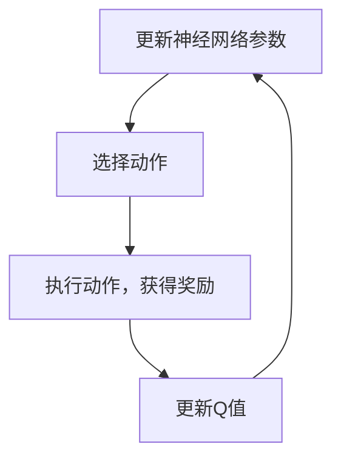
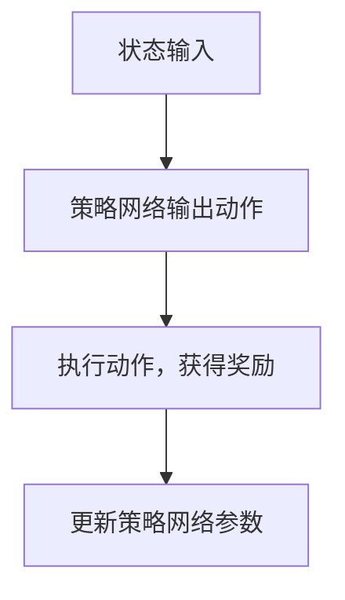
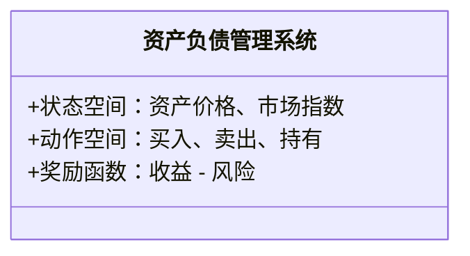
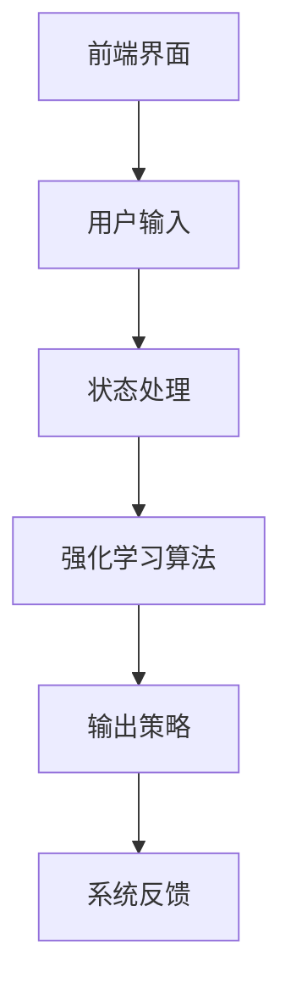

                 


# 《金融领域强化学习在资产负债管理中的应用》

> **关键词**：强化学习、资产负债管理、金融、机器学习、深度学习、风险管理  
> **摘要**：本文探讨了强化学习在金融领域资产负债管理中的应用，分析了强化学习的基本概念、算法原理及其在资产配置、风险控制和投资组合优化中的具体应用。通过实际案例和系统设计，展示了如何利用强化学习解决金融领域的复杂问题，提供了从理论到实践的全面指导。

---

## 第1章 强化学习与金融领域的基础

### 1.1 强化学习的基本概念

#### 1.1.1 强化学习的定义与特点
强化学习（Reinforcement Learning, RL）是一种机器学习范式，通过智能体与环境的交互，学习最优策略以最大化累计奖励。其特点包括：
- **试错性**：通过不断尝试和错误来优化决策。
- **延迟反馈**：奖励通常在多个动作之后才给出。
- **高维状态空间**：适用于复杂和高维的问题。

#### 1.1.2 强化学习的核心要素：状态、动作、奖励
- **状态（State）**：描述环境当前情况的特征，如资产价格、市场波动等。
- **动作（Action）**：智能体在给定状态下采取的行为，如买入或卖出资产。
- **奖励（Reward）**：智能体在执行动作后获得的反馈，通常表示行为的好坏。

#### 1.1.3 强化学习与监督学习的区别
- **监督学习**：基于已标注数据进行学习，目标是预测输入的标签。
- **强化学习**：通过与环境交互，学习最优策略，强调长期收益。

### 1.2 金融领域的基本概念

#### 1.2.1 资产负债管理的定义
资产负债管理（Asset-Liability Management, ALM）是金融领域的重要任务，旨在通过优化资产和负债的配置，实现风险控制和收益最大化。

#### 1.2.2 金融市场的基本构成
金融市场包括股票、债券、基金等多种金融工具，涉及投资者、交易员、金融机构等多方参与者。

#### 1.2.3 资产负债管理的核心目标
- **收益最大化**：通过优化资产配置提高收益。
- **风险最小化**：降低市场波动对资产负债的影响。

### 1.3 强化学习在金融领域的应用前景

#### 1.3.1 金融领域的复杂性与不确定性
金融市场受到多种因素影响，如经济指标、政策变化等，强化学习能够处理这种复杂性和不确定性。

#### 1.3.2 强化学习在金融决策中的优势
- **动态适应性**：能够根据市场变化实时调整策略。
- **全局优化**：通过强化学习算法找到全局最优解。

#### 1.3.3 资产负债管理中的具体应用场景
- **资产配置**：优化资产组合以实现收益和风险的平衡。
- **风险控制**：实时监控和调整资产负债结构，降低风险。

---

## 第2章 强化学习的理论基础

### 2.1 马尔可夫决策过程（MDP）

#### 2.1.1 状态空间与动作空间
- **状态空间**：所有可能的状态集合，如资产价格、市场指数等。
- **动作空间**：所有可能的动作集合，如买入、卖出或持有资产。

#### 2.1.2 奖励函数与价值函数
- **奖励函数**：定义在每一步动作后获得的奖励。
- **价值函数**：衡量某状态下采取某个动作的长期收益。

#### 2.1.3 策略与价值评估
- **策略**：决定在每个状态下采取的动作。
- **价值评估**：评估策略在某状态下的长期收益。

### 2.2 强化学习算法的基本原理

#### 2.2.1 Q-learning算法
Q-learning是一种经典的强化学习算法，通过更新Q值表来学习最优策略。其更新公式为：
$$ Q(s,a) = Q(s,a) + \alpha (r + \gamma \max Q(s',a') - Q(s,a)) $$
其中，$\alpha$是学习率，$\gamma$是折扣因子。

#### 2.2.2 Deep Q-Learning算法
Deep Q-Learning结合了神经网络和Q-learning，通过神经网络近似Q值函数。其优势在于处理高维状态空间。

#### 2.2.3 策略梯度方法
策略梯度方法直接优化策略参数，通过梯度下降更新策略，适用于连续动作空间。

### 2.3 神经网络在强化学习中的应用

#### 2.3.1 神经网络作为价值函数的近似器
使用神经网络近似Q值函数，其结构可以是卷积神经网络（CNN）或循环神经网络（RNN）。

#### 2.3.2 神经网络作为策略的近似器
策略网络直接输出动作概率分布，适用于策略梯度方法。

#### 2.3.3 经典网络结构
- **DQN网络**：双神经网络结构，一个用于当前策略，一个用于目标网络。
- **PPO网络**：基于策略梯度的网络结构，适用于复杂环境。

---

## 第3章 金融领域中的强化学习问题建模

### 3.1 资产负债管理中的强化学习问题

#### 3.1.1 状态空间的定义
状态可以是资产价格、市场指数、资金流动性等。

#### 3.1.2 动作空间的设计
动作可以是买入某资产、卖出某资产或持有不动。

#### 3.1.3 奖励函数的构建
奖励函数通常基于收益和风险的平衡，例如：
$$ R = \text{收益} - \text{风险} $$

### 3.2 市场环境的建模

#### 3.2.1 资产价格的动态模型
常用随机过程建模，如几何布朗运动：
$$ dP_t = \mu P_t dt + \sigma P_t dW_t $$

#### 3.2.2 风险因素的建模
风险因素包括市场波动率、信用风险等，通常通过马尔可夫链建模。

#### 3.2.3 市场参与者的互动
考虑多方参与者的影响，构建博弈论模型。

### 3.3 约束条件与目标函数

#### 3.3.1 资产负债管理的约束条件
- 资金流动性约束
- 风险暴露限制

#### 3.3.2 目标函数的设计
目标函数通常为收益最大化或风险最小化，例如：
$$ \max \text{收益} - \lambda \text{风险} $$

---

## 第4章 强化学习算法在资产负债管理中的实现

### 4.1 Deep Q-Learning算法实现

#### 4.1.1 算法流程图（Mermaid）


#### 4.1.2 神经网络结构设计
使用双神经网络结构，一个作为当前网络，一个作为目标网络。

#### 4.1.3 算法实现代码示例
```python
import numpy as np
import tensorflow as tf

class DQN:
    def __init__(self, state_space, action_space):
        self.state_space = state_space
        self.action_space = action_space
        self.model = self.build_model()
        self.target_model = self.build_model()
    
    def build_model(self):
        model = tf.keras.Sequential([
            tf.keras.layers.Dense(64, activation='relu', input_shape=(self.state_space,)),
            tf.keras.layers.Dense(64, activation='relu'),
            tf.keras.layers.Dense(self.action_space, activation='linear')
        ])
        return model
    
    def update_target_model(self):
        self.target_model.set_weights(self.model.get_weights())
```

### 4.2 策略网络算法实现

#### 4.2.1 策略网络的基本原理
策略网络直接输出动作概率，通过梯度下降更新参数。

#### 4.2.2 算法流程图（Mermaid）


#### 4.2.3 算法实现代码示例
```python
import numpy as np
import tensorflow as tf

class PolicyGradient:
    def __init__(self, state_space):
        self.state_space = state_space
        self.model = self.build_model()
    
    def build_model(self):
        model = tf.keras.Sequential([
            tf.keras.layers.Dense(64, activation='relu', input_shape=(self.state_space,)),
            tf.keras.layers.Dense(64, activation='relu'),
            tf.keras.layers.Dense(1, activation='sigmoid')
        ])
        return model
    
    def update_policy(self, states, rewards):
        with tf.GradientTape() as tape:
            probabilities = self.model(states)
            loss = -tf.reduce_mean(tf.math.log(probabilities) * rewards)
        grads = tape.gradient(loss, self.model.trainable_weights)
        self.optimizer.apply_gradients(zip(grads, self.model.trainable_weights))
```

### 4.3 算法对比与选择

#### 4.3.1 不同强化学习算法的优缺点
| 算法 | 优点 | 缺点 |
|------|------|------|
| Q-Learning | 简单，离线学习 | 需要大量样本 |
| Deep Q-Learning | 处理高维状态 | 训练不稳定 |
| Policy Gradient | 直接优化策略 | �易收敛到局部最优 |

#### 4.3.2 在资产负债管理中的适用性分析
- **Deep Q-Learning**：适合处理高维金融数据。
- **Policy Gradient**：适合复杂策略优化。

---

## 第5章 系统架构设计

### 5.1 问题场景介绍
设计一个基于强化学习的资产负债管理系统，用于实时优化资产配置。

### 5.2 项目介绍
项目目标是通过强化学习算法优化资产组合，降低风险并提高收益。

### 5.3 系统功能设计（领域模型）



### 5.4 系统架构设计（架构图）



### 5.5 系统接口设计
- **输入接口**：接收市场数据和用户指令。
- **输出接口**：输出优化后的资产配置策略。

### 5.6 系统交互设计（交互图）

```mermaid
sequenceDiagram
用户 -->+ 系统：输入市场数据
系统 -->+ 用户：返回优化策略
```

---

## 第6章 项目实战

### 6.1 环境安装
安装必要的库，如TensorFlow、Keras、NumPy等。

### 6.2 系统核心实现源代码

#### 6.2.1 环境建模
```python
import numpy as np

class MarketEnvironment:
    def __init__(self, assets):
        self.assets = assets
        self.prices = np.random.rand(len(assets)) * 100
    
    def get_state(self):
        return self.prices
```

#### 6.2.2 强化学习算法实现
```python
class DQNAgent:
    def __init__(self, state_space, action_space):
        self.state_space = state_space
        self.action_space = action_space
        self.model = self.build_model()
    
    def build_model(self):
        return tf.keras.Sequential([
            tf.keras.layers.Dense(64, activation='relu', input_shape=(self.state_space,)),
            tf.keras.layers.Dense(self.action_space, activation='linear')
        ])
    
    def act(self, state):
        state = np.array([state])
        prediction = self.model.predict(state)
        return np.argmax(prediction[0])
```

### 6.3 代码应用解读与分析
通过训练模型，智能体学习如何在不同市场状态下做出最优决策。

### 6.4 实际案例分析
以股票投资为例，展示如何通过强化学习优化资产配置。

### 6.5 项目小结
总结项目实现的关键点和优化建议。

---

## 第7章 总结与展望

### 7.1 总结
本文详细介绍了强化学习在金融领域资产负债管理中的应用，从理论到实践进行了全面探讨。

### 7.2 展望
未来的研究方向包括更复杂的市场建模和多智能体协作。

---

## 附录

### 附录A 完整代码
提供完整的代码示例，包括环境建模、算法实现和系统设计。

### 附录B 图表
包括所有图表的详细解释和代码生成方式。

---

**作者**：AI天才研究院/AI Genius Institute & 禅与计算机程序设计艺术/Zen And The Art of Computer Programming

