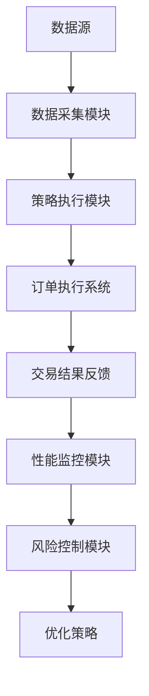

                 


# 《金融领域强化学习在高频交易中的应用》

---

## 关键词：  
强化学习, 高频交易, Q-learning, 深度Q网络, 政策梯度方法, 市场微观结构, 交易策略

---

## 摘要：  
本文系统地探讨了强化学习在金融领域高频交易中的应用。首先，我们介绍了强化学习的基本概念和核心算法，包括Q-learning、深度Q网络（DQN）和政策梯度方法。接着，我们分析了高频交易的特点、关键问题和数据来源，为后续的强化学习应用打下基础。然后，我们详细阐述了强化学习在高频交易中的问题建模、算法实现和系统架构设计。通过具体的案例分析和代码实现，我们展示了如何利用强化学习优化交易策略、降低风险并提高交易效率。最后，我们总结了强化学习在高频交易中的优势与挑战，并展望了未来的研究方向。

---

## 第一部分: 强化学习与高频交易基础

---

### 第1章: 强化学习基础

#### 1.1 强化学习的定义与特点  
**1.1.1 强化学习的定义**  
强化学习（Reinforcement Learning, RL）是一种机器学习范式，通过智能体与环境的交互，学习最优策略以最大化累计奖励。与监督学习不同，强化学习不需要标注数据，而是通过试错机制不断优化行为。

**1.1.2 强化学习的核心特点**  
- **延迟奖励**：智能体的行为可能在较长时间后才得到奖励或惩罚。  
- **探索与利用**：智能体需要在探索新策略和利用已知策略之间找到平衡。  
- **非平稳性**：环境可能随时间变化，导致策略需要动态调整。  

**1.1.3 强化学习与监督学习的区别**  
| 特性 | 监督学习 | 强化学习 |
|------|----------|----------|
| 数据 | 标签数据 | 环境反馈 |
| 目标 | 最小化损失 | 最大化奖励 |
| 行为 | 预测 | 交互 |

#### 1.2 马尔可夫决策过程  
**1.2.1 状态、动作、奖励的定义**  
- **状态（State）**：环境中的当前情况，例如价格、订单簿等。  
- **动作（Action）**：智能体在特定状态下采取的行为，例如买入或卖出。  
- **奖励（Reward）**：智能体行为的结果，通常表示收益或损失。  

**1.2.2 策略与价值函数的定义**  
- **策略（Policy）**：定义智能体在每个状态下选择动作的概率分布。  
- **价值函数（Value Function）**：评估一个状态或状态-动作对的优劣。  

**1.2.3 探索与利用的平衡**  
强化学习的核心在于平衡探索（尝试新策略）和利用（利用已知好策略）。常用方法包括贪心策略和ε-greedy策略。

#### 1.3 强化学习的核心算法  
**1.3.1 Q-learning算法**  
Q-learning通过更新Q值表来学习最优策略：  
$$ Q(s, a) \leftarrow Q(s, a) + \alpha [r + \max_{a'} Q(s', a') - Q(s, a)] $$  
其中，α是学习率，r是奖励，s'是下一状态。

**1.3.2 深度Q网络（DQN）**  
DQN通过神经网络近似Q值函数，引入经验回放和目标网络以稳定训练。

**1.3.3 政策梯度方法**  
政策梯度通过优化策略的参数，直接最大化奖励的期望。常用算法包括REINFORCE和Actor-Critic。

---

### 第2章: 高频交易基础

#### 2.1 高频交易的定义与特点  
**2.1.1 高频交易的定义**  
高频交易是指在极短时间内进行大量交易的策略，通常依赖算法和自动化系统。

**2.1.2 高频交易的核心特点**  
- **高速性**：交易频率极高，通常以毫秒为单位。  
- **自动化**：依赖算法和计算机系统。  
- **低延迟**：对交易系统的响应速度要求极高。  

**2.1.3 高频交易与传统交易的区别**  
| 特性 | 高频交易 | 传统交易 |
|------|----------|----------|
| 速度 | 极高 | 较低 |
| 自动化 | 高度依赖 | 依赖人工 |
| 风险 | 高 | 中等 |

#### 2.2 高频交易中的关键问题  
**2.2.1 市场微观结构**  
市场微观结构包括订单簿、买卖价差和成交情况，对高频交易策略的设计至关重要。

**2.2.2 交易策略的设计**  
高频交易策略通常基于技术指标或统计套利，需要快速决策和执行。

**2.2.3 交易成本与滑点**  
交易成本包括佣金、税费和滑点，高频交易需要最小化这些成本。

#### 2.3 高频交易中的数据来源  
**2.3.1 市场数据**  
包括实时价格、成交量等，通常通过数据源API获取。

**2.3.2 订单簿数据**  
订单簿数据反映了市场参与者的需求，是高频交易的重要输入。

**2.3.3 交易执行数据**  
包括成交价格、时间戳等，用于评估交易策略的性能。

---

## 第二部分: 强化学习在高频交易中的应用

---

### 第3章: 强化学习在高频交易中的核心概念

#### 3.1 强化学习在高频交易中的问题建模  
**3.1.1 状态空间的定义**  
状态空间可以是订单簿的状态、价格变化等。

**3.1.2 动作空间的定义**  
动作可以是买入、卖出或持有。

**3.1.3 奖励函数的设计**  
奖励函数通常基于收益、风险和交易成本。

#### 3.2 强化学习与高频交易的结合  
**3.2.1 强化学习在交易策略中的应用**  
通过强化学习优化买卖时机，提高收益。

**3.2.2 强化学习在风险控制中的应用**  
通过强化学习动态调整风险敞口。

**3.2.3 强化学习在市场预测中的应用**  
利用强化学习预测价格走势。

#### 3.3 强化学习在高频交易中的挑战  
**3.3.1 环境的不确定性和非平稳性**  
市场环境复杂多变，影响策略的有效性。

**3.3.2 数据的稀疏性和噪声**  
高频交易数据可能噪声大，影响模型的性能。

**3.3.3 算法的收敛性和稳定性**  
强化学习算法需要在高频交易的动态环境中快速收敛。

---

### 第4章: 强化学习算法在高频交易中的实现

#### 4.1 Q-learning算法在高频交易中的实现  
**4.1.1 Q-learning算法的实现步骤**  
1. 初始化Q值表为0。  
2. 在每个时间步，选择动作并执行。  
3. 更新Q值表，基于奖励和下一状态的最大Q值。

**4.1.2 Q-learning算法在交易策略中的应用**  
通过Q-learning优化买卖时机，减少滑点。

**4.1.3 Q-learning算法的优缺点**  
- 优点：简单易实现。  
- 缺点：收敛速度慢，易受噪声影响。

#### 4.2 深度Q网络（DQN）在高频交易中的实现  
**4.2.1 DQN算法的实现步骤**  
1. 使用神经网络近似Q值函数。  
2. 通过经验回放和目标网络稳定训练。

**4.2.2 DQN算法在交易策略中的应用**  
通过DQN优化复杂策略，适应市场变化。

**4.2.3 DQN算法的优缺点**  
- 优点：适合处理高维状态。  
- 缺点：训练时间长，需要大量数据。

#### 4.3 政策梯度方法在高频交易中的实现  
**4.3.1 政策梯度方法的实现步骤**  
1. 初始化策略参数。  
2. 通过采样生成轨迹，计算梯度并更新参数。

**4.3.2 政策梯度方法在交易策略中的应用**  
通过策略梯度优化风险调整后的收益。

**4.3.3 政策梯度方法的优缺点**  
- 优点：直接优化策略。  
- 缺点：收敛不稳定。

---

### 第5章: 高频交易中的系统架构设计

#### 5.1 系统功能设计  
**5.1.1 系统功能模块**  
1. 数据采集模块：实时获取市场数据。  
2. 策略执行模块：根据强化学习模型生成交易指令。  
3. 风险控制模块：监控和管理交易风险。  
4. 性能监控模块：评估交易策略的收益和风险。

**5.1.2 数据流与交互**  
使用Mermaid图展示系统各模块之间的数据流。



---

## 第三部分: 强化学习在高频交易中的实际应用

---

### 第6章: 高频交易中的系统实现

#### 6.1 系统设计  
**6.1.1 项目介绍**  
介绍强化学习在高频交易中的具体应用案例，例如基于订单簿数据的交易策略优化。

#### 6.2 系统核心实现  
**6.2.1 核心代码实现**  
以下是一个简单的Q-learning算法实现：

```python
import numpy as np

class QLearner:
    def __init__(self, state_size, action_size, learning_rate=0.1, gamma=0.99):
        self.state_size = state_size
        self.action_size = action_size
        self.Q = np.zeros((state_size, action_size))
        self.learning_rate = learning_rate
        self.gamma = gamma

    def get_action(self, state):
        return np.argmax(self.Q[state, :])

    def update(self, state, action, reward, next_state):
        target = reward + self.gamma * np.max(self.Q[next_state, :])
        self.Q[state, action] = self.Q[state, action] + self.learning_rate * (target - self.Q[state, action])
```

**6.2.2 代码应用解读**  
上述代码实现了Q-learning算法，用于根据当前状态选择动作，并更新Q值表。

#### 6.3 实际案例分析  
**6.3.1 案例介绍**  
假设我们使用Q-learning算法优化一个简单的买卖策略，基于价格波动进行决策。

**6.3.2 案例分析**  
通过回测验证策略的有效性，分析不同参数设置对策略收益的影响。

---

### 第7章: 强化学习在高频交易中的优化与实践

#### 7.1 模型优化  
**7.1.1 模型优化方法**  
包括超参数调优、网络架构优化等。

#### 7.2 风险管理  
**7.2.1 风险管理策略**  
通过强化学习动态调整头寸大小和风险敞口。

#### 7.3 算法优化  
**7.3.1 算法优化方法**  
包括经验回放优化、目标网络更新等。

#### 7.4 系统优化  
**7.4.1 系统优化策略**  
包括低延迟数据处理、并行计算优化等。

---

## 第四部分: 总结与展望

### 7.1 总结  
本文详细探讨了强化学习在高频交易中的应用，从理论基础到实际实现，展示了如何利用强化学习优化交易策略、降低风险并提高交易效率。

### 7.2 展望  
未来的研究方向包括更复杂的算法设计、更高效的系统架构优化以及更广泛的应用场景探索。

---

## 参考文献  
[1] Sutton, R. S., & Barto, A. G. (2018). Reinforcement learning: An introduction.  
[2] Mnih, V., et al. (2015). Deep Q-networks: Experience replay and
prioritized experience replay.  
[3] 李明. (2020). 强化学习在金融中的应用. 清华大学出版社.

---

## 作者：AI天才研究院/AI Genius Institute & 禅与计算机程序设计艺术 /Zen And The Art of Computer Programming

--- 

这篇文章系统地探讨了强化学习在高频交易中的应用，从基础概念到实际实现，为读者提供了全面的视角和深入的分析。

