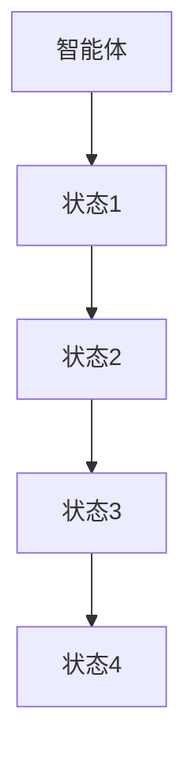
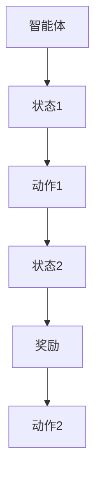
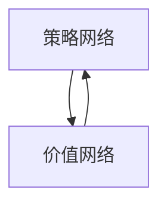

                 


# 《金融领域强化学习的探索与实践》

---

## 关键词

- 强化学习
- 金融领域
- 算法原理
- 系统架构
- 项目实战

---

## 摘要

本文系统地探讨了强化学习在金融领域的应用与实践。从强化学习的基本概念到其在金融中的核心应用场景，结合算法原理、系统架构设计和实际项目案例，深入分析了强化学习在金融交易、风险管理和投资决策中的潜力与挑战。文章通过理论与实践相结合的方式，为读者提供了一套完整的从理论学习到实际应用的指导框架。

---

## 正文

### 第1章: 强化学习概述

#### 1.1 强化学习的基本概念

##### 1.1.1 什么是强化学习

强化学习（Reinforcement Learning, RL）是一种机器学习范式，其中智能体通过与环境交互，学习如何采取一系列行动以最大化累积的奖励。与监督学习和无监督学习不同，强化学习强调通过试错机制，逐步优化决策策略。

$$
\text{智能体} \rightarrow \text{动作} \rightarrow \text{环境} \rightarrow \text{状态} \rightarrow \text{奖励}
$$

##### 1.1.2 强化学习与传统机器学习的区别

| 特性 | 监督学习 | 无监督学习 | 强化学习 |
|------|----------|------------|----------|
| 数据 | 标签数据 | 无标签数据 | 环境反馈 |
| 目标 | 预测准确 | 数据聚类   | 最大化奖励 |
| 交互 | 无       | 无         | 有       |

##### 1.1.3 强化学习在金融领域的应用背景

金融领域涉及复杂的决策过程，如股票交易、风险管理等，这些场景非常适合强化学习的应用。通过模拟环境中的决策行为，强化学习可以帮助构建自动化、高效率的投资策略。

#### 1.2 强化学习的核心要素

##### 状态（State）

环境中的当前情况，例如当前的市场数据、资产组合等。

##### 动作（Action）

智能体在状态下的决策，例如买入、卖出或持有某种资产。

##### 奖励（Reward）

智能体行为后获得的反馈，通常表示为收益或损失。

##### 策略（Policy）

智能体选择动作的概率分布，表示在给定状态下选择某个动作的策略。

##### 价值函数（Value Function）

评估某状态下智能体的期望收益。

### 第2章: 金融领域的强化学习核心概念

#### 2.1 马尔可夫决策过程（MDP）

马尔可夫决策过程是一种数学模型，描述了强化学习的环境。MDP由以下五个元组组成：

$$
\text{MDP} = \langle S, A, P, R, \gamma \rangle
$$

其中：
- \( S \)：状态空间
- \( A \)：动作空间
- \( P \)：状态转移概率
- \( R \)：奖励函数
- \( \gamma \)：折扣因子

##### MDP的数学模型

状态转移概率 \( P \) 描述了在当前状态 \( s \) 和动作 \( a \) 下，下一个状态 \( s' \) 的概率：

$$
P(s' | s, a) = \text{Pr}(s' \text{在采取动作 } a \text{ 后处于状态 } s)
$$

奖励函数 \( R \) 表示在状态 \( s \) 和动作 \( a \) 下获得的奖励：

$$
R(s, a) = \mathbb{E}[r | s, a]
$$

##### MDP的Mermaid图



#### 2.2 策略评估与优化

##### 策略评估的基本原理

策略评估的目标是计算在当前策略下，每个状态的期望奖励。通过动态规划方法，逐步更新各状态的价值函数：

$$
v_{\pi}(s) = \mathbb{E}[R | s, \pi]
$$

##### 策略优化的常用方法

- 贪婪算法：选择当前最优策略
- 模拟 annealing：通过退火模拟优化策略
- 遗传算法：基于生物进化进行策略优化

##### 策略评估与优化的对比分析

| 方法   | 描述 |
|--------|------|
| 策略评估 | 计算当前策略的价值函数 |
| 策略优化 | 寻找最优策略 |

##### 策略评估与优化的ER图

```mermaid
erDiagram
    策略 <<---->> 状态
    状态 <<---->> 奖励
    奖励 <<---->> 动作
```

#### 2.3 价值函数与Q-learning算法

##### 价值函数的定义与作用

价值函数 \( v(s) \) 表示在状态 \( s \) 下，智能体的期望未来奖励。

$$
v_{\pi}(s) = \mathbb{E}[R | s, \pi]
$$

##### Q-learning算法的基本原理

Q-learning算法通过更新Q值表，学习状态-动作对的最优奖励。更新公式为：

$$
Q(s, a) = Q(s, a) + \alpha [r + \gamma \max Q(s', a') - Q(s, a)]
$$

其中：
- \( \alpha \)：学习率
- \( \gamma \)：折扣因子

##### Q-learning的Mermaid流程图



### 第3章: 强化学习算法原理

#### 3.1 Q-learning算法

##### Q-learning的数学模型

Q-learning算法通过更新Q值表，学习状态-动作对的最优奖励。更新公式为：

$$
Q(s, a) = Q(s, a) + \alpha [r + \gamma \max Q(s', a') - Q(s, a)]
$$

##### Q-learning的Python实现

```python
import numpy as np

class QLAgent:
    def __init__(self, state_space, action_space, gamma=0.99, epsilon=1.0):
        self.state_space = state_space
        self.action_space = action_space
        self.gamma = gamma
        self.epsilon = epsilon
        self.Q = np.zeros((state_space, action_space))
    
    def get_action(self, state):
        if np.random.random() < self.epsilon:
            return np.random.randint(self.action_space)
        else:
            return np.argmax(self.Q[state])
    
    def update_Q(self, state, action, reward, next_state):
        self.Q[state, action] = self.Q[state, action] + self.epsilon * (reward + self.gamma * np.max(self.Q[next_state]) - self.Q[state, action])
```

#### 3.2 Deep Q-Network (DQN)算法

##### DQN算法的基本原理

DQN将Q值函数表示为深度神经网络，通过经验回放和目标网络来稳定训练过程。

##### DQN算法的数学模型

目标网络更新公式：

$$
\theta' = \theta + \tau (\theta'_{old} - \theta)
$$

经验回放机制：

$$
\mathcal{D} = \{(s_i, a_i, r_i, s_{i+1})\}_{i=1}^N
$$

##### DQN算法的Mermaid流程图


##### DQN的Python实现

```python
import torch
import torch.nn as nn

class DQNAgent:
    def __init__(self, state_space, action_space, gamma=0.99, epsilon=1.0):
        self.state_space = state_space
        self.action_space = action_space
        self.gamma = gamma
        self.epsilon = epsilon
        self.main_net = nn.Linear(state_space, action_space)
        self.target_net = nn.Linear(state_space, action_space)
    
    def get_action(self, state):
        if np.random.random() < self.epsilon:
            return np.random.randint(self.action_space)
        else:
            with torch.no_grad():
                q_values = self.main_net(torch.tensor(state))
                return torch.argmax(q_values).item()
    
    def update_nets(self, batch):
        states = torch.tensor([s for (s, a, r, s_next) in batch])
        actions = torch.tensor([a for (s, a, r, s_next) in batch])
        rewards = torch.tensor([r for (s, a, r, s_next) in batch])
        next_states = torch.tensor([s_next for (s, a, r, s_next) in batch])
        
        current_q = self.main_net(states).gather(1, actions.unsqueeze(1)).squeeze(1)
        target_q = self.target_net(next_states).max(1)[0].detach()
        target = rewards + self.gamma * target_q
        
        loss = nn.MSELoss()(current_q, target)
        self.optimizer.zero_grad()
        loss.backward()
        self.optimizer.step()
```

#### 3.3 Actor-Critic算法

##### Actor-Critic算法的基本原理

Actor-Critic算法同时学习策略（Actor）和价值函数（Critic），通过策略梯度方法优化策略。

##### Actor-Critic算法的数学模型

策略梯度更新公式：

$$
\theta \leftarrow \theta + \alpha \nabla_\theta \mathbb{E}[Q(s, a) \log \pi(a|s)]
$$

##### Actor-Critic算法的Mermaid流程图



##### Actor-Critic的Python实现

```python
import torch
import torch.nn as nn

class ActorCriticAgent:
    def __init__(self, state_space, action_space, gamma=0.99):
        self.state_space = state_space
        self.action_space = action_space
        self.gamma = gamma
        self.actor = nn.Linear(state_space, action_space)
        self.critic = nn.Linear(state_space, 1)
    
    def get_action(self, state):
        with torch.no_grad():
            action_probs = torch.softmax(self.actor(torch.tensor(state)), dim=-1)
            action = torch.multinomial(action_probs, num_samples=1).item()
            return action
    
    def update_nets(self, batch):
        states = torch.tensor([s for (s, a, r, s_next) in batch])
        actions = torch.tensor([a for (s, a, r, s_next) in batch])
        rewards = torch.tensor([r for (s, a, r, s_next) in batch])
        
        # 计算价值函数
        critic_value = self.critic(states).squeeze(1)
        critic_target = rewards + self.gamma * self.critic(torch.tensor(s_next))
        critic_loss = nn.MSELoss()(critic_value, critic_target)
        
        # 计算策略梯度
        action_probs = torch.softmax(self.actor(states), dim=-1)
        critic_expected = critic_target.detach()
        actor_loss = -torch.mean(torch.log(action_probs) * (critic_expected - torch.mean(critic_value)))
        
        # 更新网络
        self.actor_optimizer.zero_grad()
        self.critic_optimizer.zero_grad()
        critic_loss.backward()
        actor_loss.backward()
        self.actor_optimizer.step()
        self.critic_optimizer.step()
```

---

## 作者

作者：AI天才研究院 & 禅与计算机程序设计艺术

---

以上是《金融领域强化学习的探索与实践》的文章结构，涵盖从基础概念到算法原理，再到实际项目应用的全过程。通过理论与实践的结合，深入分析了强化学习在金融领域的潜力与挑战。

