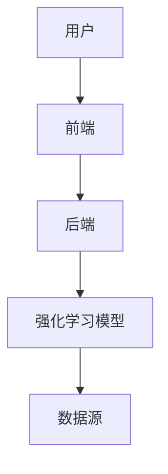

                 


# 金融领域强化学习的最新进展与应用

> 关键词：强化学习、金融应用、Q-learning、DQN、策略梯度、资产管理系统

> 摘要：本文详细探讨了强化学习在金融领域的最新进展与应用，涵盖了强化学习的基本概念、核心算法、系统架构设计、数学模型以及项目实战等内容，旨在为读者提供一个全面的技术视角。

---

# 第1章: 强化学习与金融应用的背景

## 1.1 强化学习的基本概念

### 1.1.1 强化学习的定义与核心概念
强化学习（Reinforcement Learning, RL）是一种机器学习范式，通过智能体与环境的交互，学习最优策略以最大化累积奖励。其核心概念包括：
- **状态（State）**：环境的当前情况。
- **动作（Action）**：智能体采取的行为。
- **奖励（Reward）**：智能体行为的反馈。
- **策略（Policy）**：智能体选择动作的规则。
- **价值函数（Value Function）**：评估状态或动作的价值。

强化学习通过不断试错，优化策略以最大化累积奖励，适用于复杂、动态的环境。

### 1.1.2 强化学习与监督学习的区别
- **监督学习**：基于已知的输入-输出对进行学习，适合处理有标签数据的任务。
- **强化学习**：通过与环境交互，根据奖励信号学习策略，适合处理动态决策任务。

### 1.1.3 强化学习在金融领域的潜力
金融领域的复杂性和不确定性使得强化学习成为理想工具：
- **资产配置**：优化投资组合以最大化收益。
- **交易策略**：制定动态交易规则以捕捉市场机会。
- **风险控制**：通过强化学习模型实时调整风险敞口。

## 1.2 金融领域的强化学习应用背景

### 1.2.1 金融行业的复杂性与不确定性
金融市场受多种因素影响，如宏观经济、政策变化和市场情绪，导致高度不确定性。

### 1.2.2 传统金融模型的局限性
传统金融模型如马科维茨投资组合理论在实际应用中难以应对动态变化和非线性关系。

### 1.2.3 强化学习在金融中的独特优势
强化学习的自适应性和实时性使其在复杂金融环境中表现优异。

---

# 第2章: 强化学习的核心概念与数学模型

## 2.1 强化学习的基本原理

### 2.1.1 状态、动作、奖励的定义
- **状态（s）**：当前市场数据，如股票价格和成交量。
- **动作（a）**：买入、卖出或持有。
- **奖励（r）**：投资收益或损失。

### 2.1.2 动作空间与状态空间的构建
- **动作空间**：有限动作集，如{买入, 卖出, 持有}。
- **状态空间**：高维状态，需降维处理。

### 2.1.3 策略与价值函数的定义
- **策略（π）**：决定动作的函数。
- **价值函数（V）**：评估状态的价值。

## 2.2 强化学习的数学模型

### 2.2.1 Bellman方程与动态规划
Bellman方程：
$$ V(s) = \max_a \left[ r(s, a) + \gamma V(s', a) \right] $$
其中，$\gamma$为折扣因子，$s'$为下一状态。

### 2.2.2 Q-learning算法的数学推导
Q-learning目标是最优化Q值：
$$ Q(s, a) = r(s, a) + \gamma \max_{a'} Q(s', a') $$

### 2.2.3 策略梯度方法的数学基础
策略梯度优化：
$$ \theta = \theta + \alpha \nabla_\theta J(\theta) $$
其中，$J(\theta)$为奖励的期望。

## 2.3 金融场景中的强化学习模型

### 2.3.1 资产管理中的强化学习模型
构建资产配置模型，优化投资组合。

### 2.3.2 风险控制中的强化学习模型
实时调整风险敞口，降低损失。

### 2.3.3 交易策略中的强化学习模型
动态调整交易策略，捕捉市场机会。

---

# 第3章: 强化学习在金融领域的核心算法

## 3.1 Q-learning算法

### 3.1.1 Q-learning算法的原理
通过Q表更新动作价值，最终得到最优策略。

### 3.1.2 Q-learning在金融中的应用
应用于交易策略优化。

### 3.1.3 Q-learning的优缺点
优点：简单易实现；缺点：状态空间大时表现不佳。

## 3.2 策略梯度算法

### 3.2.1 策略梯度算法的原理
通过优化策略参数，直接最大化奖励期望。

### 3.2.2 策略梯度算法在金融中的应用
应用于风险控制模型。

### 3.2.3 策略梯度算法的优缺点
优点：适合高维状态空间；缺点：计算复杂度高。

## 3.3 其他强化学习算法

### 3.3.1 Deep Q-Networks (DQN)算法
通过深度神经网络近似Q值函数，提升表现。

### 3.3.2 Actor-Critic算法
同时优化策略和价值函数，适用于复杂环境。

### 3.3.3 多智能体强化学习算法
应用于多资产配置和交易场景。

---

# 第4章: 金融领域强化学习的系统架构与设计

## 4.1 系统架构设计

### 4.1.1 系统整体架构图


### 4.1.2 系统功能模块划分
- 前端：用户交互。
- 后端：业务逻辑处理。
- 强化学习模型：策略优化。

### 4.1.3 系统接口设计
- API接口：接收请求，返回结果。

## 4.2 系统功能设计

### 4.2.1 资产管理模块
实现投资组合优化。

### 4.2.2 风险控制模块
实时监控并调整风险敞口。

### 4.2.3 交易策略模块
制定并执行交易策略。

## 4.3 系统实现细节

### 4.3.1 数据预处理与特征提取
对历史数据进行清洗和特征提取。

### 4.3.2 算法实现与优化
优化模型参数，提升性能。

### 4.3.3 系统测试与验证
通过回测验证模型效果。

---

# 第5章: 强化学习在金融中的项目实战

## 5.1 环境配置与数据准备

### 5.1.1 环境搭建与依赖安装
安装Python和相关库，如TensorFlow和Keras。

### 5.1.2 数据来源与数据清洗
使用公开数据源，清洗并预处理数据。

### 5.1.3 数据特征提取与建模
提取关键特征，构建特征向量。

## 5.2 强化学习算法实现

### 5.2.1 Q-learning算法实现
```python
class QLAgent:
    def __init__(self, state_size, action_size):
        self.state_size = state_size
        self.action_size = action_size
        self.q_table = np.zeros((state_size, action_size))
```

### 5.2.2 DQN算法实现
```python
class DQNAgent:
    def __init__(self, state_size, action_size):
        self.state_size = state_size
        self.action_size = action_size
        self.model = self.build_model()
```

### 5.2.3 策略梯度算法实现
```python
class PolicyGradientAgent:
    def __init__(self, state_size, action_size):
        self.state_size = state_size
        self.action_size = action_size
        self.theta = np.random.randn(state_size, action_size)
```

## 5.3 项目实战分析

### 5.3.1 环境配置与数据准备
详细说明环境搭建和数据处理步骤。

### 5.3.2 算法实现与优化
通过代码实现强化学习算法，并进行优化。

### 5.3.3 实际案例分析
分析算法在实际金融场景中的表现。

## 5.4 项目小结
总结项目成果和经验教训。

---

# 作者：AI天才研究院/AI Genius Institute & 禅与计算机程序设计艺术 /Zen And The Art of Computer Programming

