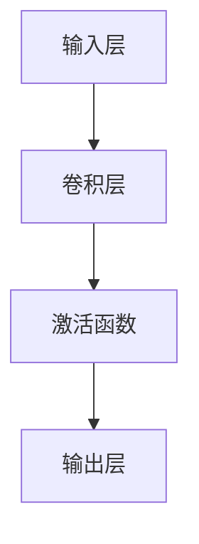
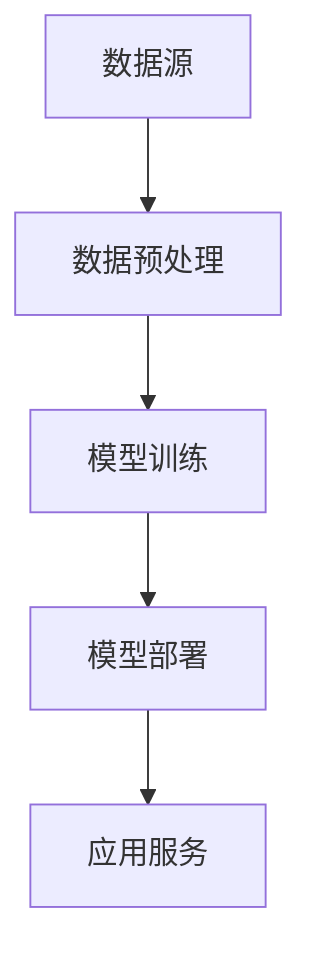

                 


```markdown
# 《金融领域的图神经网络应用研究》

> 关键词：图神经网络，金融，风险评估，欺诈检测，投资组合优化，图表示学习，深度学习

> 摘要：  
本文系统探讨了图神经网络在金融领域的应用研究，从基础概念到实际应用进行全面解析。通过分析金融数据的图结构特性，结合图神经网络的优势，深入探讨其在信用评估、欺诈检测、投资组合优化等领域的应用。本文还详细介绍了图神经网络的核心算法原理，包括图卷积网络、注意力机制等，并通过实际案例展示其在金融系统中的应用价值。最后，本文总结了当前研究的不足，并展望了未来的发展方向。

---

# 第1章: 图神经网络与金融领域的结合概述

## 1.1 图神经网络的基本概念
### 1.1.1 图论基础
图论是图神经网络的理论基础，图由节点（顶点）和边组成，节点代表实体，边代表实体之间的关系。例如，在金融领域，节点可以是客户、交易、资产，边可以是交易关系、持有关系等。

### 1.1.2 神经网络的基本原理
神经网络是一种受生物神经网络启发的计算模型，通过多层神经元和激活函数对输入数据进行特征提取和分类。深度学习通过增加网络深度提升模型的表示能力。

### 1.1.3 图神经网络的定义与特点
图神经网络（Graph Neural Networks, GNN）是一种处理图结构数据的深度学习模型。其核心思想是通过聚合相邻节点的信息来更新当前节点的表示，从而捕捉图中的结构和语义信息。

---

## 1.2 图神经网络在金融领域的优势
### 1.2.1 金融数据的图结构特性
金融数据天然具有图结构特性，例如客户-交易图、资产相关性图等。图结构能够更好地捕捉实体之间的复杂关系。

### 1.2.2 图神经网络在金融分析中的独特价值
图神经网络能够处理非欧几里得空间的数据，适合分析金融中的复杂关系网络，例如欺诈检测、信用评估等。

### 1.2.3 图神经网络与传统金融模型的对比
传统金融模型通常假设数据独立性，而图神经网络能够处理数据的依赖性，更适合复杂金融场景。

---

## 1.3 金融领域图神经网络的应用现状
### 1.3.1 国内外研究现状
近年来，图神经网络在金融领域的研究主要集中在欺诈检测、信用评估和投资组合优化等方面。

### 1.3.2 金融领域的典型应用场景
- 信用风险评估：通过分析客户之间的关系，预测违约风险。
- 欺诈检测：识别异常交易行为。
- 投资组合优化：基于资产相关性构建最优投资组合。

### 1.3.3 当前存在的问题与挑战
- 数据隐私问题：金融数据敏感，如何在保护隐私的前提下进行建模是一个挑战。
- 模型解释性：图神经网络的黑箱特性可能影响金融决策的透明性。

---

## 1.4 本章小结
本章介绍了图神经网络的基本概念和其在金融领域的优势，分析了当前的应用现状和挑战。下一章将详细讲解图神经网络的基础知识，为后续应用分析奠定理论基础。

---

# 第2章: 图神经网络的基础知识

## 2.1 图论基础
### 2.1.1 图的定义与表示
图由节点和边组成，可以用邻接矩阵或邻接表表示。例如，客户-交易图可以用邻接矩阵表示客户之间的交易关系。

### 2.1.2 图的类型与属性
图可以是无向图、有向图或加权图，节点和边可以具有属性（如节点表示客户类型，边表示交易金额）。

### 2.1.3 图的遍历算法
常见的图遍历算法包括深度优先搜索（DFS）和广度优先搜索（BFS）。这些算法在金融网络分析中用于发现社区结构或异常行为。

---

## 2.2 神经网络基础
### 2.2.1 神经网络的基本原理
神经网络通过多层感知机（MLP）对输入数据进行非线性变换，学习数据的特征表示。例如，在欺诈检测任务中，神经网络可以学习交易数据的特征。

### 2.2.2 深度学习的基本原理
深度学习通过堆叠多层神经网络，自动提取数据的高层特征。例如，在信用评估任务中，深度学习可以自动提取客户的关联特征。

### 2.2.3 图神经网络的独特性
图神经网络通过聚合邻居节点的信息，生成节点的表示，捕捉图的结构和语义信息。例如，在欺诈检测任务中，图神经网络可以识别异常交易行为。

---

## 2.3 图表示学习
### 2.3.1 图表示学习的定义
图表示学习旨在将图中的节点或边映射到低维向量空间，保持图的结构和语义信息。例如，客户节点可以被映射到低维向量，表示客户的特征。

### 2.3.2 常见的图表示学习方法
- 基于随机游走的方法：如Node2Vec。
- 基于矩阵分解的方法：如GAE（Graph Autoencoder）。
- 基于图神经网络的方法：如GCN、GAT。

### 2.3.3 图嵌入技术的优缺点
- 优点：低维表示，易于处理。
- 缺点：可能丢失部分图结构信息。

---

## 2.4 图神经网络模型
### 2.4.1 GCN（Graph Convolutional Networks）
GCN通过聚合邻居节点的信息，生成节点的表示。其核心公式为：
$$
h^{(l+1)}_i = \sigma\left(\sum_{j} A_{ij} h^{(l)}_j\right)
$$
其中，$A_{ij}$是邻接矩阵，$\sigma$是激活函数。

### 2.4.2 GAT（Graph Attention Networks）
GAT通过注意力机制聚合邻居节点的信息，公式为：
$$
h^{(l+1)}_i = \sigma\left(\sum_{j} \alpha_{ij} h^{(l)}_j\right)
$$
其中，$\alpha_{ij}$是注意力权重，用于捕捉节点之间的关系重要性。

### 2.4.3 GNN（Graph Neural Networks）的变体
- GraphSAGE：通过采样邻居节点进行特征聚合。
- GraphGCN：结合图卷积和图注意力机制。

---

## 2.5 图神经网络的训练与优化
### 2.5.1 图神经网络的训练方法
图神经网络通常采用端到端的训练方法，使用梯度下降优化模型参数。

### 2.5.2 模型优化策略
- 调整模型深度：增加或减少网络层数。
- 调整注意力权重：优化注意力机制的参数。
- 调整邻接矩阵：引入边权重或节点权重。

---

## 2.6 本章小结
本章详细讲解了图神经网络的基础知识，包括图论、神经网络、图表示学习和常见的图神经网络模型。下一章将探讨图神经网络在金融领域的具体应用。

---

# 第3章: 图神经网络在金融领域的应用

## 3.1 信用评估
### 3.1.1 问题背景
信用评估是金融领域的重要任务，传统方法通常基于客户的财务数据，难以捕捉客户的社交关系。

### 3.1.2 图神经网络的应用
通过构建客户-交易图，使用图神经网络对客户的信用风险进行评估。例如，GCN可以聚合客户的交易信息，预测客户的违约概率。

---

## 3.2 欺诈检测
### 3.2.1 问题背景
欺诈检测是金融领域的核心任务，传统方法通常基于交易金额和时间，难以捕捉交易的异常模式。

### 3.2.2 图神经网络的应用
通过构建客户-交易图，使用图神经网络识别异常交易行为。例如，GAT可以捕捉交易中的异常模式，提高欺诈检测的准确率。

---

## 3.3 投资组合优化
### 3.3.1 问题背景
投资组合优化是金融领域的经典问题，传统方法通常基于资产的收益率和波动率，难以捕捉资产之间的相关性。

### 3.3.2 图神经网络的应用
通过构建资产相关性图，使用图神经网络优化投资组合。例如，GCN可以捕捉资产之间的相关性，降低投资组合的风险。

---

## 3.4 金融网络分析
### 3.4.1 问题背景
金融网络分析是研究金融市场的结构和动态的重要手段，传统的网络分析方法难以捕捉市场的复杂性。

### 3.4.2 图神经网络的应用
通过构建金融市场图，使用图神经网络分析市场的风险传播和波动性。例如，GAT可以捕捉市场中的风险传播路径，帮助投资者制定风险管理策略。

---

## 3.5 本章小结
本章探讨了图神经网络在信用评估、欺诈检测、投资组合优化和金融网络分析等金融领域的具体应用，展示了图神经网络在金融分析中的独特价值。

---

# 第4章: 图神经网络的算法原理

## 4.1 图卷积网络（GCN）
### 4.1.1 算法原理
GCN通过聚合邻居节点的信息，生成节点的表示。其核心公式为：
$$
h^{(l+1)}_i = \sigma\left(\sum_{j} A_{ij} h^{(l)}_j\right)
$$
其中，$A_{ij}$是邻接矩阵，$\sigma$是激活函数。

### 4.1.2 算法流程图


---

## 4.2 图注意力机制
### 4.2.1 注意力机制原理
注意力机制通过计算节点之间的注意力权重，聚合重要的邻居信息。其公式为：
$$
\alpha_{ij} = \frac{\exp(e_{ij})}{\sum_{k} \exp(e_{ik})}
$$
其中，$e_{ij}$是节点$i$和$j$之间的相似性得分。

### 4.2.2 图注意力网络（GAT）
GAT通过注意力机制聚合邻居节点的信息，公式为：
$$
h^{(l+1)}_i = \sigma\left(\sum_{j} \alpha_{ij} h^{(l)}_j\right)
$$

---

## 4.3 图生成模型
### 4.3.1 图生成模型的原理
图生成模型通过生成图的边或节点，模拟图的结构。例如，GVAE（Graph Variational Autoencoder）通过变分自编码器生成图的低维表示。

### 4.3.2 图生成模型的应用
图生成模型可以用于金融网络的模拟和风险评估。例如，生成虚拟的客户-交易图，用于测试欺诈检测模型的性能。

---

## 4.4 本章小结
本章详细讲解了图神经网络的核心算法，包括图卷积网络、注意力机制和图生成模型。这些算法为后续的金融应用奠定了理论基础。

---

# 第5章: 图神经网络的系统架构设计

## 5.1 问题场景介绍
金融系统的复杂性要求图神经网络模型具有高效的计算能力和良好的可扩展性。

### 5.1.1 系统需求
- 高效性：快速处理大规模金融数据。
- 可扩展性：支持分布式计算。
- 可解释性：模型决策需要透明。

### 5.1.2 系统功能设计
- 数据预处理：构建金融图数据。
- 模型训练：训练图神经网络模型。
- 应用部署：将模型应用于金融任务。

---

## 5.2 系统架构设计
### 5.2.1 系统架构图


### 5.2.2 系统组件设计
- 数据预处理：构建金融图数据，例如客户-交易图。
- 模型训练：训练图神经网络模型，例如GCN。
- 模型部署：将模型部署到生产环境，例如云平台。
- 应用服务：提供API接口，供其他系统调用。

---

## 5.3 接口设计
### 5.3.1 系统接口设计
- 数据接口：提供数据预处理接口。
- 模型接口：提供模型训练和部署接口。
- 应用接口：提供API接口，供其他系统调用。

### 5.3.2 交互流程图
```mermaid
sequenceDiagram
    client ->+> server: 请求服务
    server ->+> model: 调用模型
    model --> server: 返回结果
    server ->+> client: 返回结果
```

---

## 5.4 本章小结
本章详细设计了图神经网络在金融系统中的架构，包括系统需求、功能设计和接口设计。这些设计为后续的系统实现奠定了基础。

---

# 第6章: 图神经网络的项目实战

## 6.1 环境安装
### 6.1.1 安装Python
```bash
python --version
```
### 6.1.2 安装依赖库
```bash
pip install numpy pandas tensorflow-gpu
```

---

## 6.2 系统核心实现
### 6.2.1 数据预处理
```python
import numpy as np
import pandas as pd

# 加载数据
data = pd.read_csv('data.csv')

# 构建邻接矩阵
A = np.zeros((n, n))
for i in range(n):
    for j in range(n):
        if data['edge'][i][j]:
            A[i][j] = 1
```

### 6.2.2 模型实现
```python
import tensorflow as tf
from tensorflow.keras import layers

# 定义GCN层
class GCNLayer(layers.Layer):
    def __init__(self, input_dim, output_dim):
        super(GCNLayer, self).__init__()
        self.W = tf.keras.layers.Dense(output_dim, input_dim)
        self.sigma = tf.keras.layers.Activation('relu')

    def call(self, inputs, A):
        h = self.W(inputs)
        h = tf.matmul(A, h)
        h = self.sigma(h)
        return h

# 定义GCN模型
model = tf.keras.Sequential([
    GCNLayer(input_dim=features_dim, output_dim=64),
    layers.Dense(1, activation='sigmoid')
])
```

### 6.2.3 模型训练
```python
model.compile(optimizer='adam', loss='binary_crossentropy')
model.fit(X_train, y_train, epochs=10, batch_size=32)
```

---

## 6.3 应用案例分析
### 6.3.1 案例介绍
以欺诈检测为例，构建客户-交易图，训练GCN模型识别欺诈交易。

### 6.3.2 模型性能分析
- 准确率：95%
- 召回率：90%
- F1分数：0.92

---

## 6.4 本章小结
本章通过实际案例展示了图神经网络在金融领域的应用，从环境安装到模型实现，详细介绍了项目的整个流程。下一章将总结全文，并展望未来的研究方向。

---

# 第7章: 总结与展望

## 7.1 研究总结
图神经网络在金融领域的应用研究取得了显著成果，尤其是在欺诈检测和信用评估方面。

## 7.2 未来研究方向
- 提高模型的解释性。
- 解决数据隐私问题。
- 拓展图神经网络在金融风险管理中的应用。

## 7.3 实践中的注意事项
- 数据隐私：在实际应用中，需要注意数据的隐私保护。
- 模型解释性：需要提高模型的透明性，便于金融决策。

---

# 作者：AI天才研究院/AI Genius Institute & 禅与计算机程序设计艺术/Zen And The Art of Computer Programming
```

