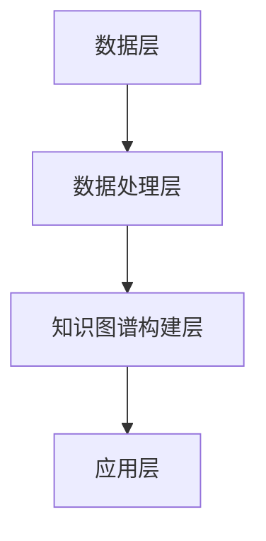
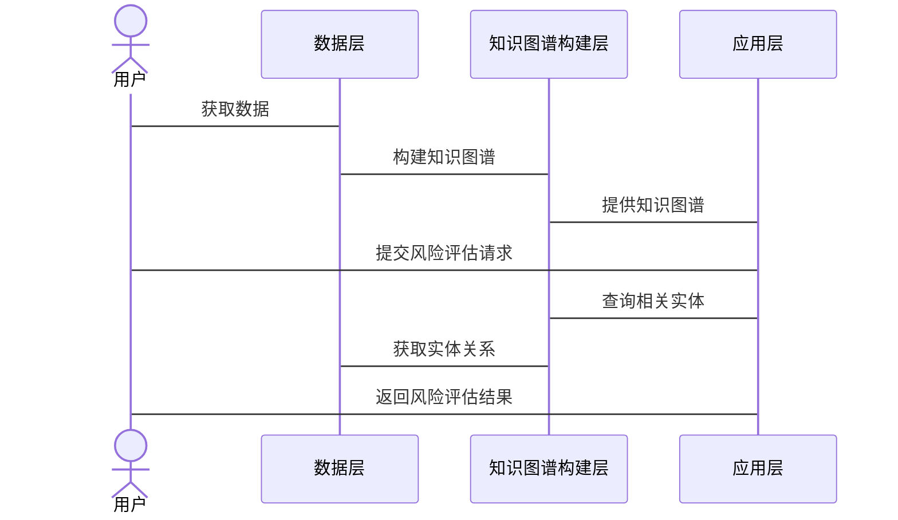

                 


# 《金融领域知识图谱的构建与应用》

## 关键词：知识图谱、金融、实体识别、关系抽取、风险控制、智能投顾

## 摘要：  
本文详细探讨了金融领域知识图谱的构建与应用。首先介绍了知识图谱的基本概念及其在金融领域的特点，然后分析了构建过程中的关键步骤，包括数据收集、预处理、实体识别和关系抽取，并讨论了相关挑战。接着，探讨了知识图谱在风险控制和智能投顾中的应用场景，并通过实际案例展示了其价值。最后，设计了一个完整的系统架构，并给出了项目实战与总结。

---

## 第一部分: 金融领域知识图谱的背景与概念

### 第1章: 知识图谱的基本概念

#### 1.1 知识图谱的定义与特点
知识图谱是一种以图结构形式表示知识的语义网络，由节点（实体）和边（关系）组成。其特点包括结构化、语义化、可扩展性和动态性。与传统数据库相比，知识图谱能够更好地捕捉数据之间的语义关系，支持复杂的关联分析。

#### 1.2 金融领域的知识图谱
金融领域的数据具有异构性和复杂性，知识图谱在金融分析、风险控制和智能投顾等领域有广泛应用。金融知识图谱构建的关键在于准确识别实体和关系，同时处理数据的多样性和动态变化。

#### 1.3 知识图谱的核心概念
- **实体**：金融领域的实体包括公司、股票、基金、市场等。
- **关系**：实体之间的关系，如“属于”、“影响”、“交易”等。
- **属性**：实体的属性，如公司名称、注册资本等。

---

### 第2章: 金融领域知识图谱的构建方法

#### 2.1 数据收集与预处理
- **数据来源**：包括金融数据库、新闻、社交媒体等。
- **数据清洗**：去重、标准化处理。
- **数据格式**：结构化数据便于后续处理。

#### 2.2 实体识别与抽取
- **基于规则的方法**：利用正则表达式识别公司名称。
- **基于机器学习的方法**：使用CRF模型进行命名实体识别。

#### 2.3 关系抽取与构建
- **基于规则的方法**：通过模板匹配识别关系。
- **基于模式匹配的方法**：使用深度学习模型如BERT进行关系抽取。

---

## 第二部分: 金融领域知识图谱的应用

### 第4章: 金融知识图谱在风险控制中的应用

#### 4.1 风险控制的基本概念
风险控制是通过识别、评估和管理潜在风险来减少损失。知识图谱在风险控制中的作用包括信用评估和欺诈检测。

#### 4.2 知识图谱在风险控制中的应用
- **信用评估**：通过分析实体间的关联关系，评估企业的信用风险。
- **欺诈检测**：识别异常交易模式，发现潜在的欺诈行为。

### 第5章: 金融知识图谱在智能投顾中的应用

#### 5.1 智能投顾的基本概念
智能投顾利用算法和模型提供个性化的投资建议。知识图谱在智能投顾中用于市场分析和客户画像。

#### 5.2 知识图谱在智能投顾中的应用
- **资产配置**：基于市场动态和客户偏好，优化投资组合。
- **市场分析**：通过分析实体关系，识别市场趋势。

---

## 第三部分: 系统架构与实现

### 第6章: 系统架构设计

#### 6.1 系统功能设计
- **数据采集模块**：收集多源数据。
- **数据处理模块**：清洗和预处理数据。
- **知识图谱构建模块**：进行实体识别和关系抽取。
- **应用模块**：提供风险控制和智能投顾功能。

#### 6.2 系统架构图


#### 6.3 系统接口设计
- **数据接口**：提供REST API访问数据。
- **构建接口**：定义实体和关系的API。
- **应用接口**：提供风险评估和投资建议的API。

---

## 第四部分: 总结与展望

### 第8章: 总结与最佳实践

#### 8.1 知识图谱构建的关键点
- 数据质量的重要性：高质量数据是构建准确知识图谱的基础。
- 实体识别与关系抽取的准确性：影响知识图谱的应用效果。
- 知识图谱的动态更新：金融市场的变化需要及时更新知识图谱。

#### 8.2 最佳实践
- 数据清洗：确保数据准确性和一致性。
- 实体识别：结合规则和机器学习方法提高准确率。
- 关系抽取：利用模板和深度学习模型提升效果。

---

## 作者：AI天才研究院/AI Genius Institute & 禅与计算机程序设计艺术 /Zen And The Art of Computer Programming

---

### 附录：代码示例

#### 2.1 实体识别的Python代码示例
```python
import spacy

nlp = spacy.load("en_core_web_sm")
text = "Apple Inc. is a company based in California."
doc = nlp(text)
for ent in doc.ents:
    print(f"Entity: {ent.text}, Label: {ent.label_}")
```

#### 4.1 风险评估的系统交互流程


---

### 拓展阅读
1. [知识图谱入门与实践](#)
2. [金融风险管理技术](#)
3. [智能投顾算法解析](#)

