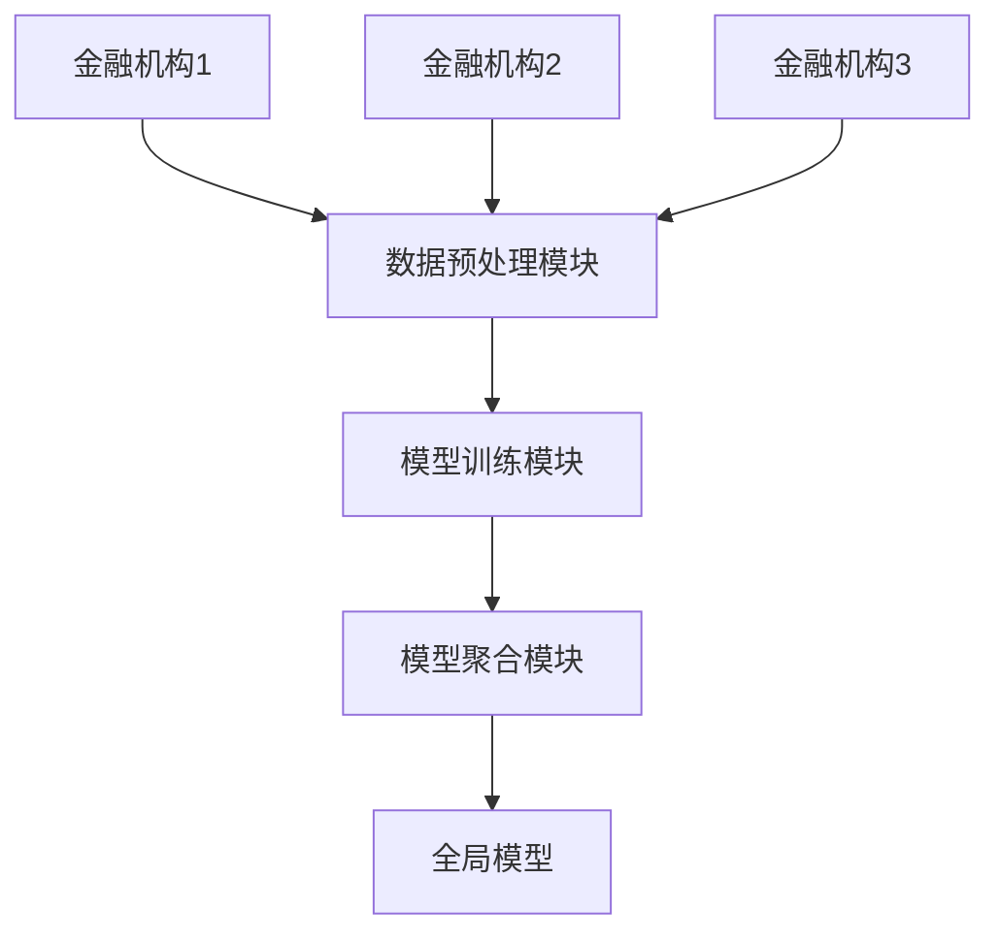
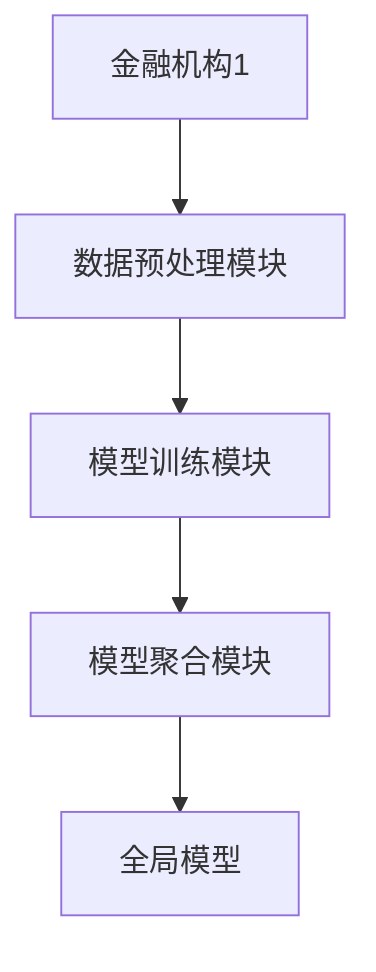

                 


# 金融领域联邦学习在跨机构信用评分与风险管理中的应用

> **关键词**: 联邦学习, 信用评分, 风险管理, 金融机构, 数据隐私, 横向联邦学习, 纵向联邦学习

> **摘要**: 本文深入探讨了联邦学习（Federated Learning）在金融领域的应用，特别是在跨机构信用评分与风险管理中的创新实践。通过分析联邦学习的核心概念、算法原理、系统架构以及实际案例，本文揭示了联邦学习如何在保护数据隐私的前提下，提升信用评分模型的准确性和泛化能力。文章还详细介绍了联邦学习的实现过程，包括数据预处理、模型训练、模型聚合等关键步骤，并通过实际项目实战展示了联邦学习在信用评分中的具体应用。最后，本文总结了联邦学习的优势与挑战，并提出了未来的研究方向。

---

## 第1章: 背景介绍

### 1.1 金融领域联邦学习的背景

#### 1.1.1 联邦学习的起源与定义
联邦学习是一种分布式的机器学习技术，旨在在不集中用户数据的前提下，通过分布式计算协同训练模型。其核心思想是“数据不出门，模型多跑路”，既保护了数据隐私，又实现了模型的联合优化。

#### 1.1.2 金融领域中的数据共享挑战
金融行业高度依赖数据驱动的决策，但数据孤岛现象严重。不同金融机构之间的数据难以共享，导致信用评分模型的泛化能力受限。此外，数据隐私和安全问题也是金融机构在数据共享时面临的重大挑战。

#### 1.1.3 跨机构信用评分与风险管理的现状
传统信用评分模型通常依赖单一机构的数据，难以全面评估借款人的信用风险。跨机构信用评分需要整合多家机构的数据，但数据共享的成本和隐私风险限制了这一目标的实现。

---

### 1.2 问题背景与问题描述

#### 1.2.1 传统信用评分模型的局限性
- 数据来源单一，难以全面反映借款人的信用状况。
- 数据量有限，模型泛化能力不足。
- 数据隐私问题导致跨机构合作受限。

#### 1.2.2 跨机构数据共享的痛点
- 数据隐私泄露风险。
- 数据格式和标准不统一。
- 数据共享的成本和效率问题。

#### 1.2.3 联邦学习如何解决这些问题
- 通过分布式计算，避免数据集中共享。
- 在保证数据隐私的前提下，协同训练信用评分模型。
- 提高模型的泛化能力和预测精度。

---

### 1.3 联邦学习的核心概念与边界

#### 1.3.1 联邦学习的核心概念
- **联邦学习**：分布式机器学习技术，通过协同训练模型，避免数据集中共享。
- **数据隐私**：保护参与机构的数据不被泄露。
- **模型聚合**：将各机构本地训练的模型参数进行融合，形成全局模型。

#### 1.3.2 联邦学习的边界与外延
- 联邦学习的边界：仅在模型层面进行协同，不涉及原始数据的共享。
- 联邦学习的外延：与区块链、同态加密等技术结合，进一步增强数据隐私保护。

#### 1.3.3 核心要素与组成结构
- 数据源：各金融机构的客户数据。
- 模型训练：本地模型训练与全局模型聚合。
- 通信机制：模型参数的同步与交换。

---

## 第2章: 联邦学习的核心概念与联系

### 2.1 联邦学习的原理与机制

#### 2.1.1 联邦学习的基本原理
- **数据分布**：数据分布在多个机构，每个机构持有部分数据。
- **模型训练**：每个机构在本地数据上训练模型，并将模型参数上传到中心服务器。
- **模型聚合**：中心服务器将各机构的模型参数进行聚合，形成全局模型。

#### 2.1.2 联邦学习的通信机制
- **数据不共享**：仅交换模型参数，不泄露原始数据。
- **安全通信**：通过加密通道进行通信，确保数据传输安全。
- **权限控制**：只有授权机构才能参与模型训练。

#### 2.1.3 联邦学习的安全与隐私保护
- **数据加密**：对模型参数进行加密，防止中间人攻击。
- **隐私保护**：通过差分隐私等技术，进一步保护数据隐私。

---

### 2.2 联邦学习与传统机器学习的对比

#### 2.2.1 核心原理对比
| 对比维度 | 联邦学习 | 传统机器学习 |
|----------|----------|---------------|
| 数据分布 | 分布式数据 | 集中式数据    |
| 模型训练 | 分布式训练 | 集中式训练    |
| 数据共享 | 不共享数据 | 共享数据      |

#### 2.2.2 模型训练过程对比
- 传统机器学习：数据集中到中心服务器，统一训练模型。
- 联邦学习：数据保持在本地，仅交换模型参数。

#### 2.2.3 优缺点对比
- **联邦学习优点**：保护数据隐私，适合跨机构合作。
- **联邦学习缺点**：通信成本较高，模型收敛速度较慢。

---

### 2.3 联邦学习在信用评分中的应用

#### 2.3.1 联邦学习如何提升信用评分模型
- **数据多样性**：整合多家机构的客户数据，提高模型的泛化能力。
- **隐私保护**：在不共享数据的前提下，协同训练信用评分模型。
- **实时性**：通过分布式计算，提高模型更新的实时性。

#### 2.3.2 联邦学习在信用评分中的具体应用场景
- **联合信用评分**：基于多家机构的数据，训练更准确的信用评分模型。
- **风险预警**：通过实时模型更新，提高信用风险预警能力。

---

## 第3章: 联邦学习的算法原理

### 3.1 联邦学习的算法分类

#### 3.1.1 横向联邦学习
- 数据按行分布，每个机构持有不同的样本。
- 适用于信用评分中的多机构联合建模。

#### 3.1.2 纵向联邦学习
- 数据按列分布，每个机构持有不同的特征。
- 适用于特征维度较高的场景。

#### 3.1.3 联邦学习的其他变体
- **混合联邦学习**：结合横向和纵向联邦学习的优势。
- **联邦迁移学习**：适用于数据分布差异较大的场景。

---

### 3.2 联邦学习的数学模型与公式

#### 3.2.1 联邦学习的优化目标
$$ \min_{\theta} \sum_{i=1}^n \mathcal{L}_i(\theta) $$

其中，$\theta$ 是模型参数，$\mathcal{L}_i(\theta)$ 是第 $i$ 个机构的损失函数。

#### 3.2.2 联邦学习的损失函数
$$ \mathcal{L}_i(\theta) = \frac{1}{m_i} \sum_{j=1}^{m_i} \mathcal{L}(\theta, x_j, y_j) $$

其中，$m_i$ 是第 $i$ 个机构的数据量，$(x_j, y_j)$ 是第 $j$ 个样本。

#### 3.2.3 联邦学习的更新规则
$$ \theta_{t+1} = \theta_t - \eta \sum_{i=1}^n \nabla \mathcal{L}_i(\theta_t) $$

其中，$\eta$ 是学习率，$\nabla \mathcal{L}_i(\theta_t)$ 是第 $i$ 个机构的梯度。

---

### 3.3 联邦学习的算法流程

#### 3.3.1 数据预处理
1. 数据清洗：处理缺失值、异常值。
2. 数据标准化：统一数据格式和特征尺度。

#### 3.3.2 模型训练
1. 初始化模型参数。
2. 每个机构在本地数据上训练模型，计算梯度。
3. 将梯度上传到中心服务器。

#### 3.3.3 模型聚合
1. 中心服务器收集所有机构的梯度。
2. 聚合梯度，更新全局模型参数。

#### 3.3.4 模型评估
1. 使用测试数据评估模型性能。
2. 根据评估结果调整模型参数。

---

## 第4章: 联邦学习的系统架构与设计

### 4.1 系统架构设计

#### 4.1.1 联邦学习的整体架构


#### 4.1.2 数据流的流向与处理


#### 4.1.3 通信协议的选择与实现
- **通信协议**：使用HTTPS进行安全通信。
- **数据格式**：使用JSON格式传输模型参数。

---

### 4.2 系统功能设计

#### 4.2.1 数据预处理模块
```python
def preprocess(data):
    # 处理缺失值
    data = data.dropna()
    # 标准化处理
    from sklearn.preprocessing import StandardScaler
    scaler = StandardScaler()
    data_scaled = scaler.fit_transform(data)
    return data_scaled
```

#### 4.2.2 模型训练模块
```python
def train_model(data, model):
    model.fit(data)
    return model
```

#### 4.2.3 模型聚合模块
```python
def aggregate_models(models):
    # 均值聚合
    avg_model = [sum([model[i] for model in models]) / len(models) for i in range(len(models[0]))]
    return avg_model
```

#### 4.2.4 模型评估模块
```python
def evaluate_model(model, test_data):
    from sklearn.metrics import accuracy_score
    y_pred = model.predict(test_data)
    accuracy = accuracy_score(test_data.target, y_pred)
    return accuracy
```

---

### 4.3 系统架构图

#### 4.3.1 系统架构的Mermaid图


#### 4.3.2 数据流的Mermaid图


---

## 第5章: 联邦学习在信用评分中的应用实战

### 5.1 项目环境安装与配置
```python
# 安装依赖
pip install numpy pandas scikit-learn requests
```

### 5.2 系统核心实现源代码

#### 5.2.1 数据预处理
```python
import pandas as pd
from sklearn.preprocessing import StandardScaler

def preprocess(data):
    data = data.dropna()
    scaler = StandardScaler()
    data_scaled = scaler.fit_transform(data)
    return data_scaled
```

#### 5.2.2 模型训练
```python
from sklearn.linear_model import LogisticRegression

def train_model(data, model):
    model.fit(data)
    return model
```

#### 5.2.3 模型聚合
```python
def aggregate_models(models):
    avg_model = [sum([model[i] for model in models]) / len(models) for i in range(len(models[0]))]
    return avg_model
```

#### 5.2.4 模型评估
```python
from sklearn.metrics import accuracy_score

def evaluate_model(model, test_data):
    y_pred = model.predict(test_data)
    accuracy = accuracy_score(test_data.target, y_pred)
    return accuracy
```

---

## 第6章: 总结与扩展

### 6.1 项目小结
通过联邦学习技术，我们成功实现了跨机构信用评分模型的联合训练，提升了模型的泛化能力和预测精度。同时，联邦学习在保护数据隐私的前提下，为金融机构之间的合作提供了新的可能性。

### 6.2 注意事项
- **数据隐私**：需要严格控制数据访问权限，防止数据泄露。
- **通信效率**：需要优化通信协议，降低通信成本。
- **模型收敛**：需要调整模型参数，提高模型收敛速度。

### 6.3 未来研究方向
- **联邦学习的优化**：探索更高效的模型聚合方法。
- **联邦学习的扩展**：研究联邦学习在其他金融场景中的应用。
- **技术结合**：将联邦学习与区块链、人工智能等技术结合，进一步提升数据隐私保护能力。

### 6.4 拓展阅读
- **推荐书籍**：《联邦学习：分布式机器学习新范式》
- **推荐论文**：《Federated Learning: Challenges, Methods, and Future Directions》

---

**作者：AI天才研究院/AI Genius Institute & 禅与计算机程序设计艺术 /Zen And The Art of Computer Programming**

