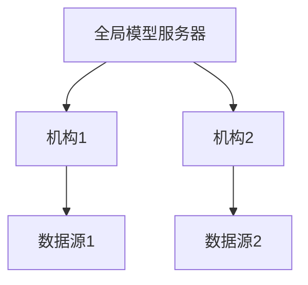
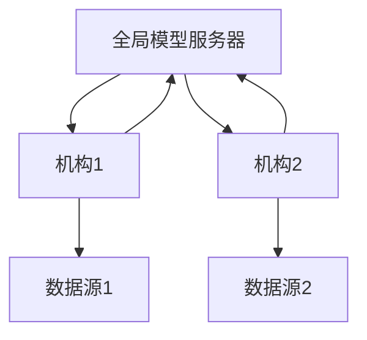

                 

# 《金融领域联邦学习在跨机构信用评分中的应用》

> **关键词**：联邦学习，跨机构，信用评分，金融，数据隐私，模型协作

> **摘要**：  
> 本文探讨了联邦学习在金融领域跨机构信用评分中的应用，详细分析了联邦学习的核心概念、技术原理、系统架构及实际案例。通过结合联邦学习的数学模型和算法实现，本文展示了如何在保护数据隐私的前提下，提升跨机构信用评分模型的性能和泛化能力。文章还提供了具体的项目实战和系统设计，为金融领域的从业者和技术爱好者提供了深入的技术参考。

---

# 第一部分：背景与概述

## 第1章：联邦学习与信用评分概述

### 1.1 联邦学习的基本概念

#### 1.1.1 联邦学习的定义与特点
联邦学习（Federated Learning）是一种分布式机器学习技术，允许多个机构在不共享原始数据的情况下，协作训练一个全局模型。其核心特点包括：
- **数据局部性**：数据分布在多个机构的本地存储中，不进行集中共享。
- **模型协作**：通过通信协议，各机构协作更新模型参数，最终获得全局模型。
- **隐私保护**：数据不出域，确保隐私安全。

#### 1.1.2 联邦学习的核心思想与优势
联邦学习的核心思想是“数据不动，模型动”。其主要优势包括：
- **数据隐私保护**：避免数据集中化带来的隐私泄露风险。
- **高效协作**：通过模型协作，实现跨机构的数据共享与模型优化。
- **灵活性**：适用于不同机构间数据分布不均的场景。

#### 1.1.3 联邦学习在金融领域的应用价值
在金融领域，联邦学习可以用于信用评分、欺诈检测、风险评估等多个场景。其在信用评分中的应用价值尤为突出：
- **提升模型性能**：通过跨机构数据协作，提高模型的泛化能力。
- **降低数据孤岛**：解决单机构数据不足的问题。
- **合规性**：符合金融行业的数据隐私法规（如GDPR、《个人信息保护法》等）。

### 1.2 跨机构信用评分的背景与挑战

#### 1.2.1 信用评分的定义与意义
信用评分是金融机构评估客户信用风险的重要工具，通常基于客户的财务状况、消费行为等信息。信用评分的准确性直接影响金融机构的信贷决策和风险管理。

#### 1.2.2 跨机构信用评分的难点
- **数据隐私**：不同机构的客户数据属于不同主体，不能直接共享。
- **数据分布不均**：单个机构的数据量可能不足以训练 robust 的模型。
- **模型协作复杂性**：需要设计高效的通信协议和模型更新机制。

#### 1.2.3 联邦学习如何解决跨机构数据共享问题
联邦学习通过模型协作的方式，避免了数据的直接共享，同时实现了跨机构的数据联合建模。具体来说：
- **数据不出域**：各机构仅分享模型参数，不共享原始数据。
- **模型更新同步**：通过通信协议，各机构协作更新模型参数，最终获得全局最优模型。

---

## 第2章：联邦学习的理论基础

### 2.1 联邦学习的核心概念

#### 2.1.1 数据联邦
数据联邦是指将分布在不同机构的数据通过联邦学习技术进行联合建模。其特点包括：
- **数据分布性**：数据分布在多个机构的本地存储中。
- **隐私保护**：通过加密和差分隐私技术，保护数据隐私。

#### 2.1.2 模型联邦
模型联邦是指在数据分布的环境下，通过模型协作机制，训练全局模型的过程。其核心步骤包括：
- **初始化**：各机构本地初始化模型参数。
- **模型更新**：各机构本地训练模型，并通过通信协议同步模型参数。
- **模型聚合**：通过联邦服务器或协调器，将各机构的模型参数聚合，更新全局模型。

#### 2.1.3 联邦学习的通信协议与安全性
联邦学习的通信协议包括数据传输、模型同步、参数更新等步骤。安全性方面，通常采用加密技术（如同态加密）和差分隐私技术，确保数据和模型的安全性。

### 2.2 联邦学习的数学基础

#### 2.2.1 联邦学习的数学模型概述
联邦学习的数学模型通常基于分布式优化算法，目标是最小化全局损失函数：
$$ L = \sum_{i=1}^{n} L_i $$
其中，$L_i$ 是第 $i$ 个机构的局部损失函数。

#### 2.2.2 分布式优化算法
联邦学习的核心算法是分布式优化算法，常用的是联邦平均（FedAvg）算法。其数学表达式为：
$$ \theta_{\text{new}} = \frac{1}{n} \sum_{i=1}^{n} \theta_i^{(t)} $$
其中，$\theta_i^{(t)}$ 是第 $i$ 个机构在第 $t$ 轮的模型参数，$\theta_{\text{new}}$ 是更新后的全局模型参数。

#### 2.2.3 加密与隐私保护技术
联邦学习中常用的隐私保护技术包括：
- **同态加密**：允许在加密数据上进行计算，结果仍保持加密状态。
- **差分隐私**：通过添加噪声，保护数据的隐私性。

---

# 第二部分：联邦学习在信用评分中的应用

## 第3章：信用评分的联邦学习模型构建

### 3.1 联邦学习在信用评分中的应用场景

#### 3.1.1 跨机构数据共享的必要性
在信用评分中，单个机构的数据量通常有限，无法训练 robust 的模型。通过联邦学习，多个机构可以联合建模，提升模型的泛化能力。

#### 3.1.2 联邦学习如何提升信用评分模型的性能
联邦学习通过联合多个机构的数据，提高了模型的多样性和泛化能力。具体表现在：
- **降低过拟合风险**：通过多机构数据的联合建模，减少模型对单机构数据的依赖。
- **提高模型鲁棒性**：通过多机构数据的协作，增强模型的泛化能力。

#### 3.1.3 联邦学习在信用评分中的优势
- **数据隐私保护**：避免了数据的集中共享，符合金融行业的隐私保护要求。
- **高效协作**：通过模型协作，实现了跨机构的数据联合建模。
- **灵活性**：适用于不同机构间数据分布不均的场景。

### 3.2 联邦学习模型的设计与实现

#### 3.2.1 模型构建的基本流程
联邦学习模型的构建流程包括：
1. 初始化全局模型参数。
2. 各机构本地训练模型，更新模型参数。
3. 通过通信协议同步模型参数，更新全局模型。

#### 3.2.2 模型参数的同步与更新机制
模型参数的同步与更新机制是联邦学习的核心。常用的是联邦平均（FedAvg）算法，其数学表达式为：
$$ \theta_{\text{new}} = \frac{1}{n} \sum_{i=1}^{n} \theta_i^{(t)} $$
其中，$\theta_i^{(t)}$ 是第 $i$ 个机构在第 $t$ 轮的模型参数，$\theta_{\text{new}}$ 是更新后的全局模型参数。

#### 3.2.3 联邦学习中的隐私保护技术
联邦学习中的隐私保护技术包括：
- **同态加密**：允许在加密数据上进行计算，结果仍保持加密状态。
- **差分隐私**：通过添加噪声，保护数据的隐私性。

---

## 第4章：信用评分的数学模型与算法

### 4.1 联邦学习的数学模型

#### 4.1.1 联邦学习的优化目标
联邦学习的优化目标是通过分布式优化算法，最小化全局损失函数：
$$ L = \sum_{i=1}^{n} L_i $$
其中，$L_i$ 是第 $i$ 个机构的局部损失函数。

#### 4.1.2 分布式优化算法
分布式优化算法是联邦学习的核心算法，常用的是联邦平均（FedAvg）算法。其数学表达式为：
$$ \theta_{\text{new}} = \frac{1}{n} \sum_{i=1}^{n} \theta_i^{(t)} $$
其中，$\theta_i^{(t)}$ 是第 $i$ 个机构在第 $t$ 轮的模型参数，$\theta_{\text{new}}$ 是更新后的全局模型参数。

#### 4.1.3 模型更新的数学推导
模型更新的数学推导通常基于梯度下降算法。假设损失函数为：
$$ L = \frac{1}{n} \sum_{i=1}^{n} L_i $$
则梯度为：
$$ \nabla L = \frac{1}{n} \sum_{i=1}^{n} \nabla L_i $$
模型参数更新为：
$$ \theta_{\text{new}} = \theta_{\text{old}} - \eta \nabla L $$
其中，$\eta$ 是学习率。

### 4.2 联邦学习中的算法实现

#### 4.2.1 分布式梯度下降算法
分布式梯度下降算法是联邦学习的核心算法之一。其基本步骤如下：
1. 初始化全局模型参数。
2. 各机构本地计算梯度，更新模型参数。
3. 通过通信协议同步模型参数，更新全局模型。

#### 4.2.2 联邦平均（FedAvg）算法
联邦平均算法是一种常用的模型更新算法，其数学表达式为：
$$ \theta_{\text{new}} = \frac{1}{n} \sum_{i=1}^{n} \theta_i^{(t)} $$
其中，$\theta_i^{(t)}$ 是第 $i$ 个机构在第 $t$ 轮的模型参数，$\theta_{\text{new}}$ 是更新后的全局模型参数。

#### 4.2.3 联邦学习中的加密算法
联邦学习中的加密算法包括：
- **同态加密**：允许在加密数据上进行计算，结果仍保持加密状态。
- **差分隐私**：通过添加噪声，保护数据的隐私性。

---

# 第三部分：系统架构与实现

## 第5章：系统架构设计

### 5.1 系统功能设计

#### 5.1.1 系统功能模块划分
系统功能模块包括：
1. 数据采集与预处理模块。
2. 模型训练与更新模块。
3. 结果展示与分析模块。

#### 5.1.2 数据采集与预处理模块
数据采集与预处理模块负责从各机构获取数据，并进行清洗、特征提取等预处理工作。常用的数据预处理方法包括：
- **数据清洗**：去除噪声数据，处理缺失值。
- **特征提取**：提取有助于模型训练的特征。

#### 5.1.3 模型训练与更新模块
模型训练与更新模块负责训练和更新模型参数。常用算法包括：
- **联邦平均（FedAvg）算法**。
- **分布式梯度下降算法**。

#### 5.1.4 结果展示与分析模块
结果展示与分析模块负责展示模型的训练结果，并进行性能分析。常用指标包括：
- **准确率**：模型预测的准确程度。
- **召回率**：模型预测的召回程度。
- **F1分数**：模型的综合性能指标。

### 5.2 系统架构图

#### 5.2.1 系统整体架构图（Mermaid）

#### 5.2.2 数据流与交互流程图（Mermaid）

---

## 第6章：系统实现与项目实战

### 6.1 环境搭建与依赖安装

#### 6.1.1 开发环境配置
开发环境配置包括：
- **操作系统**：建议使用 Linux 或 macOS。
- **编程语言**：Python 3.6+。
- **框架选择**：建议使用 Federated Learning Framework（如 TensorFlow Federated）。

#### 6.1.2 联邦学习框架的选择与安装
常用联邦学习框架包括：
- **TensorFlow Federated**：基于 TensorFlow 的联邦学习框架。
- **PyTorch Federated**：基于 PyTorch 的联邦学习框架。

#### 6.1.3 数据集的准备与预处理
数据集的准备与预处理包括：
- **数据获取**：从各机构获取数据。
- **数据清洗**：去除噪声数据，处理缺失值。
- **特征提取**：提取有助于模型训练的特征。

### 6.2 核心代码实现

#### 6.2.1 数据联邦的实现
数据联邦的实现包括：
1. 数据采集与预处理。
2. 数据分布与隐私保护。

#### 6.2.2 模型联邦的实现
模型联邦的实现包括：
1. 模型初始化与训练。
2. 模型更新与聚合。

#### 6.2.3 系统接口设计
系统接口设计包括：
- **数据接口**：数据采集与预处理接口。
- **模型接口**：模型训练与更新接口。
- **结果接口**：结果展示与分析接口。

---

## 第7章：最佳实践与总结

### 7.1 小结
通过本文的介绍，我们了解了联邦学习在金融领域跨机构信用评分中的应用。联邦学习通过模型协作的方式，解决了跨机构数据共享的难题，同时保证了数据隐私和模型性能。

### 7.2 注意事项
在实际应用中，需要注意以下几点：
- **数据隐私保护**：确保数据不出域，避免隐私泄露。
- **模型调优**：根据实际场景，调整模型参数和优化算法。
- **系统性能优化**：通过优化通信协议和计算效率，提升系统性能。

### 7.3 拓展阅读
推荐以下拓展阅读内容：
- **《Federated Learning: Challenges, Methods, and Future Directions》**
- **《Differential Privacy and Its Application to Federated Learning》**

---

# 作者：AI天才研究院 & 禅与计算机程序设计艺术

---

以上是《金融领域联邦学习在跨机构信用评分中的应用》的完整目录大纲和文章内容。希望对您有所帮助！

