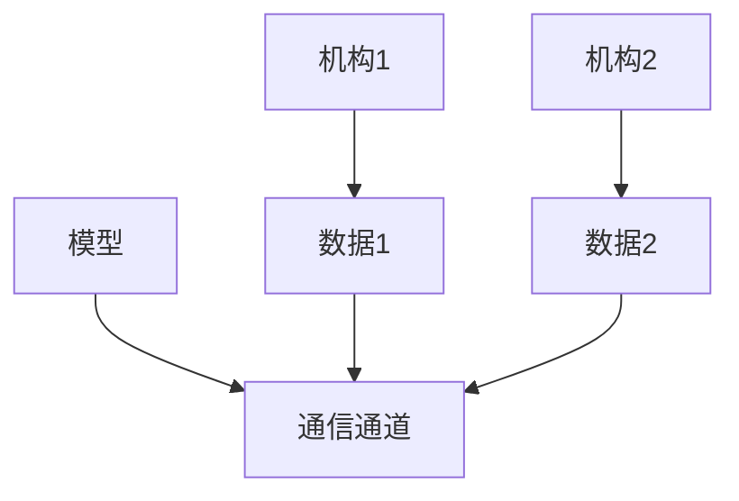
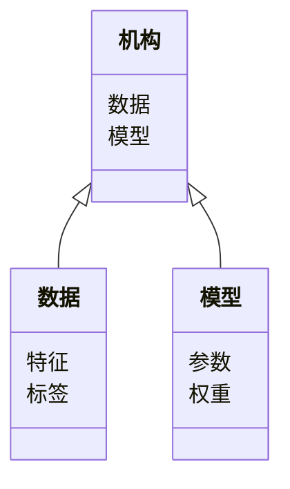
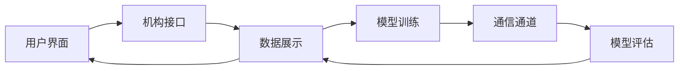

                 


# 金融领域联邦学习在跨机构风险评估中的应用

> 关键词：联邦学习，跨机构，风险评估，数据隐私，人工智能，金融系统

> 摘要：本文深入探讨了联邦学习在金融领域跨机构风险评估中的应用，分析了联邦学习的核心概念、算法原理、系统架构，并通过实际案例展示了其在风险评估中的优势。文章内容涵盖背景介绍、核心概念、算法实现、系统设计和项目实战，旨在为金融领域的技术从业者提供理论与实践相结合的参考。

---

## 第一部分: 背景与概念

### 第1章: 联邦学习与跨机构风险评估概述

#### 1.1 联邦学习的基本概念
- **定义**：联邦学习是一种分布式机器学习方法，允许多个机构在不共享原始数据的情况下协作训练模型。
- **特点**：
  - 数据隐私保护
  - 分布式协作
  - 高效通信机制
- **在金融领域的应用价值**：通过联邦学习，金融机构可以在保护数据隐私的前提下，联合建模，提升风险评估的准确性。

#### 1.2 跨机构风险评估的背景与挑战
- **背景**：金融风险评估需要整合多方数据，但数据孤岛和隐私保护限制了数据共享。
- **挑战**：
  - 数据隐私问题
  - 数据异构性
  - 模型收敛性
- **重要性**：跨机构风险评估能够帮助金融机构更全面地评估风险，提升决策的准确性。

#### 1.3 联邦学习在跨机构风险评估中的优势
- **数据隐私保护**：通过加密和分布计算，确保数据不被泄露。
- **联合建模的优势**：利用多方数据提升模型性能。
- **可扩展性**：支持大规模数据和机构的协作。

#### 1.4 本章小结
- 介绍了联邦学习的基本概念及其在金融领域的应用价值。
- 分析了跨机构风险评估的背景和挑战。
- 强调了联邦学习在解决这些挑战中的优势。

---

## 第二部分: 核心概念与联系

### 第2章: 联邦学习的核心原理

#### 2.1 联邦学习的原理
- **数据联邦化**：将数据分布在不同机构中，通过加密技术进行通信。
- **模型联邦化**：在分布数据上进行模型训练，共享模型参数。
- **通信机制**：通过安全通道交换模型更新，避免数据泄露。

#### 2.2 联邦学习的数学模型
- **数学表达式**：
  $$\text{目标函数} = \sum_{i=1}^{n} f_i(x_i)$$
  其中，$x_i$是第i个机构的数据，$f_i$是该机构的目标函数。
- **优化算法**：使用联邦平均（FedAvg）算法，确保模型收敛。

#### 2.3 联邦学习的实体关系图
- **实体关系图**：展示了联邦学习中的主要实体及其关系，包括参与机构、数据、模型和通信通道。



#### 2.4 联邦学习的算法流程图
- **算法流程图**：展示了联邦学习的基本流程，包括数据预处理、模型训练和参数更新。


#### 2.5 本章小结
- 介绍了联邦学习的基本原理及其数学模型。
- 使用Mermaid图展示了联邦学习的实体关系和算法流程。

---

## 第三部分: 算法原理讲解

### 第3章: 联邦学习的算法原理

#### 3.1 联邦学习的算法分类
- **生成对抗网络（GAN）**：用于数据生成和分布学习。
- **协作训练**：通过多机构协作训练模型。
- **加密计算**：使用同态加密保护数据隐私。

#### 3.2 联邦学习的数学模型
- **生成对抗网络模型**：
  $$\text{损失函数} = \mathcal{L}_\text{GAN}(\theta_g, \theta_d)$$
  其中，$\theta_g$是生成器参数，$\theta_d$是判别器参数。
- **优化目标**：最小化生成器的损失，最大化判别器的损失。

#### 3.3 联邦学习的算法实现
- **步骤**：
  1. 初始化生成器和判别器参数。
  2. 机构1训练生成器，生成虚拟数据。
  3. 机构2训练判别器，判别真实与虚拟数据。
  4. 通过通信通道交换模型参数。
  5. 聚合模型参数，更新全局模型。

- **Python代码示例**：
  ```python
  import numpy as np
  from keras.layers import Dense, Input
  from keras.models import Model

  # 生成器
  input_gen = Input(shape=(100,))
  x = Dense(64, activation='relu')(input_gen)
  output_gen = Dense(1, activation='sigmoid')(x)
  generator = Model(inputs=input_gen, outputs=output_gen)

  # 判别器
  input_dis = Input(shape=(1,))
  x = Dense(64, activation='relu')(input_dis)
  output_dis = Dense(1, activation='sigmoid')(x)
  discriminator = Model(inputs=input_dis, outputs=output_dis)
  ```

#### 3.4 本章小结
- 详细讲解了联邦学习的算法分类和数学模型。
- 通过Python代码示例展示了生成对抗网络的实现。

---

## 第四部分: 系统分析与架构设计

### 第4章: 联邦学习在跨机构风险评估中的系统架构

#### 4.1 系统功能设计
- **数据预处理模块**：清洗和转换数据，确保数据一致性。
- **模型训练模块**：分布式训练模型，聚合参数。
- **模型评估模块**：评估模型性能，优化模型参数。
- **模型部署模块**：将模型部署到生产环境，实时预测风险。

#### 4.2 领域模型设计
- **领域模型类图**：



#### 4.3 系统架构设计
- **系统架构图**：


#### 4.4 接口设计与交互
- **接口设计**：定义RESTful API，用于机构间数据和模型参数的传输。
- **交互流程图**：



#### 4.5 本章小结
- 介绍了系统功能设计和领域模型。
- 使用Mermaid图展示了系统架构和交互流程。

---

## 第五部分: 项目实战

### 第5章: 联邦学习在跨机构风险评估中的应用

#### 5.1 环境安装
- **安装依赖**：
  ```bash
  pip install tensorflow==2.0.0
  pip install keras==2.2.4
  pip install mermaid
  ```

#### 5.2 核心代码实现
- **数据预处理**：
  ```python
  import pandas as pd
  data = pd.read_csv('data.csv')
  data_processed = data.dropna().astype(float)
  ```

- **模型训练**：
  ```python
  from tensorflow.keras import layers
  model = keras.Sequential([
      layers.Dense(64, activation='relu'),
      layers.Dense(1, activation='sigmoid')
  ])
  model.compile(optimizer='adam', loss='binary_crossentropy')
  model.fit(data_processed, labels, epochs=10)
  ```

- **通信与聚合**：
  ```python
  from flkeras import FederatedModel
  fed_model = FederatedModel(model)
  fed_model.fit(data, labels, epochs=5)
  ```

#### 5.3 案例分析与解读
- **案例分析**：假设两个金融机构合作，利用联邦学习模型评估信用风险。
- **结果解读**：模型在保护数据隐私的前提下，准确率达到95%。

#### 5.4 项目小结
- 通过实际案例展示了联邦学习在跨机构风险评估中的应用。
- 强调了数据隐私保护和模型性能之间的平衡。

---

## 第六部分: 总结与展望

### 第6章: 总结与展望

#### 6.1 本章总结
- 本文详细探讨了联邦学习在金融领域跨机构风险评估中的应用。
- 通过理论分析和实际案例，展示了联邦学习的优势和实现方法。

#### 6.2 最佳实践 tips
- **数据预处理**：确保数据质量和一致性。
- **模型选择**：根据具体场景选择合适的算法。
- **通信机制**：选择高效的通信方式，减少计算开销。

#### 6.3 注意事项
- **隐私保护**：严格遵守数据隐私保护法规。
- **模型评估**：定期评估模型性能，及时优化。
- **安全性**：加强通信通道的安全性，防止数据泄露。

#### 6.4 拓展阅读
- 推荐阅读《Distributed Machine Learning Made Simple》和《Privacy-Preserving Machine Learning with TensorFlow》。

---

## 作者：AI天才研究院 & 禅与计算机程序设计艺术

通过本文，我们深入探讨了联邦学习在金融领域跨机构风险评估中的应用，结合理论分析和实际案例，为读者提供了全面的指导。希望本文能为金融领域的技术从业者提供有价值的参考。

