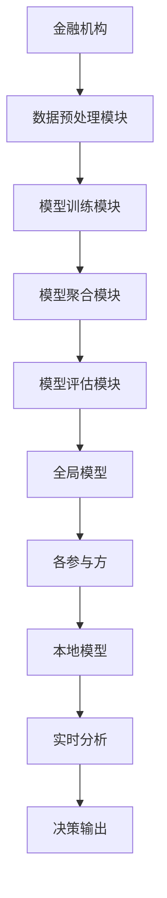
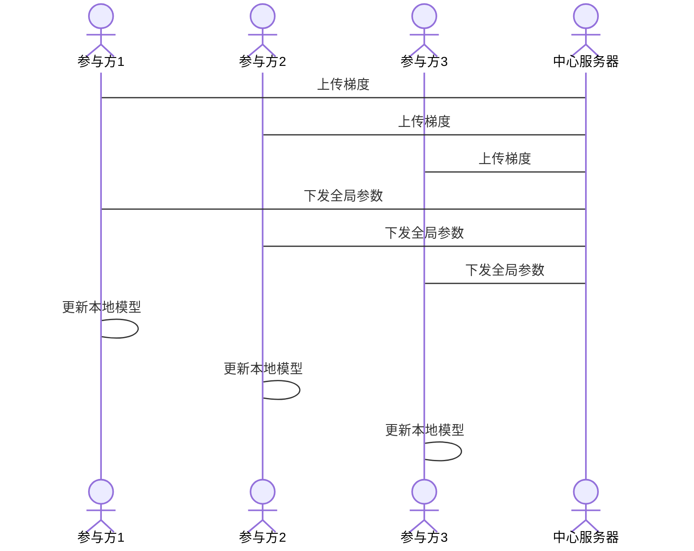

                 


# 《金融领域联邦学习在隐私保护中的应用》

> 关键词：联邦学习，隐私保护，金融数据，数据安全，模型训练，隐私计算

> 摘要：本文深入探讨了联邦学习在金融领域的应用，特别是在隐私保护方面的创新与实践。文章从联邦学习的基本概念出发，分析其在金融数据安全中的重要作用，详细阐述了联邦学习的核心算法原理、系统架构设计、实际应用场景以及最佳实践方法。通过具体案例分析，展示了联邦学习如何在保护隐私的前提下，高效地进行金融数据分析与模型训练，为金融行业的数字化转型提供了重要的理论支持与实践指导。

---

# 第一部分: 联邦学习与隐私保护概述

## 第1章: 联邦学习与隐私保护背景介绍

### 1.1 联邦学习的基本概念
#### 1.1.1 联邦学习的定义与核心思想
- 联邦学习（Federated Learning）是一种分布式机器学习技术，旨在在数据不集中存储的情况下，通过多方协作完成模型训练。
- 核心思想：数据不出域，模型多训练。

#### 1.1.2 联邦学习的起源与发展
- 起源：为了解决数据孤岛问题，提升模型泛化能力。
- 发展：从学术研究到工业应用，逐步成熟。

#### 1.1.3 联邦学习在金融领域的应用背景
- 金融数据的分散性：银行、支付机构等各自拥有数据。
- 隐私保护的刚需：金融数据涉及用户隐私和商业机密。
- 合规要求：《GDPR》、《个人信息保护法》等法规约束。

### 1.2 隐私保护的重要性
#### 1.2.1 金融数据的敏感性分析
- 用户信息：姓名、身份证号、手机号、银行卡号等。
- 交易数据：交易时间、金额、地点、方式等。
- 风险评估：信用评分、欺诈检测等敏感信息。

#### 1.2.2 隐私泄露的潜在风险
- 个人信息泄露可能导致身份盗窃、金融诈骗。
- 商业机密泄露可能影响金融机构的竞争优势。
- 法律合规风险：违规可能面临罚款、诉讼等。

#### 1.2.3 金融隐私保护的法律法规与合规要求
- 《通用数据保护条例》（GDPR）：严格限制数据处理和共享。
- 《中华人民共和国个人信息保护法》：规定数据处理者必须承担的义务。
- 金融行业的内控制度：如反洗钱（AML）、支付清算系统等。

### 1.3 联邦学习与隐私保护的核心问题
#### 1.3.1 数据孤岛问题
- 数据分布：数据分布在不同机构，难以集中。
- 数据异构性：数据格式、结构不同，难以统一处理。

#### 1.3.2 数据隐私与模型训练的平衡
- 如何在保护数据隐私的前提下，提升模型性能。
- 数据可用性与隐私保护的矛盾。

#### 1.3.3 联邦学习中的安全威胁与防护措施
- 数据泄露风险：恶意攻击者可能窃取模型参数或训练数据。
- 通信安全：数据传输过程中可能被截获或篡改。
- 模型安全：模型可能被攻击者操控，导致错误决策。

---

## 第2章: 联邦学习的核心概念与联系

### 2.1 联邦学习的原理与机制
#### 2.1.1 联邦学习的基本原理
- 数据不集中：模型参数在中心服务器汇总，数据在边缘设备处理。
- 分散训练：每个参与方本地训练模型，然后将梯度或模型参数上传到中心服务器。
- 联合优化：通过多轮迭代，逐步优化全局模型，提升性能。

#### 2.1.2 联邦学习的通信机制
- 梯度上传：参与方计算梯度，上传到中心服务器。
- 参数下载：参与方定期下载全局参数，更新本地模型。
- 同步与异步模式：同步模式下，所有参与方同时更新；异步模式下，参与方可以按需更新。

#### 2.1.3 联邦学习的同步与异步模式
- 同步模式：所有参与方同时进行训练，确保数据一致性。
- 异步模式：参与方可以随时上传梯度，适合数据量大的场景。

### 2.2 联邦学习与其他隐私保护技术的对比
#### 2.2.1 联邦学习与数据加密技术的对比
- 数据加密：数据在传输过程中加密，防止被窃听。
- 联邦学习：数据不离开本地，通过模型参数更新实现协作。

#### 2.2.2 联邦学习与数据脱敏技术的对比
- 数据脱敏：对数据进行匿名化处理，降低隐私风险。
- 联邦学习：通过模型训练，直接在原始数据上进行分析，保护数据隐私。

#### 2.2.3 联邦学习与同态加密技术的对比
- 同态加密：允许在加密数据上进行计算，结果仍为加密状态。
- 联邦学习：通过参数聚合，间接实现数据协作，隐私保护效果更好。

### 2.3 联邦学习的ER实体关系图
```mermaid
er
  actor: 金融机构
  actor: 客户
  actor: 第三方服务
  entity: 金融数据
  entity: 模型参数
  entity: 训练任务
  relationship: 金融机构拥有金融数据
  relationship: 金融机构拥有模型参数
  relationship: 第三方服务提供训练任务
  relationship: 金融数据与模型参数相关联
```

---

## 第3章: 联邦学习算法原理

### 3.1 联邦学习的算法流程
#### 3.1.1 数据预处理阶段
- 数据清洗：去除噪声数据，处理缺失值。
- 数据标准化：统一数据格式，确保各参与方的数据可比。

#### 3.1.2 模型训练阶段
- 每个参与方使用本地数据训练模型，计算梯度。
- 梯度上传到中心服务器，更新全局模型参数。

#### 3.1.3 模型聚合阶段
- 中心服务器汇总所有参与方的梯度，计算全局更新参数。
- 将更新后的参数分发给各参与方，更新本地模型。

#### 3.1.4 模型更新阶段
- 参与方下载全局参数，更新本地模型。
- 重复训练-聚合-更新过程，直到模型收敛或达到预设轮数。

### 3.2 联邦学习的数学模型
#### 3.2.1 分散训练过程
$$ y_i = \theta x_i + \epsilon $$
- 其中，$x_i$ 是输入数据，$\theta$ 是模型参数，$y_i$ 是预测结果，$\epsilon$ 是误差项。

#### 3.2.2 模型聚合过程
$$ \theta_{new} = \frac{1}{n}\sum_{i=1}^{n}\theta_i $$
- $n$ 是参与方的数量，$\theta_i$ 是第 $i$ 个参与方的本地模型参数。

#### 3.2.3 模型更新过程
$$ \theta_i^{new} = \theta_i + \alpha (\theta_{new} - \theta_i) $$
- $\alpha$ 是学习率，控制更新步长。

### 3.3 联邦学习的算法实现
#### 3.3.1 梯度上传与参数聚合
- 参与方计算梯度：$\nabla L_i = \frac{\partial L}{\partial \theta_i}$
- 梯度上传到中心服务器：$\nabla L_{total} = \sum_{i=1}^{n} \nabla L_i$
- 更新全局参数：$\theta_{new} = \theta + \eta \nabla L_{total}$
- $\eta$ 是学习率，控制更新步长。

#### 3.3.2 模型权重更新策略
- 同步更新：所有参与方同时更新模型参数。
- 异步更新：参与方可以按需更新，减少通信开销。

#### 3.3.3 联邦学习的收敛性分析
- 收敛条件：当模型参数的变化小于预设阈值时，停止训练。
- 收敛速度：与参与方数量、数据分布、模型复杂度等因素有关。

---

## 第4章: 联邦学习的系统架构与设计

### 4.1 问题场景介绍
#### 4.1.1 金融数据的分布式存储
- 数据分布在不同金融机构，无法集中存储。
- 数据格式、结构可能不同，难以统一处理。

#### 4.1.2 多方参与的模型训练需求
- 金融机构之间需要协作训练模型，提升预测精度。
- 模型需要适应不同机构的业务特点。

#### 4.1.3 隐私保护下的实时分析需求
- 实时监控交易行为，防范欺诈。
- 快速响应市场变化，优化业务决策。

### 4.2 系统功能设计
#### 4.2.1 数据预处理模块
- 数据清洗：处理缺失值、异常值。
- 数据标准化：统一数据格式，确保各参与方的数据可比。

#### 4.2.2 模型训练模块
- 本地训练：参与方使用本地数据训练模型，计算梯度。
- 梯度上传：将梯度上传到中心服务器，更新全局模型参数。

#### 4.2.3 模型聚合模块
- 参数聚合：汇总所有参与方的梯度，计算全局更新参数。
- 参数分发：将更新后的参数分发给各参与方，更新本地模型。

#### 4.2.4 模型评估模块
- 模型评估：使用测试数据评估模型性能，计算准确率、召回率等指标。
- 模型优化：根据评估结果，调整模型参数，提升性能。

### 4.3 系统架构设计


### 4.4 系统接口设计
- 数据接口：定义数据格式、传输协议，确保各参与方数据互通。
- 模型接口：定义模型参数格式、训练接口，确保各参与方协作训练。
- 通信接口：定义通信协议、数据传输方式，确保数据安全传输。

### 4.5 系统交互流程


---

## 第5章: 项目实战与案例分析

### 5.1 环境安装与配置
- 安装Python环境：使用Anaconda或虚拟环境。
- 安装依赖库：如TensorFlow、Flask、gRPC等。
- 配置分布式环境：搭建多台服务器，配置通信协议。

### 5.2 核心系统实现
#### 5.2.1 数据预处理代码
```python
import pandas as pd
from sklearn.preprocessing import StandardScaler

# 加载数据
data = pd.read_csv('financial_data.csv')

# 数据清洗
data.dropna()
data = data.drop_duplicates()

# 数据标准化
scaler = StandardScaler()
scaled_data = scaler.fit_transform(data)
```

#### 5.2.2 模型训练代码
```python
import tensorflow as tf
from tensorflow.keras import layers

# 定义模型
model = tf.keras.Sequential([
    layers.Dense(64, activation='relu'),
    layers.Dense(1, activation='sigmoid')
])

# 编译模型
model.compile(optimizer='adam', loss='binary_crossentropy', metrics=['accuracy'])

# 训练模型
model.fit(x_train, y_train, epochs=10, batch_size=32)
```

#### 5.2.3 模型聚合代码
```python
# 梯度聚合
def aggregate_gradients(gradients):
    return tf.reduce_mean(gradients, axis=0)

# 更新全局参数
global_weights = global_weights + learning_rate * aggregate_gradients(gradients)
```

### 5.3 案例分析与详细讲解
#### 5.3.1 案例背景
- 某大型银行希望与多家机构协作训练客户信用评分模型。
- 数据分布：客户交易记录分布在多个分支机构。

#### 5.3.2 案例实现
- 数据预处理：清洗和标准化客户数据。
- 模型训练：各分支机构本地训练信用评分模型。
- 模型聚合：中心服务器聚合各分支机构的梯度，更新全局模型。

#### 5.3.3 案例效果
- 模型准确率提升：通过联邦学习，模型性能优于单机构训练。
- 隐私保护：客户数据未被集中存储，隐私风险降低。

### 5.4 项目小结
- 联邦学习能够有效解决金融数据的分布式训练问题。
- 通过联邦学习，可以在保护隐私的前提下，提升模型性能。
- 项目实现的关键点：数据预处理、模型训练、模型聚合。

---

## 第6章: 最佳实践与注意事项

### 6.1 最佳实践
#### 6.1.1 数据预处理阶段
- 数据清洗：确保数据质量，去除噪声。
- 数据标准化：统一数据格式，确保各参与方数据可比。

#### 6.1.2 模型训练阶段
- 参数设置：合理设置学习率、批量大小等超参数。
- 模型选择：根据业务需求选择合适模型架构。

#### 6.1.3 模型聚合阶段
- 梯度聚合：采用合适的聚合方法，确保全局模型准确。
- 参数更新：合理设置更新频率，平衡通信开销与模型收敛速度。

### 6.2 注意事项
#### 6.2.1 数据安全
- 数据加密：数据传输过程中加密，防止被截获。
- 权限管理：严格控制数据访问权限，确保只有授权方可以访问数据。

#### 6.2.2 模型安全
- 模型监控：实时监控模型行为，防止被恶意攻击者操控。
- 模型审计：记录模型训练过程，确保模型行为符合预期。

#### 6.2.3 系统性能
- 通信效率：优化通信协议，减少数据传输量。
- 计算效率：合理分配计算资源，确保模型训练高效进行。

### 6.3 拓展阅读
- 《Federated Learning: Challenges, Methods, and Applications》
- 《Privacy-Preserving Machine Learning with Federated Learning: A Survey》

---

## 第7章: 小结与展望

### 7.1 小结
- 联邦学习是一种分布式机器学习技术，可以在保护隐私的前提下，实现多方协作模型训练。
- 本文详细介绍了联邦学习的基本概念、算法原理、系统架构设计、项目实现以及最佳实践。
- 通过具体案例分析，展示了联邦学习在金融领域的实际应用价值。

### 7.2 未来展望
- 技术创新：研究更高效的联邦学习算法，提升模型性能。
- 应用扩展：探索联邦学习在其他领域的应用，如医疗、教育等。
- 标准化建设：推动联邦学习相关标准的制定与实施，确保技术的规范使用。

---

## 作者

作者：AI天才研究院/AI Genius Institute & 禅与计算机程序设计艺术 /Zen And The Art of Computer Programming

---

# 结束语

本文通过系统性地分析联邦学习在金融隐私保护中的应用，为读者提供了从理论到实践的全面指导。希望本文能够为金融行业的技术从业者提供有价值的参考，同时也为学术界的研究者提供新的研究方向。未来，随着技术的不断进步，联邦学习将在更多领域发挥重要作用，我们拭目以待。

