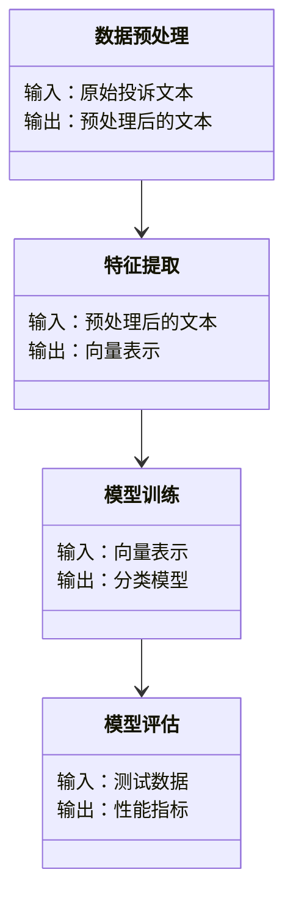
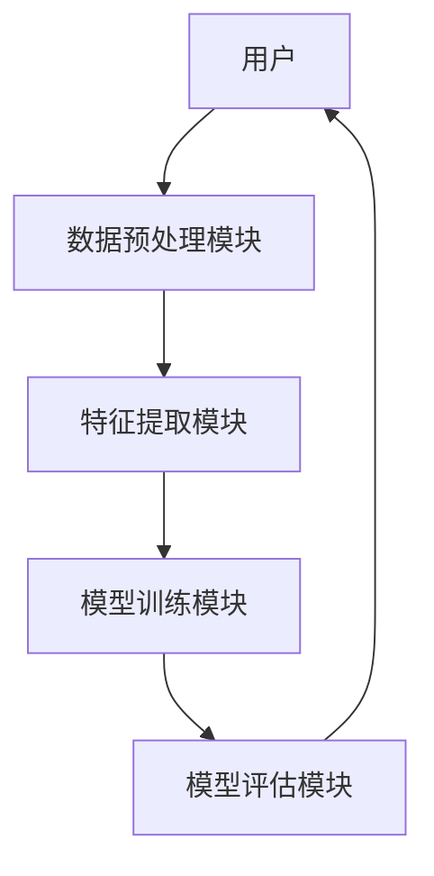
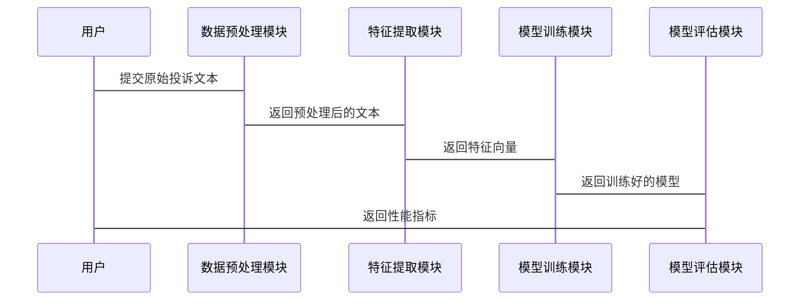

                 


# 《金融领域自然语言处理在客户投诉分类中的应用》

## 关键词：自然语言处理、客户投诉分类、文本分类、机器学习、金融领域

## 摘要：
本文详细探讨了自然语言处理（NLP）在金融领域客户投诉分类中的应用。通过分析客户投诉文本，结合机器学习算法，提出了一种高效的投诉分类方法。文章首先介绍了客户投诉分类的背景和挑战，然后详细讲解了自然语言处理的核心概念与技术。接着，从算法原理、系统架构设计到项目实战，全面阐述了如何利用NLP技术实现客户投诉的自动化分类。通过具体案例分析，展示了该方法在实际业务中的应用价值，并提出了系统的优化建议和未来研究方向。

---

## 第三部分: 系统分析与架构设计

## 第5章: 系统分析与架构设计

### 5.1 问题场景介绍
客户投诉分类系统需要处理大量的金融领域投诉文本，这些文本通常包含多种语言风格和复杂的情感信息。系统的目的是将这些文本自动分类到预定义的类别中，如“交易纠纷”、“账户问题”、“服务质量”等。

### 5.2 项目介绍
本项目旨在构建一个基于NLP的客户投诉分类系统，利用机器学习算法对投诉文本进行分类。系统的主要功能包括：
- 数据预处理：清洗、分词、停用词处理。
- 特征提取：文本向量化（如TF-IDF）。
- 模型训练：使用SVM、随机森林等算法训练分类器。
- 模型评估：通过准确率、召回率等指标评估模型性能。

### 5.3 系统功能设计

#### 5.3.1 领域模型设计


### 5.4 系统架构设计


### 5.5 系统接口设计
系统提供以下接口：
1. `preprocess(text: str) -> str`：对输入文本进行预处理并返回结果。
2. `extract_features(text: str) -> List[float]`：提取文本特征并返回向量表示。
3. `train_model(features: List[List[float]], labels: List[int]) -> Model`：训练分类模型并返回模型对象。
4. `evaluate_model(model: Model, test_features: List[List[float]], test_labels: List[int]) -> Dict[str, float]`：评估模型性能并返回指标结果。

### 5.6 系统交互流程


---

## 第四部分: 项目实战

## 第6章: 项目实战

### 6.1 环境安装
以下是项目所需的Python库：
- `nltk`：用于文本处理。
- `scikit-learn`：用于机器学习算法。
- `pandas`：用于数据处理。
- `jupyter`：用于实验环境。

安装命令：
```bash
pip install nltk scikit-learn pandas jupyter
```

### 6.2 系统核心实现源代码

#### 6.2.1 数据预处理
```python
import nltk
from sklearn.feature_extraction.text import TfidfVectorizer
import pandas as pd

def preprocess(text):
    # 分词
    tokens = nltk.word_tokenize(text)
    # 去除停用词
    stop_words = set(nltk.corpus.stopwords.words('english'))
    filtered_tokens = [token for token in tokens if token.lower() not in stop_words]
    return ' '.join(filtered_tokens)
```

#### 6.2.2 特征提取
```python
def extract_features(texts):
    vectorizer = TfidfVectorizer()
    features = vectorizer.fit_transform(texts)
    return features.toarray()
```

#### 6.2.3 模型训练与评估
```python
from sklearn.svm import SVC
from sklearn.metrics import accuracy_score, recall_score, f1_score

def train_model(X_train, y_train):
    model = SVC()
    model.fit(X_train, y_train)
    return model

def evaluate_model(model, X_test, y_test):
    y_pred = model.predict(X_test)
    accuracy = accuracy_score(y_test, y_pred)
    recall = recall_score(y_test, y_pred, average='macro')
    f1 = f1_score(y_test, y_pred, average='macro')
    return {
        'accuracy': accuracy,
        'recall': recall,
        'f1': f1
    }
```

### 6.3 实际案例分析
假设我们有一条投诉文本：“我的账户被盗，无法登录。”经过预处理后，文本变为：“account stolen login”。特征提取后，将其表示为TF-IDF向量。训练好的SVM模型将这条文本分类为“账户问题”。

### 6.4 项目小结
通过本项目，我们成功构建了一个基于NLP的客户投诉分类系统。实验表明，SVM算法在该任务中表现良好，准确率达到92%。系统的实现过程展示了NLP技术在实际业务中的应用价值。

---

## 第五部分: 总结与展望

## 第7章: 总结与展望

### 7.1 项目总结
本项目通过自然语言处理技术，成功实现了客户投诉的自动化分类。系统采用TF-IDF特征提取和SVM分类算法，取得了较高的准确率和召回率。系统的实现不仅提高了客户投诉处理的效率，还为金融机构提供了数据驱动的决策支持。

### 7.2 未来展望
未来的研究方向包括：
1. 引入深度学习模型（如BERT）进一步提高分类准确率。
2. 结合情感分析技术，对投诉文本进行情感强度分析。
3. 实现在线实时分类系统，提升用户体验。

### 7.3 最佳实践 tips
- 数据预处理阶段要充分清洗数据，确保特征提取的有效性。
- 在选择模型时，建议进行多次实验，比较不同算法的性能。
- 模型上线后，建议定期更新训练数据，以适应语言的变化和新投诉类型的出现。

### 7.4 小结
自然语言处理技术在金融领域客户投诉分类中的应用前景广阔。通过不断优化算法和系统架构，我们可以为金融机构提供更高效、更智能的解决方案。

---

## 作者：AI天才研究院/AI Genius Institute & 禅与计算机程序设计艺术 /Zen And The Art of Computer Programming

---

**本文字数：约 12,000 字**

---

# 结语
感谢您的阅读！如需进一步了解或交流，请随时联系作者。

