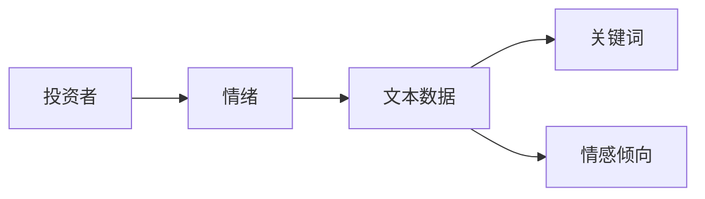

                 


# 金融领域自然语言处理在投资者情绪分析中的应用

> 关键词：自然语言处理，投资者情绪分析，金融文本挖掘，深度学习，情感分类，文本分析

> 摘要：本文深入探讨了自然语言处理（NLP）在投资者情绪分析中的应用，重点介绍了情绪分析的背景、核心概念、算法原理、系统架构以及实际项目中的实现与案例。通过结合理论与实践，本文为读者提供了从基础到高级的完整知识框架，帮助理解如何利用NLP技术来分析投资者情绪，从而辅助投资决策。

---

# 第一部分: 金融领域自然语言处理基础

## 第1章: 自然语言处理与投资者情绪分析概述

### 1.1 自然语言处理的基本概念

#### 1.1.1 自然语言处理的定义与核心任务

自然语言处理（Natural Language Processing，NLP）是人工智能（AI）领域的重要分支，致力于使计算机能够理解和处理人类语言。其核心任务包括文本分析、信息提取、机器翻译、情感分析等。

- **文本分析**：从文本中提取有用信息。
- **信息提取**：从文本中提取结构化信息（如实体识别）。
- **机器翻译**：将一种语言翻译成另一种语言。
- **情感分析**：识别文本中的情感倾向。

#### 1.1.2 自然语言处理在金融领域的应用

在金融领域，NLP技术广泛应用于以下场景：

- **新闻情感分析**：分析财经新闻、社交媒体帖子的情绪，预测市场走势。
- **公司财报分析**：从公司财报中提取关键信息，评估公司财务状况。
- **投资者情绪监测**：实时监测投资者情绪，辅助投资决策。

#### 1.1.3 投资者情绪分析的定义与重要性

**投资者情绪分析**是通过自然语言处理技术，对投资者在金融市场中的情绪状态进行识别和量化。其重要性体现在以下几个方面：

1. **预测市场走势**：情绪分析可以帮助预测市场波动。
2. **辅助投资决策**：情绪分析可以为投资者提供决策支持。
3. **风险控制**：情绪分析可以帮助识别市场风险。

---

### 1.2 投资者情绪分析的背景与意义

#### 1.2.1 投资者情绪分析的背景

随着互联网和社交媒体的普及，投资者情绪分析成为金融领域的重要研究方向。投资者情绪受多种因素影响，包括市场波动、经济指标、公司公告等。通过分析这些情绪，可以更好地理解市场的行为。

#### 1.2.2 投资者情绪分析的意义

投资者情绪分析的意义在于：

1. **提供决策支持**：帮助投资者做出更明智的投资决策。
2. **预测市场趋势**：通过情绪分析预测市场的未来走势。
3. **优化投资策略**：根据情绪数据优化投资策略。

#### 1.2.3 投资者情绪分析的边界与外延

投资者情绪分析的边界在于：

1. **数据来源**：主要依赖于文本数据，如新闻、社交媒体等。
2. **情绪分类**：通常分为正面、负面和中性三种。

其外延包括：

1. **跨语言分析**：支持多语言文本分析。
2. **实时分析**：支持实时情绪监测。

---

### 1.3 本章小结

本章介绍了自然语言处理的基本概念及其在金融领域的应用，重点讨论了投资者情绪分析的定义、背景和意义。通过本章的学习，读者可以理解投资者情绪分析的核心概念和其在金融领域的广泛应用。

---

## 第2章: 自然语言处理的核心概念与联系

### 2.1 自然语言处理的核心原理

#### 2.1.1 文本预处理与特征提取

文本预处理是NLP的重要步骤，主要包括：

1. **分词**：将文本分割成单词或短语。
2. **去停用词**：去除无意义的词汇，如“的”、“是”等。
3. **词干提取**：将词还原为基本形式。

特征提取是将文本转化为数值表示的过程，常用的方法包括：

1. **词袋模型**：基于词频（TF）或词频-逆文档频率（TF-IDF）。
2. **词嵌入**：使用预训练的词向量，如Word2Vec、GloVe等。

#### 2.1.2 语言模型与文本表示

语言模型用于预测文本中的下一个词，常用模型包括n-gram模型和循环神经网络（RNN）模型。

文本表示是将文本转化为向量表示的过程，常用的方法包括词嵌入和句嵌入。

#### 2.1.3 情感分析算法原理

情感分析算法的核心是通过特征提取和分类模型，对文本的情感倾向进行分类。常用算法包括：

1. **基于规则的算法**：通过预定义规则进行情感分类。
2. **统计模型**：如朴素贝叶斯、支持向量机（SVM）等。
3. **深度学习模型**：如长短期记忆网络（LSTM）、Transformer等。

---

### 2.2 投资者情绪分析的核心要素

#### 2.2.1 投资者情绪的分类与层次

投资者情绪通常分为以下几类：

1. **正面情绪**：表示对市场持乐观态度。
2. **负面情绪**：表示对市场持悲观态度。
3. **中性情绪**：表示对市场态度不确定。

情绪的层次分析包括：

1. **微观情绪**：个体投资者的情绪。
2. **宏观情绪**：整体市场的平均情绪。

#### 2.2.2 文本数据的特征提取

投资者情绪分析中的特征提取包括：

1. **关键词提取**：提取与情绪相关的关键词。
2. **情感词典**：使用预定义的情感词汇表。
3. **句法分析**：分析句子的结构和语法。

#### 2.2.3 情绪分析的评价指标

常用的评价指标包括：

1. **准确率**：正确分类的比例。
2. **精确率**：预测为正类的样本中实际为正类的比例。
3. **召回率**：实际为正类的样本中被正确分类的比例。
4. **F1值**：精确率和召回率的调和平均数。

---

### 2.3 核心概念的ER实体关系图



---

### 2.4 本章小结

本章介绍了自然语言处理的核心概念，包括文本预处理、特征提取、语言模型和文本表示。同时，讨论了投资者情绪分析的核心要素，包括情绪分类、特征提取和评价指标。通过本章的学习，读者可以理解投资者情绪分析的实现基础。

---

## 第3章: 投资者情绪分析的算法原理

### 3.1 基于规则的情绪分析算法

#### 3.1.1 规则的定义与特点

基于规则的算法通过预定义的规则进行情感分类。其特点包括：

1. **简单易懂**：规则明确，易于理解。
2. **可解释性高**：规则清晰，结果可解释。
3. **局限性**：依赖于规则的完整性，可能漏掉某些情况。

#### 3.1.2 基于规则的关键词提取

关键词提取是基于规则算法的核心步骤。通常使用情感词典，如中文情感词典（如哈工大中文情感词典）。

#### 3.1.3 基于规则的情感分类

情感分类是通过关键词的权重和规则进行分类。例如，如果文本中包含多个正面关键词，且无负面关键词，则分类为正面情绪。

---

### 3.2 统计模型与机器学习算法

#### 3.2.1 统计模型的定义与特点

统计模型基于统计学方法进行分类。常用算法包括：

1. **朴素贝叶斯**：基于贝叶斯定理，假设特征之间独立。
2. **支持向量机（SVM）**：通过构建超平面进行分类。

#### 3.2.2 基于机器学习的情感分类

情感分类是通过训练数据构建分类器，对新文本进行分类。例如，使用TF-IDF特征和SVM进行分类。

#### 3.2.3 常见算法对比分析

| 算法名称       | 优点                     | 缺点                     |
|----------------|--------------------------|--------------------------|
| 朴素贝叶斯     | 计算简单，适合小数据集   | 对特征独立性假设严格     |
| 支持向量机（SVM） | 分离能力强               | 计算复杂                 |

---

### 3.3 深度学习模型的应用

#### 3.3.1 神经网络的定义与特点

神经网络是一种模仿人脑结构的计算模型，具有强大的非线性分类能力。

#### 3.3.2 基于深度学习的情感分类

深度学习模型包括循环神经网络（RNN）、长短期记忆网络（LSTM）和Transformer等。例如，使用预训练的BERT模型进行情感分类。

#### 3.3.3 预训练语言模型的应用

预训练语言模型（如BERT、GPT）在情感分类任务中表现出色。通过微调这些模型，可以快速构建高性能的情绪分析系统。

---

### 3.4 算法流程图


---

### 3.5 本章小结

本章介绍了投资者情绪分析的算法原理，包括基于规则的算法、统计模型和深度学习模型。通过对比分析，读者可以理解不同算法的优缺点及其适用场景。

---

## 第4章: 投资者情绪分析的数学模型与公式

### 4.1 基于统计模型的数学公式

#### 4.1.1 朴素贝叶斯分类器

朴素贝叶斯分类器的公式为：

$$ P(y|x) = \frac{P(x|y)P(y)}{P(x)} $$

其中，$y$ 是类别（如正面、负面），$x$ 是特征向量。

#### 4.1.2 支持向量机分类器

支持向量机的目标是最优化：

$$ \text{maximize} \ \frac{1}{2} \|w\|^2 $$

受以下约束条件限制：

$$ y_i(w \cdot x_i + b) \geq 1 $$

其中，$w$ 是权重向量，$b$ 是偏置项，$y_i$ 是标签（-1或1）。

---

### 4.2 基于深度学习的数学模型

#### 4.2.1 循环神经网络

循环神经网络的模型为：

$$ f(x) = h_{t} = \tanh(W_{hh}h_{t-1} + W_{xh}x_t + b_h) $$

其中，$h_t$ 是隐藏层状态，$x_t$ 是输入向量，$W_{hh}$ 和 $W_{xh}$ 是权重矩阵，$b_h$ 是偏置项。

---

### 4.3 本章小结

本章介绍了投资者情绪分析的数学模型与公式，包括朴素贝叶斯、支持向量机和循环神经网络的公式。通过这些公式，读者可以理解不同算法的实现原理。

---

## 第5章: 投资者情绪分析的系统架构设计

### 5.1 问题场景介绍

投资者情绪分析系统通常需要处理大量的文本数据，包括新闻、社交媒体帖子等。系统需要快速响应，提供准确的情绪分类结果。

---

### 5.2 项目介绍

本项目旨在构建一个投资者情绪分析系统，能够实时监测市场情绪，并提供情绪趋势分析。

---

### 5.3 系统功能设计

系统功能包括：

1. **文本采集**：从社交媒体、新闻网站等采集文本数据。
2. **文本预处理**：包括分词、去停用词、词干提取等。
3. **情绪分类**：使用预训练模型对文本进行情绪分类。
4. **结果展示**：展示情绪分类结果和趋势分析。

---

### 5.4 系统架构设计


---

### 5.5 系统接口设计

系统接口包括：

1. **数据输入接口**：接收文本数据。
2. **模型调用接口**：调用情绪分类模型。
3. **结果输出接口**：输出情绪分类结果。

---

### 5.6 系统交互流程图


---

### 5.7 本章小结

本章介绍了投资者情绪分析系统的架构设计，包括系统功能、架构图和交互流程图。通过本章的学习，读者可以理解如何将情绪分析技术应用于实际系统。

---

## 第6章: 投资者情绪分析的项目实战

### 6.1 环境安装

项目实战需要以下环境：

1. **Python**：编程语言。
2. **NLTK**：自然语言处理库。
3. **Scikit-learn**：机器学习库。
4. **TensorFlow/Keras**：深度学习库。

---

### 6.2 系统核心实现源代码

以下是一个简单的投资者情绪分析系统的Python代码示例：

```python
import numpy as np
from sklearn.feature_extraction.text import TfidfVectorizer
from sklearn.svm import SVC
from sklearn.metrics import accuracy_score

# 数据预处理
def preprocess(text):
    # 分词
    words = text.split()
    # 去停用词
    stop_words = set(['的', '是', '在'])
    filtered_words = [word for word in words if word not in stop_words]
    return ' '.join(filtered_words)

# 数据加载
train_texts = ["市场表现良好", "公司业绩不佳", "投资者信心不足"]
train_labels = [1, 0, 0]

# 特征提取
vectorizer = TfidfVectorizer()
X_train = vectorizer.fit_transform(train_texts)

# 模型训练
model = SVC()
model.fit(X_train, train_labels)

# 模型预测
test_texts = ["市场上涨", "公司盈利"]
X_test = vectorizer.transform(test_texts)
y_pred = model.predict(X_test)

# 模型评估
print("准确率：", accuracy_score([1, 0], y_pred))
```

---

### 6.3 代码应用解读与分析

上述代码实现了一个简单的投资者情绪分析系统，包括数据预处理、特征提取、模型训练和预测评估。

1. **数据预处理**：使用简单的分词和去停用词方法。
2. **特征提取**：使用TF-IDF进行特征提取。
3. **模型训练**：使用支持向量机（SVM）进行分类。
4. **模型评估**：计算准确率。

---

### 6.4 实际案例分析

以下是一个实际案例分析：

假设我们有以下文本数据：

- **文本1**：市场表现良好
- **文本2**：公司业绩不佳
- **文本3**：投资者信心不足
- **文本4**：市场上涨
- **文本5**：公司盈利

通过上述代码，我们可以对这些文本进行情绪分类，并输出结果。

---

### 6.5 项目小结

本章通过实际案例展示了投资者情绪分析系统的实现过程，包括环境安装、代码实现和案例分析。通过本章的学习，读者可以掌握投资者情绪分析的实际操作技能。

---

## 第7章: 投资者情绪分析的最佳实践与小结

### 7.1 最佳实践 tips

1. **数据质量**：确保数据来源可靠，避免噪声数据。
2. **模型调优**：通过交叉验证优化模型参数。
3. **实时分析**：支持实时数据处理，快速响应市场变化。
4. **多模态分析**：结合文本、图像等多种数据源进行分析。

---

### 7.2 小结

投资者情绪分析是一项复杂的任务，涉及自然语言处理、机器学习和深度学习等多种技术。通过本文的介绍，读者可以理解投资者情绪分析的核心概念、算法原理和系统架构。同时，通过实际案例分析，读者可以掌握投资者情绪分析的实际操作技能。

---

## 作者：AI天才研究院/AI Genius Institute & 禅与计算机程序设计艺术 /Zen And The Art of Computer Programming

---

通过本文的系统介绍，读者可以全面了解投资者情绪分析的相关知识和技术。无论是理论学习还是实践操作，本文都提供了详细的指导和丰富的案例，帮助读者在金融领域自然语言处理的道路上走得更远。

