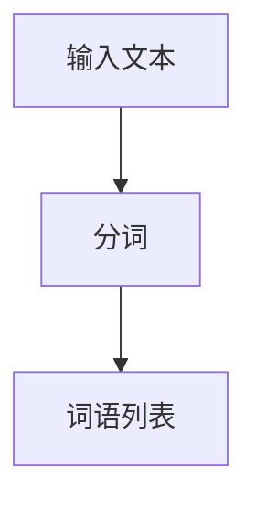
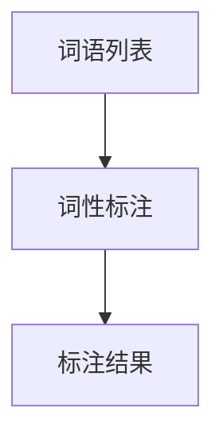
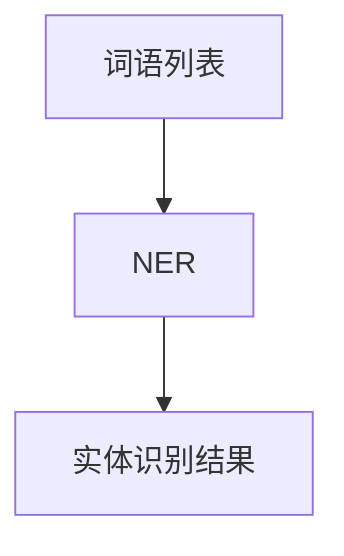
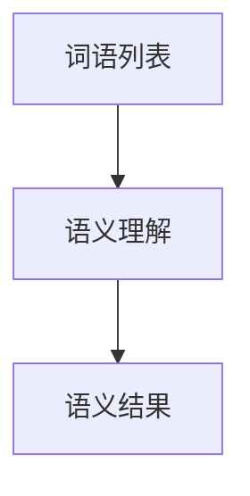
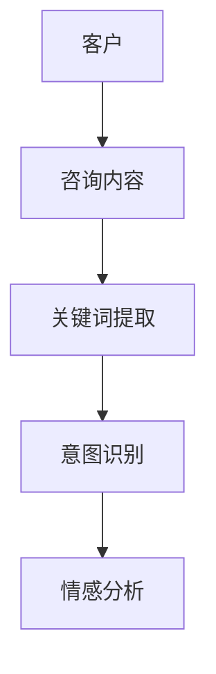
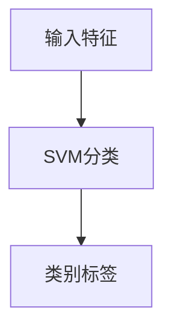
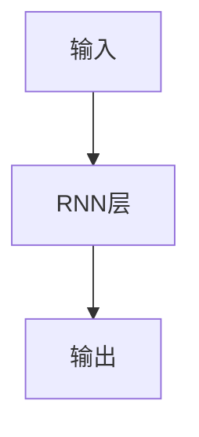
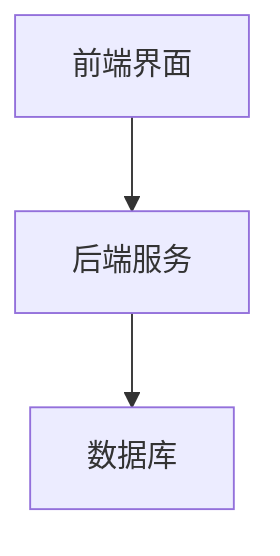
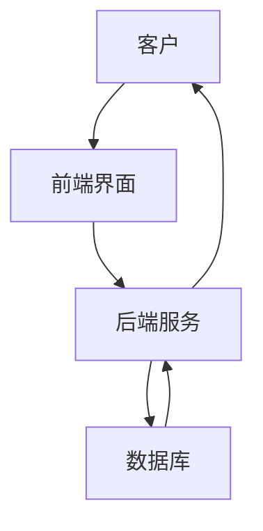
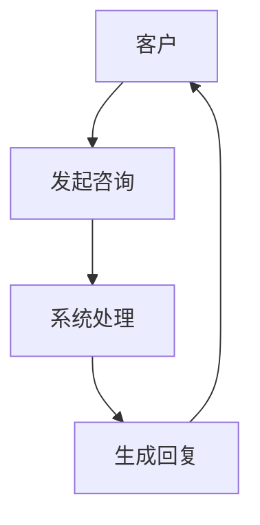

                 


# 《金融领域自然语言理解技术在客户服务中的应用》

> 关键词：自然语言处理，金融客服，NLU技术，深度学习，实体识别，语义理解，客户服务

> 摘要：本文详细探讨了自然语言理解技术在金融客户服务中的应用。通过分析金融领域自然语言理解技术的核心概念、算法原理、系统架构以及实际案例，本文旨在为读者提供一个全面的技术视角，展示如何通过NLU技术提升金融客户服务的效率和质量。文章从背景介绍、核心概念、算法原理、系统分析、项目实战到案例分析，层层递进，为读者提供了一条从理论到实践的学习路径。

---

# 第一部分: 金融领域自然语言理解技术背景与应用概述

## 第1章: 自然语言理解技术与金融客户服务的结合

### 1.1 自然语言理解技术的定义与特点

自然语言理解（Natural Language Understanding, NLU）是自然语言处理（NLP）的重要组成部分，旨在让计算机能够理解人类的自然语言输入，并准确提取其中的语义信息。NLU的核心目标是将非结构化的文本数据转化为结构化的信息，以便计算机能够进行进一步的处理和分析。

#### 1.1.1 自然语言处理的核心概念

自然语言处理（NLP）是一个跨学科的领域，涉及计算机科学、语言学和认知科学。NLP的目标是让计算机能够理解和生成人类语言。NLU作为NLP的一个子领域，专注于理解文本的语义信息。

- **文本处理**：NLP的基本任务包括文本分割、分词、词性标注、命名实体识别（NER）、句法分析、语义分析等。
- **信息提取**：从文本中提取关键信息，如人名、地名、组织名、时间、日期等。
- **语义理解**：理解文本的含义，包括意图识别、情感分析、相似度计算等。

#### 1.1.2 金融领域对NLU技术的独特需求

金融领域是一个高度专业化的领域，涉及大量的专业术语和复杂的业务逻辑。金融客户服务中的NLU技术需要满足以下特殊需求：

1. **高精度要求**：金融交易和客户服务通常涉及大量的敏感信息，NLU技术必须确保高精度，避免误识别或误分类。
2. **复杂语义分析**：金融领域的文本通常包含复杂的句式结构和专业术语，NLU技术需要能够准确解析这些语义信息。
3. **实时性要求**：金融客户服务通常需要实时响应，NLU技术需要在短时间内完成处理。

#### 1.1.3 自然语言理解的关键技术

自然语言理解的核心技术包括：

- **分词（Tokenization）**：将连续的文本分割成有意义的词语或短语。
- **词性标注（Part-of-Speech Tagging）**：给每个词语标注其词性（如名词、动词、形容词等）。
- **命名实体识别（Named Entity Recognition, NER）**：识别文本中的命名实体，如人名、地名、组织名、时间、日期等。
- **语义理解（Semantic Understanding）**：基于文本的语法和语义信息，理解文本的含义。

### 1.2 金融客户服务中的语言理解挑战

金融客户服务中的语言理解面临以下挑战：

1. **复杂性**：金融领域的文本通常包含大量的专业术语和复杂的句式结构。
2. **多样性**：客户的问题可能涉及多种不同的业务领域，如投资、贷款、保险等。
3. **模糊性**：自然语言中的歧义性可能导致NLU技术出现错误。

#### 1.2.1 金融领域的复杂性

金融领域的复杂性主要体现在以下几个方面：

- **专业术语**：金融领域有大量的专业术语，如“期权”、“期货”、“杠杆”等，这些术语需要NLU技术能够准确识别和理解。
- **业务逻辑**：金融业务通常涉及复杂的业务逻辑，NLU技术需要能够理解这些逻辑关系。
- **法规合规**：金融领域的文本通常需要符合相关的法律法规，NLU技术需要能够识别和处理这些合规信息。

#### 1.2.2 客户服务中的语言多样性

客户服务中的语言多样性主要体现在以下几个方面：

- **表达方式多样**：客户可能使用不同的表达方式来描述同一个问题，例如“我想了解贷款利率”和“贷款的利率是多少”。
- **意图多样**：客户的问题可能涉及多个不同的意图，例如客户可能同时询问贷款利率和还款方式。
- **情感多样**：客户的问题中可能包含不同的情感色彩，例如客户可能表达不满或抱怨。

#### 1.2.3 传统客服模式的局限性

传统客服模式主要依赖人工处理，存在以下局限性：

- **效率低下**：人工客服的响应速度较慢，无法满足大量客户的需求。
- **一致性差**：人工客服的回答可能存在一致性问题，不同客服人员可能给出不同的答案。
- **成本高昂**：人工客服需要大量的成本投入，包括人员工资、培训费用等。

### 1.3 自然语言理解技术在金融客服中的应用前景

随着自然语言处理技术的不断发展，NLU技术在金融客服中的应用前景广阔。

#### 1.3.1 提升客户体验的潜力

NLU技术可以显著提升客户的体验：

- **智能分拣**：通过NLU技术，系统可以自动分拣客户的问题，将其路由到相应的处理人员或系统，提高处理效率。
- **智能回复**：NLU技术可以生成智能回复，提供准确的答案，减少客户等待时间。
- **情感分析**：通过情感分析，系统可以识别客户的情绪，提供更加个性化的服务。

#### 1.3.2 降低企业成本的可能性

NLU技术可以帮助企业降低客服成本：

- **自动化处理**：通过NLU技术，系统可以自动处理大量重复性问题，减少人工客服的工作量。
- **智能路由**：NLU技术可以智能路由客户问题，减少客户等待时间，提高处理效率。

#### 1.3.3 未来发展趋势与挑战

未来的NLU技术在金融客服中的发展趋势包括：

- **深度学习的普及**：深度学习技术在NLU领域的应用将更加广泛，模型的精度和效率将不断提升。
- **多模态融合**：NLU技术将与计算机视觉等其他技术结合，提供更加丰富的语义理解能力。
- **实时性优化**：NLU技术将更加注重实时性，满足金融客户服务的实时需求。

### 1.4 本章小结

本章介绍了自然语言理解技术在金融客户服务中的应用背景，分析了金融领域对NLU技术的独特需求，并探讨了NLU技术在金融客服中的应用前景。接下来的章节将详细探讨NLU技术的核心概念与原理。

---

# 第二部分: 自然语言理解技术的核心概念与原理

## 第2章: 自然语言理解技术的核心概念

### 2.1 自然语言理解技术的关键技术

自然语言理解技术的核心技术包括分词、词性标注、命名实体识别和语义理解。

#### 2.1.1 分词技术

分词技术是NLU的基础，用于将连续的文本分割成有意义的词语或短语。

##### 分词算法的对比分析

以下是一个分词算法的对比表格：

| 分词算法 | 基于规则 | 统计学习 | 深度学习 |
|---------|---------|---------|---------|
| 优点 | 简单易实现 | 精度高 | 模型能力强 |
| 缺点 | 精度低 | 计算复杂 | 需大量数据 |
| 适用场景 | 简单场景 | 复杂场景 | 高精度需求 |

##### 分词流程图

以下是一个分词流程图：



#### 2.1.2 词性标注

词性标注是对分词后的词语进行词性标注，如名词、动词、形容词等。

##### 词性标注流程图

以下是一个词性标注流程图：



#### 2.1.3 命名实体识别

命名实体识别（NER）是识别文本中的命名实体，如人名、地名、组织名、时间、日期等。

##### 命名实体识别流程图

以下是一个命名实体识别流程图：



#### 2.1.4 语义理解

语义理解是基于文本的语法和语义信息，理解文本的含义。

##### 语义理解流程图

以下是一个语义理解流程图：



### 2.2 自然语言理解技术的属性特征对比

以下是一个NLU技术属性特征对比表格：

| 技术 | 基于规则 | 统计学习 | 深度学习 |
|-----|---------|---------|---------|
| 精度 | 低 | 中 | 高 |
| 计算复杂度 | 低 | 中 | 高 |
| 数据需求 | 少 | 中 | 大 |
| 适用场景 | 简单场景 | 复杂场景 | 高精度需求 |

### 2.3 自然语言理解技术的ER实体关系图

以下是一个NLU技术的ER实体关系图：



---

## 第3章: 自然语言理解技术的算法原理

### 3.1 基于规则的NLU算法

基于规则的NLU算法是一种简单且易于实现的算法。

#### 3.1.1 基于规则的分词算法

基于规则的分词算法通过预定义的规则进行分词。

##### 分词规则示例

```python
def segment(text):
    words = []
    current_word = ''
    for char in text:
        if char in '，。!?;:':
            if current_word:
                words.append(current_word)
                current_word = ''
            words.append(char)
        else:
            current_word += char
    if current_word:
        words.append(current_word)
    return words
```

#### 3.1.2 基于规则的实体识别算法

基于规则的实体识别算法通过预定义的规则识别实体。

##### 实体识别规则示例

```python
def recognize_entity(text):
    entities = []
    for i in range(len(text)):
        if text[i] in ['人', '名', '地', '组织']:
            entities.append(text[i])
    return entities
```

### 3.2 统计学习的NLU算法

统计学习的NLU算法通过统计方法进行学习和分类。

#### 3.2.1 TF-IDF算法

TF-IDF算法是一种常用的文本特征提取方法。

##### TF-IDF计算公式

$$ TF-IDF(t, d) = TF(t, d) \times ID

F(t) $$

其中，TF(t, d)是词t在文档d中的词频，ID

F(t)是词t的逆文档频率。

##### TF-IDF实现示例

```python
from sklearn.feature_extraction.text import TfidfVectorizer

vectorizer = TfidfVectorizer()
tfidf = vectorizer.fit_transform(corpus)
```

#### 3.2.2 支持向量机（SVM）算法

支持向量机是一种常用的分类算法。

##### SVM分类流程图



##### SVM分类实现示例

```python
from sklearn.svm import SVC

clf = SVC()
clf.fit(X_train, y_train)
y_pred = clf.predict(X_test)
```

### 3.3 深度学习的NLU算法

深度学习的NLU算法通过神经网络进行学习和推理。

#### 3.3.1 循环神经网络（RNN）算法

循环神经网络是一种常用的序列模型。

##### RNN网络结构图



##### RNN实现示例

```python
import tensorflow as tf

model = tf.keras.Sequential()
model.add(tf.keras.layers.SimpleRNN(units=64, input_shape=(None, 1)))
model.add(tf.keras.layers.Dense(10, activation='softmax'))
model.compile(optimizer='adam', loss='sparse_categorical_crossentropy', metrics=['accuracy'])
model.fit(X_train, y_train, epochs=10, batch_size=32)
```

---

# 第三部分: 金融领域自然语言理解技术的系统分析与架构设计

## 第4章: 金融领域自然语言理解技术的系统分析与架构设计

### 4.1 系统功能设计

金融领域自然语言理解系统的功能设计包括：

- **文本预处理**：包括分词、词性标注、命名实体识别等。
- **意图识别**：识别客户的意图，如查询利率、贷款申请等。
- **情感分析**：分析客户的情感倾向，如满意、不满等。
- **智能回复**：生成智能回复，回答客户的问题。

#### 4.1.1 系统功能设计的领域模型

以下是一个系统功能设计的领域模型：

```mermaid
classDiagram
    class 客户 {
        id
        name
       咨询内容
        历史记录
    }
    class 咨询内容 {
        content
        time
        意图
        情感倾向
    }
    class 意图 {
        name
        精度
    }
    class 情感倾向 {
        type
        score
    }
    class 系统 {
        handle_request(咨询内容)
        generate_response(意图, 情感倾向)
    }
    客户 --> 咨询内容
    咨询内容 --> 意图
    咨询内容 --> 情感倾向
    系统 --> handle_request(咨询内容)
    系统 --> generate_response(意图, 情感倾向)
```

### 4.2 系统架构设计

金融领域自然语言理解系统的架构设计包括：

- **前端界面**：客户与系统交互的界面。
- **后端服务**：处理客户的咨询内容，生成智能回复。
- **数据库**：存储客户信息和咨询内容。

#### 4.2.1 系统架构图

以下是一个系统架构图：



### 4.3 系统接口设计

系统接口设计包括：

- **输入接口**：接收客户的咨询内容。
- **输出接口**：返回智能回复。

#### 4.3.1 系统接口设计的交互图

以下是一个系统接口设计的交互图：



### 4.4 系统交互设计

系统交互设计包括：

- **客户发起咨询**：客户输入咨询内容。
- **系统处理咨询**：系统处理客户的咨询内容，生成智能回复。
- **系统返回回复**：系统将智能回复返回给客户。

#### 4.4.1 系统交互流程图

以下是一个系统交互流程图：



---

# 第四部分: 金融领域自然语言理解技术的项目实战

## 第5章: 金融领域自然语言理解技术的项目实战

### 5.1 项目环境搭建

项目环境搭建包括：

- **安装Python**：安装Python 3.8或更高版本。
- **安装依赖库**：安装必要的依赖库，如TensorFlow、Keras、Scikit-learn等。

#### 5.1.1 安装Python环境

```bash
python --version
pip install --upgrade pip
```

#### 5.1.2 安装依赖库

```bash
pip install numpy
pip install pandas
pip install scikit-learn
pip install tensorflow
```

### 5.2 系统核心实现

系统核心实现包括：

- **文本预处理**：包括分词、词性标注、命名实体识别等。
- **意图识别**：使用机器学习或深度学习模型进行意图识别。
- **情感分析**：使用情感分析模型分析客户情感。

#### 5.2.1 文本预处理代码

```python
import jieba

def segment(text):
    return jieba.lcut(text)
```

#### 5.2.2 意图识别代码

```python
from sklearn.feature_extraction.text import TfidfVectorizer
from sklearn.svm import SVC

vectorizer = TfidfVectorizer()
model = SVC()

def train(X, y):
    vectorizer.fit(X)
    X_train = vectorizer.transform(X)
    model.fit(X_train, y)

def predict(X):
    X_test = vectorizer.transform(X)
    return model.predict(X_test)
```

### 5.3 项目实战案例分析

项目实战案例包括：

- **智能客服系统**：通过NLU技术实现智能客服系统的咨询处理。
- **情感分析系统**：通过NLU技术分析客户情感，提供个性化服务。

#### 5.3.1 智能客服系统实现

智能客服系统实现包括：

- **客户咨询处理**：客户输入咨询内容，系统进行分词、词性标注、命名实体识别等预处理。
- **意图识别**：系统根据预处理结果，识别客户的意图。
- **智能回复**：系统根据意图生成智能回复。

##### 智能客服系统代码

```python
def handle_query(query):
    words = segment(query)
    entities = recognize_entity(words)
    intent = classify_intent(query)
    response = generate_response(intent)
    return response
```

---

## 第5章小结

本章通过一个实际项目案例，详细讲解了金融领域自然语言理解技术的系统实现。通过环境搭建、核心实现和案例分析，读者可以掌握如何将NLU技术应用于实际项目中。

---

# 第五部分: 金融领域自然语言理解技术的案例分析与最佳实践

## 第6章: 金融领域自然语言理解技术的案例分析与最佳实践

### 6.1 案例分析

案例分析包括：

- **案例背景**：介绍案例的背景信息。
- **问题分析**：分析案例中的问题。
- **解决方案**：提出解决方案。
- **实施效果**：评估解决方案的实施效果。

#### 6.1.1 案例背景

以一家银行的智能客服系统为例，客户咨询涉及贷款、信用卡、理财等多个业务领域。

#### 6.1.2 问题分析

客户咨询内容复杂多样，人工客服难以快速准确识别客户意图，导致客户等待时间长，满意度低。

#### 6.1.3 解决方案

通过NLU技术实现智能客服系统，自动识别客户意图，生成智能回复。

#### 6.1.4 实施效果

客户等待时间显著减少，客户满意度提升，人工客服工作量降低。

### 6.2 最佳实践

最佳实践包括：

- **数据质量**：确保训练数据的质量和多样性。
- **模型优化**：不断优化模型，提高识别精度。
- **系统维护**：定期更新系统，适应业务变化。

#### 6.2.1 数据质量

数据质量是NLU技术成功的关键。确保训练数据的多样性和代表性，避免数据偏差。

#### 6.2.2 模型优化

通过不断优化模型结构和参数，提高模型的识别精度和效率。

#### 6.2.3 系统维护

定期更新系统，修复 bug，优化性能，适应业务变化。

### 6.3 小结

本章通过案例分析和最佳实践，总结了金融领域自然语言理解技术的应用经验，为读者提供了宝贵的参考。

---

# 第六部分: 总结与展望

## 第7章: 总结与展望

### 7.1 总结

本文详细探讨了自然语言理解技术在金融客户服务中的应用，从背景介绍、核心概念、算法原理、系统架构到项目实战，全面系统地分析了NLU技术的应用潜力和实现方法。

### 7.2 展望

未来，随着深度学习技术的不断发展，NLU技术在金融客服中的应用将更加广泛和深入。通过多模态融合、实时性优化等技术手段，NLU技术将为金融客户服务带来更多的创新和突破。

---

# 作者

作者：AI天才研究院/AI Genius Institute & 禅与计算机程序设计艺术/Zen And The Art of Computer Programming

---

以上是一个完整的《金融领域自然语言理解技术在客户服务中的应用》的技术博客文章的结构和内容大纲，您可以根据实际需求进行调整和补充。

