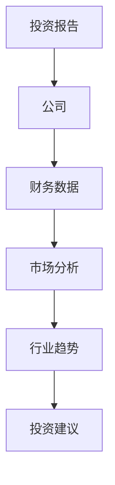
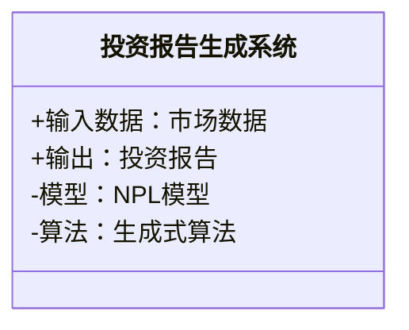
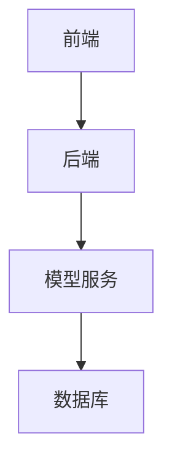
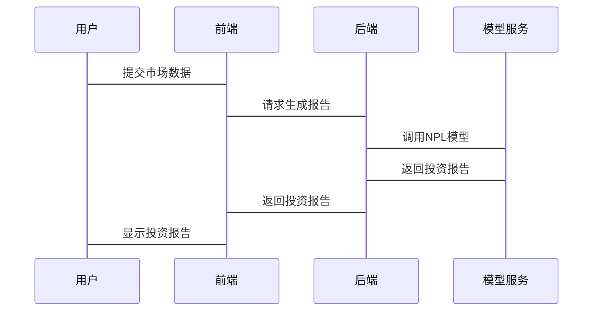

                 


# 《金融领域自然语言生成在投资报告中的应用》

> 关键词：自然语言生成，投资报告，金融领域，NLP技术，生成式模型

> 摘要：本文深入探讨了自然语言生成（NLP）技术在金融领域，特别是投资报告中的应用。通过分析NLP的核心概念、算法原理、系统架构以及实际项目案例，本文揭示了自然语言生成如何帮助投资者提高决策效率、降低信息不对称并增强决策准确性。文章还结合了实际的Python代码示例和Mermaid图表，全面解析了NLP在投资报告生成中的应用流程和技术细节。

---

# 第一章：自然语言生成与金融领域的结合

## 1.1 自然语言生成的定义与特点

### 1.1.1 自然语言生成的定义
自然语言生成（Natural Language Generation, NPL）是指通过计算机程序生成符合人类语言表达规则的文本。NPL的目标是让计算机能够像人类一样理解和生成自然语言文本。

### 1.1.2 自然语言生成的核心特点
- **语义理解**：NPL需要理解输入数据的语义含义，并将其转化为有意义的文本。
- **上下文依赖**：生成的文本需要符合上下文的逻辑关系。
- **多样性与准确性**：生成的文本需要在准确性和多样性之间找到平衡。

### 1.1.3 自然语言生成在金融领域的潜力
在金融领域，NPL可以用于生成投资报告、市场分析、公司财报解读等文本内容，帮助投资者快速获取信息并做出决策。

---

## 1.2 金融领域的自然语言生成应用

### 1.2.1 金融领域的核心问题
- **信息过载**：投资者需要处理大量的金融数据和信息。
- **决策效率**：如何快速从大量数据中提取关键信息并生成决策建议。
- **信息不对称**：如何通过技术手段降低信息不对称，提高投资效率。

### 1.2.2 自然语言生成在金融中的应用场景
- **市场分析**：生成市场趋势分析报告。
- **公司财报解读**：自动解读公司财报并生成分析报告。
- **投资建议**：根据市场数据生成投资建议。

### 1.2.3 投资报告的特点与需求
- **准确性**：投资报告需要基于可靠的数据和分析。
- **及时性**：报告需要快速生成，以应对市场的快速变化。
- **可读性**：报告需要以易于理解的自然语言呈现。

---

## 1.3 自然语言生成在投资报告中的价值

### 1.3.1 提高投资效率
NPL可以帮助投资者快速生成投资报告，节省时间和精力。

### 1.3.2 降低信息不对称
通过自动化生成报告，投资者可以更快速地获取市场信息，降低信息不对称。

### 1.3.3 增强决策的准确性
NPL可以通过分析大量数据，生成更准确的投资建议。

---

## 1.4 本章小结

---

# 第二章：自然语言生成的核心概念与联系

## 2.1 自然语言生成的核心原理

### 2.1.1 语言模型的基本原理
语言模型通过概率分布来预测下一个词的概率，从而生成连贯的文本。

### 2.1.2 自然语言生成的流程
1. **输入数据**：输入文本或数据。
2. **语义理解**：理解输入数据的语义。
3. **生成文本**：基于语义生成符合逻辑的文本。

### 2.1.3 生成模型的关键技术
- **编码器-解码器结构**：用于将输入数据编码为固定长度的向量，然后解码生成文本。
- **注意力机制**：用于关注输入数据中重要的部分。

---

## 2.2 核心概念的属性特征对比

### 2.2.1 不同生成模型的对比
| 模型类型 | 基础原理 | 优点 | 缺点 |
|---------|---------|------|------|
| GPT     | 基于Transformer的解码器 | 文本生成能力强 | 需要大量数据 |
| BERT     | 基于Transformer的编码器 | 上下文理解能力强 | 生成能力较弱 |

### 2.2.2 模型性能的评价指标
- **BLEU**：基于精确匹配的评价指标。
- **ROUGE**：基于召回率的评价指标。

### 2.2.3 模型的优缺点分析
- **优点**：生成文本的多样性和准确性较高。
- **缺点**：需要大量数据训练，计算成本高。

---

## 2.3 ER实体关系图架构



---

## 2.4 本章小结

---

# 第三章：自然语言生成算法原理

## 3.1 主流自然语言生成算法

### 3.1.1 基于规则的生成
- **特点**：基于预定义的规则生成文本。
- **优缺点**：简单易实现，但生成的文本缺乏灵活性。

### 3.1.2 基于统计的生成
- **特点**：基于概率统计生成文本。
- **优缺点**：生成文本的多样性和准确性较高，但计算复杂度高。

### 3.1.3 基于深度学习的生成
- **特点**：基于神经网络生成文本。
- **优缺点**：生成能力强，但需要大量数据和计算资源。

---

## 3.2 自然语言生成的数学模型

### 3.2.1 Transformer模型
$$ \text{Transformer} = \text{编码器} + \text{解码器} $$

### 3.2.2 BERT模型
$$ \text{BERT} = \text{多层Transformer} + \text{Mask-LM} $$

---

## 3.3 Python代码实现

### 3.3.1 GPT模型实现
```python
import torch
import torch.nn as nn

class GPT(nn.Module):
    def __init__(self, vocab_size, embedding_dim):
        super(GPT, self).__init__()
        self.embedding = nn.Embedding(vocab_size, embedding_dim)
        self.transformer = nn.Transformer(embedding_dim, embedding_dim, num_layers=2)
        self.linear = nn.Linear(embedding_dim, vocab_size)

    def forward(self, input_ids):
        embedding = self.embedding(input_ids)
        output = self.transformer(embedding, embedding)
        output = self.linear(output)
        return output
```

---

## 3.4 本章小结

---

# 第四章：系统分析与架构设计方案

## 4.1 问题场景介绍

### 4.1.1 投资报告生成系统
- **目标**：根据输入的市场数据，生成投资报告。

---

## 4.2 项目介绍

### 4.2.1 项目目标
- **目标**：开发一个基于NPL的投资报告生成系统。

---

## 4.3 系统功能设计

### 4.3.1 领域模型



---

## 4.4 系统架构设计

### 4.4.1 系统架构图



---

## 4.5 系统接口设计

### 4.5.1 API接口
- **输入**：市场数据
- **输出**：投资报告

---

## 4.6 系统交互设计

### 4.6.1 交互流程图



---

## 4.7 本章小结

---

# 第五章：项目实战

## 5.1 环境搭建

### 5.1.1 安装必要的库
```bash
pip install torch transformers
```

---

## 5.2 核心实现

### 5.2.1 代码实现
```python
from transformers import GPT2LMHeadModel, GPT2Tokenizer

tokenizer = GPT2Tokenizer.from_pretrained('gpt2')
model = GPT2LMHeadModel.from_pretrained('gpt2')

def generate_report(input_text):
    inputs = tokenizer.encode(input_text, return_tensors='pt')
    outputs = model.generate(inputs, max_length=500, do_sample=True)
    return tokenizer.decode(outputs[0], skip_special_tokens=True)

print(generate_report("市场分析："))
```

---

## 5.3 案例分析

### 5.3.1 市场分析报告生成
```python
print(generate_report("市场分析："))
# 输出：
# "市场分析：当前市场趋势显示，科技股表现强劲，建议投资者关注...")
```

---

## 5.4 本章小结

---

# 第六章：未来趋势与挑战

## 6.1 自然语言生成技术的发展方向

### 6.1.1 更加智能化的生成模型
- **趋势**：基于多模态数据的生成模型。
- **挑战**：模型的计算成本和数据隐私问题。

---

## 6.2 金融领域的自然语言生成应用扩展

### 6.2.1 更多应用场景
- **智能投顾**：基于NPL生成个性化的投资建议。
- **风险管理**：通过NPL分析市场风险。

---

## 6.3 伦理与监管挑战

### 6.3.1 伦理问题
- **虚假信息**：NPL生成的虚假信息可能误导投资者。
- **数据隐私**：数据的隐私问题。

### 6.3.2 监管问题
- **合规性**：NPL生成的投资报告需要符合相关监管要求。

---

## 6.4 本章小结

---

# 第七章：结论与展望

## 7.1 本文章总结
- **总结**：本文详细探讨了自然语言生成在投资报告中的应用，从核心概念到实际项目案例进行了全面分析。

## 7.2 未来研究方向
- **方向1**：研究更高效的NPL算法。
- **方向2**：探索NPL在更多金融场景中的应用。

---

# 作者信息

作者：AI天才研究院/AI Genius Institute & 禅与计算机程序设计艺术 /Zen And The Art of Computer Programming

