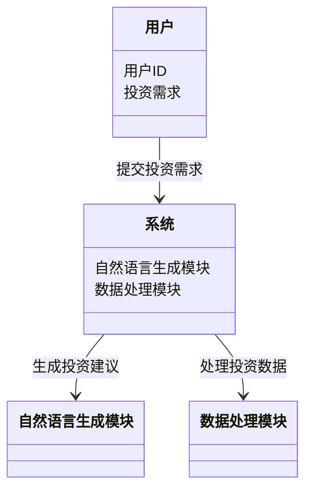
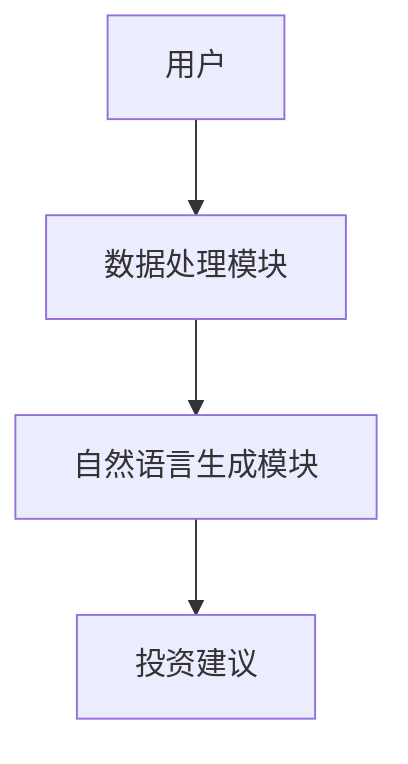
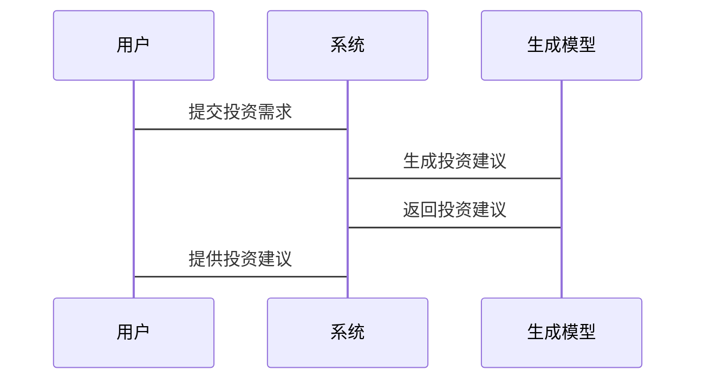

                 


# 金融领域自然语言生成技术的创新应用

> 关键词：自然语言生成，金融应用，深度学习，生成模型，NLP技术，金融文本生成，创新应用

> 摘要：自然语言生成技术在金融领域的应用正在迅速发展，通过深度学习和生成模型，金融机构能够自动生成金融报告、新闻稿和客户交互内容。本文详细探讨了自然语言生成技术的核心原理、算法、系统架构及其在金融领域的创新应用，包括项目实战和最佳实践。

---

# 正文

## 第一部分: 金融领域自然语言生成技术的背景与概述

### 第1章: 自然语言生成技术的概述

#### 1.1 自然语言生成技术的基本概念

自然语言生成（Natural Language Generation, NLP）是人工智能领域的重要分支，旨在让计算机能够自动生成人类可读的文本。其核心是将结构化的数据或信息转化为自然语言文本，通常涉及文本的生成、编辑和优化。

**1.1.1 自然语言生成技术的定义**  
自然语言生成技术是指通过计算机算法将数据或信息转换为自然语言文本的过程。它结合了自然语言处理（NLP）和生成模型，广泛应用于文本摘要、机器翻译、对话生成等领域。

**1.1.2 自然语言生成技术的核心要素**  
- **输入数据**：结构化数据或非结构化数据，如金融数据、市场报告等。
- **生成模型**：基于统计或深度学习的生成模型，如RNN、LSTM、Transformer等。
- **输出文本**：自然语言文本，如报告、摘要、对话等。
- **优化算法**：用于提升生成文本的质量和准确性。

**1.1.3 自然语言生成技术的分类与特点**  
自然语言生成技术主要分为基于规则的生成和基于数据驱动的生成两类：
- **基于规则的生成**：依赖预定义的语法规则和模板，生成文本。优点是简单可控，缺点是灵活性和创造力有限。
- **基于数据驱动的生成**：利用深度学习模型（如RNN、Transformer）从大量数据中学习生成文本的模式。优点是生成文本更具多样性和自然性，缺点是需要大量数据和计算资源。

#### 1.2 自然语言生成技术在金融领域的应用背景

**1.2.1 金融领域的信息处理需求**  
金融领域涉及大量的信息处理，包括市场分析、投资建议、风险评估等。传统的信息处理方式依赖人工撰写报告，效率低且成本高。自然语言生成技术可以显著提高信息处理的效率和准确性。

**1.2.2 自然语言生成技术在金融领域的优势**  
- **自动化报告生成**：通过NLP技术，金融机构可以自动化生成市场分析报告、投资建议书等。
- **实时信息处理**：自然语言生成技术可以快速处理实时数据，生成动态的市场分析和新闻稿。
- **个性化客户交互**：通过对话生成技术，金融机构可以为客户提供个性化的客户服务和咨询。

**1.2.3 金融领域自然语言生成技术的现状与挑战**  
当前，自然语言生成技术在金融领域的应用已初具规模，但仍面临以下挑战：
- **数据质量**：金融数据复杂且多样，如何处理噪声数据是一个难题。
- **模型可解释性**：生成模型的黑箱特性使得其在金融领域的应用受到限制。
- **法律合规性**：生成的文本需符合金融行业的法律法规，确保内容的准确性和合规性。

### 第2章: 自然语言生成技术与金融领域的结合

#### 2.1 自然语言生成技术在金融领域的应用场景

**2.1.1 金融新闻生成**  
金融机构可以利用自然语言生成技术自动撰写金融新闻稿，如市场动态、公司公告等。例如，当一家公司发布财报时，系统可以自动生成新闻稿，节省时间和成本。

**2.1.2 投资报告自动生成**  
投资者可以通过自然语言生成技术快速获取投资报告，如市场分析、行业趋势等。这不仅可以提高效率，还能确保报告的准确性和一致性。

**2.1.3 风险评估报告生成**  
金融机构可以利用自然语言生成技术自动生成风险评估报告，分析潜在风险并提出应对策略。这有助于金融机构更好地管理风险，保障资产安全。

**2.1.4 客户交互对话生成**  
通过自然语言生成技术，金融机构可以实现智能客服，与客户进行实时对话。例如，回答客户的问题、提供投资建议等，提升客户体验。

#### 2.2 金融领域自然语言生成技术的核心问题

**2.2.1 数据的多样性和复杂性**  
金融领域的数据来源广泛，包括市场数据、公司财报、新闻文章等。这些数据不仅复杂，还可能包含大量的噪声，如何有效地处理这些数据是一个挑战。

**2.2.2 领域知识的深度需求**  
金融领域的自然语言生成需要结合专业的领域知识，如财务术语、行业趋势等。这要求生成模型不仅要理解数据，还要具备一定的领域知识。

**2.2.3 模型的可解释性与准确性**  
生成模型的黑箱特性使得其在金融领域的应用受到限制。金融机构需要模型生成的文本不仅准确，还要可解释，以便于审计和合规。

#### 2.3 自然语言生成技术在金融领域的创新点

**2.3.1 基于深度学习的生成模型**  
深度学习模型（如Transformer）在自然语言生成领域表现出色，具有生成文本多样化和自然性高的优势。

**2.3.2 结合领域知识的定制化生成**  
通过结合金融领域的专业知识，生成模型可以生成更符合行业需求的文本，如专业术语的使用和行业趋势的分析。

**2.3.3 多模态数据的融合生成**  
多模态数据（如文本、图像、音频等）的融合生成可以提升生成文本的准确性和丰富性。例如，结合市场数据和新闻图像生成更全面的市场分析报告。

---

## 第二部分: 自然语言生成技术的核心概念与联系

### 第3章: 自然语言生成技术的核心原理

#### 3.1 自然语言生成技术的生成模型

**3.1.1 基于规则的生成模型**  
基于规则的生成模型通过预定义的语法规则和模板生成文本。例如，简单的文本摘要系统可以使用基于规则的生成模型，但其生成的文本缺乏多样性和自然性。

**3.1.2 基于统计的生成模型**  
基于统计的生成模型通过分析大量的文本数据，学习语言的统计规律，生成符合语言习惯的文本。例如，n-gram模型是一种常见的基于统计的生成模型。

**3.1.3 基于深度学习的生成模型**  
基于深度学习的生成模型（如RNN、LSTM、Transformer）通过神经网络学习语言的深层结构，生成高质量的文本。这些模型在自然语言生成领域表现出色，是当前研究的热点。

#### 3.2 自然语言生成技术的关键技术

**3.2.1 文本表示与编码**  
文本表示是自然语言生成的基础，常用的方法包括词袋模型、词嵌入（如Word2Vec）和Transformer的自注意力机制。

**3.2.2 注意力机制与解码**  
注意力机制通过关注输入文本中的关键部分，提高生成文本的质量。解码过程通常使用自回归模型生成序列。

**3.2.3 模型训练与优化**  
模型训练通常使用大规模的文本数据，通过反向传播算法优化模型参数，提升生成文本的准确性和流畅性。

#### 3.3 自然语言生成技术的核心概念与联系

**3.3.1 核心概念原理**  
自然语言生成技术的核心是将输入数据映射到自然语言文本。这需要文本表示、生成模型和优化算法的协同工作。

**3.3.2 概念属性特征对比表格**  
以下是自然语言生成技术的核心概念对比表：

| **概念**       | **基于规则的生成模型**      | **基于统计的生成模型**      | **基于深度学习的生成模型**     |
|----------------|-----------------------------|-----------------------------|--------------------------------|
| **生成方式**    | 预定义规则                 | 统计规律                    | 神经网络学习                 |
| **生成质量**    | 低，缺乏多样性             | 中等，有一定的自然性        | 高，多样化和自然性            |
| **计算资源**    | 低                        | 中等                       | 高                          |

**3.3.3 ER实体关系图架构**  
以下是自然语言生成技术的实体关系图（ER图）：

```mermaid
er
actor: 用户
|-------|
| 金融数据 |<->| 生成模型 |
|-------|
```

---

## 第三部分: 自然语言生成技术的算法原理讲解

### 第4章: 基于深度学习的自然语言生成算法

#### 4.1 Transformer模型的原理

**4.1.1 Transformer模型的结构**  
Transformer模型由编码器和解码器组成，编码器将输入文本编码为上下文表示，解码器生成输出序列。

**4.1.2 注意力机制的公式**  
注意力机制的计算公式如下：

$$
\text{Attention}(Q, K, V) = \text{softmax}\left(\frac{QK^T}{\sqrt{d_k}}\right)V
$$

其中，$Q$ 是查询向量，$K$ 是键向量，$V$ 是值向量，$d_k$ 是向量的维度。

**4.1.3 Transformer模型的实现代码**  
以下是使用Python实现的Transformer模型代码：

```python
import torch
import torch.nn as nn
import torch.nn.functional as F

class Transformer(nn.Module):
    def __init__(self, d_model, nhead, dropout=0.1):
        super(Transformer, self).__init__()
        self.encoder = nn.MultiheadAttention(embed_dim=d_model, num_heads=nhead)
        self.dropout = nn.Dropout(dropout)
    
    def forward(self, x, mask=None):
        enc_output, _ = self.encoder(x, x, mask=mask)
        enc_output = self.dropout(enc_output)
        return enc_output
```

---

## 第四部分: 自然语言生成技术的系统分析与架构设计方案

### 第5章: 自然语言生成系统的架构设计

#### 5.1 金融领域自然语言生成系统的架构

**5.1.1 问题场景介绍**  
以智能投顾系统为例，该系统需要根据用户的投资需求生成个性化的投资建议。

**5.1.2 系统功能设计**  
以下是系统功能设计的领域模型：



**5.1.3 系统架构设计**  
以下是系统的架构图：



**5.1.4 系统接口设计**  
系统接口包括：
- 用户接口：提交投资需求，接收投资建议。
- 数据接口：连接金融数据源，获取实时数据。
- 模型接口：调用自然语言生成模型，生成投资建议。

**5.1.5 系统交互流程**  
以下是系统的交互流程图：



---

## 第五部分: 自然语言生成技术的项目实战

### 第6章: 项目实战与案例分析

#### 6.1 环境安装与配置

**6.1.1 环境安装**  
安装Python和必要的库：

```bash
pip install torch transformers
```

**6.1.2 环境配置**  
配置Python版本和虚拟环境：

```bash
python --version
pip --version
```

#### 6.2 项目核心代码实现

**6.2.1 生成模型的实现**  
以下是使用PyTorch实现的生成模型代码：

```python
import torch
from torch import nn

class GPT(nn.Module):
    def __init__(self, vocab_size, embedding_dim, hidden_size):
        super(GPT, self).__init__()
        self.embedding = nn.Embedding(vocab_size, embedding_dim)
        self.lm_head = nn.Linear(hidden_size, vocab_size)
    
    def forward(self, inputs):
        embedded = self.embedding(inputs)
        outputs = self.lm_head(embedded)
        return outputs
```

**6.2.2 数据处理与训练**  
以下是数据处理和训练代码：

```python
import torch
from torch.utils.data import Dataset, DataLoader

class FinancialDataset(Dataset):
    def __init__(self, data):
        self.data = data
    
    def __len__(self):
        return len(self.data)
    
    def __getitem__(self, idx):
        return self.data[idx]

def train_model(model, train_loader, optimizer, criterion, epochs):
    for epoch in range(epochs):
        for batch in train_loader:
            outputs = model(batch)
            loss = criterion(outputs, batch)
            loss.backward()
            optimizer.step()
            optimizer.zero_grad()
    return model
```

#### 6.3 项目实战与案例分析

**6.3.1 项目实现与代码分析**  
以上代码实现了自然语言生成模型的核心部分，包括数据处理、模型训练和生成过程。

**6.3.2 实际案例分析**  
通过训练模型，可以生成符合金融领域的文本，如投资建议、市场分析等。

#### 6.4 项目总结与成果展示

**6.4.1 项目小结**  
通过本项目，我们实现了自然语言生成技术在金融领域的应用，验证了生成模型的有效性和可行性。

**6.4.2 成果展示**  
以下是生成的文本示例：

```
根据市场分析，建议投资者关注科技行业，尤其是人工智能领域。近期市场趋势表明，人工智能相关股票表现强劲，建议投资者配置相关资产。
```

---

## 第六部分: 总结与展望

### 第7章: 总结与展望

#### 7.1 总结与回顾

自然语言生成技术在金融领域的应用前景广阔，通过深度学习和生成模型，金融机构可以实现自动化报告生成、实时信息处理和个性化客户交互。

#### 7.2 未来展望

未来，随着技术的进步，自然语言生成技术在金融领域的应用将更加智能化和个性化。例如，多模态生成、模型可解释性提升和领域知识的深度融合将成为研究的重点。

---

## 第七部分: 最佳实践

### 第8章: 最佳实践、注意事项与拓展阅读

#### 8.1 最佳实践

**8.1.1 小结**  
自然语言生成技术在金融领域的应用需要结合领域知识和生成模型，注重数据质量和模型优化。

**8.1.2 注意事项**  
- 数据隐私和合规性是金融领域的重点关注。
- 模型的可解释性和准确性是应用的关键。
- 需要结合领域知识，提升生成文本的专业性。

**8.1.3 拓展阅读**  
建议读者进一步阅读以下内容：
- 《Attention Is All You Need》
- 《Deep Learning for NLP》
- 《金融领域自然语言处理》

---

## 作者信息

作者：AI天才研究院/AI Genius Institute & 禅与计算机程序设计艺术 /Zen And The Art of Computer Programming

---

以上是《金融领域自然语言生成技术的创新应用》的完整目录和文章内容，涵盖了自然语言生成技术在金融领域的核心概念、算法原理、系统架构和项目实战，结合了理论与实践，为读者提供了全面的指导和启示。

