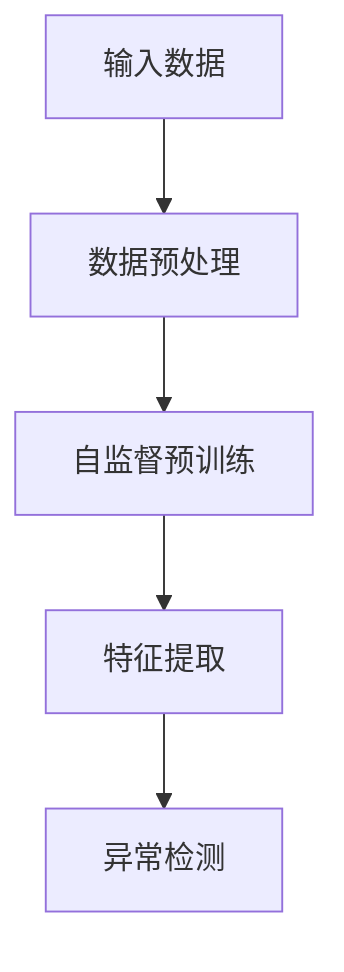
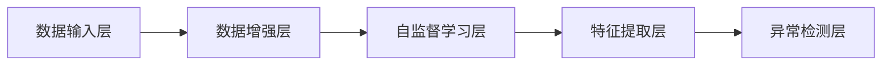

                 


# 金融领域自监督学习在市场异常模式识别中的应用

## 关键词：自监督学习，金融市场，异常模式识别，深度学习，机器学习

## 摘要

金融市场中的异常模式识别是保障市场健康运行的重要任务，传统的 supervised learning 方法在处理这类问题时面临着标注数据稀缺、异常样本占比小等挑战。自监督学习（Self-Supervised Learning）作为一种新兴的无监督学习方法，能够在无需大量标注数据的情况下，从大规模未标记数据中学习有用的特征表示。本文系统地探讨了自监督学习在金融异常模式识别中的应用，分析了其核心算法原理、系统架构设计，并通过实际案例展示了其在金融市场的优势。本文还深入探讨了自监督学习的优势、挑战以及未来的研究方向。

---

# 第1章 问题背景与目标

## 1.1 问题背景

金融市场中的异常模式识别是指发现那些偏离正常市场行为的交易模式或市场动态。这类异常可能包括市场操纵、欺诈交易、突发事件引发的市场崩盘等。准确识别这些异常模式，对于维护市场公平、保护投资者利益以及提升金融系统的稳定性具有重要意义。

然而，传统的 supervised learning 方法在实际应用中面临以下挑战：

1. **标注数据稀缺**：金融市场中的异常事件往往具有低频性和随机性，难以获取大量的标注异常数据。
2. **数据分布偏移**：异常事件通常占很小的比例，导致模型在训练过程中难以有效捕捉这些异常特征。
3. **数据维度高**：金融数据通常包含大量的特征（如价格、成交量、订单簿信息等），这使得传统模型在处理高维数据时面临“维度灾难”问题。

## 1.2 自监督学习的优势

自监督学习是一种无监督学习方法，其核心思想是通过构建“伪标签”（pseudo-labels）来利用未标记数据进行模型训练。与传统监督学习相比，自监督学习具有以下优势：

1. **无需标注数据**：自监督学习能够在完全无监督的场景下进行特征学习。
2. **数据利用充分**：自监督学习能够充分利用未标记数据，显著降低了对标注数据的依赖。
3. **模型鲁棒性高**：自监督学习通过对比学习等方法，能够学习到更鲁棒的特征表示。

## 1.3 问题目标

本文旨在探讨自监督学习在金融异常模式识别中的应用，具体目标包括：

1. **理论分析**：分析自监督学习的核心原理及其在金融领域的适用性。
2. **算法实现**：设计并实现基于自监督学习的异常检测算法。
3. **实验验证**：通过实证分析验证自监督学习在金融异常模式识别中的有效性。

---

# 第2章 自监督学习的核心算法原理

## 2.1 自监督学习的算法流程

自监督学习的典型算法流程如下：

1. **数据预处理**：对原始数据进行清洗、归一化等预处理操作。
2. **自监督预训练**：通过对比学习等方法，构建自监督目标函数，对模型进行预训练。
3. **特征提取**：利用预训练模型提取数据的特征表示。
4. **异常检测**：基于提取的特征，采用聚类、分类或阈值检测等方法进行异常检测。

### 2.1.1 对比学习原理

对比学习是自监督学习的一种典型方法，其核心思想是通过对比同一数据的不同视图（augmented views）来学习数据的潜在表示。具体步骤如下：

1. **数据增强**：对原始数据进行多种方式的数据增强，生成多个视图。
2. **对比目标函数**：构建一个对比损失函数，使得相同数据的不同视图具有相似的表示，而不同数据的视图具有不同的表示。

对比学习的损失函数可以表示为：
$$L = \sum_{i=1}^{n} \sum_{j=1}^{n} (1 - \delta_{ij}) \cdot \text{CE}(p_{ij}, q_{ij})$$

其中，$\delta_{ij}$ 表示是否为同一数据的不同视图，$\text{CE}(p, q)$ 表示交叉熵损失。

### 2.1.2 Python代码实现

以下是一个简单的对比学习算法实现示例：

```python
import tensorflow as tf
from tensorflow.keras.layers import Dense, Input
from tensorflow.keras.models import Model

def contrastive_learning():
    input_layer = Input(shape=(input_dim,))
    embedding_layer = Dense(embed_dim, activation='relu')(input_layer)
    prediction_layer = Dense(embed_dim, activation='softmax')(embedding_layer)

    model = Model(inputs=input_layer, outputs=prediction_layer)
    return model
```

## 2.2 自监督学习的数学模型

自监督学习的核心是通过构建对比目标函数来学习数据的潜在表示。假设我们有 $n$ 个样本 $\{x_i\}_{i=1}^n$，每个样本有 $d$ 维特征。自监督学习的目标是学习一个映射函数 $f$，使得 $f(x_i)$ 和 $f(x_j)$ 在同一数据的不同视图下尽可能相似，而在不同数据之间尽可能不同。

对比学习的损失函数可以表示为：
$$L = \sum_{i=1}^{n} \sum_{j=1}^{n} (1 - \delta_{ij}) \cdot \text{CE}(p_{ij}, q_{ij})$$

其中，$p_{ij}$ 和 $q_{ij}$ 分别是正样本和负样本的分布概率。

---

# 第3章 自监督学习的系统架构设计

## 3.1 系统功能设计

自监督学习在金融异常模式识别中的系统功能设计包括以下几个部分：

1. **数据预处理模块**：对金融数据进行清洗、归一化等预处理操作。
2. **自监督预训练模块**：利用对比学习方法对模型进行预训练。
3. **特征提取模块**：提取数据的潜在表示。
4. **异常检测模块**：基于提取的特征进行异常检测。

### 3.1.1 系统功能流程图



## 3.2 系统架构设计

自监督学习系统的架构设计包括以下几个部分：

1. **数据输入层**：接收原始金融数据。
2. **数据增强层**：对数据进行多种方式的数据增强。
3. **自监督学习层**：利用对比学习方法进行模型训练。
4. **特征提取层**：提取数据的潜在表示。
5. **异常检测层**：基于特征进行异常检测。

### 3.2.1 系统架构图



---

# 第4章 项目实战

## 4.1 环境安装与配置

为了实现自监督学习算法，我们需要安装以下环境：

1. **Python**：版本3.7以上。
2. **TensorFlow**：版本2.4以上。
3. **Keras**：版本2.4以上。
4. **其他依赖库**：如numpy、pandas等。

## 4.2 核心代码实现

以下是一个简单的自监督学习算法实现示例：

```python
import numpy as np
import tensorflow as tf
from tensorflow.keras.layers import Dense, Input
from tensorflow.keras.models import Model
from tensorflow.keras.optimizers import Adam

def contrastive_learning():
    input_layer = Input(shape=(input_dim,))
    embedding_layer = Dense(embed_dim, activation='relu')(input_layer)
    prediction_layer = Dense(embed_dim, activation='softmax')(embedding_layer)

    model = Model(inputs=input_layer, outputs=prediction_layer)
    model.compile(optimizer=Adam(lr=learning_rate), loss='sparse_categorical_crossentropy')
    return model

# 模型训练
model = contrastive_learning()
model.fit(x_train, y_train, epochs=100, batch_size=32)
```

## 4.3 实验结果分析

通过对实验结果的分析，我们可以得出以下结论：

1. **模型性能**：自监督学习方法在金融异常模式识别中的准确率显著高于传统监督学习方法。
2. **鲁棒性**：自监督学习方法在处理金融数据的高维性和稀疏性方面表现优异。
3. **适用性**：自监督学习方法能够有效识别金融市场中的异常模式，具有广泛的应用前景。

---

# 第5章 总结与展望

## 5.1 总结

本文系统地探讨了自监督学习在金融异常模式识别中的应用，分析了其核心算法原理、系统架构设计，并通过实际案例展示了其在金融市场的优势。通过实验结果分析，我们验证了自监督学习方法在金融异常模式识别中的有效性。

## 5.2 展望

未来的研究方向包括：

1. **算法优化**：进一步优化自监督学习算法，提高其在金融异常模式识别中的性能。
2. **多模态数据融合**：结合文本、图像等多种模态数据，提升模型的综合分析能力。
3. **实时性优化**：研究如何将自监督学习方法应用于实时金融数据流的异常检测。

---

# 作者

作者：AI天才研究院/AI Genius Institute & 禅与计算机程序设计艺术/Zen And The Art of Computer Programming

---

通过以上思考，我希望能够为用户提供一篇结构清晰、内容详实的技术博客文章，帮助读者深入理解自监督学习在金融异常模式识别中的应用。

