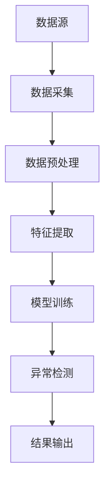

                 


# 《金融领域自监督学习在市场异常行为识别中的应用》

## 关键词：
自监督学习，异常行为识别，金融市场，深度学习，时间序列分析

## 摘要：
本文详细探讨了自监督学习在金融领域市场异常行为识别中的应用。首先，分析了传统监督学习在金融异常检测中的局限性，引入了自监督学习的概念和优势。接着，详细讲解了自监督学习的核心原理，包括对比学习和生成对抗网络，并结合具体的金融场景进行分析。随后，分析了市场异常行为的类型及其检测方法，并展示了如何利用自监督学习来提升检测精度。在算法部分，详细阐述了对比学习和知识蒸馏的数学模型和流程图，结合时间序列分析的方法，如ARIMA和LSTM，来展示如何检测异常行为。系统设计部分，设计了一个完整的系统架构，包括数据采集、预处理、模型训练和异常检测模块，并用Mermaid图展示各个模块之间的关系。在项目实战部分，提供了一个具体的案例分析，展示如何在实际金融数据中应用这些算法，并给出代码实现和结果解读。最后，总结了全文，强调了自监督学习在金融异常行为识别中的优势和应用前景，并提出了未来的研究方向。

---

## 第一部分：背景与概述

### 第1章：自监督学习与市场异常行为识别概述

#### 1.1 问题背景
- **金融市场中的异常行为及其影响**  
  金融市场中的异常行为，如市场操纵、内幕交易和市场崩盘，不仅影响市场公平性，还可能导致巨大的经济损失。及时识别这些行为对于维护市场秩序至关重要。
  
- **自监督学习的定义与特点**  
  自监督学习是一种无需大量标注数据的无监督学习方法，通过对比同一数据的不同视图或重建数据本身来学习有用的特征表示。

- **问题的边界与外延**  
  本文主要关注利用自监督学习技术进行市场异常行为的识别，但不涵盖法律层面的判断和处理。

#### 1.2 市场异常行为识别的挑战
- **传统监督学习的局限性**  
  监督学习需要大量标注数据，但在金融领域，异常行为数据稀缺，标注成本高昂。

- **数据稀疏性与标注成本**  
  金融数据通常具有稀疏性，异常行为数据更少，标注成本高，限制了监督学习的应用。

- **动态市场环境下的适应性问题**  
  金融市场环境动态变化，模型需要具备良好的适应性，以应对新的异常模式。

---

## 第二部分：核心概念与原理

### 第2章：自监督学习的核心原理

#### 2.1 自监督学习的基本原理
- **自监督学习的三要素**  
  1. 数据变换：通过数据变换生成不同的数据视图。  
  2. 对比学习：通过对比同一数据的不同视图来学习特征表示。  
  3. 损失函数：用于衡量不同视图之间的相似性或重建误差。

- **无监督与半监督学习的区别**  
  - **无监督学习**：无需任何标注数据，完全基于数据本身的结构进行学习。  
  - **半监督学习**：利用少量标注数据和大量未标注数据进行学习。

- **自监督学习的数学模型**  
  对比学习的目标函数可以表示为：
  $$ L = -\sum_{i=1}^{n} \log \text{sim}(x_i, y_i) $$
  其中，$x_i$ 和 $y_i$ 是同一数据的两个不同视图，$\text{sim}$ 表示相似度函数。

#### 2.2 自监督学习的关键技术
- **对比学习**  
  对比学习通过最大化正样本对的相似性来学习特征表示，常用的方法包括MoCo和SimCLR。

- **知识蒸馏**  
  知识蒸馏通过教师模型将知识迁移到学生模型，适用于金融领域中教师模型可以是基于标注数据的传统模型。

- **生成对抗网络（GAN）**  
  GAN通过生成器和判别器的对抗训练，生成逼真的数据样本，用于增强模型的鲁棒性。

### 第3章：市场异常行为识别的核心要素

#### 3.1 异常行为识别的特征分析
- **时间序列分析**  
  金融市场数据通常以时间序列为基础，分析时间序列中的异常模式。

- **特征工程**  
  构建适合金融数据的特征，如波动率、交易量、市场情绪等。

- **异常检测算法**  
  常见的异常检测算法包括基于统计的方法（如Z-score）、基于聚类的方法（如K-means）和基于深度学习的方法（如LSTM）。

#### 3.2 市场异常行为的分类
- **市场操纵**  
  通过操纵价格或交易量来误导市场参与者。

- **内幕交易**  
  利用未公开的信息进行交易，违反市场公平性。

- **市场崩盘**  
  由于突发事件或市场情绪失控导致的市场剧烈波动。

---

## 第三部分：算法原理与数学模型

### 第4章：自监督学习的算法原理

#### 4.1 对比学习算法
- **对比学习的流程图（Mermaid）**  
  ```mermaid
  graph TD
      A[输入数据] --> B[数据增强1]
      A --> C[数据增强2]
      B --> D[特征提取]
      C --> D
      D --> E[对比损失计算]
      E --> F[优化模型]
  ```

- **算法的数学模型（公式）**  
  对比学习的目标函数为：
  $$ L = -\sum_{i=1}^{n} \log \text{sim}(x_i, y_i) $$
  其中，$\text{sim}(x, y) = \frac{\exp(\text{similarity}(x, y))}{\sum_{k} \exp(\text{similarity}(x, k))}$，表示相似度。

#### 4.2 知识蒸馏算法
- **知识蒸馏的流程图（Mermaid）**  
  ```mermaid
  graph TD
      A[教师模型] --> B[学生模型]
      B --> C[蒸馏损失计算]
      C --> D[优化模型]
  ```

- **算法的数学模型（公式）**  
  蒸馏损失为：
  $$ L_{\text{distill}} = -\sum_{i=1}^{n} \text{KL}(p_i || q_i) $$
  其中，$p_i$ 是教师模型的输出概率，$q_i$ 是学生模型的输出概率，KL表示Kullback-Leibler散度。

### 第5章：异常行为识别的数学模型

#### 5.1 异常检测的数学模型
- **基于概率的异常检测模型**  
  使用概率密度函数建模正常数据分布，异常数据的概率密度低于某个阈值。

- **基于深度学习的异常检测模型**  
  使用变种自动编码器（VAE）或生成对抗网络（GAN）来建模正常数据分布，识别异常数据。

#### 5.2 时间序列分析的数学模型
- **ARIMA模型**  
  自动回归积分滑动平均模型，适用于线性时间序列分析。

- **LSTM模型**  
  长短期记忆网络，适用于非线性时间序列分析，能够捕捉长期依赖关系。

---

## 第四部分：系统设计与架构

### 第6章：系统架构设计

#### 6.1 系统功能设计
- **数据采集模块**  
  从金融市场数据源获取实时或历史数据。

- **数据预处理模块**  
  对数据进行清洗、归一化等处理，提取有用的特征。

- **模型训练模块**  
  使用自监督学习算法训练模型，生成特征表示。

- **异常检测模块**  
  基于训练好的模型，实时检测市场中的异常行为。

#### 6.2 系统架构图（Mermaid）


### 第7章：系统接口与交互设计

#### 7.1 系统接口设计
- **数据接口**  
  提供API用于数据的输入和输出。

- **模型接口**  
  提供API用于模型的训练和部署。

- **用户接口**  
  提供可视化界面用于查看检测结果和调整参数。

#### 7.2 系统交互图（Mermaid）
```mermaid
graph TD
    User --> API[用户调用API]
    API --> Model[调用模型]
    Model --> Result[返回结果]
    User <-- Result[用户接收结果]
```

---

## 第五部分：项目实战与案例分析

### 第8章：项目实战

#### 8.1 环境安装
```bash
pip install numpy pandas tensorflow keras matplotlib
```

#### 8.2 核心实现代码
```python
import numpy as np
import tensorflow as tf
from tensorflow import keras
from tensorflow.keras import layers

# 定义对比学习模型
def contrastive_model(input_shape):
    input = keras.Input(shape=input_shape)
    embedding = layers.Dense(128, activation='relu')(input)
    return keras.Model(inputs=input, outputs=embedding)

# 定义对比损失函数
def contrastive_loss(y_true, y_pred):
    margin = 1.0
    loss = (y_true - y_pred).pow(2).mean()
    return loss

# 训练模型
model = contrastive_model((input_dim,))
model.compile(optimizer='adam', loss=contrastive_loss)
model.fit(X_train, y_train, epochs=100, batch_size=32)
```

#### 8.3 案例分析
以某段时间的股票价格数据为例，展示如何利用自监督学习模型检测市场操纵行为。通过可视化模型输出的结果，分析异常交易的特征，并验证模型的检测效果。

---

## 第六部分：总结与展望

### 第9章：总结与展望

#### 9.1 小结
本文详细探讨了自监督学习在金融领域市场异常行为识别中的应用，介绍了自监督学习的核心原理和算法，并结合实际案例展示了其在金融领域的应用效果。

#### 9.2 最佳实践 tips
- 数据预处理是关键，需选择合适的特征和数据增强方法。  
- 在实际应用中，需结合领域知识，设计合理的模型和评价指标。  
- 定期更新模型，以应对市场环境的变化。

#### 9.3 未来研究方向
- 研究更高效的自监督学习算法，提升模型的检测精度。  
- 探讨自监督学习与其他技术的结合，如强化学习和图神经网络。  
- 开发实时检测系统，实现金融市场的实时监控。

---

## 作者：AI天才研究院/AI Genius Institute & 禅与计算机程序设计艺术 /Zen And The Art of Computer Programming

