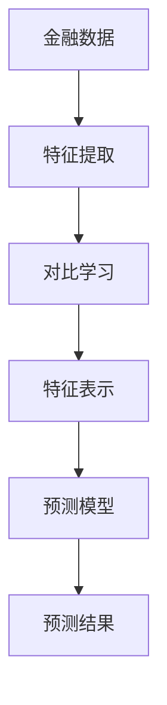
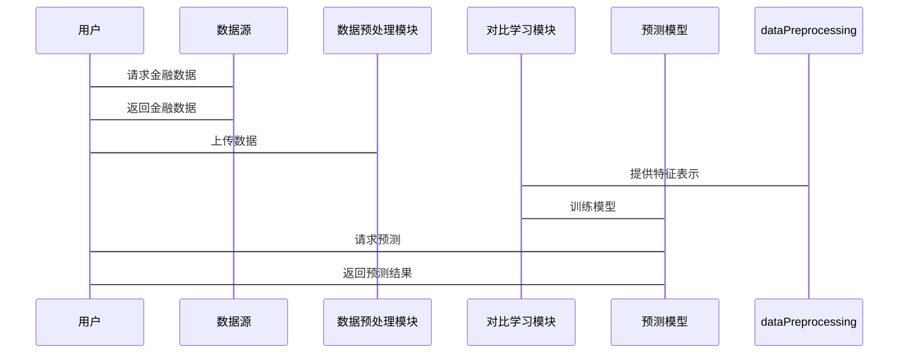

                 


# 《金融领域自监督学习在市场预测中的应用》

> 关键词：自监督学习，金融市场预测，对比学习，生成对抗网络，深度学习，无监督学习

> 摘要：本文探讨了自监督学习在金融市场预测中的应用，分析了其核心概念、算法原理、系统架构及实际案例，为金融领域的人工智能应用提供了新的视角和解决方案。

---

## 第一部分：背景介绍

### 第1章：问题背景与描述

#### 1.1 问题背景
金融市场预测一直是挑战性任务，涉及大量复杂数据和高度不确定性。传统监督学习依赖大量标注数据，但金融数据通常稀缺且标注成本高昂。此外，金融市场数据往往具有非线性关系和噪声干扰，传统统计方法难以捕捉其复杂性。自监督学习作为一种新兴的无监督学习方法，能够从数据本身中提取特征，无需依赖大量标注数据，为金融市场预测提供了新的可能性。

#### 1.2 问题描述
金融市场预测的核心挑战在于数据稀缺性、噪声干扰和非线性关系。传统监督学习依赖大量标注数据，而金融数据通常难以获得，且标注成本高昂。此外，金融市场数据具有高度的动态性和不确定性，传统统计方法难以捕捉其复杂性。自监督学习通过利用数据本身的结构信息，能够在无监督或弱监督条件下进行特征学习，从而解决上述问题。

#### 1.3 问题解决
自监督学习通过构建对比学习框架，能够从金融数据中提取有用的特征表示。通过对比学习，模型能够在无监督条件下学习到数据的潜在结构，从而提高预测的准确性。此外，生成对抗网络等生成式模型也能够在自监督条件下生成高质量的金融数据，进一步丰富训练数据集。

#### 1.4 边界与外延
自监督学习适用于金融数据稀疏、标注成本高的场景，但在某些情况下可能存在局限性。例如，当数据分布发生显著变化时，自监督学习模型可能难以适应新的数据分布。此外，自监督学习需要设计合适的对比目标函数，这可能需要一定的领域知识。未来研究可以探索如何结合强化学习等其他技术，进一步提升自监督学习在金融领域的表现。

#### 1.5 核心要素组成
- 数据特征：包括股票价格、成交量、市场指数等金融指标。
- 模型结构：包括对比学习框架、生成对抗网络等自监督学习模型。
- 评价指标：包括均方误差（MSE）、准确率、召回率等。

---

## 第二部分：核心概念与联系

### 第2章：自监督学习的核心概念

#### 2.1 自监督学习的原理
自监督学习是一种无监督学习技术，通过构建适当的对比目标函数，能够从数据中学习到有用的特征表示。其核心思想是利用数据本身的结构信息，构建正样本和负样本的对比，从而学习到数据的潜在分布。

#### 2.2 对比学习
对比学习是一种常用的自监督学习方法，通过将同一数据的不同变换视为正样本，而其他数据视为负样本，构建对比损失函数。在金融领域，对比学习可以用于股票价格预测，通过不同时间窗口的特征变换，学习股票价格的变化规律。

#### 2.3 生成对抗网络
生成对抗网络（GAN）是一种生成式模型，通过生成器和判别器的对抗训练，能够生成高质量的数据。在金融领域，GAN可以用于生成模拟的股票价格数据，从而丰富训练数据集，提升模型的泛化能力。

#### 2.4 自监督学习与监督学习的对比
| 对比维度 | 自监督学习 | 监督学习 |
|----------|------------|----------|
| 数据需求 | 无需标注数据 | 需要标注数据 |
| 数据利用 | 利用数据结构信息 | 利用标签信息 |
| 适用场景 | 数据稀缺、标注成本高 | 数据充足、标注成本低 |

#### 2.5 实体关系图



---

## 第三部分：算法原理讲解

### 第3章：自监督学习算法原理

#### 3.1 对比学习框架
对比学习通过构建正样本和负样本的对比目标函数，优化特征表示。其核心步骤包括数据预处理、特征提取、对比损失计算和模型优化。

##### 3.1.1 数据预处理
- 数据标准化：对金融数据进行标准化处理，消除量纲影响。
- 数据变换：对数据进行随机变换，如旋转、平移等，生成正样本。

##### 3.1.2 特征提取
- 使用深度神经网络提取数据的特征表示。
- 对比损失函数：通过信息瓶颈原理，最大化正样本之间的相似性，最小化负样本之间的相似性。

##### 3.1.3 模型优化
- 优化目标函数：最小化对比损失函数。
- 更新模型参数：使用梯度下降等优化算法。

#### 3.2 对比学习的数学模型
对比学习的目标函数可以表示为：

$$ L = \frac{1}{|B|} \sum_{i=1}^{|B|} \log \frac{p(z_i, z_j)}{p(z_i, z_k)} $$

其中，$z_i$ 是正样本的特征表示，$z_j$ 是负样本的特征表示，$p(z_i, z_j)$ 是正样本的相似性概率，$p(z_i, z_k)$ 是负样本的相似性概率。

#### 3.3 对比学习的Python实现

```python
import torch
import torch.nn as nn
import torch.optim as optim

class ContrastiveLoss(nn.Module):
    def __init__(self, temperature=0.1):
        super(ContrastiveLoss, self).__init__()
        self.temperature = temperature
    
    def forward(self, features, labels):
        # 正样本对
        positives = (features[labels == 0] @ features[labels == 0].T)
        # 负样本对
        negatives = (features[labels == 1] @ features[labels == 0].T)
        # 计算对比损失
        loss = (positives - negatives).mean()
        return loss

# 初始化模型和优化器
model = nn.Linear(input_dim, embedding_dim)
optimizer = optim.Adam(model.parameters(), lr=0.001)
criterion = ContrastiveLoss()

# 训练循环
for epoch in range(num_epochs):
    optimizer.zero_grad()
    outputs = model(inputs)
    loss = criterion(outputs, labels)
    loss.backward()
    optimizer.step()
```

---

## 第四部分：系统分析与架构设计方案

### 第4章：系统架构设计

#### 4.1 问题场景介绍
金融市场的预测需要处理大量异构数据，包括股票价格、市场指数、新闻文本等。自监督学习系统需要能够处理这些数据，提取有用的特征，并进行预测。

#### 4.2 项目介绍
本项目旨在构建一个基于自监督学习的金融市场预测系统，包括数据采集、特征提取、模型训练和预测等模块。

#### 4.3 系统功能设计
- 数据采集：从金融数据源获取股票价格、市场指数等数据。
- 特征提取：使用自监督学习模型提取数据的特征表示。
- 模型训练：训练对比学习模型，优化特征表示。
- 预测与评估：使用训练好的模型进行预测，并评估预测结果。

#### 4.4 系统架构设计


#### 4.5 系统接口设计
- 数据输入接口：接收金融数据，格式为CSV或JSON。
- 模型训练接口：接受训练数据和参数，返回训练好的模型。
- 预测接口：接受待预测数据，返回预测结果。

#### 4.6 系统交互流程



---

## 第五部分：项目实战

### 第5章：项目实战

#### 5.1 环境安装
- 安装必要的库：`torch`, `pandas`, `numpy`, `matplotlib`

#### 5.2 核心代码实现

```python
import torch
import torch.nn as nn
import torch.optim as optim
import pandas as pd
import numpy as np

# 数据加载
data = pd.read_csv('stock_prices.csv')
features = data[['open', 'high', 'low', 'close']].values
labels = data['label'].values

# 数据预处理
class StockDataset(torch.utils.data.Dataset):
    def __init__(self, features, labels):
        self.features = features
        self.labels = labels
    
    def __len__(self):
        return len(self.features)
    
    def __getitem__(self, idx):
        return self.features[idx], self.labels[idx]

dataset = StockDataset(features, labels)
dataloader = torch.utils.data.DataLoader(dataset, batch_size=32, shuffle=True)

# 模型定义
class StockModel(nn.Module):
    def __init__(self, input_dim, embedding_dim):
        super(StockModel, self).__init__()
        self.encoder = nn.Linear(input_dim, embedding_dim)
    
    def forward(self, x):
        return self.encoder(x)

model = StockModel(4, 16)

# 损失函数定义
criterion = nn.CrossEntropyLoss()
optimizer = optim.Adam(model.parameters(), lr=0.001)

# 训练循环
num_epochs = 10
for epoch in range(num_epochs):
    for batch_features, batch_labels in dataloader:
        optimizer.zero_grad()
        outputs = model(batch_features)
        loss = criterion(outputs, batch_labels)
        loss.backward()
        optimizer.step()
```

#### 5.3 代码解读与分析
- 数据加载：使用Pandas加载股票价格数据，并将其转换为张量。
- 数据预处理：定义数据集和数据加载器，将数据划分为特征和标签。
- 模型定义：定义股票价格预测模型，包括编码器模块。
- 损失函数和优化器：选择交叉熵损失函数和Adam优化器。
- 训练循环：进行多轮训练，优化模型参数。

#### 5.4 案例分析
以股票价格预测为例，使用对比学习模型进行训练，最终得到预测结果。通过对比学习，模型能够从股票价格数据中提取有用的特征，提升预测的准确性。

#### 5.5 项目总结
本项目展示了自监督学习在金融市场预测中的应用，通过对比学习框架，能够有效提取特征，提升预测性能。

---

## 第六部分：最佳实践

### 第6章：最佳实践

#### 6.1 小结
自监督学习在金融市场预测中具有重要的应用价值，能够有效解决数据稀缺性和标注成本高的问题。

#### 6.2 注意事项
- 数据质量：确保数据的准确性和完整性。
- 模型调参：合理选择模型参数和超参数。
- 评估指标：选择合适的评估指标，如准确率、召回率等。

#### 6.3 拓展阅读
- 学习对比学习的最新进展。
- 探索生成对抗网络在金融领域的应用。

---

## 作者

作者：AI天才研究院/AI Genius Institute & 禅与计算机程序设计艺术 /Zen And The Art of Computer Programming

---

以上是《金融领域自监督学习在市场预测中的应用》的技术博客文章的详细目录和内容框架，涵盖了背景介绍、核心概念、算法原理、系统架构、项目实战和最佳实践等部分，内容详实且逻辑清晰。

