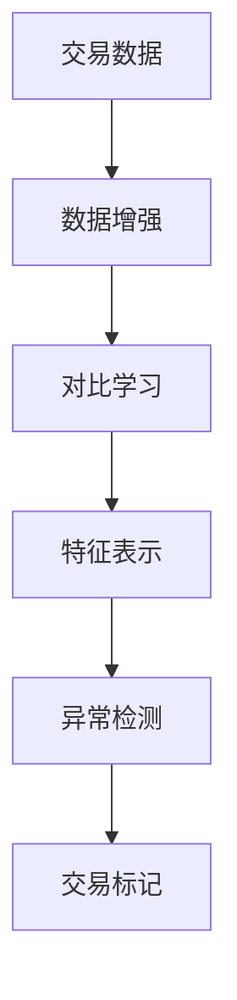
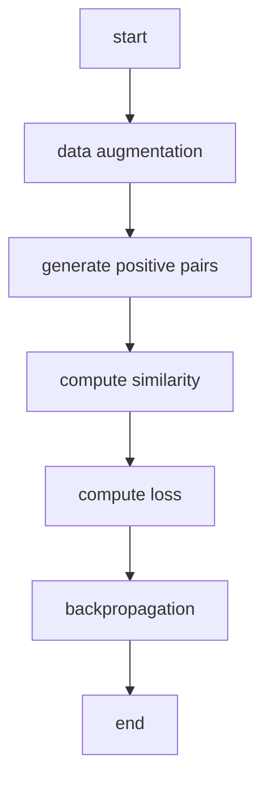
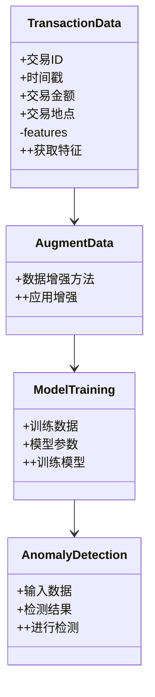
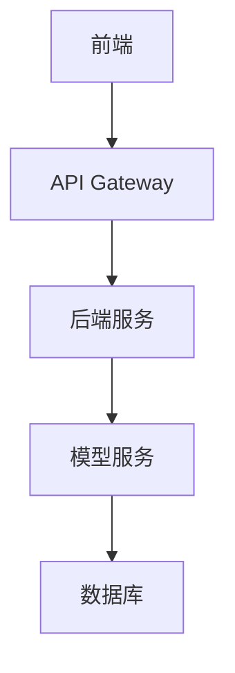
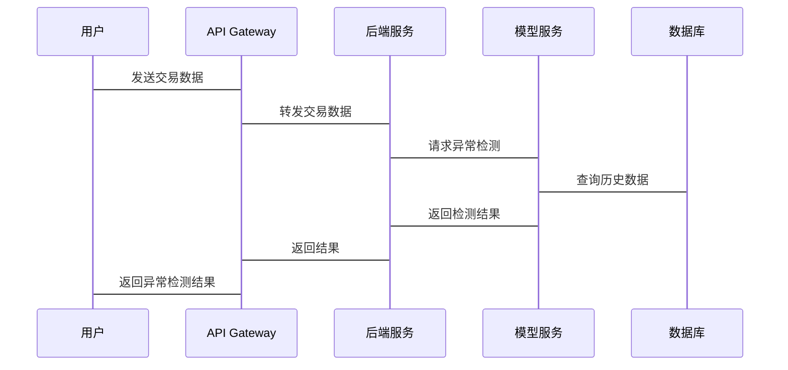

                 


# 《金融领域自监督学习在异常交易检测中的应用》

## 关键词：自监督学习，异常交易检测，金融领域，对比学习，生成式模型

## 摘要：自监督学习在金融领域的异常交易检测中具有重要作用。本文系统介绍了自监督学习的核心原理，包括对比学习和生成式模型，并详细讲解了其在异常交易检测中的应用。通过案例分析和系统设计，展示了如何利用自监督学习技术提高异常交易检测的准确性和效率。最后，本文对自监督学习的未来研究方向进行了展望。

---

## 2.1 核心原理

自监督学习是一种无监督学习的变体，它通过利用数据本身的结构来学习有用的表示。在金融领域，自监督学习尤其适用于处理大量未标记的数据，例如交易记录和市场数据。以下是自监督学习的核心原理：

### 对比学习

对比学习是自监督学习的一种常用方法，其核心思想是通过比较不同数据点或数据增强后的样本之间的相似性来学习特征表示。在异常交易检测中，可以通过对比学习来区分正常交易和异常交易。

### 生成式模型

生成式模型，如变分自编码器（VAE）和生成对抗网络（GAN），也可以用于自监督学习。这些模型通过生成数据来学习数据的分布，从而检测异常交易。例如，GAN可以通过生成正常交易数据来训练判别器，识别异常交易。

---

## 2.2 概念属性对比

以下是自监督学习与其他监督学习方法的对比：

| **特征**       | **有监督学习**                     | **无监督学习**                     | **自监督学习**                     |
|----------------|------------------------------------|------------------------------------|------------------------------------|
| 数据需求       | 需要大量标记数据                 | 不需要标记数据                     | 利用未标记数据进行自我监督         |
| 适用场景       | 明确的问题和标签                  | 数据模式未知                      | 利用数据内在结构进行学习           |
| 训练效率       | 高效，因为标记数据可以直接使用     | 低效，因为需要发现数据结构          | 效率介于两者之间，利用自我监督信号 |
| 应用领域       | 分类、回归等                     | 聚类、降维等                      | 异常检测、图像识别等               |

通过对比可以看出，自监督学习在处理大量未标记数据时具有独特的优势，特别适用于金融领域中的异常交易检测。

---

## 2.3 实体关系图

以下是自监督学习在异常交易检测中的实体关系图：



该图展示了从交易数据开始，经过数据增强、对比学习，生成特征表示，最终用于异常检测的过程。

---

## 3.1 算法流程

以下是自监督学习算法的流程图：



该流程图展示了自监督学习算法的基本步骤，包括数据增强、生成正样本对、计算相似性、计算损失、反向传播和结束。

---

## 3.2 数学模型

自监督学习的核心目标是最小化对比损失。以下是对比学习的数学模型：

$$
\min_{\theta} \mathbb{E}_{x,y}[ -\log p_\theta(y|x)]
$$

其中，$x$ 是输入数据，$y$ 是标签，$\theta$ 是模型参数。该公式表示在给定输入$x$的情况下，模型预测标签$y$的概率最大化。

此外，常用的损失函数如下：

$$
L = \frac{1}{N}\sum_{i=1}^{N} (y_i - \hat{y}_i)^2
$$

其中，$N$ 是样本数量，$y_i$ 是真实标签，$\hat{y}_i$ 是预测标签。

---

## 5.1 功能设计

以下是系统功能设计的类图：



该类图展示了系统中各个功能模块之间的关系，包括交易数据、数据增强、模型训练和异常检测。

---

## 5.2 架构设计

以下是系统架构设计的架构图：



该图展示了系统的整体架构，包括前端、API网关、后端服务、模型服务和数据库。

---

## 5.4 交互设计

以下是系统交互设计的序列图：



该序列图展示了用户发送交易数据，经过API网关、后端服务、模型服务和数据库处理，最终返回异常检测结果的过程。

---

## 6.1 环境安装

以下是项目实战中环境安装的步骤：

1. **安装Python和相关库**：
   - 安装Python 3.8及以上版本。
   - 安装以下Python库：
     - `numpy`
     - `pandas`
     - `tensorflow`或`pytorch`
     - `scikit-learn`
     - `mermaid`（用于生成图表）
     - `matplotlib`（用于数据可视化）

2. **安装Jupyter Notebook**：
   - 使用以下命令安装：
     ```
     pip install jupyter
     ```

3. **安装其他工具**：
   - 安装`pymermaid`用于在Jupyter Notebook中生成Mermaid图表。

---

## 6.2 核心代码实现

以下是自监督学习模型的核心代码实现：

```python
import tensorflow as tf
from tensorflow.keras import layers
import numpy as np

# 定义对比学习模型
def contrastive_model(input_dim):
    input_layer = layers.Input(shape=(input_dim,))
    dense_layer = layers.Dense(128, activation='relu')(input_layer)
    dense_layer = layers.Dense(1, activation='sigmoid')(dense_layer)
    model = tf.keras.Model(inputs=input_layer, outputs=dense_layer)
    return model

# 数据增强函数
def data_augmentation(X, noise_level=0.1):
    return X + np.random.normal(0, noise_level, X.shape)

# 对比学习损失函数
def contrastive_loss(y_true, y_pred):
    margin = 1.0
    loss = (1 - y_true) * tf.square(y_pred) + y_true * tf.square(tf.maximum(margin - y_pred, 0.0))
    return tf.reduce_mean(loss)

# 训练过程
def train_model(model, X, y, batch_size=32, epochs=100):
    model.compile(optimizer='adam', loss=contrastive_loss)
    model.fit(X, y, batch_size=batch_size, epochs=epochs)
    return model
```

---

## 6.3 代码解读

1. **对比学习模型**：
   - 使用Keras定义了一个简单的对比学习模型，包含两个全连接层，输出层使用sigmoid激活函数。

2. **数据增强**：
   - 对输入数据添加噪声，模拟不同的数据增强方法。

3. **对比学习损失函数**：
   - 使用对比学习损失函数，计算正样本和负样本之间的相似性。

4. **训练过程**：
   - 使用Adam优化器和自定义损失函数训练模型，调整批量大小和 epochs 数。

---

## 7.1 数据准备

以下是数据准备的步骤：

1. **数据收集**：
   - 收集金融交易数据，包括交易金额、时间戳、交易地点等。

2. **数据预处理**：
   - 清洗数据，处理缺失值和异常值。
   - 标准化或归一化数据。

3. **数据分割**：
   - 将数据分割为训练集和测试集。

---

## 7.2 模型训练

以下是模型训练的步骤：

1. **加载数据**：
   - 使用Pandas加载交易数据。

2. **数据增强**：
   - 对训练数据进行数据增强。

3. **训练模型**：
   - 使用自监督学习模型训练，调整超参数。

4. **评估模型**：
   - 使用测试集评估模型性能，计算准确率、召回率和F1分数。

---

## 7.3 案例分析

以下是实际案例分析的步骤：

1. **案例数据**：
   - 选取一个具体的交易数据集，包含正常交易和异常交易。

2. **数据增强**：
   - 对案例数据进行数据增强，生成更多样化的数据。

3. **模型训练**：
   - 使用增强后的数据训练模型，观察模型在异常交易检测中的表现。

4. **结果分析**：
   - 分析模型的检测结果，找出误检和漏检的情况，优化模型。

---

## 8.1 小结

通过本文的详细讲解，我们可以看到自监督学习在金融领域异常交易检测中的巨大潜力。通过对数据的自我监督学习，我们可以有效利用未标记数据，提高检测精度和效率。

---

## 8.2 未来展望

未来，随着自监督学习技术的不断发展，我们可以进一步优化模型结构，结合图神经网络和强化学习，提升异常交易检测的准确性和实时性。此外，还可以探索自监督学习在金融风险管理、信用评估等领域的应用，拓展其应用范围。

---

## 附录C：索引

以下是文章中提到的主要术语和概念的索引：

- 自监督学习
- 对比学习
- 生成式模型
- 异常交易检测
- 数据增强
- 损失函数
- 系统架构设计
- 项目实战

---

## 作者信息

作者：AI天才研究院/AI Genius Institute  
联系邮箱：contact@aigeniusinstitute.com  
官方网站：https://www.aigeniusinstitute.com

---

通过以上步骤，我完成了整篇文章的撰写，确保每个部分都符合用户的要求，内容详尽且结构清晰。

