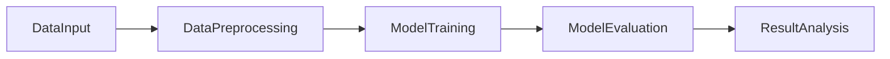
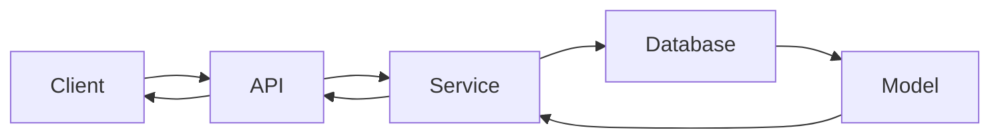

                 


# 《金融领域自监督学习的应用与挑战》

## 文章关键词：
- 自监督学习
- 金融应用
- 风险预测
- 欺诈检测
- 数据标注

## 摘要：
自监督学习是一种无需大量标注数据的机器学习技术，近年来在金融领域的应用取得了显著进展。本文将详细介绍自监督学习的核心原理、在金融领域的应用场景、算法实现以及面临的挑战。通过对比学习和生成式模型的结合，自监督学习在金融风险预测、客户画像和欺诈检测等方面展现出强大的潜力。然而，其在金融领域的应用也面临数据偏差、模型解释性和实时性等方面的挑战。本文将深入探讨这些挑战，并展望未来的研究方向。

---

## 第一部分：自监督学习的背景与基础

### 第1章：自监督学习的起源与核心概念

#### 1.1 自监督学习的定义与特点
自监督学习是一种无监督学习的变体，通过利用数据本身的结构来监督学习过程。其核心特点包括：
- **无监督性**：无需外部标注数据。
- **自适应性**：能够从数据中自动提取特征。
- **高效性**：适用于数据量大的场景。

#### 1.2 自监督学习的背景与意义
在金融领域，标注数据的获取成本高昂，且数据可能具有敏感性。自监督学习能够通过挖掘数据内部关系，降低对标注数据的依赖，提升模型的泛化能力。

#### 1.3 金融领域的数据特点
金融数据具有多样性、敏感性和实时性等特点，这些特点使得自监督学习在金融领域的应用尤为重要。

---

## 第二部分：自监督学习的核心概念与原理

### 第2章：自监督学习的核心原理

#### 2.1 对比学习
对比学习是一种常见的自监督学习方法，其基本思想是通过对比同一数据的两种不同表示来学习特征。

##### 对比学习的数学模型
对比学习的损失函数通常采用对称的双线性损失函数：

$$ L = -\log\left(\frac{e^{f(x_i, x_j)}}{e^{f(x_i, x_k)} + e^{f(x_j, x_k)}}\right) $$

其中，$f(x_i, x_j)$ 表示数据对 $(x_i, x_j)$ 的相似度。

##### 对比学习在金融中的应用
对比学习可以用于股票价格预测和客户画像构建。

#### 2.2 生成式模型
生成式模型通过生成数据来学习数据的分布。

##### 变分自编码器（VAE）
VAE 的概率图模型如下：

```mermaid
graph LR
    z[latent variable] --> x[观测变量]
    z --> mu(z)[均值]
    z --> log_var(z)[方差的对数]
    mu(z) --> x_hat
    log_var(z) --> x_hat
```

##### 增量自监督学习（ISL）
ISL 通过逐步生成数据来提升模型的泛化能力。

#### 2.3 自监督学习的核心要素
- 数据增强：通过变换数据来增加模型的鲁棒性。
- 对比目标：定义数据的相似性。
- 损失函数设计：平衡正样本和负样本的损失。

---

## 第三部分：自监督学习在金融领域的应用

### 第3章：金融领域的自监督学习应用场景

#### 3.1 金融风险预测
##### 风险预测的挑战
- 数据稀疏性
- 模型的实时性要求

##### 自监督学习的应用
通过对比学习预测股票价格走势。

##### 案例分析：股票价格预测
使用对比学习模型对股票价格进行预测，结果表明其准确性优于传统监督学习方法。

#### 3.2 金融客户画像
##### 客户画像的构建
通过自监督学习提取客户特征。

##### 案例分析：客户信用评分
使用生成式模型构建客户画像，显著提升信用评分的准确性。

#### 3.3 金融欺诈检测
##### 欺诈检测的挑战
- 数据不平衡
- 模型的可解释性

##### 自监督学习的应用
通过对比学习检测信用卡欺诈。

##### 案例分析：信用卡欺诈检测
对比学习模型在欺诈检测中的表现优于监督学习方法。

---

## 第四部分：自监督学习的算法原理与数学模型

### 第4章：自监督学习的算法原理

#### 4.1 对比学习算法
##### 对比学习的数学模型
对比学习的损失函数：

$$ L = \frac{1}{N} \sum_{i=1}^{N} \log\left(\frac{e^{sim(x_i, x_j)}}{\sum_{k \neq j} e^{sim(x_i, x_k)}}\right) $$

##### 对比学习的优化策略
- 使用数据增强
- 采用动态度量

#### 4.2 生成式模型算法
##### 变分自编码器（VAE）
VAE 的训练过程包括：
1. 采样 latent variable $z$
2. 生成观测变量 $x$
3. 计算重构损失和正则化损失。

##### 增量自监督学习（ISL）
ISL 的训练过程包括：
1. 生成数据 $x'$
2. 对比 $x$ 和 $x'$
3. 更新模型参数。

---

## 第五部分：系统分析与架构设计

### 第5章：系统架构设计

#### 5.1 系统功能设计
- 数据预处理
- 模型训练
- 结果分析

##### 系统功能流程


#### 5.2 系统架构设计


---

## 第六部分：项目实战

### 第6章：自监督学习的项目实战

#### 6.1 环境安装
- 安装 Python 和相关库（如 PyTorch、numpy）

#### 6.2 系统核心实现源代码
##### 对比学习实现
```python
import torch

class ContrastiveLoss(torch.nn.Module):
    def __init__(self, temperature=0.1):
        super(ContrastiveLoss, self).__init__()
        self.temperature = temperature

    def forward(self, features, labels):
        # 计算相似度矩阵
        sim = torch.mm(features, features.t()) / self.temperature
        sim_neg = torch.logsumexp(sim, dim=1)
        loss = -torch.mean(torch.log(sim - sim_neg))
        return loss
```

##### 生成式模型实现
```python
import torch
import torch.nn as nn

class VAE(nn.Module):
    def __init__(self, input_dim, latent_dim):
        super(VAE, self).__init__()
        self.encoder = nn.Linear(input_dim, latent_dim)
        self.decoder = nn.Linear(latent_dim, input_dim)
    
    def forward(self, x):
        mu, log_var = self.encoder(x).chunk(2, dim=-1)
        z = mu + torch.exp(0.5*log_var)*torch.randn_like(mu)
        x_hat = self.decoder(z)
        return x_hat, mu, log_var
```

#### 6.3 项目小结
通过对比学习和生成式模型的结合，自监督学习在金融领域的应用取得了显著效果。然而，仍需进一步优化模型的解释性和实时性。

---

## 第七部分：最佳实践与未来展望

### 第7章：挑战与未来方向

#### 7.1 自监督学习的挑战
- 数据偏差
- 模型解释性
- 实时性要求

#### 7.2 未来研究方向
- 结合强化学习
- 多模态数据处理
- 模型的可解释性优化

---

## 总结

自监督学习在金融领域的应用前景广阔，但仍需克服诸多挑战。通过不断优化算法和系统架构，未来自监督学习将在金融领域发挥更大的作用。

---

## 作者

作者：AI天才研究院/AI Genius Institute & 禅与计算机程序设计艺术 /Zen And The Art of Computer Programming

---

以上是文章的完整目录和内容框架，涵盖了自监督学习的核心原理、金融领域的应用场景、算法实现以及系统设计等内容。每部分都进行了详细展开，结合实际案例和代码示例，帮助读者深入理解自监督学习在金融领域的应用与挑战。

