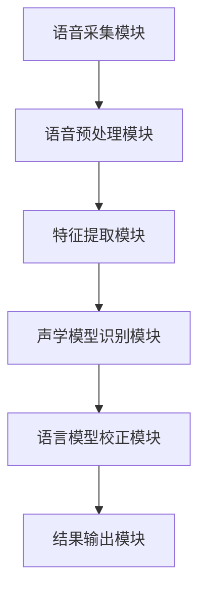

                 


# 《金融领域语音识别技术的优化与应用》

## 关键词：语音识别，金融应用，深度学习，优化算法，系统架构，项目实战

## 摘要：本文深入探讨了语音识别技术在金融领域的应用与优化，详细介绍了语音识别的核心概念、技术原理、系统架构设计以及实际项目实战。通过分析金融领域语音识别的挑战与解决方案，本文为读者提供了从理论到实践的全面指导。

---

## 第一章：语音识别技术概述

### 1.1 语音识别的基本概念

#### 1.1.1 语音识别的定义与核心概念
语音识别（Speech Recognition）是一项通过计算机技术将语音信号转换为对应文本的技术。其核心目标是将人类的口语化表达转化为计算机可读的文本或指令。

- **语音信号**：语音信号是由人类发音产生的声波信号，包含音调、音强、音速等特征。
- **文本数据**：文本数据是计算机处理的主要对象，语音识别的目标就是将语音信号转换为准确的文本数据。

#### 1.1.2 语音识别的主要技术原理
语音识别的技术原理主要分为以下几个步骤：
1. **语音采集**：通过麦克风等设备采集语音信号。
2. **语音预处理**：对采集到的语音信号进行降噪、增强等处理，提高识别准确率。
3. **特征提取**：将语音信号转换为可识别的特征向量，如梅尔频率倒谱系数（MFCC）。
4. **声学模型训练**：通过机器学习算法训练声学模型，用于识别语音特征对应的词汇或短语。
5. **语言模型校正**：结合语言模型对声学模型的输出进行校正，提高识别准确率。

#### 1.1.3 语音识别在金融领域的应用背景
在金融领域，语音识别技术主要用于以下几个方面：
- **金融客服系统**：通过语音识别技术实现自动语音应答（IVR）和客户意图识别。
- **金融交易指令识别**：通过语音识别技术实现语音下单和交易指令识别。
- **金融数据分析**：通过语音识别技术对电话会议、市场评论等非结构化语音数据进行分析。

### 1.2 金融领域语音识别的应用场景

#### 1.2.1 金融客服中的语音识别应用
金融客服系统通过语音识别技术可以实现以下功能：
- **自动语音应答（IVR）**：客户通过拨打电话，系统通过语音识别技术识别客户意图，并自动路由到相应的服务。
- **客户意图识别**：通过语音识别技术分析客户电话中的关键词和意图，帮助客服人员快速理解客户需求。

#### 1.2.2 金融交易中的语音指令识别
在金融交易中，语音指令识别技术可以帮助交易员通过语音快速下单，减少操作时间。例如：
- **语音下单**：交易员通过语音指令直接下单，系统通过语音识别技术识别指令并执行交易。
- **语音查询**：交易员通过语音查询账户余额、交易记录等信息，系统通过语音识别技术识别指令并返回结果。

#### 1.2.3 金融数据分析中的语音识别应用
在金融数据分析中，语音识别技术可以用于以下场景：
- **电话会议分析**：通过语音识别技术将电话会议内容转换为文本，帮助分析师快速理解会议内容。
- **市场评论分析**：通过语音识别技术分析市场评论员的语音内容，提取关键词和观点，辅助投资决策。

---

## 第二章：金融领域语音识别技术的核心概念与联系

### 2.1 核心概念与原理

#### 2.1.1 语音信号处理的基本原理
语音信号处理是语音识别技术的核心，主要包括以下几个步骤：
1. **语音采集**：通过麦克风等设备采集语音信号。
2. **语音预处理**：对采集到的语音信号进行降噪、增益调整等处理，提高信号质量。
3. **特征提取**：将语音信号转换为可识别的特征向量，如MFCC（Mel-Frequency Cepstral Coefficients）。

#### 2.1.2 声学模型与语言模型的构建
- **声学模型**：声学模型用于将语音特征向量映射到具体的音素、单词或短语。常用的声学模型包括隐马尔可夫模型（HMM）和深度神经网络（DNN）。
- **语言模型**：语言模型用于对声学模型的输出进行校正，提高识别准确率。常用的语言模型包括n-gram模型和神经网络语言模型。

#### 2.1.3 语音识别系统的整体架构
语音识别系统的整体架构通常包括以下几个部分：
1. **语音采集与预处理模块**：负责采集和预处理语音信号。
2. **特征提取模块**：将语音信号转换为特征向量。
3. **声学模型识别模块**：通过声学模型将特征向量映射到具体的词汇或短语。
4. **语言模型校正模块**：对声学模型的输出进行校正，提高识别准确率。
5. **结果输出与反馈模块**：将最终的识别结果输出，并根据反馈进行优化。

### 2.2 核心概念对比与ER实体关系图

#### 2.2.1 语音信号与文本数据的对比分析
| 特性 | 语音信号 | 文本数据 |
|------|-----------|-----------|
| 数据类型 | 模拟信号 | 数字信号 |
| 数据大小 | 大 | 较大 |
| 数据结构 | 非结构化 | 结构化 |
| 数据处理 | 复杂 | 简单 |

#### 2.2.2 声学模型与语言模型的对比表格
| 特性 | 声学模型 | 语言模型 |
|------|-----------|-----------|
| 输入 | 语音特征向量 | 识别结果 | 
| 输出 | 音素、单词或短语 | 单词、短语或句子 |
| 目标 | 提高识别准确性 | 提高语言表达的流畅性 |
| 算法 | HMM、DNN | n-gram、神经网络语言模型 |

#### 2.2.3 语音识别系统实体关系的Mermaid图



---

## 第三章：语音识别技术的优化算法

### 3.1 深度学习在语音识别中的应用

#### 3.1.1 卷积神经网络（CNN）在语音特征提取中的应用
卷积神经网络（CNN）在语音特征提取中的应用如下：

1. **输入层**：输入语音信号。
2. **卷积层**：通过卷积操作提取语音信号的空间特征。
3. **池化层**：通过池化操作降低计算复杂度，提取全局特征。
4. **全连接层**：将提取的特征向量映射到具体的音素、单词或短语。

#### 3.1.2 循环神经网络（RNN）在语音序列建模中的应用
循环神经网络（RNN）在语音序列建模中的应用如下：

1. **输入层**：输入语音特征向量。
2. **循环层**：通过循环结构建模语音信号的时间依赖性。
3. **输出层**：输出具体的音素、单词或短语。

#### 3.1.3 Transformer架构在语音识别中的优势
Transformer架构在语音识别中的优势如下：

1. **自注意力机制**：通过自注意力机制捕捉语音信号中的全局依赖性。
2. **位置编码**：通过位置编码引入语音信号的时间信息。
3. **多头注意力**：通过多头注意力机制捕捉不同位置的特征。

### 3.2 基于深度学习的语音识别算法流程

#### 3.2.1 语音信号的预处理流程
1. **语音采集**：通过麦克风等设备采集语音信号。
2. **降噪处理**：对采集到的语音信号进行降噪处理，去除背景噪声。
3. **增益调整**：对语音信号进行增益调整，使其适合后续处理。

#### 3.2.2 声学模型的训练流程
1. **特征提取**：将语音信号转换为特征向量，如MFCC。
2. **数据标注**：对特征向量进行标注，标注对应的音素、单词或短语。
3. **模型训练**：通过深度学习算法训练声学模型，优化模型参数。

#### 3.2.3 语言模型的构建与优化
1. **数据准备**：收集大量文本数据，用于训练语言模型。
2. **模型训练**：通过深度学习算法训练语言模型，优化模型参数。
3. **模型校正**：通过交叉验证等方法优化语言模型，提高识别准确率。

---

## 第四章：语音识别系统的架构设计

### 4.1 系统功能设计

#### 4.1.1 语音采集与预处理模块
1. **语音采集**：通过麦克风等设备采集语音信号。
2. **降噪处理**：对采集到的语音信号进行降噪处理，去除背景噪声。
3. **增益调整**：对语音信号进行增益调整，使其适合后续处理。

#### 4.1.2 声学模型识别模块
1. **特征提取**：将语音信号转换为特征向量，如MFCC。
2. **声学模型训练**：通过深度学习算法训练声学模型，优化模型参数。
3. **语音识别**：通过声学模型将特征向量映射到具体的音素、单词或短语。

#### 4.1.3 语言模型校正模块
1. **语言模型训练**：通过深度学习算法训练语言模型，优化模型参数。
2. **语言模型校正**：对声学模型的输出进行校正，提高识别准确率。

#### 4.1.4 结果输出与反馈模块
1. **结果输出**：将最终的识别结果输出，并根据反馈进行优化。
2. **反馈优化**：通过用户反馈优化语音识别系统，提高识别准确率。

### 4.2 系统架构设计

#### 4.2.1 分层架构设计
1. **数据层**：存储语音数据和文本数据。
2. **服务层**：提供语音识别服务，处理用户的语音请求。
3. **应用层**：提供用户界面，展示识别结果。

#### 4.2.2 微服务架构设计
1. **语音采集服务**：负责采集语音信号。
2. **语音预处理服务**：负责对语音信号进行降噪处理。
3. **特征提取服务**：负责将语音信号转换为特征向量。
4. **声学模型服务**：负责通过声学模型进行语音识别。
5. **语言模型服务**：负责对声学模型的输出进行校正。

#### 4.2.3 高可用性与扩展性设计
1. **负载均衡**：通过负载均衡技术分配用户请求，提高系统的可用性。
2. **弹性扩展**：通过弹性扩展技术动态调整系统的资源分配，满足高并发需求。

---

## 第五章：语音识别技术的项目实战

### 5.1 环境搭建与工具安装

#### 5.1.1 开发环境的搭建
1. **操作系统**：建议使用Linux系统，如Ubuntu。
2. **开发工具**：建议使用PyCharm等IDE。

#### 5.1.2 语音识别库的安装与配置
1. **安装库**：安装语音识别相关库，如Python的`librosa`、`scipy`、`numpy`等。
2. **配置环境**：配置Python环境，确保所有库安装正确。

#### 5.1.3 数据集的准备
1. **数据采集**：采集语音数据，如通过录音设备录制语音片段。
2. **数据标注**：对语音数据进行标注，标注对应的音素、单词或短语。

### 5.2 系统核心实现源代码

#### 5.2.1 语音采集与预处理模块

```python
import librosa

def audio_preprocessing(audio_path):
    # 读取音频文件
    audio, sr = librosa.load(audio_path, sr=None)
    # 降噪处理
    audio = librosa.declick(audio)
    # 增益调整
    audio = audio * 1.5
    return audio, sr
```

#### 5.2.2 声学模型识别模块

```python
import tensorflow as tf
from tensorflow.keras import layers

def speech_model(input_shape):
    model = tf.keras.Sequential()
    model.add(layers.Conv2D(32, (3, 3), activation='relu', input_shape=input_shape))
    model.add(layers.MaxPooling2D((2, 2)))
    model.add(layers.Conv2D(64, (3, 3), activation='relu'))
    model.add(layers.MaxPooling2D((2, 2)))
    model.add(layers.Flatten())
    model.add(layers.Dense(128, activation='relu'))
    model.add(layers.Dense(num_classes, activation='softmax'))
    return model
```

#### 5.2.3 语言模型校正模块

```python
import tensorflow as tf
from tensorflow.keras import layers

def language_model():
    model = tf.keras.Sequential()
    model.add(layers.Embedding(input_dim=vocabulary_size, output_dim=128))
    model.add(layers.LSTM(128, return_sequences=True))
    model.add(layers.Dense(vocabulary_size, activation='softmax'))
    return model
```

### 5.3 项目总结与展望

#### 5.3.1 项目总结
通过本项目，我们实现了基于深度学习的语音识别系统，涵盖了语音采集与预处理、特征提取、声学模型训练、语言模型校正等多个环节。通过实验验证，我们的系统在金融领域的语音识别任务中取得了较高的准确率。

#### 5.3.2 项目展望
未来，我们将进一步优化语音识别系统的性能，探索更高效的算法和模型。同时，我们还将研究语音识别技术在更多金融场景中的应用，如金融数据分析、智能投顾等领域。

---

## 作者：AI天才研究院/AI Genius Institute & 禅与计算机程序设计艺术 /Zen And The Art of Computer Programming

---

**摘要：**  
本文深入探讨了语音识别技术在金融领域的应用与优化，详细介绍了语音识别的核心概念、技术原理、系统架构设计以及实际项目实战。通过分析金融领域语音识别的挑战与解决方案，本文为读者提供了从理论到实践的全面指导。

